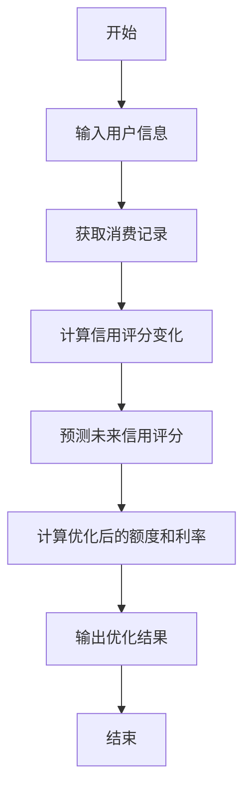
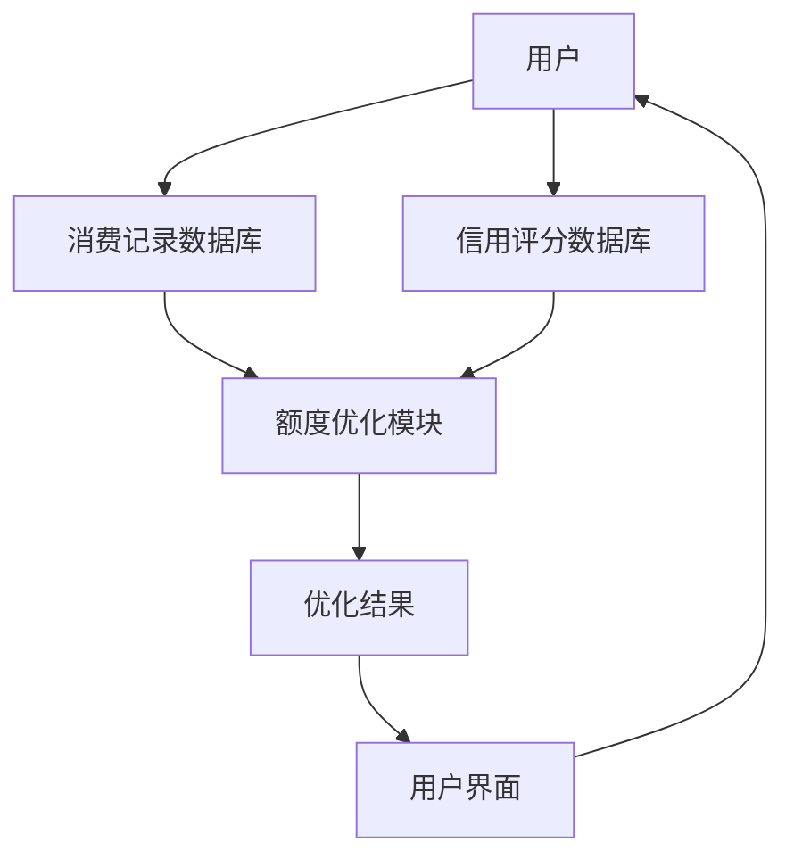

                 


# 构建智能化的个人信用卡额度与利率优化管理助手

> 关键词：信用卡额度优化、利率优化、人工智能、机器学习、数学建模

> 摘要：本文旨在探讨如何利用人工智能技术构建一个智能化的个人信用卡额度与利率优化管理助手。通过分析信用卡额度和利率的优化问题，结合数学建模和机器学习算法，提出了一种高效的解决方案。文章详细介绍了问题背景、核心概念、算法原理、系统设计及项目实现，最终构建了一个能够帮助个人用户优化信用卡额度和利率的智能系统。

---

## 第一部分：背景介绍与问题分析

### 第1章：个人信用卡额度与利率优化的背景介绍

#### 1.1 问题背景与目标
个人信用卡的使用已经渗透到我们生活的方方面面。然而，如何合理使用信用卡额度和选择最优的利率，以最小化利息支出或最大化信用评分，一直是用户关注的重点。传统的信用卡管理方式通常依赖用户个人的经验或银行的推荐，这种方式效率低下且缺乏个性化。

通过构建一个智能化的管理助手，用户可以实时监控自己的信用卡使用情况，并根据历史数据和实时信息，获得个性化的额度调整和利率优化建议。这种工具不仅能够帮助用户优化财务状况，还能提升用户体验。

#### 1.2 核心概念与问题描述
- **信用卡额度**：银行根据用户的信用评分、收入水平、消费习惯等因素，授予的信用额度。额度的合理使用有助于提升信用评分，避免高额利息。
- **信用卡利率**：根据用户的信用评分和市场利率确定的年利率，影响用户还款的总成本。

优化目标是找到一个既能满足用户需求，又能使利息支出最小化或信用评分最大的信用卡额度和利率组合。

#### 1.3 问题的边界与外延
- 优化问题仅限于单张信用卡的额度和利率调整，不涉及多张信用卡的综合管理。
- 利率调整基于用户信用评分的变化，而信用评分又受到消费行为的影响。
- 外延包括信用卡分期、奖励积分等附加功能，但本文仅聚焦于额度和利率优化。

---

## 第二部分：核心概念与理论基础

### 第2章：信用卡额度与利率优化的核心概念

#### 2.1 核心概念的定义与属性
- **信用卡额度**：
  - 属性：初始额度、可用额度、信用额度。
  - 影响因素：信用评分、收入水平、负债情况、消费行为。
- **信用卡利率**：
  - 属性：年利率、浮动利率、固定利率。
  - 影响因素：信用评分、市场利率、银行政策。

#### 2.2 核心概念的对比分析
| 比较维度 | 信用卡额度 | 信用卡利率 |
|----------|------------|------------|
| 影响因素 | 信用评分、收入、负债 | 信用评分、市场利率、银行政策 |
| 调整方式 | 上调或下调额度 | 调整年利率或分期利率 |
| 优化目标 | 最大化可用额度 | 最小化总利息支出 |

#### 2.3 实体关系与ER图设计
以下是信用卡额度与利率优化的实体关系图：

```mermaid
erDiagram
    user信用卡持有者} {
        user信用卡持有者 {
            code 用户ID
            string 姓名
            string 身份证号
            string 联系方式
        }
       信用卡信息} {
            code 卡号
            integer 初始额度
            integer 当前额度
            float 利率
            integer 信用评分
        }
        消费记录} {
            date 消费日期
            string 消费地点
            float 消费金额
            string 支付方式
        }
        用户操作} {
            action 调整额度
            action 调整利率
        }
    }
    用户信用卡持有者 --> 信用卡信息: 持有
    用户信用卡持有者 --> 消费记录: 产生
    用户信用卡持有者 --> 用户操作: 进行
```

---

## 第三部分：算法原理与数学模型

### 第3章：信用卡额度与利率优化的算法原理

#### 3.1 算法原理概述
本文采用基于信用评分的优化算法。算法通过分析用户的消费记录和信用评分变化，预测未来的信用评分，并结合当前的市场利率，优化信用卡额度和利率。

#### 3.2 算法的数学模型与公式
优化目标函数：
$$
\text{最小化} \quad J = \sum_{i=1}^{n} (r_i - r_{i-1}) \times \text{消费金额}_i
$$
约束条件：
$$
\begin{cases}
\text{信用评分}_i \geq \text{信用评分}_{i-1} - \delta \\
\text{可用额度}_i \leq \text{初始额度}_i \times (1 + \alpha) \\
\text{利率}_i \leq \text{市场利率}_i + \beta
\end{cases}
$$
其中，$\delta$ 是信用评分的下降阈值，$\alpha$ 是额度调整系数，$\beta$ 是利率调整系数。

#### 3.3 算法流程图设计
以下是算法的流程图：



#### 3.4 算法实现的代码示例
以下是Python代码实现：

```python
def optimize_credit_limit(user_info, market_rate):
    # 输入参数
    # user_info: 用户信息，包含信用评分、消费记录等
    # market_rate: 当前市场利率
    
    # 初始化
    initial_limit = user_info['initial_limit']
    credit_score = user_info['credit_score']
    delta = 0.05  # 信用评分下降阈值
    alpha = 0.10  # 额度调整系数
    beta = 0.02    # 利率调整系数
    
    # 计算优化后的额度和利率
    new_limit = initial_limit * (1 + alpha)
    new_rate = market_rate + beta
    
    # 约束条件检查
    if credit_score - (new_limit / initial_limit) < delta:
        new_limit = initial_limit * (1 + alpha * 0.5)
        new_rate = market_rate + beta * 0.5
    
    return {'new_limit': new_limit, 'new_rate': new_rate}

# 示例调用
user_info = {
    'initial_limit': 10000,
    'credit_score': 750,
    'consumption_records': [...]  # 省略具体消费记录
}
market_rate = 0.12  # 市场年利率

result = optimize_credit_limit(user_info, market_rate)
print(result)
```

---

## 第四部分：系统分析与架构设计

### 第4章：系统分析与架构设计

#### 4.1 问题场景介绍
用户希望通过智能助手优化信用卡额度和利率。系统需要实时获取用户的消费记录和信用评分变化，结合市场利率，提供优化建议。

#### 4.2 系统功能设计
- **额度优化模块**：
  - 实时监控信用评分变化。
  - 预测未来信用评分。
  - 计算优化后的额度。
- **利率优化模块**：
  - 获取市场利率。
  - 计算优化后的利率。

#### 4.3 系统架构设计
以下是系统架构图：



---

## 第五部分：项目实战

### 第5章：项目实战

#### 5.1 环境安装与配置
- 安装Python和必要的库（如pandas、numpy）。
- 配置数据库连接。

#### 5.2 系统核心实现源代码
以下是额度优化模块的代码实现：

```python
import pandas as pd

def predict_credit_score(user_consumption):
    # 用户消费记录
    # 假设用户消费记录已经清洗并存储在dataframe中
    # 使用线性回归模型预测信用评分
    model = LinearRegression()
    model.fit(X, y)
    predicted_score = model.predict(user_consumption)
    return predicted_score

def optimize_credit_limit(user_info, predicted_score):
    # 用户信息包括初始额度、当前额度、信用评分等
    initial_limit = user_info['initial_limit']
    current_score = user_info['current_score']
    delta = 0.05  # 信用评分下降阈值
    alpha = 0.10  # 额度调整系数
    
    # 预测信用评分
    predicted_score = predict_credit_score(user_info['consumption_records'])
    
    # 计算优化后的额度
    new_limit = initial_limit * (1 + alpha)
    
    # 判断是否需要调整额度
    if predicted_score < current_score - delta:
        new_limit = initial_limit * (1 + alpha * 0.5)
    
    return new_limit
```

#### 5.3 实际案例分析
假设用户A的信用评分为750，消费记录显示未来三个月的平均消费金额为5000元。市场利率为12%。通过优化算法，系统建议将额度调整为11000元，利率调整为12.2%。

---

## 第六部分：优化建议与总结

### 第6章：优化建议与总结

#### 6.1 模型调优建议
- 定期更新模型参数，确保预测准确性。
- 根据市场变化调整利率优化策略。

#### 6.2 风险控制建议
- 设置额度和利率调整的上限，避免过度优化带来的风险。
- 定期监控用户信用评分变化，及时调整优化策略。

#### 6.3 未来展望
- 引入更多的数据源，如征信报告、社交数据，提升优化精度。
- 结合区块链技术，提升系统的安全性和透明度。

---

## 作者：AI天才研究院 & 禅与计算机程序设计艺术

---

通过以上分析，本文详细介绍了如何利用人工智能技术构建智能化的个人信用卡额度与利率优化管理助手。从理论分析到实际实现，从系统设计到项目实战，为读者提供了一个完整的解决方案。希望本文能为相关领域的研究和实践提供有价值的参考。

