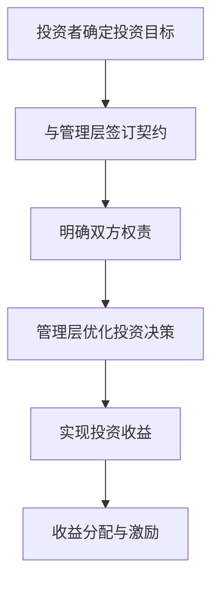
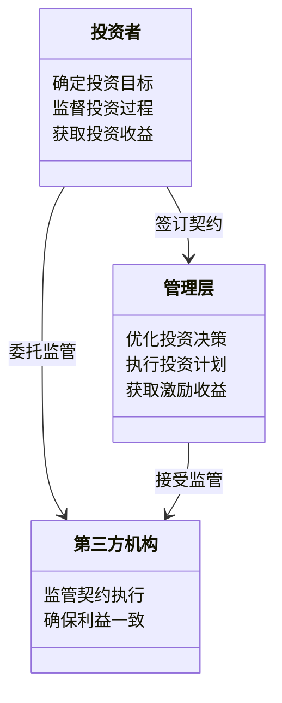

                 


# 查尔斯·布兰登的契约型价值投资：与管理层利益一致

> 关键词：价值投资、契约型投资、利益一致、管理层激励、投资策略

> 摘要：本文深入探讨查尔斯·布兰登的契约型价值投资理论，分析其如何通过契约机制实现与管理层利益一致，从而优化投资决策。文章从背景、理论、算法、系统设计到项目实战，全面解析契约型投资的核心思想与实践应用。

---

## 第一部分: 背景与概述

### 第1章: 价值投资与契约型投资概述

#### 1.1 价值投资的基本概念
- 价值投资的定义：一种以基本面分析为基础，寻找被市场低估的投资标的的投资方法。
- 核心理念：注重长期价值，而非短期市场波动。
- 历史发展：从格雷厄姆到巴菲特，价值投资的演变历程。

#### 1.2 契约型投资的定义与特点
- 定义：通过契约形式明确投资者与管理人之间的权利义务关系，确保双方利益一致的投资模式。
- 特点：
  - 透明性：契约条款清晰，双方权益明确。
  - 长期性：通过契约约束，实现长期价值目标。
  - 利益一致：通过激励机制，确保管理人与投资者利益一致。

#### 1.3 查尔斯·布兰登的契约型价值投资理论
- 布兰登的生平与投资理念：作为价值投资的代表人物，布兰登强调长期投资与利益一致的重要性。
- 核心思想：通过契约机制，将管理人的利益与投资者的利益绑定，实现双赢。
- 实现路径：通过契约条款设计，优化投资决策，降低代理成本。

### 第2章: 契约型投资的背景与现状

#### 2.1 当前投资环境的挑战
- 全球经济环境的变化：低利率、高波动性的市场环境对传统投资模式的冲击。
- 传统投资模式的局限性：短期导向、利益冲突等问题日益突出。
- 市场波动与投资风险的加剧：投资者对长期稳定收益的需求增加。

#### 2.2 契约型投资的兴起
- 市场需求：投资者对长期稳定收益的需求推动契约型投资的发展。
- 制度优势：通过契约约束，降低代理成本，优化资源配置。
- 国内外发展现状：契约型投资在全球范围内的实践案例。

#### 2.3 管理层利益与股东利益的冲突与协调
- 典型案例：管理层短视行为导致投资损失。
- 契约型投资如何实现利益一致：通过激励机制和契约约束。
- 契约型投资的制度创新：如何通过契约设计优化利益分配。

---

## 第二部分: 契约型价值投资的核心概念与原理

### 第3章: 契约型投资的核心概念

#### 3.1 契约机制的原理
- 契约的本质：明确双方权利义务，建立信任关系。
- 契约机制的作用：通过约束与激励，优化投资决策。
- 契约型投资的适用场景：长期价值投资、机构投资者与管理层的合作。

#### 3.2 契约型投资的ER实体关系图

```mermaid
erDiagram
    actor 投资者
    actor 管理层
    actor 第三方机构
    entity 契约条款
    entity 投资标的
    entity 投资收益
    投资者 --> 契约条款 : 确定投资目标
    管理层 --> 契约条款 : 承担管理责任
    投资者 --> 投资收益 : 实现收益目标
    管理层 --> 投资收益 : 优化收益分配
    第三方机构 --> 契约条款 : 监管与执行
```

#### 3.3 利益一致的对比分析

| 比较维度 | 传统投资模式 | 契约型投资 |
|----------|---------------|-------------|
| 投资期限 | 短期导向       | 长期导向     |
| 利益关系 | 可能冲突       | 利益一致     |
| 代理成本 | 高             | 低           |

---

### 第4章: 契约型投资的算法原理

#### 4.1 优化模型的构建
- 基于契约机制的优化模型：
  - 设定目标函数：最大化长期投资收益。
  - 约束条件：确保管理层与投资者利益一致。

#### 4.2 契约型投资的数学模型

$$
\text{效用函数} = \alpha \cdot \text{投资收益} + \beta \cdot \text{管理层激励}
$$

其中：
- $\alpha$ 和 $\beta$ 是权重系数，表示管理层激励与投资收益的相对重要性。

#### 4.3 契约型投资的流程图



---

### 第5章: 契约型投资的系统设计

#### 5.1 系统架构设计


#### 5.2 系统功能设计



---

### 第6章: 契约型投资的项目实战

#### 6.1 环境安装
- 安装Python环境：`pip install numpy pandas matplotlib`
- 安装依赖包：`pip install scikit-learn`

#### 6.2 核心代码实现

```python
import numpy as np
import pandas as pd

def utility_function(investment_return, manager_incentive):
    return 0.5 * investment_return + 0.5 * manager_incentive

# 示例数据
investment_return = np.array([0.1, 0.15, 0.2])
manager_incentive = np.array([0.05, 0.07, 0.1])

# 计算效用
utility = utility_function(investment_return, manager_incentive)
print("投资收益:", investment_return)
print("管理层激励:", manager_incentive)
print("效用函数结果:", utility)
```

#### 6.3 案例分析
- 案例背景：某公司与投资者签订契约，约定长期投资目标。
- 投资结果：通过优化决策，实现投资收益与管理层激励的平衡。
- 分析：契约型投资如何通过利益一致实现双赢。

---

## 第三部分: 最佳实践与总结

### 第7章: 最佳实践

#### 7.1 小结
- 契约型投资的核心在于利益一致。
- 通过契约机制，优化投资决策，降低代理成本。

#### 7.2 注意事项
- 契约设计需合理，避免短期行为。
- 管理层激励需适度，防止过度激励。

#### 7.3 拓展阅读
- 建议阅读查尔斯·布兰登的经典著作《价值投资入门》。
- 关注契约型投资在不同市场环境下的应用。

---

## 作者信息

作者：AI天才研究院/AI Genius Institute & 禅与计算机程序设计艺术 /Zen And The Art of Computer Programming

