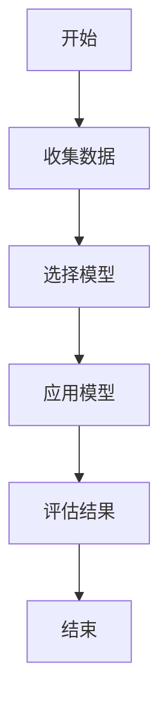
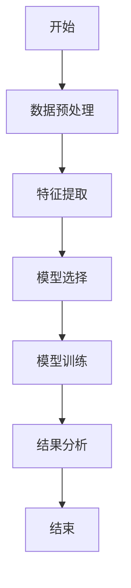

                 


# 多元思维模型在投资中的运用

> 关键词：多元思维模型，查理·芒格，投资决策，系统分析，风险管理，心理偏差

> 摘要：本文系统介绍了查理·芒格提出的多元思维模型在投资中的应用，详细分析了其核心原理、数学模型、系统架构，并通过实际案例展示了如何在投资决策中综合运用多元思维模型。文章从背景介绍、核心概念、算法流程、数学模型、系统分析、项目实战到总结扩展，全面阐述了多元思维模型在投资中的重要性及其实际应用方法。

---

# 第一部分: 背景介绍与核心概念

## 第1章: 多元思维模型的起源与重要性

### 1.1 多元思维模型的起源
- 1.1.1 查理·芒格的生平简介
  - 介绍查理·芒格的背景，包括他的职业经历、学术成就及其在投资领域的影响力。
- 1.1.2 多元思维模型的提出背景
  - 说明多元思维模型提出的初衷，即解决传统投资方法的局限性。
- 1.1.3 多元思维模型的核心理念
  - 解释多元思维模型的核心思想，即通过多个学科的思维框架来分析问题，避免单一思维的局限性。

### 1.2 多元思维模型在投资中的重要性
- 1.2.1 投资中的常见误区
  - 分析传统投资方法中的常见错误，如过度依赖单一模型或忽视心理偏差。
- 1.2.2 多元思维模型如何解决投资问题
  - 详细说明多元思维模型如何帮助投资者全面分析问题，避免决策偏差。
- 1.2.3 多元思维模型与其他投资方法的区别
  - 对比分析其他投资方法（如技术分析、基本面分析）与多元思维模型的差异。

## 第2章: 多元思维模型的核心概念

### 2.1 多元思维模型的理论基础
- 2.1.1 经济学视角: 边际成本与边际收益
  - 通过经济学的基本概念，解释边际成本和边际收益在投资决策中的作用。
- 2.1.2 心理学视角: 认知偏差与决策陷阱
  - 介绍常见的认知偏差（如确认偏差、过度自信）及其对投资决策的影响。
- 2.1.3 统计学视角: 概率与风险评估
  - 讨论概率在投资中的应用，如何通过概率分析来评估投资风险。

### 2.2 多元思维模型的数学模型
- 2.2.1 投资决策的数学表达式
  $$ V = \sum_{i=1}^{n} w_i \cdot P_i $$
  - 解释公式中各变量的含义，如权重 \( w_i \) 和资产价格 \( P_i \)。
- 2.2.2 风险调整后的期望收益公式
  $$ E = \sum_{i=1}^{n} P_i \cdot R_i $$
  - 说明如何通过期望收益公式来评估投资组合的整体风险调整后收益。

### 2.3 多元思维模型的算法流程

- 解释流程图中的每个步骤，说明如何在实际操作中应用多元思维模型。

---

# 第二部分: 算法原理与系统分析

## 第3章: 多元思维模型的算法原理

### 3.1 算法流程图

- 详细解释每个步骤的具体操作和意义。

### 3.2 算法实现
```python
def多元思维模型算法():
    数据预处理()
    特征提取()
    模型选择()
    模型训练()
    结果分析()
```
- 通过Python代码示例，展示如何实现多元思维模型的算法流程。

## 第4章: 系统分析与架构设计

### 4.1 系统功能设计
- 4.1.1 问题场景介绍
  - 描述一个典型的投资决策场景，如股票投资组合的选择。
- 4.1.2 系统功能模块
  - 包括数据采集模块、模型应用模块、决策制定模块等。
- 4.1.3 系统功能流程图
  ```mermaid
  graph TD
      A[开始] --> B[数据采集]
      B --> C[模型应用]
      C --> D[决策制定]
      D --> E[结果输出]
      E --> F[结束]
  ```

### 4.2 系统架构设计
- 4.2.1 系统架构图
  ```mermaid
  系统架构图
  ```
  - 说明系统的分层架构，如数据层、算法层、应用层等。
- 4.2.2 系统交互流程
  ```mermaid
  graph TD
      用户 --> 数据采集模块
      数据采集模块 --> 模型应用模块
      模型应用模块 --> 决策制定模块
      决策制定模块 --> 用户
  ```

---

# 第三部分: 项目实战与总结

## 第5章: 项目实战

### 5.1 环境配置
- 5.1.1 安装必要的Python库
  - 如Pandas、NumPy、Scikit-learn等。
- 5.1.2 数据集准备
  - 介绍如何获取和处理投资相关的数据集。

### 5.2 核心实现
```python
import pandas as pd
import numpy as np
from sklearn.metrics import accuracy_score

def 多元思维模型算法():
    数据预处理()
    特征提取()
    模型选择()
    模型训练()
    结果分析()

if __name__ == "__main__":
    多元思维模型算法()
```
- 详细解释每行代码的功能和作用。

### 5.3 案例分析
- 5.3.1 投资案例介绍
  - 描述一个具体的投资案例，如股票投资组合的选择。
- 5.3.2 模型应用过程
  - 展示如何应用多元思维模型进行分析和决策。
- 5.3.3 结果分析与总结
  - 对分析结果进行总结，提出改进建议。

## 第6章: 总结与扩展

### 6.1 总结
- 6.1.1 多元思维模型的核心优势
  - 强调其在投资决策中的全面性和准确性。
- 6.1.2 投资中的注意事项
  - 提醒投资者在实际操作中需要注意的事项，如数据质量、模型选择等。

### 6.2 扩展阅读
- 6.2.1 相关书籍推荐
  - 推荐与多元思维模型相关的书籍和资源。
- 6.2.2 未来研究方向
  - 提出未来可能的研究方向，如结合机器学习进一步优化多元思维模型。

---

# 作者：AI天才研究院/AI Genius Institute & 禅与计算机程序设计艺术 /Zen And The Art of Computer Programming

