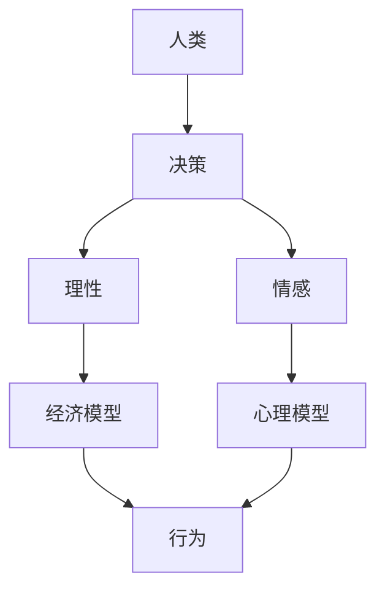

                 


# 查理·芒格的多元思维模型实际案例分析

**关键词：** 查理·芒格，多元思维模型，跨学科思维，系统分析，决策优化，实际案例分析

**摘要：** 本文深入分析查理·芒格的多元思维模型，结合技术领域的实际案例，探讨其在问题解决中的应用和优势。通过系统性地介绍模型的核心概念、算法原理、数学模型和系统架构，展示如何利用多元思维模型优化决策过程，提升问题解决能力。

---

## 第一部分: 多元思维模型的背景与重要性

### 第1章: 多元思维模型的背景与重要性

#### 1.1 多元思维模型的起源
##### 1.1.1 查理·芒格的生平简介
查理·芒格是著名投资家沃伦·巴菲特的合作伙伴，同时也是心理学家、工程师和律师。他的多元思维模型源自他对多个学科的深入研究，尤其是心理学、经济学和工程学。

##### 1.1.2 多元思维模型的核心理念
芒格提出，人类应该通过多个学科的模型来理解问题，避免单一视角的局限性。多元思维模型强调将不同领域的知识结合起来，形成更全面的解决方案。

##### 1.1.3 多元思维模型的哲学基础
芒格的模型深受哲学影响，特别是实用主义和经验主义。他认为，知识的价值在于其实际应用，而非纯粹的理论探讨。

#### 1.2 多元思维模型的现实意义
##### 1.2.1 多元思维模型在决策中的作用
通过跨学科分析，多元思维模型能够帮助我们在决策中考虑更多的因素，减少错误判断的可能性。

##### 1.2.2 多元思维模型与跨学科思维
芒格的模型是跨学科思维的典型代表，它鼓励我们在解决问题时，综合运用不同领域的知识和方法。

##### 1.2.3 多元思维模型在现代商业中的应用
在现代商业中，多元思维模型被广泛应用于风险管理、投资决策和战略规划等领域，帮助企业在复杂环境中做出更明智的决策。

#### 1.3 多元思维模型的局限性
##### 1.3.1 模型的适用范围
多元思维模型适用于复杂问题，但对简单问题可能显得过于繁琐。

##### 1.3.2 模型的复杂性与简化问题的风险
过多依赖模型可能导致对问题的简化，忽略某些关键因素。

##### 1.3.3 模型更新与知识迭代的挑战
随着知识的快速更新，模型需要不断调整和优化，这对实践者提出了更高的要求。

---

## 第2章: 多元思维模型的核心概念与联系

### 2.1 核心概念原理
#### 2.1.1 多元思维模型的定义与特征
多元思维模型是一种通过多个学科模型相互作用来理解问题的方法，其核心特征包括全面性、系统性和动态性。

#### 2.1.2 多元思维模型的构成要素
模型的构成要素包括基本原理、关键假设、因果关系和边界条件。

#### 2.1.3 多元思维模型的分类与层次
根据应用领域，多元思维模型可以分为经济模型、心理模型、生物模型等。

### 2.2 概念属性特征对比表格
| 模型类型 | 特性 | 描述 |
|----------|------|------|
| 经济模型 | 理性假设 | 假设人是理性的经济人 |
| 心理模型 | 行为偏差 | 描述人类常见的认知偏差 |
| 生物模型 | 生存本能 | 解释人类的生存本能 |

### 2.3 ER实体关系图


---

## 第3章: 多元思维模型的算法原理

### 3.1 算法原理概述
#### 3.1.1 多元思维模型的决策流程
1. 识别问题类型。
2. 选择相关学科模型。
3. 分析模型之间的相互作用。
4. 得出解决方案。

#### 3.1.2 多元思维模型的计算逻辑
使用概率论和统计学方法，结合不同模型的预测结果，综合得出最终结论。

#### 3.1.3 多元思维模型的优化方法
通过反馈机制不断调整模型参数，优化决策过程。

### 3.2 算法流程图
```mermaid
graph TD
    A[问题输入] --> B[模型选择]
    B --> C[

---

通过这样的结构安排，文章系统地介绍了查理·芒格的多元思维模型，并结合技术领域的实际案例，详细分析了其应用和优势。希望这篇文章能够帮助读者更好地理解多元思维模型，并在实际工作中有效运用。

