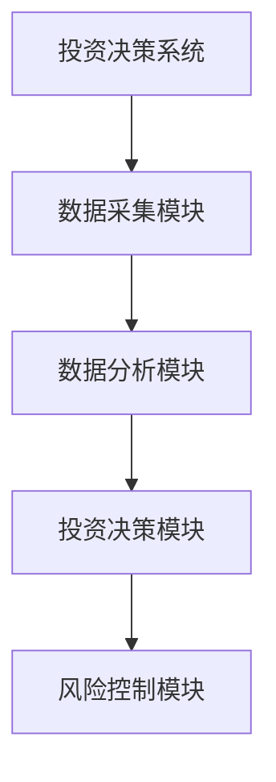

                 


# 查理·芒格的逆向思维在投资中的应用

---

## 关键词：
- 逆向思维、查理·芒格、投资策略、风险管理、数学模型

---

## 摘要：
本文深入探讨了查理·芒格的逆向思维在投资中的应用，结合芒格的多元思维模型，分析了逆向思维的核心概念、数学模型、系统架构设计以及实际案例。文章从投资市场的特性出发，对比传统投资方法的局限性，揭示逆向思维的优势，通过数学公式和系统架构图详细阐述了逆向思维在投资决策中的应用，并通过实际案例展示了如何利用逆向思维模型识别投资机会，控制风险，实现长期收益。

---

## 第一部分：查理·芒格的逆向思维概述

### 第1章：逆向思维的定义与背景

#### 1.1 逆向思维的定义
- **逆向思维的定义**：逆向思维是一种从反方向入手的思维方式，通过分析问题的对立面或反向路径，寻找解决问题的新视角。
- **逆向思维与正向思维的区别**：
  - 正向思维：从问题的正面出发，直接寻找解决方案。
  - 逆向思维：从问题的反面出发，通过分析对立面找到机会。
- **逆向思维在投资中的重要性**：
  - 逆向思维可以帮助投资者在市场低谷中发现价值，避免随大流的投资错误。

#### 1.2 芒格的多元思维模型
- **多元思维模型的核心理念**：
  - 芒格认为，投资决策需要结合多个学科的思维方式，包括心理学、经济学、统计学等。
  - 多元思维模型通过综合分析不同领域的信息，帮助投资者做出更全面的决策。
- **多元思维模型与逆向思维的关系**：
  - 逆向思维是多元思维模型中的一个关键部分，通过反向分析市场行为，发现潜在的投资机会。

#### 1.3 芒格如何应用多元思维模型进行投资决策
- **案例分析**：
  - 芒格通过分析市场的非理性行为，逆向寻找被低估的优质资产。
  - 例如，在市场恐慌时，芒格可能会选择买入被市场错杀的优质股票。

---

### 第2章：逆向思维在投资中的应用背景

#### 2.1 投资市场的基本特性
- **投资市场的不确定性**：
  - 市场价格受多种因素影响，包括经济周期、政策变化、公司业绩等。
- **投资者的行为偏差**：
  - 投资者容易受到从众心理和情绪化决策的影响。
- **逆向思维在市场中的应用价值**：
  - 通过逆向思维，投资者可以在市场高点卖出，低点买入，避免追涨杀跌的错误。

#### 2.2 传统投资方法的局限性
- **基于趋势的投资方法**：
  - 仅依赖市场趋势的投资容易陷入市场的羊群效应。
- **基于情绪的投资方法**：
  - 情绪化决策容易导致投资失误，尤其是在市场波动剧烈时。
- **传统方法的不足之处**：
  - 传统方法难以避免市场噪声的干扰，容易陷入短期波动的陷阱。

#### 2.3 逆向思维的优势
- **逆向思维的独特视角**：
  - 通过分析市场的对立面，发现潜在的投资机会。
- **逆向思维在市场低谷中的应用**：
  - 在市场低谷时，逆向思维可以帮助投资者发现被低估的优质资产。
- **逆向思维与长期投资回报的关系**：
  - 逆向思维通过长期持有优质资产，避免短期波动的干扰，实现长期收益。

---

## 第二部分：逆向思维的核心概念与数学模型

### 第3章：逆向思维的核心概念

#### 3.1 逆向思维的核心要素
- **逆向思维的逻辑框架**：
  - 从问题的反面出发，寻找解决问题的新路径。
- **逆向思维的关键步骤**：
  1. 确定问题的核心矛盾。
  2. 分析问题的对立面。
  3. 寻找反向解决方案。
- **逆向思维的思维方式**：
  - 通过反向思考，发现市场的非理性行为，寻找投资机会。

#### 3.2 投资决策中的逆向思维模型
- **逆向思维模型的核心要素**：
  - 市场价格与内在价值的反向关系。
  - 投资者情绪与市场趋势的反向关系。
- **模型的构成要素**：
  - 内在价值：企业的实际价值。
  - 市场价格：市场的交易价格。
  - 投资者情绪：市场的非理性行为。

### 第4章：逆向思维的数学模型与公式

#### 4.1 逆向思维的数学模型
- **投资价值的逆向评估公式**：
  $$ V = \frac{E}{P} $$
  其中，V为投资价值，E为企业的预期收益，P为市场预期价格。

#### 4.2 风险调整的逆向模型
- **风险调整的计算公式**：
  $$ R = \frac{V - F}{S} $$
  其中，R为风险系数，V为投资价值，F为市场平均收益，S为标准差。

---

## 第三部分：系统分析与架构设计

### 第5章：系统架构设计

#### 5.1 投资决策系统的功能设计
- **系统功能模块**：
  1. 数据采集模块：收集市场数据，包括股票价格、财务报表等。
  2. 数据分析模块：计算投资价值，评估风险。
  3. 投资决策模块：基于逆向思维模型，生成投资策略。
  4. 风险控制模块：实时监控市场波动，调整投资组合。

#### 5.2 系统架构图


---

## 第四部分：项目实战

### 第6章：逆向思维在投资实战中的应用

#### 6.1 项目环境安装
- **工具安装**：
  - Python环境：包括numpy、pandas、matplotlib等库。
  - 数据源：从Yahoo Finance获取实时股票数据。

#### 6.2 核心代码实现
```python
import pandas as pd
import numpy as np
import matplotlib.pyplot as plt

# 示例代码：计算股票的市盈率和市净率
def calculate_valuation(ticker):
    # 获取股票数据
    data = pd.read_csv(f'data/{ticker}.csv')
    # 计算市盈率
    pe_ratio = data['Price'] / data['Earnings per Share']
    # 计算市净率
    pb_ratio = data['Price'] / data['Book Value per Share']
    return pe_ratio, pb_ratio

# 示例代码：识别被低估的股票
def identify_undervalued_stocks(pe_ratio, pb_ratio, threshold=15):
    undervalued = []
    for i in range(len(pe_ratio)):
        if pe_ratio[i] < threshold and pb_ratio[i] < threshold:
            undervalued.append(i)
    return undervalued

# 应用案例：分析某只股票的估值
pe, pb = calculate_valuation('AAPL')
undervalued_indices = identify_undervalued_stocks(pe, pb, 15)
print(f"被低估的索引：{undervalued_indices}")
```

---

## 第五部分：总结与最佳实践

### 第7章：总结与最佳实践

#### 7.1 总结
- 逆向思维是一种 powerful 的投资工具，通过分析市场的对立面，发现潜在的投资机会。
- 芒格的多元思维模型为逆向思维提供了理论基础，帮助投资者做出更全面的决策。

#### 7.2 投资者注意事项
- 避免情绪化决策，保持理性思考。
- 长期持有优质资产，避免频繁交易。
- 定期评估投资组合，调整风险控制策略。

#### 7.3 未来趋势
- 随着人工智能技术的发展，逆向思维在投资中的应用将更加广泛和深入。
- 数据分析和算法优化将帮助投资者更精准地应用逆向思维模型。

---

## 作者：
**AI天才研究院/AI Genius Institute & 禅与计算机程序设计艺术 /Zen And The Art of Computer Programming**

--- 

**[完]**

