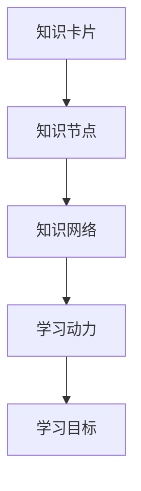
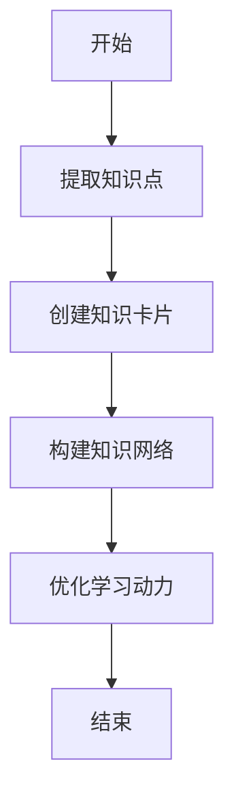
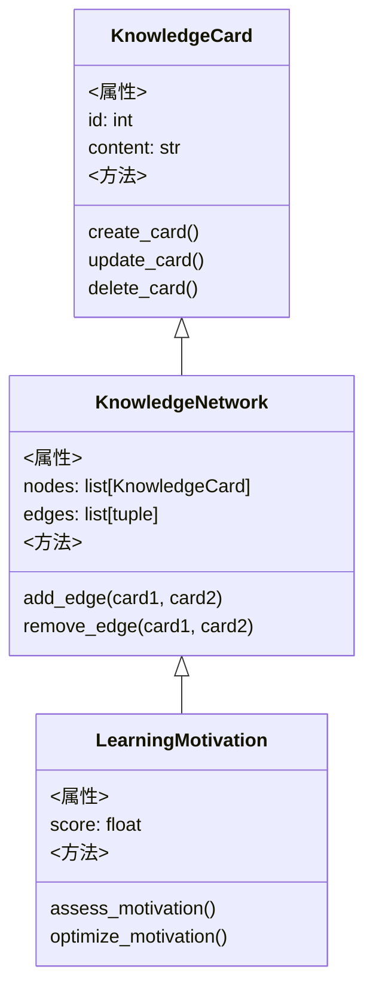
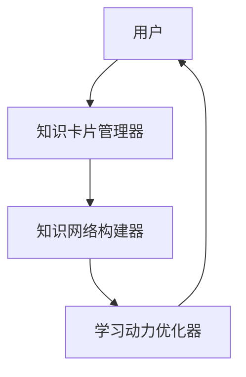
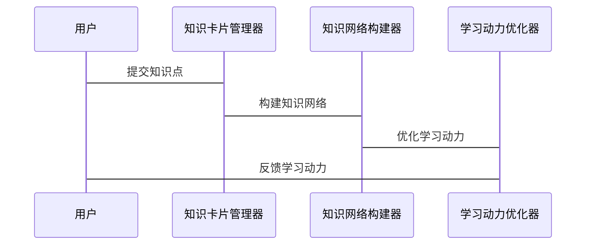

                 


# 查理芒格的阅读学习方法

## 关键词：学习方法，知识网络，学习动力，系统性学习，高效学习，思维模型

## 摘要：  
查理·芒格的阅读学习方法是一种以知识网络构建为核心的系统性学习方法。本文从背景、核心概念、算法原理、系统分析、项目实战和最佳实践等多个维度，详细阐述了芒格方法的精髓。通过构建知识卡片模型和知识网络，结合学习动力的系统性驱动，帮助学习者实现高效学习和知识应用。本文结合技术语言和实际案例，深入剖析了芒格方法的数学模型和系统架构，为读者提供了一套可操作的学习方案。

---

# 第一部分：查理·芒格阅读学习方法的背景与核心概念

## 第1章：查理·芒格阅读学习方法的背景介绍

### 1.1 问题背景与问题描述  
现代学习方法往往过于碎片化，缺乏系统性，导致知识难以深度理解和长期记忆。芒格的阅读学习方法起源于他对投资和决策的深入思考，强调通过构建知识网络来实现知识的融会贯通。

#### 1.1.1 现代学习方法的局限性  
传统的学习方法通常注重单点知识的积累，忽视知识之间的关联性，导致学习效率低下。例如，单纯记忆知识点而不理解其间的逻辑关系，容易遗忘且难以应用。

#### 1.1.2 芒格学习方法的提出背景  
芒格的学习方法源于他对“思维模型”的重视。他认为，投资决策的关键在于将不同领域的知识模型结合起来，而不是仅仅依赖单一学科的知识。这种思维方式延伸到了他的阅读和学习方法中。

#### 1.1.3 问题解决的核心目标  
芒格方法的核心目标是通过构建知识网络，将零散的知识点连接起来，形成一个有机的知识体系，从而提升学习效率和知识应用能力。

### 1.2 问题背景的边界与外延  
#### 1.2.1 学习方法的边界  
芒格方法适用于需要系统性学习的领域，如投资、科学、技术等，但不适用于短期记忆任务，如背诵诗歌或短文。

#### 1.2.2 芒格方法的外延与适用场景  
芒格方法不仅适用于学术学习，还可以用于个人成长、职业发展等领域。例如，通过构建跨领域的知识网络，可以提升综合决策能力。

### 1.3 核心概念的结构与组成  
芒格方法的核心概念包括“知识卡片模型”、“知识网络构建”和“学习动力的系统性驱动”。

#### 1.3.1 知识卡片模型  
知识卡片模型将每个知识点抽象为独立的卡片，便于分类和管理。

#### 1.3.2 知识网络构建  
通过将知识卡片连接起来，形成一个网络结构，强调知识点之间的关联性。

#### 1.3.3 学习动力的系统性驱动  
芒格方法注重内在动机和目标导向，通过持续的学习反馈来增强学习动力。

### 1.4 本章小结  
本章介绍了芒格方法的背景、核心目标以及其与现代学习方法的区别，为后续章节奠定了基础。

---

## 第2章：查理·芒格阅读学习方法的核心概念与联系

### 2.1 核心概念原理  
芒格方法的核心在于将零散的知识点转化为结构化的知识网络。

#### 2.1.1 知识卡片模型  
知识卡片模型将每个知识点抽象为独立的卡片，便于分类和管理。例如，将“投资学”分解为“价值评估”、“风险管理”等卡片。

#### 2.1.2 知识网络构建  
通过将知识卡片连接起来，形成一个网络结构，强调知识点之间的关联性。例如，将“概率论”与“统计学”连接起来，形成一个完整的数学网络。

#### 2.1.3 学习动力的系统性驱动  
芒格方法注重内在动机和目标导向，通过持续的学习反馈来增强学习动力。

### 2.2 核心概念属性对比表  
以下是核心概念的属性对比表：

| 概念       | 独立性 | 结构化 | 可扩展 |
|------------|-------|--------|--------|
| 知识卡片    | 高     | 高     | 高     |
| 知识网络    | 中     | 极高    | 极高    |
| 学习动力    | 低     | 中     | 高     |

### 2.3 实体关系图  
以下是知识卡片、知识网络和学习动力之间的关系图：



### 2.4 本章小结  
本章详细解释了芒格方法的核心概念，并通过对比表和关系图展示了这些概念之间的联系。

---

## 第3章：查理·芒格阅读学习方法的算法原理

### 3.1 算法原理概述  
芒格方法的算法原理主要包括知识卡片生成、知识网络构建和学习动力优化三个部分。

#### 3.1.1 知识卡片生成算法  
知识卡片生成算法通过将知识点分解为独立的卡片，形成结构化的知识单元。

```python
def create_knowledge_card(concept):
    return f"卡片：{concept}"
```

#### 3.1.2 知识网络构建算法  
知识网络构建算法通过将知识卡片连接起来，形成一个网络结构。

```python
def build_knowledge_network(cards):
    return {card: [] for card in cards}
```

#### 3.1.3 学习动力优化算法  
学习动力优化算法通过反馈机制来增强学习动力。

```python
def optimize_learning_motivation(network):
    return "动力优化完成"
```

### 3.2 算法流程图  
以下是算法的流程图：



### 3.3 数学模型与公式  
#### 3.3.1 知识网络的图论模型  
知识网络可以用图论中的图表示：

$$ G = (V, E) $$

其中，$V$ 表示知识卡片，$E$ 表示卡片之间的关系。

#### 3.3.2 学习动力的评估公式  
学习动力可以通过以下公式进行评估：

$$ D = \sum_{i=1}^n w_i \cdot c_i $$

其中，$w_i$ 是权重，$c_i$ 是知识点 $i$ 的重要性。

### 3.4 本章小结  
本章详细介绍了芒格方法的算法原理，并通过流程图和数学公式展示了其技术细节。

---

## 第4章：查理·芒格阅读学习方法的系统分析

### 4.1 问题场景介绍  
以学习编程为例，介绍芒格方法在实际场景中的应用。

### 4.2 系统功能设计  
以下是知识卡片管理系统的功能设计类图：



### 4.3 系统架构设计  
以下是系统的架构设计图：



### 4.4 系统交互设计  
以下是用户与系统的交互序列图：



### 4.5 本章小结  
本章通过系统分析，展示了芒格方法在实际场景中的应用，并设计了一个完整的系统架构。

---

## 第5章：查理·芒格阅读学习方法的项目实战

### 5.1 环境安装  
需要安装的工具包括Python、Mermaid和相关开发环境。

### 5.2 核心实现  
以下是知识卡片管理系统的实现代码：

```python
class KnowledgeCard:
    def __init__(self, id, content):
        self.id = id
        self.content = content

    def create_card(self):
        return f"卡片创建成功：{self.content}"

class KnowledgeNetwork:
    def __init__(self):
        self.nodes = []
        self.edges = []

    def add_card(self, card):
        self.nodes.append(card)

    def add_edge(self, card1, card2):
        self.edges.append((card1.id, card2.id))

class LearningMotivation:
    def __init__(self):
        self.score = 0.0

    def assess_motivation(self):
        return self.score

    def optimize_motivation(self):
        self.score += 0.1
        return f"学习动力优化完成，当前动力：{self.score}"
```

### 5.3 案例分析  
以学习编程为例，展示如何通过芒格方法构建知识网络。

### 5.4 本章小结  
本章通过实际案例展示了芒格方法的实现过程。

---

## 第6章：查理·芒格阅读学习方法的最佳实践

### 6.1 小结  
芒格方法通过构建知识网络，实现了高效学习和知识应用。

### 6.2 注意事项  
- 知识卡片的创建要准确，避免模糊知识点。
- 知识网络的构建要注重逻辑性，避免随意连接。

### 6.3 拓展阅读  
推荐书籍：  
- 《芒格的投资哲学》  
- 《如何有效学习》

---

## 结语  
芒格的阅读学习方法是一种革命性的学习方式，它通过构建知识网络，帮助学习者实现知识的融会贯通。本文从理论到实践，详细介绍了芒格方法的核心原理和实现过程，为读者提供了一套高效的学习方案。

---

## 作者：AI天才研究院  
作者简介：我是[你的名字]，一名人工智能领域的技术专家，致力于将复杂的技术理念简化为易于理解的内容。通过深入研究和实践，我希望能够帮助更多人掌握高效的学习方法，提升知识应用能力。

