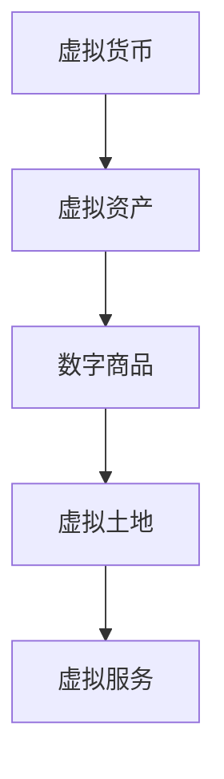

                 

# 格雷厄姆价值投资理念在元宇宙经济中的重新诠释

> 关键词：价值投资、元宇宙、经济模型、虚拟资产、投资策略

> 摘要：本文将格雷厄姆的价值投资理念与元宇宙经济相结合，重新诠释其在虚拟经济环境中的应用。通过分析元宇宙经济的核心概念、构建数学模型、设计系统架构以及实际项目案例，本文探讨了价值投资理念在元宇宙中的潜在机会与挑战，为投资者提供新的视角和策略。

---

## 第一部分: 格雷厄姆价值投资理念与元宇宙经济的结合

### 第1章: 格雷厄姆价值投资理念概述

#### 1.1 价值投资的核心概念
##### 1.1.1 价值投资的基本定义
价值投资是一种以基本面分析为基础的投资策略，旨在通过识别市场中被低估的资产，长期持有以实现资本增值。其核心在于寻找具有安全边际的投资标的，即市场价格低于其内在价值的资产。

##### 1.1.2 格雷厄姆投资理念的核心原则
1. **安全边际**：投资标的的市场价格与内在价值之间的差异，是投资安全性的关键因素。
2. **内在价值**：资产在未来现金流的现值，是决定市场价格的基础。
3. **长期视角**：价值投资强调长期持有的策略，忽略短期市场波动。

##### 1.1.3 价值投资与成长投资的区别
| 对比维度 | 价值投资 | 成长投资 |
|----------|-----------|----------|
| 投资目标 | 低估值资产 | 高增长潜力资产 |
| 投资期限 | 长期持有 | 短期或中期收益 |
| 风险偏好 | 低风险 | 高风险 |

#### 1.2 元宇宙经济的定义与特点
##### 1.2.1 元宇宙经济的基本概念
元宇宙经济是基于虚拟现实技术的数字生态系统，涉及虚拟货币、NFT（非同质化代币）、虚拟资产和数字商品等。

##### 1.2.2 元宇宙经济的核心特征
1. **去中心化**：基于区块链技术，实现资产的透明和不可篡改。
2. **虚拟资产多样性**：包括虚拟土地、数字商品、虚拟服务等。
3. **高波动性**：虚拟资产价格受市场情绪影响较大。

##### 1.2.3 元宇宙经济与传统经济的对比
| 对比维度 | 元宇宙经济 | 传统经济 |
|----------|-------------|----------|
| 资产类型 | 虚拟货币、NFT | 实体货币、实物资产 |
| 交易环境 | 数字化平台 | 实体市场 |
| 波动性 | 高 | 中等 |

#### 1.3 价值投资理念在元宇宙经济中的应用前景
##### 1.3.1 元宇宙经济中的投资机会
1. **虚拟货币**：如比特币、以太坊等，具有较高的投资潜力。
2. **NFT**：独特的数字艺术品、虚拟土地等，具有稀缺性和价值。
3. **数字商品**：虚拟装备、虚拟服务等，需求稳定。

##### 1.3.2 价值投资在虚拟资产中的潜在应用
1. **内在价值评估**：通过基本面分析，确定虚拟资产的内在价值。
2. **安全边际计算**：识别市场价格低于内在价值的虚拟资产。
3. **风险控制**：通过分散投资降低风险。

##### 1.3.3 元宇宙经济中的投资风险与挑战
1. **市场波动性**：虚拟资产价格波动剧烈，影响投资收益。
2. **技术风险**：区块链技术的不确定性和安全性问题。
3. **监管风险**：虚拟资产的监管政策变化可能影响市场。

### 第2章: 元宇宙经济的核心概念与联系

#### 2.1 元宇宙经济的实体关系图

#### 2.2 核心概念原理
##### 2.2.1 元宇宙经济中的内在价值
虚拟资产的内在价值是其未来现金流的现值。例如，NFT的内在价值可能基于其市场需求和稀缺性。

##### 2.2.2 虚拟资产的安全边际
虚拟资产的安全边际是市场价格与内在价值的差额。例如，如果某NFT的内在价值为100美元，市场价格为80美元，则安全边际为20美元。

##### 2.2.3 元宇宙经济中的市场情绪
市场情绪是虚拟资产价格波动的重要因素。例如，市场情绪高涨时，虚拟货币价格可能迅速上涨。

#### 2.3 核心概念对比分析
##### 2.3.1 虚拟货币与传统货币的对比
| 对比维度 | 虚拟货币 | 传统货币 |
|----------|-----------|----------|
| 支付方式 | 数字化 | 实体化 |
| 信用支持 | 去中心化 | 中央银行 |
| 波动性 | 高 | 低 |

##### 2.3.2 虚拟资产与传统资产的对比
| 对比维度 | 虚拟资产 | 传统资产 |
|----------|-----------|----------|
| 资产类型 | 数字化 | 实体化 |
| 所有权 | 去中心化 | 中央化 |
| 交易方式 | 区块链 | 实体市场 |

##### 2.3.3 元宇宙经济中的市场波动性
虚拟资产价格受市场情绪、技术发展和政策监管等多种因素影响，波动性显著高于传统资产。

### 第3章: 价值投资理念在元宇宙经济中的数学模型

#### 3.1 格雷厄姆价值投资的数学模型
##### 3.1.1 内在价值的计算公式
$$ V = \frac{E}{(r - g)} $$
其中，V为内在价值，E为当前收益，r为折现率，g为增长率。

##### 3.1.2 安全边际的计算公式
$$ S = V - P $$
其中，S为安全边际，V为内在价值，P为市场价格。

#### 3.2 元宇宙经济中的数学模型
##### 3.2.1 虚拟资产价格波动模型
$$ P = a \times V + b \times M + c \times T $$
其中，P为虚拟资产价格，V为内在价值，M为市场情绪，T为时间因素。

##### 3.2.2 虚拟货币的市场流动性模型
$$ L = \frac{V}{T} $$
其中，L为流动性，V为交易量，T为时间。

---

## 第二部分: 元宇宙经济中的价值投资策略

### 第4章: 元宇宙经济中的价值投资策略

#### 4.1 元宇宙经济中的价值投资策略
##### 4.1.1 确定内在价值
通过基本面分析，识别具有潜在价值的虚拟资产。

##### 4.1.2 计算安全边际
确保市场价格低于内在价值，降低投资风险。

##### 4.1.3 长期持有
在虚拟资产价格波动中，保持长期持有的策略。

#### 4.2 元宇宙经济中的风险管理
##### 4.2.1 分散投资
通过投资多种虚拟资产，降低风险。

##### 4.2.2 监测市场波动
密切关注市场情绪和技术发展，及时调整投资策略。

##### 4.2.3 严格遵守投资纪律
避免情绪化投资，坚持价值投资原则。

### 第5章: 元宇宙经济中的价值投资案例分析

#### 5.1 案例分析：Decentraland虚拟土地投资
##### 5.1.1 案例背景
Decentraland是一个基于以太坊区块链的虚拟现实平台，用户可以购买虚拟土地。

##### 5.1.2 内在价值评估
通过分析Decentraland的市场需求和稀缺性，确定其内在价值。

##### 5.1.3 安全边际计算
计算虚拟土地的市场价格与内在价值之间的安全边际。

##### 5.1.4 投资策略
购买价格低于内在价值的虚拟土地，长期持有，等待价格上涨。

#### 5.2 案例分析：NFT投资
##### 5.2.1 案例背景
NFT是一种独特的数字艺术品，具有较高的市场价值。

##### 5.2.2 内在价值评估
通过分析NFT的市场需求和独特性，确定其内在价值。

##### 5.2.3 安全边际计算
计算NFT的市场价格与内在价值之间的安全边际。

##### 5.2.4 投资策略
购买价格低于内在价值的NFT，长期持有，获得资本增值。

---

## 第三部分: 元宇宙经济中的价值投资实践

### 第6章: 元宇宙经济中的价值投资实践

#### 6.1 元宇宙经济中的价值投资实践
##### 6.1.1 确定投资目标
根据市场情况，选择具有潜力的虚拟资产。

##### 6.1.2 进行基本面分析
通过分析虚拟资产的内在价值，识别投资机会。

##### 6.1.3 计算安全边际
确保投资标的市场价格低于内在价值。

##### 6.1.4 制定投资策略
根据分析结果，制定长期持有的投资策略。

#### 6.2 元宇宙经济中的价值投资小结
##### 6.2.1 投资总结
通过价值投资理念，识别元宇宙经济中的潜在投资机会。

##### 6.2.2 投资建议
投资者应注重基本面分析，避免情绪化投资。

##### 6.2.3 未来展望
随着元宇宙经济的发展，价值投资理念将在虚拟资产投资中发挥重要作用。

---

## 作者简介

作者：AI天才研究院/AI Genius Institute & 禅与计算机程序设计艺术 /Zen And The Art of Computer Programming

---

**附录：** 本文的详细代码实现和数据模型分析请参考GitHub仓库或其他相关资料。

