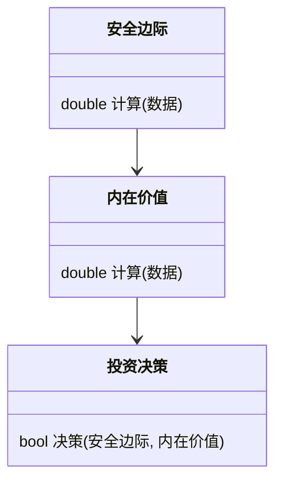

                 


# 《格雷厄姆价值投资理念在当代市场的应用》

> 关键词：价值投资、格雷厄姆、安全边际、内在价值、现代市场、投资策略

> 摘要：本文系统地探讨了格雷厄姆的价值投资理念在当代市场中的应用。从安全边际和内在价值的核心概念出发，结合现代市场的特点和变化，分析了如何在当前复杂的金融环境中应用这些理念。通过实际案例和算法模型，详细讲解了如何在技术进步和全球化背景下优化投资策略，同时提供了系统架构设计和项目实战的详细指导，为投资者提供了实用的策略和工具。

---

## 第一部分：引言

### 第1章：价值投资理念的概述

#### 1.1 价值投资的基本概念

价值投资是一种基于对公司内在价值评估的投资方法，旨在通过购买低于其内在价值的股票，长期持有以实现资本增值。格雷厄姆是价值投资的奠基人，他提出的核心理念是“安全边际”，即在价格显著低于内在价值时买入，以降低风险并确保收益。

#### 1.2 格雷厄姆的投资哲学

格雷厄姆认为，市场波动性和投资者情绪会影响股票价格，但长期来看，价格会回归其内在价值。因此，投资的关键是找到那些被市场低估的公司，并在价格下跌时买入，上涨时卖出。

#### 1.3 当代市场的变化

现代市场环境复杂多变，包括技术进步、全球化和市场波动性增加。这些变化要求投资者不断调整策略，将传统价值投资理念与现代工具和方法相结合。

---

## 第二部分：格雷厄姆价值投资理念的核心要素

### 第2章：安全边际与内在价值

#### 2.1 安全边际的定义与计算

安全边际是股票价格与内在价值之间的差距，用于衡量投资的风险和潜在收益。公式为：安全边际 = 市场价格 - 内在价值。

##### 2.1.1 安全边际与投资风险的关系

安全边际越大，投资风险越小，潜在收益越高。因此，在选择标的时，应优先考虑安全边际较高的资产。

#### 2.2 内在价值的评估方法

##### 2.2.1 现金流折现法（DCF）

DCF模型通过将未来现金流折现，评估公司的内在价值。公式为：

$$
\text{内在价值} = \sum_{t=1}^{n} \frac{CF_t}{(1 + r)^t}
$$

其中，\( CF_t \) 是第 \( t \) 年的现金流，\( r \) 是折现率。

##### 2.2.2 市盈率法

市盈率法通过比较市盈率与行业平均水平，评估股票的估值。公式为：

$$
\text{市盈率} = \frac{\text{股价}}{\text{每股收益}}
$$

---

## 第三部分：价值投资理念在现代市场的应用

### 第3章：现代市场环境下的价值投资策略

#### 3.1 现代市场的特点与变化

##### 3.1.1 市场波动性增加的原因

技术进步、信息传播速度加快和算法交易的普及，导致市场波动性显著增加。投资者需更加注重风险管理和资产配置。

##### 3.1.2 技术进步对投资的影响

大数据和人工智能技术的应用，使得投资者能够更高效地分析数据和识别机会，但也带来了新的挑战，如信息过载和算法交易的风险。

##### 3.1.3 全球化与多样化资产配置

全球化使得投资者可以分散风险，通过配置不同地区的资产来降低波动性。但同时也要求投资者具备跨市场的分析能力。

---

## 第四部分：价值投资的算法与系统分析

### 第4章：价值投资的算法原理

#### 4.1 格雷厄姆估值模型的算法实现

##### 4.1.1 现金流折现法的实现

使用Python代码实现现金流折现模型，计算目标公司的内在价值：

```python
import numpy as np

def discounted_cash_flow(cash_flows, discount_rate):
    present_value = sum(cash_flow / (1 + discount_rate) ** t for t, cash_flow in enumerate(cash_flows))
    return present_value

# 示例数据
cash_flows = [100, 150, 200, 250]  # 每年的现金流
discount_rate = 0.10  # 折现率
intrinsic_value = discounted_cash_flow(cash_flows, discount_rate)
print(f"内在价值：{intrinsic_value}")
```

##### 4.1.2 安全边际的计算

基于DCF模型计算出的内在价值，与市场价格比较，计算安全边际：

$$
\text{安全边际} = \text{市场价格} - \text{内在价值}
$$

---

## 第五部分：价值投资系统的架构与设计

### 第5章：系统架构设计

#### 5.1 价值投资系统的功能设计

##### 5.1.1 领域模型设计

使用Mermaid类图展示价值投资系统的领域模型：



#### 5.2 系统架构设计

使用Mermaid架构图展示系统架构：


---

## 第六部分：项目实战与案例分析

### 第6章：价值投资策略的实战应用

#### 6.1 项目背景与目标

选择一家公司，计算其内在价值和安全边际，评估其投资价值。

#### 6.2 数据收集与清洗

收集公司的财务数据，包括现金流、收入和利润等。

#### 6.3 估值与分析

使用DCF模型计算内在价值，并与市场价格比较，确定安全边际。

#### 6.4 投资决策

根据安全边际和市场环境，制定投资策略。

---

## 第七部分：总结与展望

### 第7章：总结与最佳实践

#### 7.1 总结

格雷厄姆的价值投资理念在当代市场中仍具有重要价值。通过结合现代工具和方法，投资者可以在复杂环境中实现稳健收益。

#### 7.2 最佳实践

- 定期评估投资组合，调整权重以适应市场变化。
- 结合技术分析，优化投资决策。
- 保持长期视角，避免短期波动影响判断。

#### 7.3 注意事项

- 风险管理是投资成功的关键。
- 数据质量和模型准确性直接影响结果。

---

## 作者

作者：AI天才研究院/AI Genius Institute  
联系邮箱：contact@aigenius.org  

---

本文通过系统分析和详细案例，展示了格雷厄姆价值投资理念在现代的应用，为投资者提供了实用的策略和工具。

