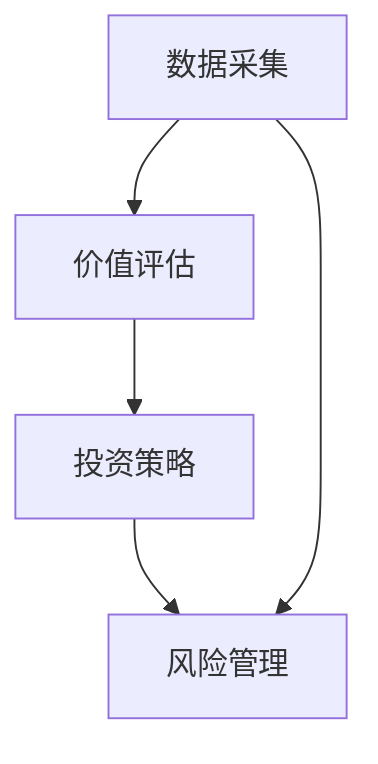

                 

# 格雷厄姆价值投资理念在虚拟经济时代的新解读

## 关键词：价值投资，虚拟经济，区块链，加密货币，NFT，投资策略

## 摘要：  
本文将深入探讨格雷厄姆价值投资理念在虚拟经济时代的新应用，分析其在区块链、加密货币和NFT等虚拟经济领域的适用性。通过结合传统价值投资原则与虚拟经济的特点，提出创新的投资策略，并结合实际案例，提供系统化的价值评估模型和风险管理方法，为投资者在虚拟经济中实现稳健收益提供理论支持和实践指导。

---

## 第一部分: 格雷厄姆价值投资理念的背景与基础

### 第1章: 价值投资理念的核心概念

#### 1.1 格雷厄姆价值投资的定义与原则

##### 1.1.1 价值投资的起源与发展  
价值投资是一种基于对公司内在价值的评估，寻找市场价格低于内在价值的投资策略。其创始人本杰明·格雷厄姆（Benjamin Graham）在20世纪初提出了“安全边际”和“内在价值”等核心概念，为价值投资奠定了理论基础。

##### 1.1.2 格雷厄姆的投资理念与方法  
格雷厄姆的价值投资方法强调买入被市场低估的股票，长期持有，等待市场重新评估其价值。他提出的“margin of safety”（安全边际）概念，即买入价格低于内在价值，是价值投资的核心原则。

##### 1.1.3 价值投资的核心原则与框架  
- **内在价值**：资产的真正价值是其未来现金流的现值。  
- **安全边际**：买入价格低于内在价值，以降低投资风险。  
- **长期持有**：价值投资强调长期持有，避免频繁交易。  
- **逆周期投资**：在市场低迷时寻找被低估的机会。

#### 1.2 虚拟经济时代的背景与特点

##### 1.2.1 虚拟经济的定义与特征  
虚拟经济是指以数字资产、区块链、加密货币和NFT等虚拟商品为交易对象的经济体系。其特点是去中心化、高波动性和技术驱动。

##### 1.2.2 区块链与加密货币的兴起  
区块链技术的去中心化特性使得加密货币（如比特币）成为虚拟经济的重要组成部分。加密货币的供应量有限，具备稀缺性和可追溯性，吸引了大量投资者。

##### 1.2.3 NFT与虚拟资产的崛起  
NFT（Non-Fungible Token，非同质化代币）通过区块链技术实现了数字艺术品、虚拟土地等虚拟资产的唯一性和所有权，推动了虚拟经济的进一步发展。

#### 1.3 价值投资与虚拟经济的结合

##### 1.3.1 传统价值投资与虚拟经济的差异  
传统价值投资主要针对实体经济中的股票和公司，而虚拟经济中的资产（如加密货币和NFT）具有不同的特性，例如高波动性和去中心化。

##### 1.3.2 虚拟经济时代价值投资的适用性  
尽管虚拟经济与实体经济存在差异，但价值投资的核心理念——寻找被低估的资产、注重长期价值——仍然适用。

##### 1.3.3 格雷厄姆理念在虚拟经济中的新应用  
将格雷厄姆的价值投资理念与虚拟经济的特点相结合，提出了新的价值评估方法和投资策略。

---

### 第2章: 虚拟经济中的价值评估模型

#### 2.1 价值评估的基本原理

##### 2.1.1 虚拟资产的价值构成要素  
虚拟资产的价值取决于其用途、稀缺性、流动性和技术支撑等因素。例如，比特币的价值来源于其去中心化、有限供应和网络安全。

##### 2.1.2 价值评估的关键指标与方法  
- **市场流动性**：资产在市场中的交易活跃度。  
- **技术支撑**：区块链技术的稳定性和可扩展性。  
- **市场需求**：用户需求和应用场景的广泛性。

##### 2.1.3 格雷厄姆模型的虚拟经济适应性  
传统的格雷厄姆模型主要适用于实体经济中的股票和公司，但在虚拟经济中需要进行调整，以适应数字资产的特点。

#### 2.2 虚拟经济价值评估的数学模型

##### 2.2.1 虚拟资产价值的公式化表达  
虚拟资产的内在价值可以通过以下公式进行估算：  
$$ V = \frac{CF}{r} $$  
其中，\( CF \) 是未来现金流，\( r \) 是折现率。

##### 2.2.2 价值评估模型的构建与验证  
以比特币为例，其内在价值可以通过以下步骤进行评估：  
1. 估算比特币的未来现金流。  
2. 确定合适的折现率。  
3. 计算比特币的内在价值。  
4. 比较市场价格与内在价值，判断是否低估或高估。

##### 2.2.3 案例分析与模型应用  
案例分析：以比特币为例，假设其未来现金流为 $1000，折现率为 5%，则其内在价值为 $20000。如果当前市场价格为 $18000，则比特币被低估，具有投资价值。

---

### 第3章: 虚拟经济中的投资策略创新

#### 3.1 传统价值投资策略的挑战

##### 3.1.1 传统价值投资在虚拟经济中的局限性  
虚拟经济中的资产具有高度波动性和不确定性，传统的价值投资策略在面对市场波动时显得不够灵活。

##### 3.1.2 虚拟经济环境下的投资风险  
虚拟经济中的资产价格波动剧烈，投资者需要面对更大的市场风险和技术风险。

##### 3.1.3 投资者行为与市场波动的影响  
投资者的非理性行为（如追涨杀跌）会加剧市场波动，影响价值投资策略的有效性。

#### 3.2 虚拟经济时代的价值投资策略

##### 3.2.1 基于基本面分析的虚拟资产选择  
基本面分析需要关注区块链技术的稳定性、项目团队的背景和市场应用场景。

##### 3.2.2 市场情绪与技术分析的结合  
结合技术分析指标（如移动平均线、相对强弱指数）和市场情绪，优化投资决策。

##### 3.2.3 长期投资与短期波动的平衡  
价值投资强调长期持有，但在虚拟经济中需要关注短期波动，及时调整投资组合。

#### 3.3 案例分析与策略优化

##### 3.3.1 虚拟经济中的成功投资案例  
案例：以太坊（ETH）在智能合约和去中心化应用（DApp）的推动下，价值显著提升。

##### 3.3.2 投资策略的动态调整与优化  
根据市场变化和技术发展，动态调整投资组合，优化价值评估模型。

##### 3.3.3 策略的有效性评估与改进  
通过回测和实证分析，评估投资策略的有效性，并根据结果进行优化。

---

## 第二部分: 虚拟经济中的价值投资实践

### 第4章: 虚拟经济中的技术分析与投资决策

#### 4.1 技术分析在虚拟经济中的应用

##### 4.1.1 技术分析的基本原理与方法  
技术分析通过研究价格走势和交易量，预测未来的价格波动。

##### 4.1.2 虚拟资产价格波动的技术分析指标  
- **移动平均线（MA）**：用于判断价格趋势。  
- **相对强弱指数（RSI）**：用于判断超买或超卖状态。  
- **MACD（移动平均收敛散度）**：用于判断价格趋势和力量。

##### 4.1.3 技术分析的优缺点  
优点：能够捕捉短期价格波动，提供交易信号。缺点：容易受到市场情绪的影响，具有一定的局限性。

#### 4.2 技术分析与价值投资的结合

##### 4.2.1 技术分析在价值投资中的作用  
技术分析可以帮助投资者识别市场趋势和价格波动，辅助价值评估。

##### 4.2.2 价值投资与技术分析的结合策略  
- **长期持有**：基于价值评估，选择优质资产长期持有。  
- **短期调整**：根据技术分析信号，进行短期仓位调整。

##### 4.2.3 案例分析：比特币的技术分析与价值投资结合  
案例分析：通过技术分析识别比特币的上涨趋势，结合价值评估确认其低估状态，制定长期持有策略。

---

## 第三部分: 虚拟经济中的风险管理与投资组合优化

### 第5章: 风险管理与投资组合优化

#### 5.1 风险管理的重要性

##### 5.1.1 投资风险的分类与特征  
- **市场风险**：资产价格波动带来的风险。  
- **流动性风险**：资产难以快速变现的风险。  
- **技术风险**：区块链技术故障带来的风险。

##### 5.1.2 风险管理的核心原则  
- **分散投资**：通过投资不同类型的资产降低风险。  
- **风险厌恶**：根据投资者的风险承受能力调整投资组合。

#### 5.2 投资组合优化策略

##### 5.2.1 现代投资组合理论（MPT）的应用  
通过优化投资组合的收益与风险比率，实现风险最小化。

##### 5.2.2 基于MPT的虚拟资产投资组合设计  
以NFT和加密货币为例，设计一个包含多种资产的投资组合，分散风险。

##### 5.2.3 投资组合优化的数学模型  
使用均值-方差模型优化投资组合：  
$$ \text{Minimize } \sigma^2 \text{ subject to } \mu \geq \text{target return} $$

#### 5.3 案例分析：基于MPT的虚拟资产投资组合优化  
案例分析：假设投资者有 $100000 可投资，选择比特币、以太坊和NFT三种资产，根据MPT优化投资组合。

---

## 第四部分: 项目实战与系统架构

### 第6章: 项目实战与系统架构

#### 6.1 项目背景与目标

##### 6.1.1 项目背景  
以虚拟经济中的NFT投资为例，设计一个基于格雷厄姆价值投资理念的NFT投资系统。

##### 6.1.2 项目目标  
- 构建NFT的价值评估模型。  
- 设计投资策略。  
- 开发投资管理系统。

#### 6.2 系统架构设计

##### 6.2.1 系统功能设计  
- 数据采集模块：获取NFT的交易数据和市场信息。  
- 价值评估模块：计算NFT的内在价值。  
- 投资策略模块：制定投资策略并生成交易信号。  
- 风险管理模块：监控投资组合并进行风险评估。

##### 6.2.2 系统架构图  

#### 6.3 核心代码实现

##### 6.3.1 数据采集与清洗  
使用Python的爬虫框架（如Scrapy）采集NFT交易数据，清洗数据并存储在数据库中。

##### 6.3.2 价值评估模型  
基于格雷厄姆模型，开发NFT价值评估算法，计算每件NFT的内在价值。

##### 6.3.3 投资策略与风险管理  
根据价值评估结果和市场趋势，制定投资策略，并通过风险管理模块进行实时监控。

---

## 总结与展望

### 总结  
本文从理论到实践，详细探讨了格雷厄姆价值投资理念在虚拟经济中的新应用。通过构建价值评估模型、制定创新投资策略、优化投资组合和开发投资管理系统，为投资者在虚拟经济中实现稳健收益提供了理论支持和实践指导。

### 展望  
未来，随着虚拟经济的不断发展，价值投资的理念和技术将更加紧密地结合。投资者需要不断学习新技术、优化投资策略，以应对虚拟经济中的挑战。

---

## 作者：AI天才研究院/AI Genius Institute & 禅与计算机程序设计艺术 /Zen And The Art of Computer Programming

---

以上是《格雷厄姆价值投资理念在虚拟经济时代的新解读》的完整大纲和详细内容，涵盖了从理论到实践的各个方面，结合了区块链、加密货币和NFT等虚拟经济领域的实例，为投资者提供了系统的指导和实践方案。

