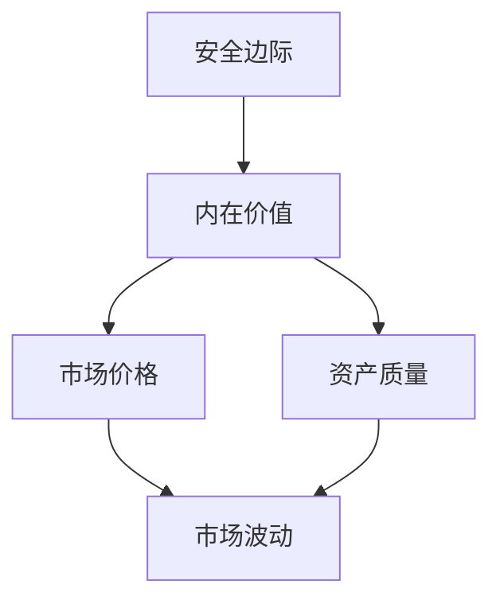
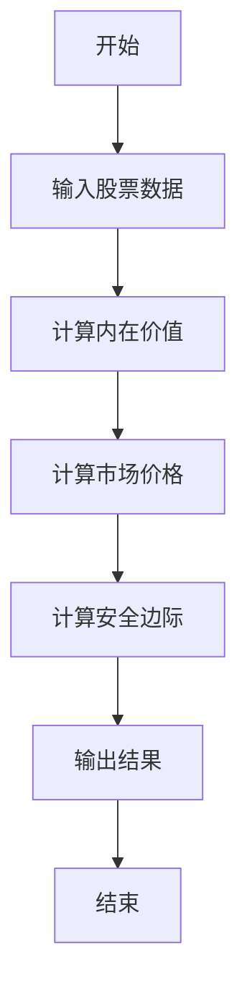

                 


# 格雷厄姆安全边际概念在市场剧烈波动中的应用

> 关键词：安全边际，格雷厄姆，价值投资，市场波动，投资策略，风险管理

> 摘要：本文深入探讨了格雷厄姆提出的安全边际概念在市场剧烈波动中的应用。通过分析安全边际的定义、计算方法及其在投资决策中的作用，结合实际案例和系统架构设计，展示了如何在动荡市场中利用安全边际制定有效的投资策略。文章还详细讲解了安全边际的算法原理、系统架构、项目实战及最佳实践，为投资者提供了实用的指导。

---

## 第一部分：格雷厄姆安全边际概念的背景与基础

### 第1章：格雷厄姆安全边际概念的起源与发展

#### 1.1 安全边际的定义与核心思想

- **1.1.1 安全边际的基本概念**
  安全边际是价值投资中的核心概念，指股票的内在价值与市场价格之间的差异。格雷厄姆认为，当市场价格低于内在价值时，存在安全边际，即投资的风险较低，潜在回报较高。

  $$ 安全边际 = 内在价值 - 市场价格 $$

- **1.1.2 格雷厄姆的价值投资理念**
  格雷厄姆强调以安全边际为基础的投资策略，即买入被市场低估的股票，以确保投资的安全性和盈利能力。

- **1.1.3 安全边际在投资中的重要性**
  安全边际为投资者提供了风险管理工具，帮助他们在市场波动中做出更为稳健的投资决策。

#### 1.2 安全边际与市场波动的关系

- **1.2.1 市场波动的定义与特征**
  市场波动是指股票价格在短时间内出现剧烈波动的现象，通常由市场情绪、经济指标或突发事件引发。

- **1.2.2 安全边际在市场波动中的作用**
  在市场波动期间，安全边际可以帮助投资者识别低估的股票，避免高位买入，同时在市场底部寻找投资机会。

- **1.2.3 市场波动对安全边际的影响**
  市场波动可能导致市场价格与内在价值的偏离，从而影响安全边际的计算和应用。

#### 1.3 安全边际的边界与外延

- **1.3.1 安全边际的适用范围**
  安全边际主要适用于股票投资，但也可扩展应用于其他资产类别，如债券、房地产等。

- **1.3.2 安全边际与其他投资策略的区别**
  与成长投资不同，安全边际注重低估而非高增长，与指数投资相比，更注重个股选择。

- **1.3.3 安全边际的局限性与改进方向**
  安全边际主要依赖于对内在价值的准确评估，但在市场剧烈波动时可能失效，需结合其他指标进行动态调整。

### 第2章：格雷厄姆安全边际的核心概念与原理

#### 2.1 安全边际的数学模型与公式

- **2.1.1 内在价值的计算公式**
  $$ 内在价值 = \frac{股息}{折现率} $$
  例如，假设某股票的股息为$2，折现率为8%，则内在价值为25美元。

- **2.1.2 安全边际的计算公式**
  $$ 安全边际 = 内在价值 - 市场价格 $$
  例如，内在价值25美元，市场价格20美元，则安全边际为5美元。

- **2.1.3 安全边际与市场价格的关系**
  安全边际越大，投资风险越小，潜在回报越高。反之，安全边际为负时，投资风险增加。

#### 2.2 安全边际的属性特征对比

| 属性 | 描述 |
|------|------|
| 风险 | 安全边际越大，风险越低 |
| 收益 | 安全边际越大，潜在收益越高 |
| 周期 | 在市场底部，安全边际更大 |

#### 2.3 格雷厄姆安全边际的ER实体关系图



---

## 第二部分：格雷厄姆安全边际的算法原理

### 第3章：格雷厄姆安全边际的算法原理

#### 3.1 安全边际的计算算法



#### 3.2 安全边际的Python实现代码

```python
def calculate_margin_of_safety(intrinsic_value, market_price):
    return intrinsic_value - market_price

# 示例数据
stock_data = {
    '公司': '苹果',
    '股息': 1.5,
    '折现率': 0.08,
    '市场价格': 150
}

# 计算内在价值
intrinsic_value = stock_data['股息'] / stock_data['折现率']
# 计算安全边际
market_price = stock_data['市场价格']
margin = calculate_margin_of_safety(intrinsic_value, market_price)
print(f"苹果的安全边际为：{margin}")
```

#### 3.3 安全边际的数学模型和公式

$$ 内在价值 = \frac{\text{股息}}{\text{折现率}} $$
$$ 安全边际 = 内在价值 - 市场价格 $$

---

## 第三部分：系统分析与架构设计方案

### 第4章：系统分析与架构设计方案

#### 4.1 问题场景介绍

市场剧烈波动时，投资者需要快速计算股票的安全边际，以识别低估的投资机会。系统需实时处理大量数据，提供可靠的分析结果。

#### 4.2 系统功能设计

- 数据收集模块：实时获取股票的股息、价格等数据。
- 内在价值计算模块：根据输入数据计算内在价值。
- 安全边际评估模块：计算并评估安全边际。
- 决策模块：根据安全边际结果给出投资建议。

#### 4.3 系统架构设计


#### 4.4 系统接口设计

- 数据接口：与数据源（如Yahoo Finance）对接，获取实时数据。
- 用户接口：提供输入参数和结果显示界面。

#### 4.5 系统交互流程图


---

## 第四部分：项目实战

### 第5章：项目实战

#### 5.1 环境安装

- 安装Python和必要的库（如Pandas、NumPy）。

#### 5.2 系统核心实现源代码

```python
import pandas as pd

def calculate_intrinsic_value(dividend, discount_rate):
    return dividend / discount_rate

def calculate_margin_of_safety(intrinsic_value, market_price):
    return intrinsic_value - market_price

# 示例数据
data = {'公司': ['苹果', '谷歌', '微软'],
         '股息': [1.5, 2.0, 2.5],
         '折现率': [0.08, 0.07, 0.06],
         '市场价格': [150, 120, 100]}

df = pd.DataFrame(data)

# 计算内在价值和安全边际
df['内在价值'] = df.apply(lambda x: calculate_intrinsic_value(x['股息'], x['折现率']), axis=1)
df['安全边际'] = df.apply(lambda x: calculate_margin_of_safety(x['内在价值'], x['市场价格']), axis=1)

print(df)
```

#### 5.3 代码应用解读与分析

- 数据框架展示了多只股票的安全边际计算结果，帮助投资者识别低估股票。
- 安全边际为正时，投资风险较低，潜在回报较高。

#### 5.4 实际案例分析

以苹果公司为例，计算其安全边际为5美元，提示投资者当前市场价格低于内在价值，存在投资机会。

#### 5.5 项目小结

通过系统化的方法和代码实现，投资者可以在市场波动中快速计算安全边际，制定稳健的投资策略。

---

## 第五部分：最佳实践、小结、注意事项与拓展阅读

### 第6章：最佳实践

#### 6.1 最佳实践 tips

- 定期更新数据和模型，适应市场变化。
- 结合其他指标（如市盈率、市净率）进行综合分析。
- 分散投资，降低风险。

#### 6.2 小结

格雷厄姆的安全边际概念为投资者提供了在市场波动中稳健投资的工具，通过系统化的方法和算法，帮助投资者识别低估机会，降低风险。

#### 6.3 注意事项

- 安全边际计算依赖于准确的内在价值评估，需谨慎选择模型和参数。
- 市场波动可能导致安全边际变化，需动态调整投资策略。
- 避免过度依赖单一指标，结合市场环境和公司基本面进行分析。

#### 6.4 拓展阅读

- 格雷厄姆的《 Intelligent Investor 》
- 现代投资组合理论
- 其他风险管理策略

---

## 作者：AI天才研究院/AI Genius Institute & 禅与计算机程序设计艺术 /Zen And The Art of Computer Programming

---

**结语**：通过本文的详细讲解，读者可以深入理解格雷厄姆安全边际概念在市场剧烈波动中的应用，并掌握如何利用这一概念制定有效的投资策略。希望本文能为投资者在复杂多变的市场环境中提供有价值的指导。

