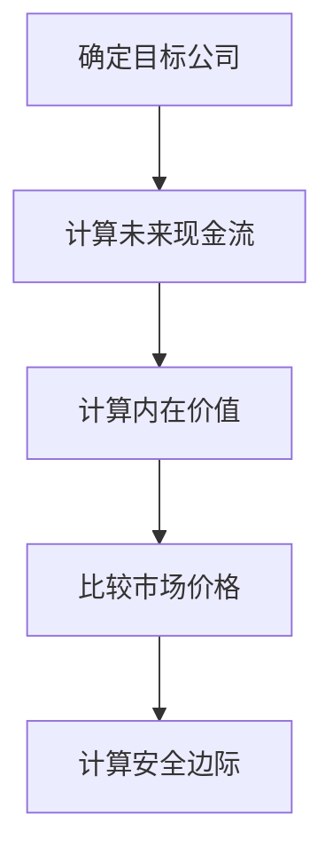
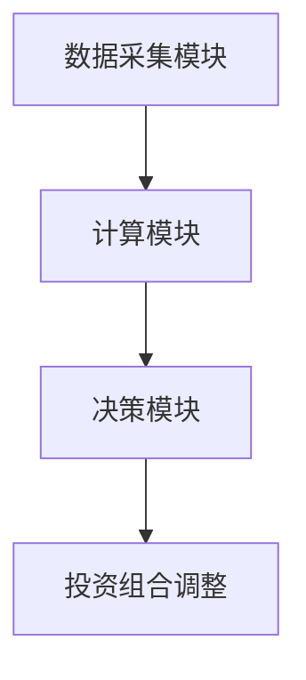
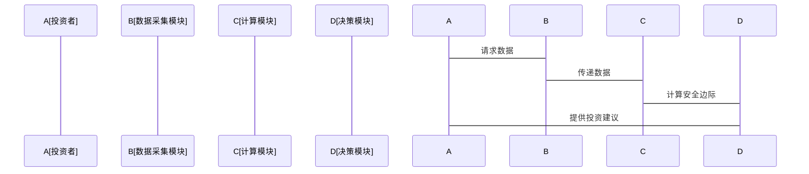

                 


# 格雷厄姆安全边际概念在极端市场事件中的应用

> 关键词：安全边际，格雷厄姆，极端市场，投资策略，风险管理，价值投资

> 摘要：本文深入探讨了格雷厄姆提出的安全边际概念在极端市场事件中的应用。通过分析安全边际的核心理论、数学模型、算法原理以及实际案例，本文揭示了如何在市场波动剧烈的情况下，利用安全边际策略来保护投资组合并抓住潜在机会。文章还结合了技术分析和系统架构设计，提出了在极端市场环境中的具体实施策略，为投资者提供了实用的指导和建议。

---

## 第一部分：安全边际的核心概念与背景

### 第1章：安全边际的定义与历史背景

#### 1.1 格雷厄姆投资理论概述
格雷厄姆是价值投资的鼻祖，他提出的安全边际概念是其投资理论的核心。他强调，投资者应以低于内在价值的价格买入资产，以确保在市场波动时能够避免重大损失并获得超额收益。

#### 1.2 安全边际的内涵
安全边际=内在价值-市场价格。通过计算安全边际，投资者可以评估资产的潜在风险和收益，从而做出更为明智的投资决策。

#### 1.3 与价值投资的关系
价值投资强调购买低于内在价值的资产，而安全边际是实现这一目标的具体工具。通过安全边际，投资者能够在市场价格波动时保持投资组合的稳定性。

---

### 第2章：安全边际在极端市场中的作用

#### 2.1 极端市场事件的定义与分类
极端市场事件包括市场崩盘、系统性风险爆发、非理性繁荣等情况。这些事件通常伴随着市场波动剧烈和投资者情绪失控。

#### 2.2 安全边际在极端市场中的作用
在极端市场中，安全边际能够帮助投资者避免过度损失，并在市场复苏时获得超额收益。通过动态调整安全边际，投资者可以在不同市场环境下优化投资组合。

---

## 第二部分：安全边际的数学模型与算法原理

### 第3章：安全边际的数学模型

#### 3.1 内在价值的计算公式
$$
\text{内在价值} = \frac{\text{未来现金流}}{\text{折现率}}
$$

#### 3.2 安全边际的计算公式
$$
\text{安全边际} = \text{内在价值} - \text{市场价格}
$$

#### 3.3 安全边际与风险的关系
$$
\text{风险} = \frac{\text{市场价格} - \text{内在价值}}{\text{内在价值}}
$$

### 第4章：算法原理的详细讲解

#### 4.1 安全边际计算的步骤
1. 确定目标公司的未来现金流。
2. 计算公司的内在价值。
3. 比较市场价格与内在价值。
4. 计算安全边际。

#### 4.2 安全边际计算的 mermaid 流程图


#### 4.3 Python 实现安全边际计算的代码示例
```python
def calculate_intrinsic_value(cash_flows, discount_rate):
    return sum(cash_flows) / discount_rate

def calculate_margin_of_safety(intrinsic_value, market_price):
    return intrinsic_value - market_price
```

---

## 第三部分：系统分析与架构设计方案

### 第5章：极端市场中的系统设计

#### 5.1 问题场景介绍
在极端市场中，投资者需要快速计算安全边际并动态调整投资组合。这需要一个高效的系统架构来支持实时数据分析和决策制定。

#### 5.2 系统功能设计
- 数据采集模块：实时获取市场数据。
- 计算模块：计算内在价值和安全边际。
- 决策模块：根据安全边际结果动态调整投资组合。

#### 5.3 系统架构设计 mermaid 图


#### 5.4 系统接口设计
- 数据接口：与数据源对接，获取实时市场数据。
- 计算接口：调用安全边际计算函数，返回结果。
- 决策接口：根据安全边际结果，生成投资建议。

#### 5.5 系统交互 mermaid 序列图


---

## 第四部分：项目实战与案例分析

### 第6章：极端市场中的实战案例

#### 6.1 案例环境安装
- 数据源：选择可靠的金融数据提供商。
- 工具：安装Python和相关库（如Pandas、NumPy）。

#### 6.2 核心代码实现
```python
import pandas as pd
import numpy as np

def calculate_margin_of_safety(stocks):
    intrinsic_values = []
    for stock in stocks:
        iv = calculate_intrinsic_value(stock.cash_flows, stock.discount_rate)
        mos = iv - stock.market_price
        intrinsic_values.append(mos)
    return intrinsic_values
```

#### 6.3 案例分析与结果解读
通过分析极端市场中的股票，计算其安全边际，评估投资风险，并根据结果动态调整投资策略。

---

## 第五部分：总结与建议

### 第7章：总结与最佳实践

#### 7.1 总结
安全边际是价值投资中的重要工具，在极端市场中能够帮助投资者规避风险并抓住机会。

#### 7.2 投资建议
1. 在极端市场中，优先选择具有较高安全边际的资产。
2. 定期评估投资组合的安全边际，及时调整。
3. 结合技术分析和基本面分析，提高投资决策的准确性。

#### 7.3 小结
通过本文的分析，读者可以深入了解安全边际的应用，并在实际投资中灵活运用这一策略。

---

## 作者信息

作者：AI天才研究院/AI Genius Institute  
禅与计算机程序设计艺术 /Zen And The Art of Computer Programming

