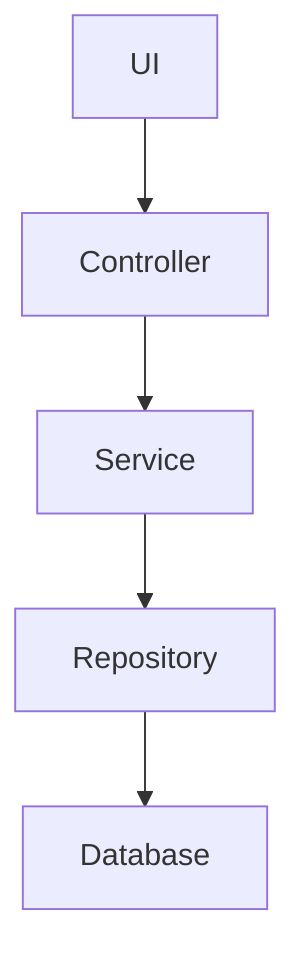

                 


# 格雷厄姆安全边际概念在特价股票选择中的应用

> 关键词：格雷厄姆，安全边际，特价股票，股票选择，投资策略

> 摘要：本文深入探讨了格雷厄姆的安全边际概念在特价股票选择中的应用，从安全边际的定义、计算方法，到其在投资组合中的实际应用，结合数学模型和案例分析，为投资者提供了一个系统化的股票选择框架。

---

## 第一部分: 格雷厄姆安全边际概念的背景与基础

### 第1章: 格雷厄姆安全边际概念的起源与发展

#### 1.1 格雷厄姆的生平与投资理念
- **格雷厄姆的生平简介**  
  本杰明·格雷厄姆（Benjamin Graham）是20世纪著名的投资学家，被誉为“价值投资之父”。他于1894年出生在美国纽约，早年就读于哥伦比亚大学，毕业后进入华尔街工作。他在投资领域的主要贡献在于提出了“价值投资”理念，并撰写了多本经典著作，如《证券分析》和《聪明的投资者》。

- **格雷厄姆的投资哲学与价值投资**  
  格雷厄姆认为，股票不仅仅是一个交易的工具，更是一个企业的所有权证书。投资者应该以低于其内在价值的价格买入股票，并长期持有，直到其价值被市场充分认可。这种投资理念强调安全性和稳定性，而非短期的市场波动。

- **安全边际概念的提出与意义**  
  格雷厄姆提出的“安全边际”是价值投资的核心思想。安全边际是指股票的市场价格与内在价值之间的差距。通过计算安全边际，投资者可以识别出那些价格被市场低估的股票，从而降低投资风险并提高收益。

#### 1.2 安全边际的核心要素
- **安全边际的定义**  
  安全边际 = 内在价值 - 市场价格  
  其中，内在价值是股票的真正价值，而市场价格是市场上的交易价格。

- **安全边际的重要性**  
  安全边际的存在为投资者提供了“缓冲区”。即使市场出现波动，只要内在价值不变，投资者的安全边际仍然存在，从而降低了投资的风险。

- **安全边际与股票价值的关系**  
  当市场价格低于内在价值时，安全边际为正，说明股票具有投资价值；反之，则不具有投资价值。

---

### 第2章: 安全边际的量化分析与模型

#### 2.1 安全边际的计算方法
- **市盈率与市净率的基本概念**  
  市盈率（P/E）= 市场价格 / 每股净利润  
  市净率（P/B）= 市场价格 / 每股净资产  

- **格雷厄姆公式与安全边际的计算**  
  格雷厄姆提出了一种计算内在价值的方法：  
  $$ \text{内在价值} = \frac{\text{每股收益} \times (4.33 \times \text{保留比率})}{\text{资本回报率}} $$  
  通过比较市场价格与内在价值，可以确定安全边际的大小。

- **安全边际与股票价格的对比分析**  
  使用以下公式计算安全边际：  
  $$ \text{安全边际} = \text{内在价值} - \text{市场价格} $$  
  如果安全边际为正，说明股票具有投资价值。

#### 2.2 安全边际的数学模型与公式
- **格雷厄姆公式的基本结构**  
  $$ \text{内在价值} = \frac{E \times (4.33 \times R)}{C} $$  
  其中，E 是每股收益，R 是保留比率，C 是资本回报率。

- **安全边际的计算公式**  
  $$ \text{安全边际} = V - P $$  
  其中，V 是内在价值，P 是市场价格。

- **公式中各变量的定义与解释**  
  - 每股收益（E）：公司净利润除以总股本。  
  - 保留比率（R）：公司保留的利润比例，用于再投资。  
  - 资本回报率（C）：公司使用股东资金的回报率。  

#### 2.3 安全边际的图表分析
- **安全边际与股票价格的对比图**  
  ```mermaid
  line_chart
    title 安全边际与股票价格对比
    x-axis: 价格
    y-axis: 安全边际
    "内在价值": 100
    "市场价格": 80
    安全边际: 20
  ```

- **市盈率与市净率的散点图**  
  ```mermaid
  scatterplot
    title 市盈率与市净率
    x-axis: 市盈率
    y-axis: 市净率
    "数据点1": (15, 2)
    "数据点2": (20, 3)
    "数据点3": (25, 4)
  ```

---

## 第二部分: 安全边际在股票选择中的应用

### 第3章: 安全边际与特价股票的选择

#### 3.1 特价股票的定义与特征
- 特价股票是指市场价格远低于内在价值的股票，通常具有较高的安全边际。

- 特价股票的特征：  
  1. 低市盈率或低市净率。  
  2. 盈利稳定，具有较高的股息率。  
  3. 公司基本面良好，行业地位稳固。  

#### 3.2 安全边际在特价股票选择中的作用
- 通过计算安全边际，投资者可以识别出具有投资价值的特价股票。

- 安全边际越高，股票的投资价值越大。

#### 3.3 特价股票与市场周期的关系
- 在市场低迷时期，特价股票更容易出现。  
- 在市场繁荣时期，安全边际可能为负，投资者应避免买入。

---

## 第三部分: 安全边际的量化分析与模型

### 第4章: 安全边际与投资组合优化

#### 4.1 投资组合的基本概念
- 投资组合是将不同股票组合在一起，以分散风险并提高收益。

- 投资组合的风险与收益分析：  
  风险与收益是投资组合的核心考量因素。通过引入安全边际，可以优化投资组合的收益与风险比。

#### 4.2 安全边际在投资组合中的应用
- 通过筛选具有高安全边际的股票，构建一个稳健的投资组合。

- 投资组合的优化算法：  
  使用数学优化方法，如均值-方差优化，结合安全边际指标，构建最优投资组合。

#### 4.3 安全边际的投资策略
- **长期投资**：持有具有高安全边际的股票，等待其内在价值被市场发现。  
- **分批买入**：在市场波动中，分批买入具有高安全边际的股票，降低平均成本。  

---

## 第四部分: 系统分析与架构设计方案

### 第5章: 系统功能设计

#### 5.1 问题场景介绍
- 投资者需要一个系统化的工具，帮助其识别具有高安全边际的特价股票。

#### 5.2 系统功能设计
- **用户输入**：输入股票的基本信息，如市盈率、市净率、每股收益等。  
- **安全边际计算**：根据输入的信息，计算股票的内在价值和安全边际。  
- **结果输出**：输出安全边际的数值，并给出投资建议。

#### 5.3 系统架构设计


---

## 第五部分: 项目实战

### 第6章: 项目实战

#### 6.1 环境安装
- 安装Python和相关库，如pandas、numpy、scipy。

#### 6.2 系统核心实现源代码
```python
import pandas as pd
import numpy as np

def calculate_intrinsic_value(eps, retention_ratio, return_on_equity):
    return (eps * (4.33 * retention_ratio)) / return_on_equity

def calculate_margin_of_safety(intrinsic_value, market_price):
    return intrinsic_value - market_price

# 示例数据
data = {
    '公司': ['公司A', '公司B', '公司C'],
    'eps': [1.5, 2.0, 1.2],
    'retention_ratio': [0.6, 0.7, 0.5],
    'return_on_equity': [0.15, 0.18, 0.12],
    'market_price': [50, 60, 40]
}

df = pd.DataFrame(data)

# 计算内在价值和安全边际
df['内在价值'] = df.apply(lambda x: calculate_intrinsic_value(x['eps'], x['retention_ratio'], x['return_on_equity']), axis=1)
df['安全边际'] = df.apply(lambda x: calculate_margin_of_safety(x['内在价值'], x['market_price']), axis=1)

print(df)
```

---

## 第六部分: 最佳实践与总结

### 第7章: 最佳实践

#### 7.1 总结
- 格雷厄姆的安全边际概念为投资者提供了一个有效的工具，帮助其识别具有投资价值的股票。

#### 7.2 注意事项
- 投资者应结合市场环境和公司基本面，综合考虑安全边际和其他因素。

#### 7.3 拓展阅读
- 《证券分析》和《聪明的投资者》是理解安全边际概念的经典著作。

---

## 作者：AI天才研究院/AI Genius Institute & 禅与计算机程序设计艺术 /Zen And The Art of Computer Programming

---

这篇文章详细介绍了格雷厄姆安全边际概念在特价股票选择中的应用，从理论到实践，结合数学模型和代码实现，为投资者提供了一个系统化的投资框架。希望对您有所帮助！

