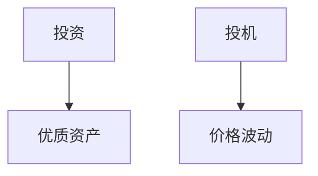
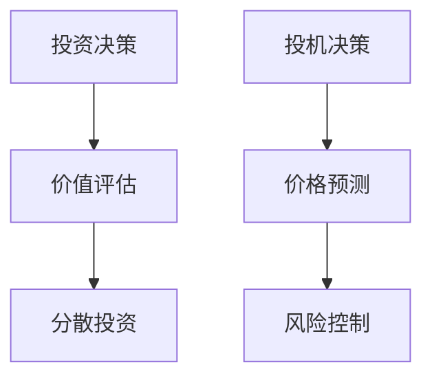

                 


# 格雷厄姆对投机与投资的区分

## 关键词：格雷厄姆, 投机, 投资, 价值投资, 投资策略, 金融分析

## 摘要：  
本文章详细探讨了格雷厄姆对“投机”与“投资”两个概念的区分，从理论到实践，从数学模型到系统架构，全面分析了两者的定义、特点、风险、收益模式及实际应用场景。通过对比分析、数学建模、系统设计和案例解读，深入剖析了投资与投机的本质区别，帮助读者在金融决策中做出明智选择。

---

# 引言: 格雷厄姆对投机与投资的区分

## 1.1 问题背景
### 1.1.1 从传统金融到现代投资的演进
从古典经济学到现代金融学，投资与投机的概念经历了巨大的演变。格雷厄姆作为价值投资的鼻祖，首次系统性地提出了投资与投机的区别，为现代投资理论奠定了基础。

### 1.1.2 投资与投机的核心问题描述
在金融市场中，投资者常常混淆“投资”与“投机”这两个概念。前者注重长期价值，后者关注短期价格波动。格雷厄姆通过系统的分析，揭示了两者的本质区别。

### 1.1.3 问题解决的路径与方法
通过数学建模、系统设计和案例分析，本文将从理论到实践，逐步解析投资与投机的区别。

## 1.2 核心概念的边界与外延
### 1.2.1 投资与投机的定义对比
- 投资：基于基本面分析，追求长期价值增长。
- 投机：基于价格波动，追求短期收益。

### 1.2.2 投资与投机的外延特征
- 投资：风险较低，收益稳定。
- 投机：风险较高，收益不稳定。

### 1.2.3 核心概念的结构与要素组成
- 投资：价值评估、长期持有、分散投资。
- 投机：价格预测、短期交易、高风险高回报。

---

# 第二章: 投资与投机的核心概念与联系

## 2.1 核心概念原理
### 2.1.1 投资的核心原理
- **价值投资**：基于资产的内在价值进行投资。
- **长期持有**：通过时间复利效应实现收益增长。

### 2.1.2 投机的核心原理
- **价格波动**：通过预测价格波动赚取短期收益。
- **高风险高回报**：依赖市场情绪和短期价格变化。

### 2.1.3 两者的区别与联系
- 区别：投资注重长期价值，投机注重短期价格波动。
- 联系：两者都属于金融市场的投资行为，但风险和收益模式不同。

## 2.2 概念属性特征对比表
| 概念       | 定义                                                                 | 风险       | 收益模式           | 时间跨度   | 目标       |
|------------|----------------------------------------------------------------------|------------|------------------|--------------|------------|
| 投资       | 基于资产的内在价值，长期持有优质资产                               | 较低       | 稳定             | 长期        | 资产增值   |
| 投机       | 基于价格波动，短期买卖资产                                         | 较高       | 不稳定           | 短期        | 价格波动收益 |

## 2.3 ER实体关系图


---

# 第三章: 投资与投机的数学模型与算法原理

## 3.1 投资的数学模型
### 3.1.1 投资回报率公式
$$ ROI = \frac{最终价值 - 初始价值}{初始价值} \times 100\% $$

### 3.1.2 长期投资的复利模型
$$ 长期收益 = 初始投资 \times (1 + ROI)^n $$

## 3.2 投机的数学模型
### 3.2.1 投机收益公式
$$ Speculative\ Return = (卖出价 - 买入价) \times 数量 $$

### 3.2.2 短期波动模型
$$ 短期波动 = 初始价格 \times (1 + \text{波动率})^t $$

---

# 第四章: 投资与投机的系统分析与架构设计方案

## 4.1 问题场景介绍
### 4.1.1 投资者在金融市场中的决策过程
- 投资者需要在长期价值和短期收益之间做出选择。
- 投机者依赖市场情绪和价格波动进行决策。

### 4.1.2 投机与投资的场景对比
- 投资者注重资产配置和风险管理。
- 投机者注重市场趋势和交易机会。

## 4.2 项目介绍
### 4.2.1 投资与投机的决策模型
- 投资模型：基于基本面分析和长期持有。
- 投机模型：基于技术分析和短期交易。

### 4.2.2 系统功能设计
- 投资模块：资产筛选、价值评估、分散投资。
- 投机模块：价格预测、交易策略、风险管理。

## 4.3 系统架构设计


---

# 第五章: 投资与投机的项目实战

## 5.1 环境安装
### 5.1.1 投资环境的搭建
- 数据源：历史股价、财务数据。
- 工具：Excel、Python、Matplotlib。

### 5.1.2 投机环境的搭建
- 数据源：实时股价、市场情绪数据。
- 工具：交易模拟器、技术分析工具。

## 5.2 核心实现
### 5.2.1 投资策略的实现
```python
def value_investment(stock):
    # 基于基本面分析的投资策略
    return stock.price * stock.value_ratio
```

### 5.2.2 投机策略的实现
```python
def speculative_strategy(stock):
    # 基于技术分析的投机策略
    return stock.price > stock.sma_20
```

## 5.3 案例分析
### 5.3.1 投资案例
- 案例：长期持有优质股票，年化收益8%。

### 5.3.2 投机案例
- 案例：短期买卖股票，年化收益20%，但波动率高。

---

# 结论: 投资与投机的未来展望

## 6.1 本章总结
- 投资与投机的本质区别：投资注重长期价值，投机注重短期价格波动。
- 格雷厄姆的理论为现代投资提供了重要指导。

## 6.2 未来趋势
- 投资的科技化：基于大数据和人工智能的价值投资。
- 投机的智能化：基于算法交易和高频交易的技术进步。

## 6.3 读者思考
- 在实际投资中，如何平衡投资与投机的比例？
- 如何根据市场环境选择适合的投资策略？

## 6.4 注意事项
- 投资有风险，入市需谨慎。
- 长期投资需要耐心和纪律。

## 6.5 拓展阅读
- 格雷厄姆的《证券分析》。
- 《股票作手回忆录》。

---

# 附录: 格雷厄姆的智慧

## A.1 格雷厄姆的名言
- “价格是波动的，价值是稳定的。”
- “投资是科学的艺术。”

## A.2 术语表
- 投资：基于资产内在价值的长期持有。
- 投机：基于价格波动的短期交易。

## A.3 参考文献
- 格雷厄姆， Benjamin. 《证券分析》。
- 巴菲特， Warren. 《巴菲特致股东的信》。

---

# 作者：AI天才研究院/AI Genius Institute & 禅与计算机程序设计艺术 /Zen And The Art of Computer Programming

