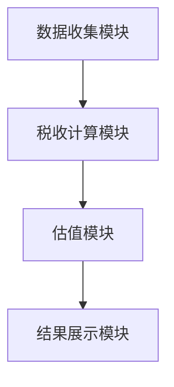
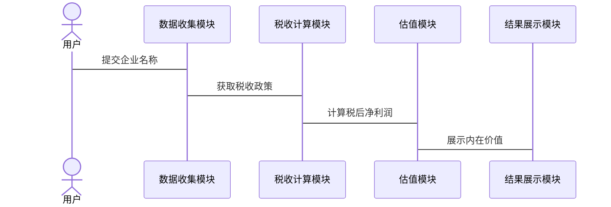

                 


# 格雷厄姆特价股票理论在不同税收环境下的调整

## 关键词
- 格雷厄姆投资理论
- 特价股票
- 税收环境
- 股票估值
- 价值投资

## 摘要
本文探讨了格雷厄姆特价股票理论在不同税收环境下的调整方法。首先介绍了格雷厄姆投资理论的背景和核心概念，然后分析了税收政策对股票估值的影响。接着，提出了调整后的数学模型，并通过实际案例验证了模型的有效性。最后，总结了调整后的模型的优势和实际应用中的注意事项。

---

## 第一部分: 格雷厄姆特价股票理论基础

### 第1章: 格雷厄姆投资理论概述

#### 1.1 格雷厄姆投资理论的起源
格雷厄姆是价值投资的鼻祖，他的投资理念以安全边际和内在价值为核心。他主张以低于内在价值的价格购买股票，长期持有，等待市场重新认识到其价值。

#### 1.2 格雷厄姆特价股票理论的核心概念
- **安全边际**：购买价格低于内在价值的部分，确保投资的安全性。
- **内在价值**：股票的真实价值，与市场价格可能不同。
- **价值投资**：通过分析企业的基本面，寻找被市场低估的股票。

#### 1.3 格雷厄姆投资理论与其他投资理论的对比
- **与技术分析的对比**：格雷厄姆的价值投资注重基本面分析，而技术分析关注价格和成交量的变化。
- **与现代资产组合理论的对比**：格雷厄姆的理论更注重个股的选择，而现代资产组合理论注重分散投资和风险控制。

### 第2章: 格雷厄姆特价股票理论的数学模型

#### 2.1 格雷厄姆安全边际的计算公式
安全边际 = 内在价值 - 市场价格

#### 2.2 特价股票的估值模型
内在价值 = (预期现金流) / (折现率)

#### 2.3 安全边际与投资决策的关系
通过计算安全边际，投资者可以确定投资的安全性。安全边际越大，投资风险越小。

---

## 第二部分: 税收环境对股票估值的影响

### 第3章: 税收政策对股票市场的影响

#### 3.1 税收政策对股票市场的基本影响
- **所得税**：影响投资者的净利润，从而影响股票的内在价值。
- **资本利得税**：影响股票的流动性，投资者可能因为税后收益减少而降低对股票的需求。

#### 3.2 不同国家的税收政策对比
- **美国**：资本利得税税率较低，鼓励长期投资。
- **英国**：资本利得税税率较高，影响短期投资行为。
- **中国**：所得税和增值税的双重影响，增加了企业的税负。

#### 3.3 税收环境对股票估值的具体影响
- 税收政策影响企业的净利润，进而影响股票的内在价值。
- 税收政策影响投资者的税后收益，进而影响股票的市场价值。

---

## 第三部分: 格雷厄姆特价股票理论在不同税收环境下的调整

### 第4章: 税收环境下的股票估值调整

#### 4.1 调整后的数学模型
$$ 内在价值_{调整后} = \frac{预期现金流}{折现率} \times (1 - 税率) $$

#### 4.2 税收政策对折现率的影响
税收政策会影响折现率，进而影响内在价值的计算。

#### 4.3 实际案例分析
以美国和中国为例，分析不同税收政策下的股票估值调整。

---

## 第四部分: 系统架构与实现

### 第5章: 系统架构设计

#### 5.1 系统功能设计
- 数据收集模块：收集企业的财务数据和税收政策。
- 税收计算模块：计算企业的税后净利润。
- 估值模块：根据调整后的数学模型计算股票的内在价值。
- 结果展示模块：展示调整后的内在价值和市场价值。

#### 5.2 系统架构图


#### 5.3 系统接口设计
- 数据接口：与企业财务系统对接，获取财务数据。
- 税收接口：与税务系统对接，获取税收政策。

#### 5.4 系统交互流程图


---

## 第五部分: 项目实战

### 第6章: 项目实战

#### 6.1 环境安装
- 安装Python和相关库（如Pandas、NumPy）。
- 安装Mermaid工具，用于绘制图表。

#### 6.2 核心代码实现
```python
def calculate_adjusted_intrinsic_value(expected_cash_flow, discount_rate, tax_rate):
    intrinsic_value = (expected_cash_flow / discount_rate) * (1 - tax_rate)
    return intrinsic_value

# 示例
expected_cash_flow = 1000
discount_rate = 0.1
tax_rate = 0.2

adjusted_intrinsic_value = calculate_adjusted_intrinsic_value(expected_cash_flow, discount_rate, tax_rate)
print(f"调整后的内在价值为：{adjusted_intrinsic_value}")
```

#### 6.3 代码解读与分析
- `calculate_adjusted_intrinsic_value`函数根据预期现金流、折现率和税率计算调整后的内在价值。
- 示例中，预期现金流为1000，折现率为10%，税率为20%，计算出的调整后的内在价值为800。

#### 6.4 实际案例分析
以某公司为例，分析在不同税收政策下的股票估值调整。

---

## 第六部分: 最佳实践与总结

### 第7章: 最佳实践

#### 7.1 小结
- 税收政策对股票估值的影响不可忽视。
- 调整后的数学模型能够更准确地反映股票的真实价值。

#### 7.2 注意事项
- 税率的变化会影响模型的准确性。
- 模型的假设条件需要根据实际情况进行调整。

#### 7.3 拓展阅读
- 格雷厄姆《证券分析》
- 现代资产组合理论的相关书籍

---

## 作者信息

作者：AI天才研究院 & 禅与计算机程序设计艺术

