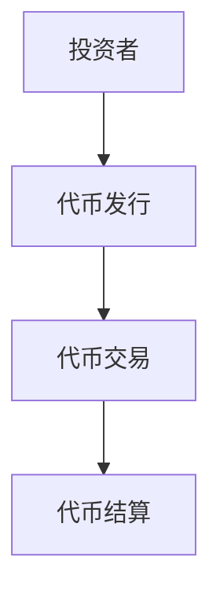
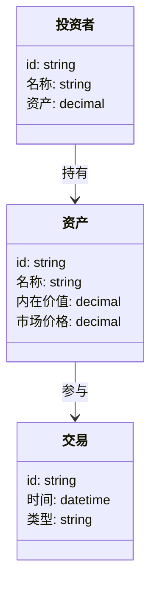
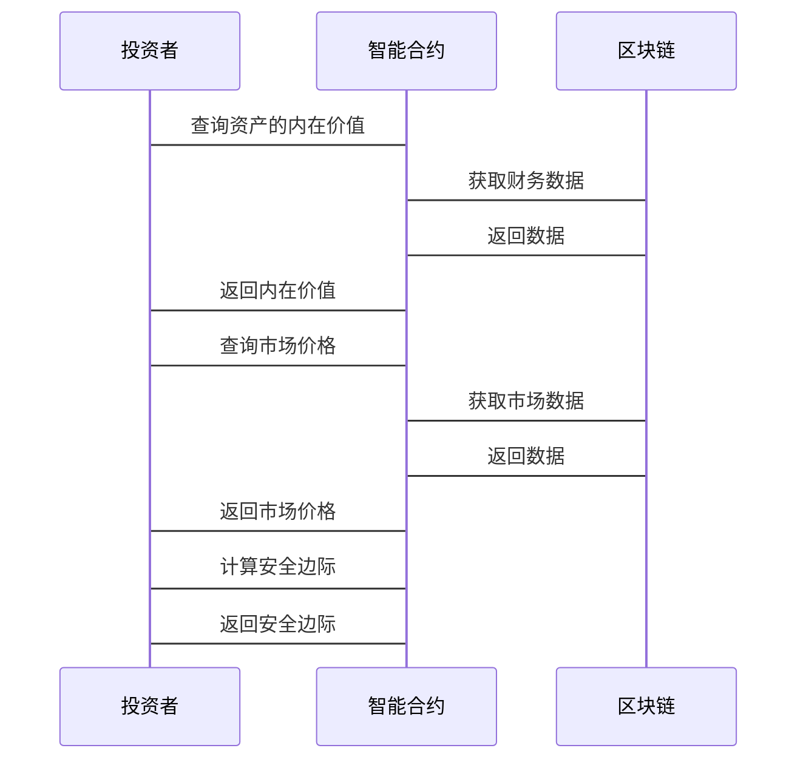

                 


# 格雷厄姆特价股票理论在代币化证券中的运用

## 关键词：
格雷厄姆投资理论，代币化证券，价值投资，安全边际，内在价值

## 摘要：
本文探讨了本杰明·格雷厄姆的价值投资理论在代币化证券中的应用。通过分析格雷厄姆的特价股票策略，结合区块链技术的特点，提出了一种新型的代币化证券价值评估方法，利用安全边际和内在价值的概念，构建了基于智能合约的投资决策模型。文章详细介绍了理论基础、算法实现和实际案例，为投资者提供了新的视角和工具。

---

# 第一部分：背景介绍

## 第1章：格雷厄姆特价股票理论概述

### 1.1 格雷厄姆投资理论的核心概念

#### 1.1.1 价值投资的基本原理
价值投资是一种以内在价值为基础的投资策略，强调购买价格低于内在价值的资产。格雷厄姆在《 Intelligent Investor》中提出，内在价值是资产的公允价值，可以通过财务指标计算得出。

#### 1.1.2 安全边际的概念与应用
安全边际是价值投资中的关键概念，指市场价格与内在价值之间的差异。通过购买价格低于内在价值的资产，投资者可以降低风险，确保投资的安全性。

#### 1.1.3 内在价值的计算方法
内在价值的计算公式为：
$$
\text{内在价值} = \frac{\text{净利润} \times (1 + g)}{r - g}
$$
其中，$g$为增长率，$r$为贴现率。

### 1.2 代币化证券的基本概念

#### 1.2.1 代币化证券的定义与特点
代币化证券是基于区块链技术的数字资产，具有可分割性、透明性和去中心化的特点。与传统证券相比，代币化证券的交易更加便捷，成本更低。

#### 1.2.2 代币化证券与传统证券的区别
| 属性 | 传统证券 | 代币化证券 |
|------|----------|------------|
| 发行方式 | 中央机构发行 | 区块链智能合约发行 |
| 交易效率 | 低效 | 高效 |
| 成本 | 高 | 低 |

#### 1.2.3 代币化证券的发行与交易流程
代币化证券的发行流程包括：发行申请、审核、发行和上架。交易流程包括：下单、撮合、清算和交割。

### 1.3 格雷厄姆理论与代币化证券的结合

#### 1.3.1 代币化证券的价值评估新维度
代币化证券的内在价值可以通过财务指标和市场数据计算得出，结合智能合约的功能，提供实时价值评估。

#### 1.3.2 格雷厄姆理论在数字资产中的应用潜力
通过分析代币化证券的内在价值和市场价格，投资者可以发现被低估的资产，利用安全边际进行投资。

#### 1.3.3 当前市场中的实际案例分析
以某区块链项目为例，分析其内在价值和市场价格，计算安全边际，确定投资机会。

---

# 第二部分：核心概念与联系

## 第2章：核心概念的深入分析

### 2.1 格雷厄姆理论的核心要素

#### 2.1.1 内在价值的计算公式
$$
\text{内在价值} = \frac{\text{净利润} \times (1 + g)}{r - g}
$$

#### 2.1.2 安全边际的数学表达
$$
\text{安全边际} = \text{内在价值} - \text{市场价格}
$$

#### 2.1.3 财务报表分析的关键指标
关键指标包括市盈率、市净率、股息率等。

### 2.2 代币化证券的属性特征对比

#### 2.2.1 流动性与可分割性
代币化证券可以分割成小单位，提高流动性。

#### 2.2.2 透明度与可追踪性
区块链技术提供了透明的交易记录，便于监管和审计。

#### 2.2.3 智能合约的功能与优势
智能合约自动执行交易，减少中介成本。

### 2.3 核心概念的ER实体关系图

```mermaid
er
    entity 投资者 {
        id: string
        名称: string
        资产: decimal
    }
    entity 资产 {
        id: string
        名称: string
        内在价值: decimal
        市场价格: decimal
    }
    entity 交易 {
        id: string
        时间: datetime
        类型: string
    }
    investor INVESTS asset
    asset TRADES transaction
```

---

# 第三部分：算法原理讲解

## 第3章：算法原理与实现

### 3.1 格雷厄姆投资策略的算法实现

#### 3.1.1 计算内在价值
通过财务指标计算内在价值，比较市场价格和内在价值，判断是否存在安全边际。

#### 3.1.2 安全边际评估
$$
\text{安全边际} = \text{内在价值} - \text{市场价格}
$$

#### 3.1.3 投资决策
如果安全边际为正，建议买入；否则建议卖出。

### 3.2 代币化证券的智能合约实现

#### 3.2.1 智能合约的功能
智能合约自动执行代币的发行、交易和结算。

#### 3.2.2 代币化证券的生命周期


### 3.3 算法实现的Python代码示例

```python
def calculate_intrinsic_value(net_profit, growth_rate, discount_rate):
    return (net_profit * (1 + growth_rate)) / (discount_rate - growth_rate)

def calculate_margin_of_safety(intrinsic_value, market_price):
    return intrinsic_value - market_price

# 示例数据
net_profit = 1000000
growth_rate = 0.05
discount_rate = 0.10
market_price = 50

intrinsic_value = calculate_intrinsic_value(net_profit, growth_rate, discount_rate)
margin_of_safety = calculate_margin_of_safety(intrinsic_value, market_price)

print(f"内在价值: {intrinsic_value}")
print(f"安全边际: {margin_of_safety}")
```

---

# 第四部分：数学模型与公式

## 第4章：数学模型与公式

### 4.1 内在价值计算模型

$$
\text{内在价值} = \frac{\text{净利润} \times (1 + g)}{r - g}
$$

### 4.2 安全边际计算模型

$$
\text{安全边际} = \text{内在价值} - \text{市场价格}
$$

### 4.3 投资决策模型

如果 $\text{安全边际} > 0$，则买入；否则，卖出。

---

# 第五部分：系统分析与架构设计

## 第5章：系统分析与架构设计

### 5.1 系统功能设计

#### 5.1.1 领域模型


### 5.2 系统架构设计

#### 5.2.1 系统架构图


### 5.3 系统接口设计

#### 5.3.1 接口描述
- API 1：获取资产的内在价值
- API 2：获取资产的市场价格
- API 3：计算安全边际

#### 5.3.2 接口实现
```python
# API 1: 获取资产的内在价值
def get_intrinsic_value(asset_id):
    # 实现细节
    pass

# API 2: 获取资产的市场价格
def get_market_price(asset_id):
    # 实现细节
    pass

# API 3: 计算安全边际
def calculate_margin_of_safety(asset_id):
    iv = get_intrinsic_value(asset_id)
    mp = get_market_price(asset_id)
    return iv - mp
```

### 5.4 系统交互流程

#### 5.4.1 交互流程图


---

# 第六部分：项目实战

## 第6章：项目实战与分析

### 6.1 项目环境安装

#### 6.1.1 安装依赖
```bash
pip install eth-abi eth-account web3
```

### 6.2 核心代码实现

#### 6.2.1 智能合约实现
```solidity
// SPDX-License-Identifier: MIT
pragma solidity ^0.8.0;

contract TokenizedSecurity {
    mapping(address => uint256) public balances;
    mapping(uint256 => uint256) public assetValues;

    function mint(address to, uint256 amount) public {
        balances[to] += amount;
    }

    function burn(address from, uint256 amount) public {
        balances[from] -= amount;
    }

    function getTokenValue(uint256 assetId) public view returns (uint256) {
        return assetValues[assetId];
    }
}
```

#### 6.2.2 代币化证券的价值评估
```python
def evaluate_asset(asset_id):
    iv = calculate_intrinsic_value(asset_id)
    mp = get_market_price(asset_id)
    margin = iv - mp
    return margin
```

### 6.3 案例分析

#### 6.3.1 案例选择
以某区块链项目为例，计算其内在价值和市场价格，评估安全边际。

#### 6.3.2 分析结果
假设内在价值为100，市场价格为80，则安全边际为20，建议买入。

### 6.4 项目总结

通过实际案例分析，验证了格雷厄姆理论在代币化证券中的应用，展示了如何利用安全边际进行投资决策。

---

# 第七部分：最佳实践与总结

## 第7章：最佳实践、小结、注意事项和拓展阅读

### 7.1 最佳实践

#### 7.1.1 投资建议
- 定期评估代币化证券的内在价值和市场价格。
- 关注区块链技术的发展，选择可靠的智能合约平台。

#### 7.1.2 风险提示
- 市场波动较大，需谨慎操作。
- 智能合约存在技术风险，需确保代码安全。

### 7.2 小结

本文结合格雷厄姆的价值投资理论和代币化证券的特点，提出了新的投资策略，为投资者提供了理论和实践指导。

### 7.3 注意事项

- 投资需谨慎，建议在专业指导下进行。
- 定期更新财务数据和市场信息，确保评估准确。

### 7.4 拓展阅读

- 《 Intelligent Investor》
- 区块链技术书籍
- 相关学术论文

---

# 第八部分：作者信息

## 作者：AI天才研究院/AI Genius Institute & 禅与计算机程序设计艺术 /Zen And The Art of Computer Programming

联系方式：[your.email@example.com](mailto:your.email@example.com)

社交媒体链接：[GitHub](https://github.com/yourusername)

---

通过以上结构，文章详细阐述了格雷厄姆理论在代币化证券中的应用，结合理论分析和实际案例，为投资者提供了实用的指导和工具。

