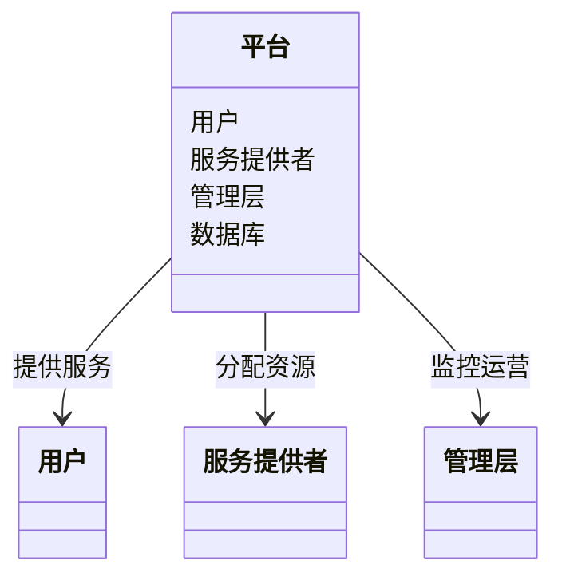
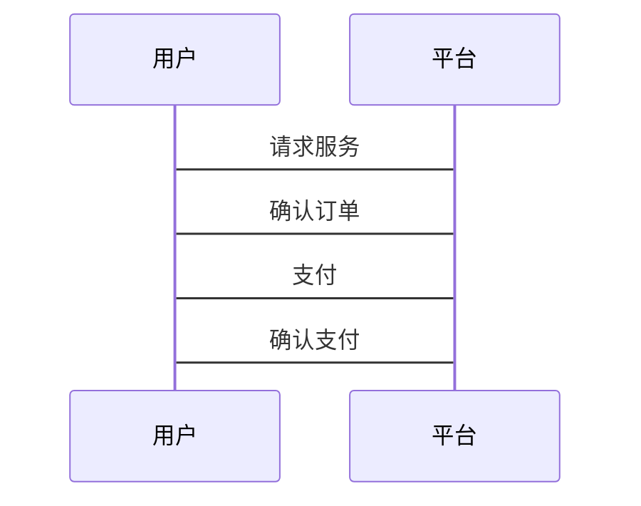

                 


# 格雷厄姆特价股票理论在共享经济产业中的应用

> 关键词：格雷厄姆特价股票理论、共享经济、价值投资、企业估值、投资策略

> 摘要：本文探讨了格雷厄姆的特价股票理论在共享经济产业中的应用，通过分析共享经济的特点和商业模式，结合格雷厄姆的价值投资理念，构建了适用于共享经济企业的估值模型，并通过实际案例分析验证了该模型的有效性。本文为投资者提供了新的视角和方法，帮助他们在共享经济领域做出更明智的投资决策。

---

## 第1章：引言

### 1.1 共享经济的背景与现状
共享经济是一种基于互联网平台的新型经济模式，通过共享闲置资源，提高资源利用率，降低成本。典型平台包括滴滴出行、Airbnb、滴滴出行等。共享经济的兴起源于技术进步和人们对高效利用资源的需求，但也面临市场竞争、平台监管等挑战。

### 1.2 格雷厄姆特价股票理论的核心理念
本杰明·格雷厄姆是价值投资之父，提倡寻找市场低估的股票。他的理论关注低市盈率、低市净率等指标，强调基本面分析和安全边际。核心在于通过深入分析企业财务状况，识别被市场低估的投资机会。

### 1.3 本书的研究意义与目标
本书旨在探索格雷厄姆的理论在共享经济中的应用，构建适合该领域的估值模型，为投资者提供新的分析工具。通过结合共享经济的特点，优化投资策略，提升投资决策的科学性和准确性。

---

## 第2章：格雷厄姆特价股票理论概述

### 2.1 格雷厄姆投资理论的起源与发展
格雷厄姆的投资理念起源于20世纪初，强调安全边际和价值投资。他主张以低于内在价值的价格购买优质股票，长期持有，获得稳定的收益。其理论在投资界影响深远，价值投资派系至今仍遵循他的理念。

### 2.2 特价股票的定义与特征
格雷厄姆定义的特价股票是指市场价格低于其内在价值的股票。其特征包括低市盈率、低市净率、高股息率、稳定的收益等。这些指标帮助投资者识别潜在的投资机会。

### 2.3 格雷厄姆选股标准与分析方法
格雷厄姆的选股标准包括：
- 市盈率低于15倍；
- 市净率低于1.5倍；
- 股息率高于5%；
- 财务状况稳健，无重大负债。

分析方法包括基本面分析、财务指标评估、行业比较等。

---

## 第3章：共享经济的商业模式与特点

### 3.1 共享经济的定义与典型模式
共享经济通过平台连接供给方和需求方，实现资源的高效利用。典型模式包括共享出行（滴滴）、共享住宿（Airbnb）、共享办公（WeWork）等。

### 3.2 共享经济的核心特征与挑战
- 特征：平台化、双边市场、去中心化；
- 挑战：市场竞争、平台监管、用户信任等。

### 3.3 共享经济与传统经济的对比分析
共享经济强调资源利用效率，传统经济注重资产所有权。两者在商业模式、风险承担等方面存在显著差异。

---

## 第4章：格雷厄姆理论在共享经济中的适用性分析

### 4.1 共享经济中的价值评估指标
适用指标包括：
- 市盈率（P/E）；
- 市净率（P/B）；
- 资产周转率；
- 用户增长率。

### 4.2 格雷厄姆选股标准与共享经济的契合点
- 强调低估值；
- 关注用户增长和市场扩展能力；
- 评估平台的财务健康状况。

### 4.3 共享经济企业估值模型的构建
模型包括数据采集、清洗、特征提取、评估指标计算等步骤，结合格雷厄姆的指标进行评分。

---

## 第5章：系统分析与架构设计方案

### 5.1 问题场景介绍
以一家共享经济平台为例，分析其股票是否符合格雷厄姆的选股标准。

### 5.2 领域模型Mermaid类图


### 5.3 系统架构Mermaid架构图
```mermaid
archi
    服务层 --> 数据库
    网络层 --> 服务层
    用户层 --> 网络层
    管理层 --> 服务层
```

### 5.4 系统接口设计与交互序列图


---

## 第6章：项目实战与案例分析

### 6.1 项目环境与数据采集
使用Python收集共享经济平台的财务数据，清洗处理。

### 6.2 核心算法实现
代码示例：
```python
def calculate_pe_ratio(revenue, net_income):
    return revenue / net_income

pe_ratio = calculate_pe_ratio(company['revenue'], company['net_income'])
```

### 6.3 案例分析与结果解读
以滴滴为例，分析其市盈率、市净率等指标，评估是否符合格雷厄姆的选股标准。

---

## 第7章：总结与展望

### 7.1 本书的总结
总结了格雷厄姆理论在共享经济中的应用，提出了适合的估值模型和方法。

### 7.2 本书的不足与未来研究方向
指出了当前研究的局限性，如数据获取难度、模型适用性等，提出了未来的研究方向。

---

## 作者：AI天才研究院/AI Genius Institute & 禅与计算机程序设计艺术 /Zen And The Art of Computer Programming

