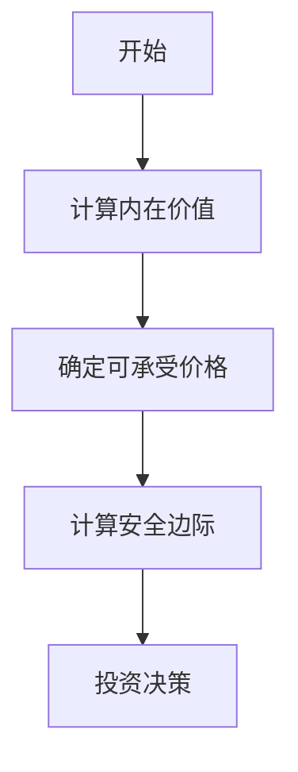

                 


# 格雷厄姆特价股票理论在共享经济时代的新思考

## 关键词：格雷厄姆，特价股票理论，共享经济，价值投资，安全边际，内在价值

## 摘要：  
在共享经济时代，传统的金融理论面临新的挑战和机遇。本文从格雷厄姆特价股票理论出发，探讨其在共享经济背景下的适用性与创新。通过分析共享经济的特点，结合价值投资的核心概念，提出新的评估方法和策略，为投资者提供新的思路。

---

# 第一部分: 格雷厄姆特价股票理论与共享经济的背景

## 第1章: 格雷厄姆特价股票理论的起源与核心概念

### 1.1 格雷厄姆投资理论的起源  
本杰明·格雷厄姆是价值投资的鼻祖，他的投资理论深刻影响了巴菲特等一代投资大师。格雷厄姆的核心思想是“买入便宜的东西”，即寻找市场价格低于其内在价值的股票。他强调安全边际的重要性，认为投资者应该以低于内在价值的价格买入股票，以确保投资的安全性。

### 1.2 共享经济的兴起与特点  
共享经济是一种通过互联网技术实现资源优化配置的新经济模式。其核心在于利用闲置资源，降低交易成本，提高资源利用率。与传统经济模式相比，共享经济具有去中心化、灵活化、高效化的特点，但也带来了新的挑战，例如如何评估共享经济企业的内在价值。

### 1.3 格雷厄姆理论与共享经济的结合  
在共享经济时代，传统的价值评估方法需要与时俱进。例如，共享经济企业可能没有固定的资产或实体门店，其价值更多体现在用户、数据和技术上。如何将这些无形资产纳入价值评估，成为新的课题。

---

## 第2章: 格雷厄姆特价股票理论的核心概念与联系  

### 2.1 核心概念原理  
价值投资的核心是寻找市场价格低于内在价值的股票。内在价值是基于企业未来现金流的折现值，而安全边际则是市场价格与内在价值之间的差距，用以确保投资的安全性。

### 2.2 核心概念属性对比表  
| 概念       | 属性               | 描述                                   |
|------------|--------------------|----------------------------------------|
| 价值投资   | 长期导向           | 以长期持有为目标                     |
| 安全边际   | 风险控制           | 确保投资的安全性                     |
| 内在价值   | 客观评估           | 反映企业的真实价值                   |

### 2.3 ER实体关系图  
```mermaid
er
  actor 投资者
  actor 企业
  actor 市场
  entity 证券
  entity 价值评估
  entity 交易
  relation 投资者-证券: 持有
  relation 企业-证券: 发行
  relation 市场-交易: 交易
  relation 证券-价值评估: 评估
```

---

## 第3章: 格雷厄姆特价股票理论的算法原理  

### 3.1 内在价值计算算法  
#### 3.1.1 现金流折现法  
内在价值可以通过将未来现金流折现到现值来计算。公式如下：  
$$ V = \sum_{t=1}^{n} \frac{CF_t}{(1+r)^t} $$  
其中，\( V \) 是内在价值，\( CF_t \) 是第 \( t \) 年的现金流，\( r \) 是折现率。

#### 3.1.2 市盈率分析法  
市盈率（P/E）= 市场价格 / 每股收益。通过比较市盈率与行业平均水平，可以初步判断股票是否被低估。

#### 3.1.3 市净率分析法  
市净率（P/B）= 市场价格 / 每股净资产。市净率低于行业平均水平的股票可能具有投资价值。

### 3.2 安全边际计算流程  


---

## 第4章: 共享经济时代的价值评估新思考  

### 4.1 共享经济企业的特点  
共享经济企业通常依赖数据和技术，其资产轻量化，但用户粘性和数据价值极高。例如，滴滴出行的估值主要基于其用户规模和数据资源。

### 4.2 新型价值评估模型  
在共享经济时代，传统的财务指标可能不足以评估企业价值。因此，需要引入新的评估维度，例如用户生命周期价值（CLV）和网络效应。

---

## 第5章: 格雷厄姆理论在共享经济中的应用案例  

### 5.1 案例分析：滴滴出行  
滴滴出行的商业模式具有典型的共享经济特征。其内在价值可以通过用户活跃度、订单量和变现能力来评估。假设滴滴的内在价值为100亿美元，而市场价格为80亿美元，则具有投资价值。

### 5.2 案例分析：Airbnb  
Airbnb的估值需要考虑其在全球市场的覆盖能力、用户增长速度和房源数量。通过对比市盈率和市净率，可以判断其是否被低估。

---

## 第6章: 价值投资在共享经济中的策略优化  

### 6.1 确定投资目标  
在共享经济时代，投资者需要明确自己的投资目标，例如短期套利或长期价值投资。

### 6.2 数据驱动的决策  
利用大数据和人工智能技术，可以更精准地评估共享经济企业的内在价值。例如，通过分析用户行为数据，预测企业的未来收益。

### 6.3 风险管理  
在共享经济中，政策风险和技术风险较高。因此，投资者需要注重分散投资和设置止损点。

---

## 第7章: 结论与展望  

### 7.1 格雷厄姆理论的永恒价值  
尽管时代在变化，格雷厄姆的价值投资理念依然具有重要的指导意义。通过创新和调整，可以更好地适应新的经济环境。

### 7.2 共享经济的未来趋势  
随着技术的进步和市场的成熟，共享经济将更加普及。投资者需要不断学习和适应，才能在竞争中占据优势。

---

## 作者：AI天才研究院 & 禅与计算机程序设计艺术  

---

**总结**：格雷厄姆特价股票理论在共享经济时代依然具有重要的指导意义。通过结合新的经济模式和技术创新，投资者可以更好地把握投资机会，实现长期收益。

