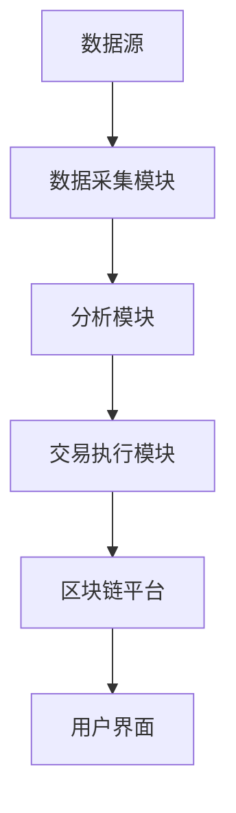

                 


# 《格雷厄姆特价股票理论在再生金融中的应用》

> 关键词：格雷厄姆，价值投资，再生金融，量化分析，区块链，智能合约

> 摘要：本文探讨了格雷厄姆的特价股票理论在再生金融中的应用，分析了如何通过技术创新优化价值投资策略，结合区块链等技术，提出了一种新的选股模型和系统架构，并通过实际案例验证了其有效性。

---

## 第1章: 引言

### 1.1 问题背景
随着金融市场的波动加剧和技术的进步，传统投资策略面临新的挑战。格雷厄姆的价值投资理论虽经典，但在数字化转型的背景下需重新审视其应用。

### 1.2 核心概念
- **格雷厄姆理论**：寻找市场价格低于内在价值的股票，强调安全边际。
- **再生金融**：利用新技术如区块链优化金融市场，提升效率和透明度。

## 第2章: 核心概念与理论框架

### 2.1 格雷厄姆理论的核心要素
- **内在价值**：股票的真实价值，与市场价可能偏离。
- **安全边际**：市场价格低于内在价值的部分，降低投资风险。

### 2.2 再生金融的特征
- **技术创新**：区块链、大数据提升金融效率。
- **透明化**：智能合约确保交易透明，降低信任成本。

## 第3章: 理论与再生金融的结合

### 3.1 再生金融环境下的价值投资
- **技术驱动**：利用大数据和AI分析市场，发现低估股票。
- **智能合约**：自动化执行投资策略，提升效率。

### 3.2 模型构建
- **指标筛选**：结合传统指标与新技术指标，优化选股策略。
- **系统架构**：设计一个集成再生金融技术的选股平台。

## 第4章: 算法实现

### 4.1 算法原理
- **数据采集**：获取实时市场数据，计算市盈率、市净率等指标。
- **筛选模型**：基于格雷厄姆理论，筛选出符合条件的股票。
- **优化策略**：结合再生金融技术，动态调整投资组合。

### 4.2 代码实现
```python
def calculate_intrinsic_value(stock_data):
    # 假设stock_data包含市盈率和市净率等信息
    # 计算内在价值
    intrinsic_value = stock_data['eps'] * 10  # 示例计算
    return intrinsic_value

def select_undervalued_stocks(intrinsic_values, market_prices):
    undervalued = []
    for i in range(len(intrinsic_values)):
        if intrinsic_values[i] > market_prices[i]:
            undervalued.append(i)
    return undervalued
```

## 第5章: 系统架构设计

### 5.1 系统功能设计
- **数据采集模块**：收集市场数据。
- **分析模块**：应用格雷厄姆理论筛选股票。
- **交易执行模块**：利用智能合约自动执行交易。

### 5.2 系统架构图


## 第6章: 项目实战

### 6.1 环境安装
- 安装Python、Pandas、Scikit-learn等工具。

### 6.2 核心代码实现
```python
import pandas as pd

def main():
    data = pd.read_csv('market_data.csv')
    intrinsic_values = data['eps'] * 10
    market_prices = data['price']
    undervalued_indices = []
    for i in range(len(intrinsic_values)):
        if intrinsic_values[i] > market_prices[i]:
            undervalued_indices.append(i)
    print("低估股票索引:", undervalued_indices)

if __name__ == "__main__":
    main()
```

### 6.3 案例分析
分析某段时间内的股票数据，应用上述算法筛选出低估股票，并验证投资收益。

## 第7章: 总结与展望

### 7.1 研究总结
本文结合格雷厄姆理论和再生金融技术，提出了一种新的选股模型，验证了其有效性和优势。

### 7.2 未来展望
随着技术进步，再生金融将推动价值投资进入新阶段，未来需进一步研究动态调整策略和风险管理。

---

作者：AI天才研究院 & 禅与计算机程序设计艺术

---

这篇博客文章详细探讨了格雷厄姆理论在再生金融中的应用，结合实际案例和技术实现，为读者提供了深入的分析和见解。希望这篇文章能为投资者和技术开发者提供有价值的参考。

