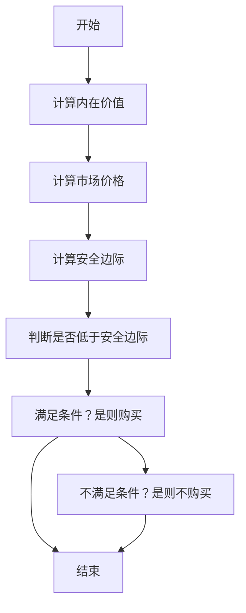
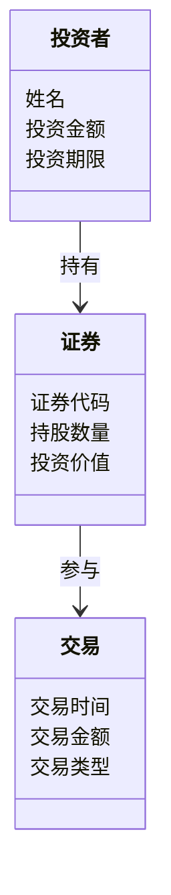

                 


# 格雷厄姆价值投资理论在分数化所有权证券中的应用

## 关键词：格雷厄姆价值投资理论、分数化所有权证券、价值评估模型、安全边际、内在价值、投资策略

## 摘要：
本文探讨了格雷厄姆价值投资理论在分数化所有权证券中的应用，结合数学模型和系统架构设计，详细阐述了如何通过分数化所有权证券实现价值投资理念，并提供了实际案例分析和投资建议。

---

## 第一部分: 格雷厄姆价值投资理论与分数化所有权证券的背景

### 第1章: 格雷厄姆价值投资理论概述

#### 1.1 格雷厄姆价值投资理论的核心理念
- **价值投资**：以低于内在价值的价格购买优质的公司股票，长期持有，获得资本增值。
- **安全边际**：购买价格与内在价值之间的差距，确保投资的安全性。
- **内在价值**：公司未来现金流的现值，与市场波动无关。

#### 1.2 格雷厄姆的投资策略
- **寻找被低估的股票**：通过分析财务报表，识别市场价值低于内在价值的公司。
- **长期持有**：避免频繁交易，减少交易成本，获得复利效应。

#### 1.3 格雷厄姆的选股标准
- **低市盈率**：市盈率低于市场平均水平。
- **低市净率**：市净率低于市场平均水平。
- **高股息率**：股息率高，表明公司盈利能力强。

### 第2章: 分数化所有权证券的概念与特点

#### 2.1 分数化所有权证券的定义
- 分数化所有权证券：将公司所有权分割成更小的单位，投资者可以购买部分所有权，类似于购买ETF或指数基金。
- 优势：降低投资门槛，使小投资者能够参与优质资产的投资。

#### 2.2 分数化所有权证券的特点
- **流动性高**：可以在二级市场买卖，交易便捷。
- **分散风险**：通过投资多个公司，降低单一公司风险。
- **易于管理**：通过平台进行操作，简化投资流程。

#### 2.3 分数化所有权证券与传统股票的区别
- **投资门槛**：传统股票需要大额投资，分数化证券门槛低。
- **风险分散**：传统股票风险集中，分数化证券风险分散。
- **交易成本**：传统股票交易成本高，分数化证券交易成本低。

### 第3章: 格雷厄姆理论与分数化所有权证券的结合

#### 3.1 格雷厄姆理论在现代证券市场中的应用
- 通过分数化所有权证券，投资者可以分散投资于多个优质公司，降低单一公司风险。
- 格雷厄姆的“安全边际”概念可以用于评估分数化证券的投资价值。

#### 3.2 分数化所有权证券如何实现格雷厄姆的“内在价值”投资理念
- 通过购买多个分数化证券，投资者可以构建一个多元化的投资组合，降低整体风险。
- 分数化证券的价格波动较小，适合长期价值投资。

#### 3.3 分数化所有权证券在价值投资中的潜在优势
- 投资门槛低，适合小额投资者。
- 通过分散投资，降低整体风险。
- 便于长期持有，获得复利效应。

---

## 第二部分: 核心概念与联系

### 第4章: 格雷厄姆理论的核心概念与数学模型

#### 4.1 格雷厄姆投资模型的数学表达
- 内在价值公式：
  $$ V = \frac{E}{P} $$
  其中，\( V \) 表示内在价值，\( E \) 表示企业未来现金流的现值，\( P \) 表示折现率。
  
- 安全边际公式：
  $$ \text{安全边际} = \text{内在价值} - \text{市场价格} $$

#### 4.2 分数化所有权证券的价值评估模型
- 分数化所有权价值公式：
  $$ S = \frac{V}{N} $$
  其中，\( S \) 表示每一份分数化所有权证券的价值，\( V \) 表示目标公司的总内在价值，\( N \) 表示分数化后的总份数。

### 第5章: 核心概念的对比与ER图分析

#### 5.1 格雷厄姆理论与分数化所有权证券的对比分析
- 格雷厄姆理论关注内在价值，分数化证券关注分散风险。
- 格雷厄姆理论适用于长期投资，分数化证券适用于小额投资。

#### 5.2 ER图分析
```mermaid
erDiagram
    customer[投资者] {
        <属性>
        姓名 : 字符串
        投资金额 : 数值
        投资期限 : 时间
    }
    investment[投资组合] {
        <属性>
        证券代码 : 字符串
        持股数量 : 数值
        投资价值 : 数值
    }
    transaction[交易] {
        <属性>
        交易时间 : 时间
        交易金额 : 数值
        交易类型 : 字符串
    }
    customer -> investment : 持有
    investment -> transaction : 参与
```

---

## 第三部分: 算法原理与实现

### 第6章: 算法原理与实现

#### 6.1 算法流程图


#### 6.2 算法实现
```python
def calculate_intrinsic_value(enterprise_value, discount_rate):
    return enterprise_value / discount_rate

def calculate_market_price(stock_price, number_of_shares):
    return stock_price * number_of_shares

def calculate_margin_of_safety(intrinsic_value, market_price):
    return intrinsic_value - market_price

# 示例
enterprise_value = 100000000  # 企业价值
discount_rate = 0.10          # 折现率
number_of_shares = 1000       # 股票数量
stock_price = 50               # 每股价格

intrinsic_value = calculate_intrinsic_value(enterprise_value, discount_rate)
market_price = calculate_market_price(stock_price, number_of_shares)
margin_of_safety = calculate_margin_of_safety(intrinsic_value, market_price)

print(f"内在价值: {intrinsic_value}")
print(f"市场价格: {market_price}")
print(f"安全边际: {margin_of_safety}")
```

---

## 第四部分: 系统分析与架构设计方案

### 第7章: 系统功能与架构设计

#### 7.1 系统功能模块
- 数据采集模块：收集目标公司的财务数据。
- 数据分析模块：计算内在价值和市场价格。
- 投资决策模块：根据安全边际判断是否购买。

#### 7.2 系统架构设计


---

## 第五部分: 项目实战

### 第8章: 项目实战与案例分析

#### 8.1 环境安装
- 安装Python和必要的库（如pandas、numpy）。

#### 8.2 核心代码实现
```python
import pandas as pd
import numpy as np

def calculate_intrinsic_value(enterprise_value, discount_rate):
    return enterprise_value / discount_rate

def calculate_margin_of_safety(intrinsic_value, market_price):
    return intrinsic_value - market_price

# 示例数据
data = {
    '公司': ['A', 'B', 'C'],
    '企业价值': [100000000, 80000000, 120000000],
    '折现率': [0.10, 0.12, 0.08],
    '股价': [50, 40, 60],
    '股数': [1000, 2000, 500]
}

df = pd.DataFrame(data)

# 计算内在价值
df['内在价值'] = df.apply(lambda row: calculate_intrinsic_value(row['企业价值'], row['折现率']), axis=1)
# 计算市场价格
df['市场价格'] = df['股价'] * df['股数']
# 计算安全边际
df['安全边际'] = df.apply(lambda row: calculate_margin_of_safety(row['内在价值'], row['市场价格']), axis=1)

print(df)
```

---

## 第六部分: 最佳实践与小结

### 第9章: 总结与建议

- **总结**：格雷厄姆价值投资理论与分数化所有权证券结合，为投资者提供了新的投资方式。
- **建议**：投资者应深入学习格雷厄姆理论，结合实际市场情况，制定合理的投资策略。

---

## 第七部分: 注意事项与拓展阅读

### 第10章: 注意事项与拓展阅读

- **注意事项**：投资有风险，需谨慎操作。
- **拓展阅读**：阅读《格雷厄姆投资经典》和相关学术论文，进一步提升投资能力。

---

## 作者信息

作者：AI天才研究院 & 禅与计算机程序设计艺术

---

以上是文章的完整内容，涵盖从理论到实践的各个方面，确保读者能够全面理解格雷厄姆价值投资理论在分数化所有权证券中的应用。

