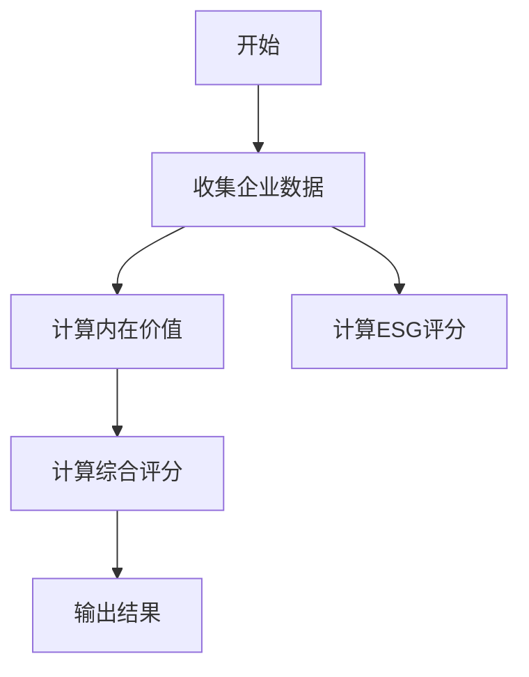

                 


# 格雷厄姆特价股票理论在可持续金融中的应用

**关键词**：价值投资、可持续金融、格雷厄姆、股票分析、ESG投资、投资策略、金融创新

**摘要**：本文探讨了格雷厄姆的价值投资理论在可持续金融中的应用，结合ESG（环境、社会、治理）投资理念，提出了一种新的投资策略。通过分析核心概念、算法原理、系统架构和项目实战，本文展示了如何将传统价值投资与可持续金融相结合，为投资者提供更全面的投资决策支持。

---

## 第一部分：背景介绍

### 第1章：格雷厄姆特价股票理论与可持续金融的背景

#### 1.1 格雷厄姆特价股票理论的起源与发展
格雷厄姆是价值投资的鼻祖，他的理论强调以低于内在价值的价格购买优质股票。特价股票是指市场价格低于其内在价值的股票，投资者通过长期持有这些股票获得超额收益。

#### 1.2 可持续金融的概念与内涵
可持续金融关注企业在环境、社会和治理方面的表现，旨在通过投资促进可持续发展。ESG因素成为评估企业的重要标准。

#### 1.3 两者的结合
将格雷厄姆的价值投资理念与可持续金融结合，可以帮助投资者在追求超额收益的同时，支持可持续发展，实现经济效益与社会责任的统一。

---

## 第2章：核心概念与联系

### 2.1 核心概念对比
| **概念**         | **格雷厄姆价值投资**            | **可持续金融**                 |
|------------------|-----------------------------|----------------------------|
| 核心思想         | 以低于内在价值的价格买入股票   | 投资于环境、社会和治理表现良好的企业 |
| 关注点           | 股价、基本面分析               | ESG因素、可持续发展            |
| 目标             | 实现超额收益                   | 支持可持续发展，获取长期收益     |

### 2.2 ER实体关系图
```mermaid
er
actor(投资者) -->
    company(企业): 企业基本面数据
    esg_score(ESG评分): 企业环境、社会和治理评分
    stock_price(股价): 股票市场价格
```

---

## 第3章：算法原理

### 3.1 格雷厄姆投资模型
格雷厄姆的模型通过计算内在价值来确定股票的合理价格：
$$ \text{内在价值} = \frac{E}{P} + \frac{D}{P} $$
其中，E为净利润，P为资本结构，D为债务。

### 3.2 ESG评分模型
ESG评分基于企业公开数据，包括环境表现、社会责任和公司治理情况。

### 3.3 综合评分算法
结合格雷厄姆模型和ESG评分，计算综合评分：
$$ \text{综合评分} = \alpha \times \text{内在价值} + \beta \times \text{ESG评分} $$
其中，$\alpha$ 和 $\beta$ 是权重系数。

### 3.4 算法流程图


### 3.5 Python实现
```python
def calculate_intrinsic_value(e, p, d):
    return (e / p) + (d / p)

def calculate_esg_score(environment, social, governance):
    return (environment + social + governance) / 3

def main():
    # 示例数据
    e = 100
    p = 50
    d = 20
    environment = 80
    social = 70
    governance = 90
    
    iv = calculate_intrinsic_value(e, p, d)
    esg = calculate_esg_score(environment, social, governance)
    alpha = 0.6
    beta = 0.4
    score = alpha * iv + beta * esg
    print(f"综合评分：{score}")

if __name__ == "__main__":
    main()
```

---

## 第4章：系统分析与架构设计

### 4.1 系统功能设计
- 数据收集模块：收集企业财务数据和ESG数据。
- 计算模块：计算内在价值和ESG评分。
- 综合评分模块：结合两者计算综合评分。
- 结果展示模块：输出投资建议。

### 4.2 系统架构图


---

## 第5章：项目实战

### 5.1 环境安装
安装Python和相关库：
```bash
pip install numpy pandas matplotlib
```

### 5.2 核心代码实现
```python
import pandas as pd
import numpy as np

def calculate_intrinsic_value(df):
    df['Intrinsic Value'] = df['Earnings'] / df['Price'] + df['Debt'] / df['Price']
    return df

def calculate_esg_score(df):
    df['ESG Score'] = (df['Environment'] + df['Social'] + df['Governance']) / 3
    return df

def main():
    data = {
        'Company': ['A', 'B', 'C'],
        'Price': [50, 60, 45],
        'Earnings': [100, 120, 90],
        'Debt': [20, 25, 15],
        'Environment': [80, 70, 85],
        'Social': [70, 80, 75],
        'Governance': [90, 85, 80]
    }
    df = pd.DataFrame(data)
    df = calculate_intrinsic_value(df)
    df = calculate_esg_score(df)
    df['Score'] = 0.6 * df['Intrinsic Value'] + 0.4 * df['ESG Score']
    print(df)

if __name__ == "__main__":
    main()
```

### 5.3 案例分析
以某企业为例，计算其综合评分，得出是否值得投资的结论。

---

## 第6章：最佳实践与小结

### 6.1 最佳实践
- 定期更新企业数据和ESG评分。
- 根据市场变化调整权重系数。
- 结合技术分析进行综合判断。

### 6.2 小结
本文通过分析格雷厄姆价值投资与可持续金融的结合，提出了一种新的投资策略，为投资者提供了更全面的决策支持。

### 6.3 注意事项
- 数据来源的准确性影响结果。
- 权重系数需要根据实际情况调整。
- 投资需谨慎，建议结合多种方法进行分析。

### 6.4 拓展阅读
推荐阅读《价值的奇幻旅程》和《ESG投资手册》。

---

**作者：AI天才研究院/AI Genius Institute & 禅与计算机程序设计艺术 /Zen And The Art of Computer Programming**

---

这篇文章通过详细的理论分析、算法设计和项目实战，全面探讨了格雷厄姆价值投资理论在可持续金融中的应用，为投资者提供了新的视角和方法。

