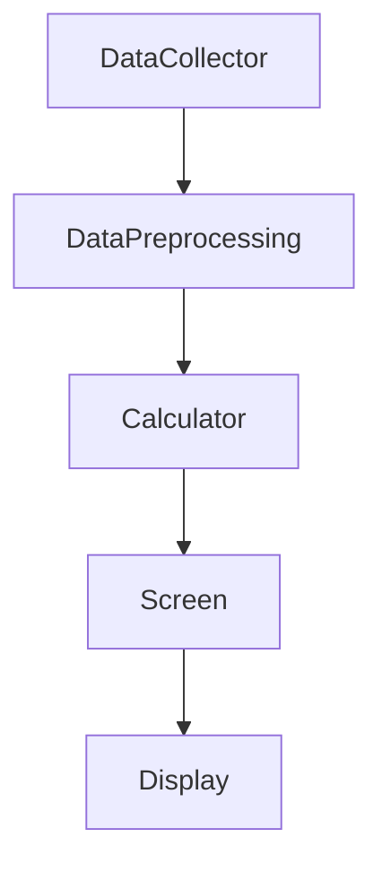

                 


# 格雷厄姆特价股票理论在小盘股中的应用

## 关键词：格雷厄姆投资理论，特价股票，小盘股，安全边际，内在价值，价值投资

## 摘要：本文深入探讨了格雷厄姆特价股票理论在小盘股投资中的应用，通过理论分析、数学建模、系统设计和实际案例，详细阐述了如何利用格雷厄姆的安全边际概念在小盘股市场中寻找被低估的投资机会。文章从理论背景、核心概念、算法实现、系统架构到实战案例，全面解析了格雷厄姆理论在小盘股投资中的应用，并提供了具体的Python代码和数据分析方法，帮助投资者在小盘股市场中实现稳健的投资回报。

---

# 第一部分: 格雷厄姆投资理论与小盘股市场

## 第1章: 格雷厄姆投资理论概述

### 1.1 格雷厄姆的生平与投资理念

#### 1.1.1 格雷厄姆的生平
本杰明·格雷厄姆（Benjamin Graham）是20世纪最伟大的投资理论家之一，被誉为“价值投资之父”。他出生于1894年，早年从商，后来转向投资领域，并在纽约证券交易所积累了丰富的投资经验。他的投资理念以“安全边际”为核心，强调以低于内在价值的价格买入优质股票。

#### 1.1.2 格雷厄姆投资理论的核心思想
格雷厄姆的投资理论强调以下几点：
1. **价值投资**：股票的价值在于其内在价值，而非市场波动。
2. **安全边际**：买入价格应低于股票的内在价值，以确保投资的安全性。
3. **逆向思维**：在市场恐慌时寻找机会，避免盲目跟风。

#### 1.1.3 格雷厄姆理论的现代意义
尽管格雷厄姆的投资理论提出于20世纪初，但其核心思想至今仍被广泛应用于现代投资实践中，尤其是在小盘股投资中，格雷厄姆的安全边际概念具有重要的指导意义。

### 1.2 小盘股市场的特点

#### 1.2.1 小盘股的定义
小盘股通常指市值较小的公司股票，一般指市值在50亿至300亿美元之间的公司。由于小盘股公司规模较小，市场关注度较低，其股票价格往往被低估。

#### 1.2.2 小盘股市场的波动性
小盘股市场的波动性较大，尤其是在市场下跌时，小盘股的跌幅往往超过大盘股。这种波动性为投资者提供了以低价买入优质小盘股的机会。

#### 1.2.3 小盘股市场的投资机会
小盘股市场中，许多公司具有较高的成长潜力，但由于市场关注度低，其股票价格往往被低估，这为价值投资者提供了良好的投资机会。

### 1.3 格雷厄姆理论与小盘股投资的契合点

#### 1.3.1 小盘股市场的低效性
小盘股市场通常较为低效，信息不对称较为严重，这为价值投资者提供了以低于内在价值的价格买入股票的机会。

#### 1.3.2 格雷厄姆的安全边际概念
格雷厄姆的安全边际概念在小盘股投资中尤为重要。由于小盘股市场的波动性较大，买入价格低于内在价值的股票可以有效降低投资风险。

---

## 第2章: 格雷厄姆理论在小盘股中的应用

### 2.1 格雷厄姆理论的核心工具：安全边际

#### 2.1.1 安全边际的定义
安全边际是指股票的市场价格与内在价值之间的差距。具体来说，安全边际 = 内在价值 - 市场价格。

#### 2.1.2 安全边际的重要性
1. **降低投资风险**：安全边际越大，投资风险越小。
2. **提高投资收益**：通过寻找具有较大安全边际的股票，投资者可以在市场波动中获得更高的收益。

#### 2.1.3 小盘股中的安全边际
在小盘股投资中，由于股票价格波动较大，安全边际的计算尤为重要。投资者需要通过分析公司的财务状况和市场环境，准确估算内在价值，并选择市场价格低于内在价值的股票。

### 2.2 格雷厄姆的内在价值计算方法

#### 2.2.1 内在价值的定义
内在价值是指股票在未来现金流的现值，它是股票的真正价值，与市场波动无关。

#### 2.2.2 内在价值的计算公式
格雷厄姆通常使用以下公式计算内在价值：
$$ V = \frac{E}{(1 + r)^n} $$
其中，V为内在价值，E为未来现金流，r为折现率，n为时间跨度。

#### 2.2.3 小盘股中的内在价值计算
在小盘股投资中，内在价值的计算需要考虑公司的财务状况、行业前景和市场环境。由于小盘股公司规模较小，财务数据有限，内在价值的估算需要更加谨慎。

### 2.3 小盘股投资中的安全边际策略

#### 2.3.1 安全边际的计算步骤
1. **估算内在价值**：通过分析公司财务数据和市场环境，估算股票的内在价值。
2. **确定市场价格**：获取股票的当前市场价格。
3. **计算安全边际**：安全边际 = 内在价值 - 市场价格。

#### 2.3.2 安全边际的应用
投资者应选择具有较大安全边际的股票进行投资。通常，安全边际应至少为内在价值的20%以上。

#### 2.3.3 安全边际与投资回报的关系
安全边际越大，投资回报的确定性越高。因此，在小盘股投资中，投资者应优先选择具有较大安全边际的股票。

---

## 第3章: 小盘股投资中的格雷厄姆策略

### 3.1 小盘股投资中的价值筛选

#### 3.1.1 价值筛选的标准
1. **低市盈率**：市盈率低于行业平均水平。
2. **低市净率**：市净率低于行业平均水平。
3. **高股息率**：股息率较高且稳定。

#### 3.1.2 小盘股的价值筛选方法
投资者可以通过分析公司的财务指标，如市盈率、市净率、股息率等，筛选出具有投资价值的小盘股。

### 3.2 小盘股投资中的风险控制

#### 3.2.1 风险控制的重要性
在小盘股投资中，风险控制尤为重要。由于小盘股市场的波动性较大，投资者需要采取有效的风险控制措施。

#### 3.2.2 风险控制的具体措施
1. **分散投资**：将资金分散投资于多只小盘股，降低投资风险。
2. **严格筛选**：选择具有强大财务实力和良好发展前景的小盘股。
3. **长期持有**：避免频繁交易，降低交易成本。

### 3.3 小盘股投资中的长期策略

#### 3.3.1 长期投资的重要性
长期投资是格雷厄姆价值投资的核心理念之一。通过长期持有优质股票，投资者可以避免短期市场波动的影响，获得长期稳定的收益。

#### 3.3.2 小盘股的长期投资策略
1. **选择具有成长潜力的公司**：关注行业前景良好、管理团队优秀的公司。
2. **保持耐心**：长期持有优质股票，等待市场逐步认识到其内在价值。

---

## 第4章: 小盘股投资中的数学模型与算法

### 4.1 内在价值计算模型

#### 4.1.1 模型假设
1. 公司未来现金流可以合理预测。
2. 折现率可以合理估计。

#### 4.1.2 模型实现
使用Python代码实现内在价值的计算：

```python
def calculate_intrinsic_value(future_cash_flow, discount_rate, time_span):
    intrinsic_value = 0
    for i in range(time_span):
        intrinsic_value += future_cash_flow / (1 + discount_rate) ** (i + 1)
    return intrinsic_value
```

#### 4.1.3 模型应用
通过输入未来现金流、折现率和时间跨度，计算股票的内在价值，并与市场价格进行比较，确定安全边际。

### 4.2 安全边际计算算法

#### 4.2.1 算法步骤
1. 计算股票的内在价值。
2. 获取股票的市场价格。
3. 计算安全边际 = 内在价值 - 市场价格。

#### 4.2.2 算法实现
使用Python代码实现安全边际的计算：

```python
def calculate_margin_of_safety(intrinsic_value, market_price):
    margin_of_safety = intrinsic_value - market_price
    return margin_of_safety
```

---

## 第5章: 小盘股投资中的系统设计与实现

### 5.1 系统架构设计

#### 5.1.1 系统功能模块
1. 数据收集模块：收集小盘股的基本数据。
2. 数据处理模块：清洗和转换数据。
3. 计算模块：计算内在价值和安全边际。
4. 筛选模块：筛选出具有较大安全边际的股票。
5. 展示模块：展示筛选结果。

#### 5.1.2 系统架构图


---

## 第6章: 项目实战

### 6.1 环境安装与数据获取

#### 6.1.1 环境安装
安装必要的Python库，如Pandas、NumPy等。

#### 6.1.2 数据获取
从数据源获取小盘股的基本数据，如市盈率、市净率、股息率等。

### 6.2 数据处理与分析

#### 6.2.1 数据清洗
清洗数据，处理缺失值和异常值。

#### 6.2.2 数据分析
计算内在价值和安全边际，筛选出具有较大安全边际的股票。

### 6.3 案例分析

#### 6.3.1 案例选择
选择一只具有代表性的低价小盘股，计算其内在价值和安全边际。

#### 6.3.2 结果分析
分析该股票的投资价值，制定投资策略。

---

## 第7章: 总结与展望

### 7.1 小结
本文详细探讨了格雷厄姆特价股票理论在小盘股投资中的应用，通过理论分析、数学建模和系统设计，提出了小盘股投资中的安全边际策略。通过实际案例分析，验证了格雷厄姆理论的有效性。

### 7.2 投资注意事项
1. **风险控制**：在小盘股投资中，风险控制尤为重要。
2. **长期投资**：坚持长期投资，避免短期波动的影响。
3. **持续学习**：不断学习和更新投资知识，适应市场变化。

### 7.3 拓展阅读
1. 格雷厄姆的经典著作《证券分析》。
2. 价值投资领域的其他优秀书籍和文章。

---

## 作者：AI天才研究院/AI Genius Institute & 禅与计算机程序设计艺术 /Zen And The Art of Computer Programming

