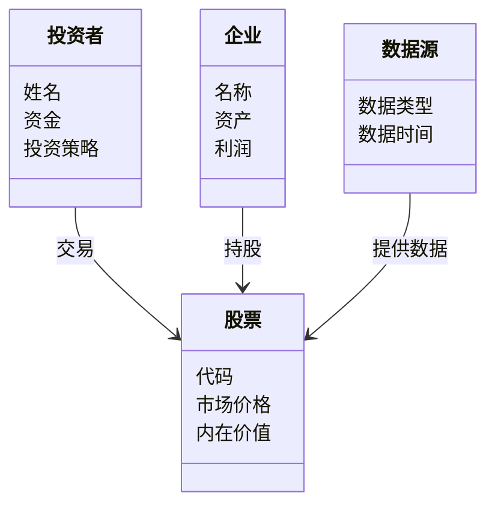
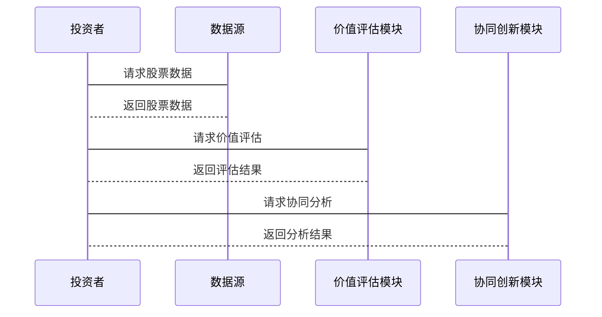

                 


# 格雷厄姆特价股票理论在数字平台协同创新产业中的应用

> 关键词：格雷厄姆特价股票理论，数字平台，协同创新，价值投资，系统设计，数学模型

> 摘要：本文探讨了格雷厄姆特价股票理论在数字平台协同创新产业中的应用，通过系统分析和实证研究，揭示了如何利用价值投资的核心理念与数字技术相结合，实现企业价值最大化和投资收益优化。

---

## 第一部分：背景介绍

### 第1章：背景介绍

#### 1.1 格雷厄姆特价股票理论的核心概念

##### 1.1.1 价值投资的基本原理
- 格雷厄姆的价值投资理论强调以低于内在价值的价格买入股票。
- 股票价格与内在价值之间的差异是投资机会的来源。
- 投资者应关注企业的基本面，如盈利能力、资产质量等。

##### 1.1.2 特价股票的定义与特征
- 特价股票是指市场价格低于内在价值的股票。
- 具有较高的安全边际，适合长期投资。
- 特价股票通常出现在市场恐慌或企业暂时困境时期。

##### 1.1.3 格雷厄姆投资策略的现代意义
- 在现代金融市场中，价值投资仍具有重要的指导意义。
- 数字技术的应用为价值投资提供了新的工具和方法。
- 协同创新模式为发现和评估企业价值提供了新的视角。

#### 1.2 数字平台协同创新产业的背景

##### 1.2.1 数字平台的定义与特点
- 数字平台是基于互联网技术构建的在线协作工具或生态系统。
- 具有开放性、交互性和数据驱动的特点。
- 数字平台通过整合资源，促进企业间的协同创新。

##### 1.2.2 协同创新产业的发展现状
- 协同创新已成为企业创新的重要模式。
- 数字平台在协同创新中扮演着关键角色。
- 协同创新产业涵盖了多个领域，如金融科技、智能制造等。

##### 1.2.3 数字平台与协同创新的关系
- 数字平台为协同创新提供了技术和工具支持。
- 协同创新推动了数字平台的不断优化和扩展。
- 两者的结合为企业价值评估和投资决策提供了新的可能性。

#### 1.3 格雷厄姆理论与数字平台的结合意义

##### 1.3.1 价值投资在数字平台中的应用潜力
- 数字平台为企业价值评估提供了丰富的数据支持。
- 通过大数据分析，可以更准确地识别特价股票。
- 数字平台的透明性和实时性有助于价值投资的实施。

##### 1.3.2 协同创新对股票价值的影响
- 协同创新模式可以提升企业的竞争力和创新能力。
- 协同创新能力强的企业往往具有更高的内在价值。
- 协同创新的成功案例可以作为价值投资的重要参考。

##### 1.3.3 数字技术对投资决策的支持作用
- 数字技术可以提高投资决策的效率和准确性。
- 通过实时数据分析，投资者可以更好地把握市场趋势。
- 数字平台提供的工具和资源可以辅助投资者进行深度分析。

---

## 第二部分：格雷厄姆特价股票理论与数字平台协同创新产业的核心概念

### 第2章：格雷厄姆特价股票理论的核心概念与联系

#### 2.1 核心概念的原理分析

##### 2.1.1 价值投资的核心要素
- 企业的内在价值是投资决策的核心依据。
- 企业的财务状况、盈利能力、竞争优势等是评估内在价值的关键因素。
- 市场价格与内在价值的偏离是投资机会的来源。

##### 2.1.2 市场情绪与股票价格的关系
- 市场情绪影响股票价格的短期波动。
- 理性投资者应避免被市场情绪左右。
- 在市场恐慌时，可能更容易找到特价股票。

##### 2.1.3 股票内在价值的计算方法
- 格雷厄姆提出了基于市盈率、市净率等指标的内在价值计算方法。
- 通过分析企业的盈利能力、资产质量等基本面指标，计算内在价值。
- 内在价值是股票的长期合理价格区间。

#### 2.2 核心概念的属性特征对比

##### 2.2.1 股票价值与市场价值的对比
- 股票的内在价值与市场价值可能存在差异。
- 内在价值是股票的理论合理价格，市场价值是实际交易价格。
- 两者的差异为投资者提供了套利机会。

##### 2.2.2 不同行业股票的特征分析
- 不同行业的股票具有不同的风险和收益特征。
- 数字平台行业的股票可能具有较高的成长性。
- 协同创新能力强的企业的股票可能具有更高的内在价值。

##### 2.2.3 数字平台企业的估值模型
- 数字平台企业的估值需要考虑其技术优势、用户基础和盈利能力。
- 可以采用DCF模型、市盈率模型等方法进行估值。
- 协同创新能力是数字平台企业的重要估值指标。

#### 2.3 ER实体关系图架构

##### 2.3.1 实体关系图的构建
```mermaid
erDiagram
    actor 投资者 {
        <属性> 姓名
        <属性> 资金
    }
    actor 企业 {
        <属性> 名称
        <属性> 资产
    }
    entity 股票 {
        <属性> 股票代码
        <属性> 市场价格
        <属性> 内在价值
    }
    entity 数据源 {
        <属性> 数据类型
        <属性> 数据时间
    }
   投资者 -> 股票 : 交易
    企业 -> 股票 : 持股
    数据源 -> 股票 : 提供数据
```

##### 2.3.2 格雷厄姆理论与数字平台的关联
- 格雷厄姆理论提供了股票价值评估的方法。
- 数字平台提供了实时数据和协同工具。
- 两者结合可以提高投资决策的效率和准确性。

##### 2.3.3 数据流与信息流的可视化
```mermaid
flowchart TD
    I[投资者] --> D[数据源]: 提供股票数据
    D --> S[股票]: 评估内在价值
    S --> I: 识别特价股票
    I --> C[协同平台]: 分析协同创新能力
    C --> I: 提供投资建议
```

---

## 第三部分：数字平台协同创新产业的系统分析

### 第3章：数字平台协同创新产业的系统分析

#### 3.1 系统功能设计

##### 3.1.1 领域模型的构建


##### 3.1.2 协同创新平台的功能模块
- 数据采集与分析模块：实时采集股票数据，进行基本面分析。
- 价值评估模块：基于格雷厄姆理论，评估股票的内在价值。
- 协同创新分析模块：评估企业的协同创新能力，辅助投资决策。

##### 3.1.3 数字平台的协同机制
- 数据共享机制：通过API接口，实现数据的实时共享。
- 协作开发机制：支持多方协作，共同开发协同创新项目。
- 信息反馈机制：及时反馈市场变化，优化投资策略。

#### 3.2 系统架构设计

##### 3.2.1 平台架构的分层设计
- 数据层：存储股票数据、企业信息等。
- 业务逻辑层：实现数据处理、价值评估等核心功能。
- 用户界面层：提供友好的操作界面，支持投资者进行交易和分析。

##### 3.2.2 微服务架构的应用
- 数据采集服务：实时采集股票数据。
- 价值评估服务：基于格雷厄姆理论，评估股票价值。
- 协同创新服务：支持企业间的协同创新活动。

##### 3.2.3 数据存储与处理方案
- 数据存储：使用数据库存储股票数据和企业信息。
- 数据处理：采用大数据技术，进行实时分析和预测。

#### 3.3 系统接口设计

##### 3.3.1 API接口的定义
- 提供RESTful API接口，支持HTTP协议。
- 接口包括：获取股票数据、评估股票价值、分析协同创新能力等。

##### 3.3.2 接口调用的流程
- 投资者通过API获取股票数据。
- 系统调用价值评估模块，评估股票的内在价值。
- 投资者根据评估结果，做出投资决策。

##### 3.3.3 接口安全的设计
- 使用HTTPS协议，确保数据传输安全。
- 采用身份验证机制，防止未授权访问。
- 定期更新API接口，修复潜在的安全漏洞。

#### 3.4 系统交互设计

##### 3.4.1 系统交互流程


---

## 第四部分：格雷厄姆理论在数字平台中的应用

### 第4章：格雷厄姆理论在数字平台中的应用

#### 4.1 数据驱动的股票价值评估

##### 4.1.1 数据挖掘与分析方法
- 采用大数据技术，分析股票的历史数据和市场趋势。
- 使用机器学习算法，预测股票价格的变化。

##### 4.1.2 机器学习算法的应用
- 使用回归算法，预测股票的内在价值。
- 使用聚类算法，识别市场中的特价股票。

##### 4.1.3 股票价值预测模型的构建
- 基于格雷厄姆理论，构建股票价值预测模型。
- 使用历史数据，验证模型的准确性和可靠性。

#### 4.2 协同创新模式下的股票价值评估

##### 4.2.1 协同创新对股票价值的影响
- 协同创新能力强的企业的股票具有更高的内在价值。
- 协同创新模式可以降低企业的运营风险。

##### 4.2.2 协同创新能力的评估指标
- 企业的协同创新能力、技术创新能力、市场拓展能力等。

##### 4.2.3 协同创新模式下的投资策略
- 优先投资于具有强大协同创新能力的企业。
- 在市场恐慌时，寻找具有协同创新潜力的特价股票。

---

## 第五部分：数字平台协同创新产业的系统设计

### 第5章：数字平台协同创新产业的系统设计

#### 5.1 系统功能设计

##### 5.1.1 领域模型的构建
- 构建股票价值评估模型，基于格雷厄姆理论。
- 构建协同创新能力评估模型，基于企业数据。

##### 5.1.2 系统功能模块
- 数据采集模块：实时采集股票数据和企业信息。
- 价值评估模块：基于格雷厄姆理论，评估股票价值。
- 协同创新分析模块：评估企业的协同创新能力。

#### 5.2 系统架构设计

##### 5.2.1 系统架构的分层设计
- 数据层：存储股票数据和企业信息。
- 业务逻辑层：实现数据处理和价值评估功能。
- 用户界面层：提供友好的操作界面，支持投资者进行交易和分析。

##### 5.2.2 微服务架构的应用
- 数据采集服务：实时采集股票数据。
- 价值评估服务：基于格雷厄姆理论，评估股票价值。
- 协同创新服务：支持企业间的协同创新活动。

#### 5.3 系统接口设计

##### 5.3.1 API接口的定义
- 提供RESTful API接口，支持HTTP协议。
- 接口包括：获取股票数据、评估股票价值、分析协同创新能力等。

##### 5.3.2 接口调用的流程
- 投资者通过API获取股票数据。
- 系统调用价值评估模块，评估股票的内在价值。
- 投资者根据评估结果，做出投资决策。

##### 5.3.3 接口安全的设计
- 使用HTTPS协议，确保数据传输安全。
- 采用身份验证机制，防止未授权访问。
- 定期更新API接口，修复潜在的安全漏洞。

#### 5.4 系统交互设计

##### 5.4.1 系统交互流程


---

## 第六部分：项目实战

### 第6章：项目实战

#### 6.1 项目背景与目标

##### 6.1.1 项目背景
- 某数字平台企业希望基于格雷厄姆理论，开发股票价值评估系统。

##### 6.1.2 项目目标
- 开发一个基于格雷厄姆理论的股票价值评估系统。
- 实现协同创新能力的评估功能。

#### 6.2 项目核心实现

##### 6.2.1 环境安装与配置
- 安装Python、Pandas、Scikit-learn等工具。
- 配置数据库和API接口。

##### 6.2.2 核心代码实现
```python
import pandas as pd
from sklearn.linear_model import LinearRegression

# 数据加载
data = pd.read_csv('stocks.csv')

# 特征提取
features = data[['市盈率', '市净率', '股息率']]
target = data['内在价值']

# 模型训练
model = LinearRegression()
model.fit(features, target)

# 预测股票价值
predicted_value = model.predict(features)
```

##### 6.2.3 代码功能解读
- 数据加载：读取股票数据。
- 特征提取：提取市盈率、市净率、股息率等指标。
- 模型训练：使用线性回归模型，训练股票价值预测模型。
- 预测股票价值：基于模型，预测股票的内在价值。

#### 6.3 项目小结

##### 6.3.1 项目总结
- 成功开发了基于格雷厄姆理论的股票价值评估系统。
- 实现了协同创新能力的评估功能。

##### 6.3.2 投资建议
- 在市场恐慌时，优先关注具有协同创新潜力的特价股票。
- 长期持有具有竞争优势和协同创新能力的企业股票。

##### 6.3.3 注意事项
- 价值投资需要结合市场实际情况，避免机械套用理论。
- 协同创新能力的评估需要结合企业的实际运营情况。

---

## 第七部分：总结与展望

### 第7章：总结与展望

#### 7.1 核心观点总结
- 格雷厄姆特价股票理论在数字平台协同创新产业中具有重要的应用价值。
- 数字技术为价值投资提供了新的工具和方法。
- 协同创新模式为发现和评估企业价值提供了新的视角。

#### 7.2 未来展望
- 随着人工智能和大数据技术的发展，价值投资的工具和方法将更加智能化。
- 协同创新模式将更加广泛地应用于各个行业，推动企业价值的提升。
- 数字平台的进一步优化和发展，将为投资者提供更强大的支持。

#### 7.3 最佳实践 tips
- 在进行价值投资时，应结合企业的基本面和市场环境，制定合理的投资策略。
- 协同创新能力是评估企业价值的重要指标，应给予充分关注。
- 投资者应保持理性，避免被市场情绪左右。

---

## 作者：AI天才研究院/AI Genius Institute & 禅与计算机程序设计艺术/Zen And The Art of Computer Programming

