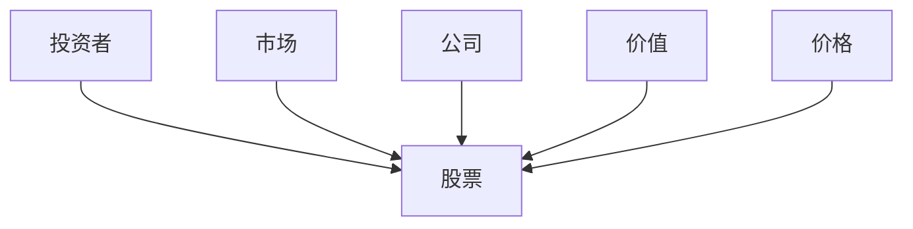
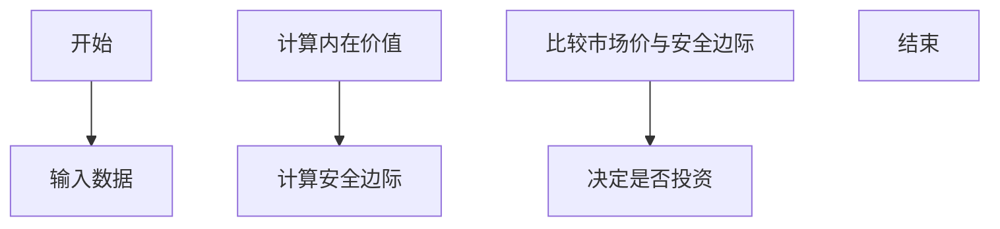
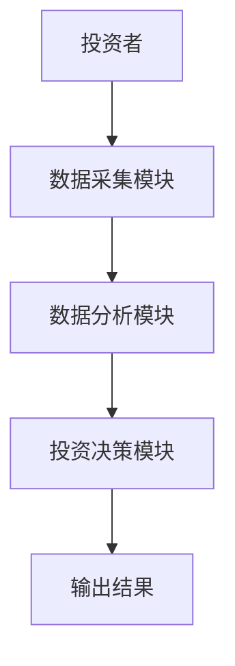
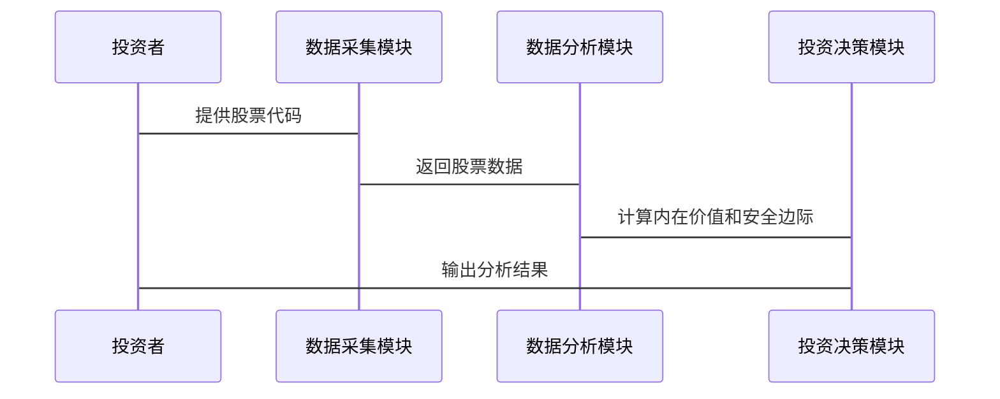

                 


# 格雷厄姆特价股票理论在数字平台协同经济产业中的应用

> 关键词：格雷厄姆，特价股票，价值投资，数字平台，协同经济，系统架构，算法原理

> 摘要：本文系统地探讨了格雷厄姆特价股票理论在数字平台协同经济产业中的应用，结合价值投资理念，通过算法原理、系统架构设计和项目实战，展示了如何在数字平台中运用格雷厄姆理论进行投资决策。文章详细分析了协同经济的现状、价值投资的核心概念、算法实现、系统设计以及实际案例，为投资者和研究者提供了理论和实践指导。

---

# 第一部分: 格雷厄姆特价股票理论与数字平台协同经济产业的背景

## 第1章: 格雷厄姆特价股票理论概述

### 1.1 格雷厄姆特价股票理论的起源与核心思想

#### 1.1.1 价值投资的起源
价值投资起源于20世纪20年代，由本杰明·格雷厄姆和戴维德·多德共同提出。格雷厄姆的学生沃伦·巴菲特继承并发展了这一理论。价值投资的核心在于寻找市场中被低估的股票，即“特价股票”。

#### 1.1.2 格雷厄姆的投资理念
格雷厄姆强调安全边际和内在价值。他认为，投资者应该购买那些市场价格低于其内在价值的股票。内在价值是基于公司基本面分析得出的合理估值，而安全边际则是市场价格与内在价值之间的差距，用以缓冲市场波动带来的风险。

#### 1.1.3 特价股票理论的核心思想
特价股票理论的核心在于寻找那些市场价格远低于其内在价值的股票。这种股票通常被视为“便宜货”，具有较高的投资回报潜力。格雷厄姆认为，通过分析公司的财务数据，如市盈率、市净率、股息率等，可以评估股票的内在价值。

### 1.2 数字平台协同经济产业的现状

#### 1.2.1 协同经济的定义与特点
协同经济是指通过数字平台连接供需双方，实现资源共享和协作的一种经济模式。其特点是去中心化、高效匹配资源和降低交易成本。典型的协同经济平台包括共享办公空间、在线教育平台和零工经济平台。

#### 1.2.2 数字平台在协同经济中的作用
数字平台通过技术手段优化资源配置，提高交易效率。例如，滴滴出行通过平台匹配司机和乘客，Airbnb通过平台连接房东和租客。这些平台利用大数据和人工智能技术，优化用户匹配和定价策略。

#### 1.2.3 协同经济产业的典型模式
协同经济的典型模式包括共享经济、零工经济和平台经济。共享经济通过闲置资源的共享实现经济价值，零工经济通过灵活用工满足企业需求，平台经济则通过技术手段降低交易成本。

### 1.3 问题背景与研究意义

#### 1.3.1 协同经济产业中的投资机会
随着数字技术的发展，协同经济平台在全球范围内迅速崛起，吸引了大量投资。然而，许多平台由于竞争激烈和商业模式不成熟，面临估值过高的问题。如何在这些平台中找到被低估的投资机会，成为投资者关注的焦点。

#### 1.3.2 格雷厄姆特价股票理论的适用性
格雷厄姆的价值投资理念强调寻找被低估的股票，这与协同经济平台早期发展阶段的特点相符。许多协同经济平台在初期阶段估值较低，具有较大的增长潜力。因此，将格雷厄姆理论应用于数字平台协同经济产业具有较高的实践意义。

#### 1.3.3 研究的价值与意义
通过将格雷厄姆理论应用于协同经济产业，投资者可以更准确地评估平台的内在价值，识别被低估的投资机会。同时，这种应用也为学术研究提供了新的视角，有助于深入理解数字平台经济的发展规律。

---

## 第2章: 格雷厄姆特价股票理论的核心概念与联系

### 2.1 核心概念原理

#### 2.1.1 安全边际的定义与计算
安全边际是市场价格与内在价值之间的差额。计算公式为：安全边际 = 内在价值 - 市场价格。安全边际越大，投资风险越小。例如，如果某股票的内在价值为50元，市场价格为40元，则安全边际为10元。

#### 2.1.2 内在价值的评估方法
内在价值是基于公司基本面分析得出的合理估值。常用的评估方法包括股息贴现模型（DDM）和折扣现金流模型（DCF）。例如，股息贴现模型的公式为：内在价值 = Σ(股息 / (1 + r)^t)，其中r为折现率，t为时间。

#### 2.1.3 市场先生的理论模型
格雷厄姆将市场波动比作“市场先生”，市场先生每天提供一个价格，投资者可以选择接受或拒绝。市场先生的情绪化行为为投资者提供了套利机会。例如，当市场价格低于内在价值时，投资者可以买入股票，市场先生的报价为投资者提供了获利机会。

### 2.2 核心概念属性特征对比

| 概念       | 特点                        | 价值投资   | 成长投资   |
|------------|-----------------------------|------------|------------|
| 安全边际   | 市场价格与内在价值的差额   | 重视       | 忽略       |
| 内在价值   | 公司基本面决定的合理估值   | 核心       | 辅助       |
| 市场波动   | 市场情绪影响的价格波动     | 利用波动   | 避免波动   |

### 2.3 ER实体关系图架构



---

## 第3章: 格雷厄姆特价股票理论的算法原理

### 3.1 算法原理概述

#### 3.1.1 内在价值计算公式
内在价值计算公式为：
$$
内在价值 = \frac{\text{股息}}{\text{折现率} - \text{增长率}}
$$
例如，假设股息为1元，折现率为10%，增长率5%，则内在价值为：
$$
\frac{1}{0.10 - 0.05} = 20 \text{元}
$$

#### 3.1.2 安全边际的计算方法
安全边际计算公式为：
$$
\text{安全边际} = \text{内在价值} - \text{市场价格}
$$
例如，内在价值为20元，市场价格为15元，则安全边际为5元。

#### 3.1.3 市场波动的预测模型
市场波动预测模型可以通过历史数据分析市场波动率，例如使用标准差衡量市场波动。公式为：
$$
\sigma = \sqrt{\frac{\sum (x_i - \bar{x})^2}{n}}
$$
其中，$\sigma$为波动率，$x_i$为每天的收盘价，$\bar{x}$为平均收盘价，$n$为天数。

### 3.2 算法流程图



### 3.3 算法实现代码

```python
def calculate_intrinsic_value(stock_data):
    # 假设 stock_data 包含股息、折现率和增长率
    dividend = stock_data['股息']
    discount_rate = stock_data['折现率']
    growth_rate = stock_data['增长率']
    return dividend / (discount_rate - growth_rate)

def calculate_margin_of_safety(intrinsic_value, market_price):
    return intrinsic_value - market_price

# 示例数据
stock_data = {
    '股息': 1,
    '折现率': 0.10,
    '增长率': 0.05,
    '市场价格': 15
}

intrinsic_value = calculate_intrinsic_value(stock_data)
margin_of_safety = calculate_margin_of_safety(intrinsic_value, stock_data['市场价格'])

print(f"内在价值: {intrinsic_value}")
print(f"安全边际: {margin_of_safety}")
```

---

## 第4章: 系统分析与架构设计

### 4.1 问题场景介绍
协同经济平台的投资者需要评估多个平台的内在价值和市场价格，寻找被低估的投资机会。然而，传统的方法难以处理大量数据，且缺乏系统化的分析工具。

### 4.2 项目介绍
本项目旨在开发一个基于格雷厄姆理论的数字平台协同经济投资分析系统。系统将提供以下功能：
1. 数据采集：收集各平台的财务数据和市场数据。
2. 数据分析：计算内在价值和安全边际。
3. 投资决策：根据分析结果推荐投资标的。

### 4.3 系统功能设计

#### 4.3.1 领域模型


#### 4.3.2 系统架构设计



### 4.4 系统接口设计

#### 4.4.1 数据接口
系统需要从多个数据源获取股票数据，例如Yahoo Finance和Alpha Vantage。

#### 4.4.2 用户界面
用户可以通过Web界面输入股票代码，查看分析结果。

### 4.5 系统交互设计



---

## 第5章: 项目实战

### 5.1 环境安装

#### 5.1.1 安装Python环境
```bash
python --version
pip install --upgrade pip
```

#### 5.1.2 安装依赖库
```bash
pip install pandas numpy matplotlib requests
```

### 5.2 系统核心实现源代码

```python
import pandas as pd
import numpy as np
import matplotlib.pyplot as plt
import requests

def get_stock_data(ticker):
    url = f"https://query1.finance.yahoo.com/v8/finance/chart/{ticker}"
    response = requests.get(url)
    data = response.json()
    return data['chart']

def calculate_intrinsic_value(data):
    # 假设数据包含股息率和市净率
    dividend_yield = data['股息率']
    price_to_book_ratio = data['市净率']
    book_value = price_to_book_ratio * data['市场价格']
    return book_value

def main():
    ticker = input("请输入股票代码：")
    data = get_stock_data(ticker)
    intrinsic_value = calculate_intrinsic_value(data)
    margin_of_safety = intrinsic_value - data['市场价格']
    print(f"内在价值: {intrinsic_value}")
    print(f"安全边际: {margin_of_safety}")
    plt.plot(data['日期'], data['收盘价'], label='市场价格')
    plt.xlabel('日期')
    plt.ylabel('价格')
    plt.legend()
    plt.show()

if __name__ == "__main__":
    main()
```

### 5.3 代码应用解读与分析
上述代码从Yahoo Finance获取股票数据，计算内在价值和安全边际，并绘制股价走势图。投资者可以根据分析结果做出投资决策。

### 5.4 实际案例分析与详细讲解剖析
以某协同经济平台为例，分析其内在价值和市场价格，计算安全边际，判断是否为被低估的股票。

### 5.5 项目小结
通过本项目的实践，投资者可以系统地应用格雷厄姆理论进行投资分析，识别协同经济产业中的投资机会。

---

## 第6章: 总结与展望

### 6.1 核心观点总结
本文系统地探讨了格雷厄姆特价股票理论在数字平台协同经济产业中的应用，结合算法原理和系统设计，展示了如何在数字平台中应用价值投资理念进行投资决策。

### 6.2 展望未来
未来，随着协同经济的发展，格雷厄姆理论的应用将更加广泛。投资者可以结合其他投资策略，如成长型投资和价值型投资，优化投资组合。同时，随着人工智能和大数据技术的发展，投资分析工具将更加智能化，为投资者提供更精准的决策支持。

---

## 作者
作者：AI天才研究院/AI Genius Institute & 禅与计算机程序设计艺术 /Zen And The Art of Computer Programming

