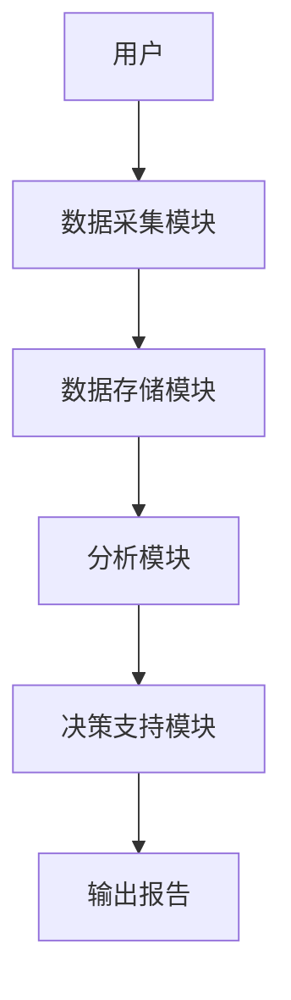

                 


# 格雷厄姆特价股票理论在数字平台经济产业中的应用

> 关键词：价值投资、数字平台经济、股票分析、投资策略、算法模型、系统架构、风险管理

> 摘要：本文探讨了如何将格雷厄姆的价值投资理论应用于数字平台经济产业中，通过分析特价股票的特征，构建量化分析模型，并设计相应的系统架构，指导投资决策。

---

## 第1章：背景介绍

### 1.1 数字平台经济概述

#### 1.1.1 数字平台经济的定义
数字平台经济是指通过互联网技术和数字化工具，连接供需双方，提供撮合交易、数据分析等服务的经济模式。典型例子包括电子商务平台、金融科技平台等。

#### 1.1.2 数字平台经济的特点
- 数据驱动：利用大数据分析优化运营和决策。
- 网络效应：用户数量的增加会提升平台的整体价值。
- 平台化趋势：企业通过平台化转型，提高效率和降低成本。

#### 1.1.3 数字平台经济的现状与挑战
- 竞争激烈：行业内存在多家巨头企业，市场竞争加剧。
- 数据安全：用户数据保护和隐私问题日益突出。
- 技术更新快：需要不断技术创新以维持竞争优势。

### 1.2 价值投资与格雷厄姆理论

#### 1.2.1 价值投资的定义
价值投资是一种以股票的内在价值为导向的投资策略，强调以低于内在价值的价格买入优质股票，长期持有，等待其价值回归。

#### 1.2.2 格雷厄姆理论的核心思想
- 安全边际：买入价格低于股票内在价值，确保投资的安全性。
- 内在价值计算：通过现金流折现法等方法估算股票的真实价值。
- 风险控制：分散投资，降低风险。

#### 1.2.3 格雷厄姆理论在数字平台经济中的应用潜力
- 通过分析数字平台企业的财务数据，识别低估的投资机会。
- 利用格雷厄姆的筛选指标，筛选出具备安全边际的平台企业。

---

## 第2章：格雷厄姆特价股票理论的核心概念与联系

### 2.1 核心概念原理

#### 2.1.1 内在价值公式
股票的内在价值可以通过未来现金流的现值计算，公式如下：
$$
V = \sum_{t=1}^{n} \frac{CF_t}{(1 + r)^t}
$$
其中，\( CF_t \) 是第 \( t \) 年的现金流，\( r \) 是折现率。

#### 2.1.2 安全边际
安全边际是买入价格与内在价值的差额，确保投资的安全性：
$$
\text{安全边际} = \text{内在价值} - \text{买入价格}
$$

#### 2.1.3 投资组合构建
通过分散投资降低风险，投资组合的总风险小于单一投资的风险。

### 2.2 核心概念属性特征对比表格

| 概念         | 定义                                                                 | 特征                       |
|--------------|----------------------------------------------------------------------|-----------------------------|
| 内在价值     | 股票未来现金流的现值和                                         | 客观性、可计算性、波动性     |
| 安全边际     | 投资价格低于内在价值的差额                                     | 风险控制、安全系数、可量化   |
| 投资组合     | 一组股票的集合                                                 | 多样性、风险分散、收益稳定 |

---

## 第3章：数字平台经济的产业分析

### 3.1 数字平台经济的主要领域

#### 3.1.1 电子商务平台
- 典型案例：亚马逊、阿里巴巴。
- 分析指标：市盈率（P/E）、市净率（P/B）。

#### 3.1.2 金融科技平台
- 典型案例：PayPal、蚂蚁集团。
- 分析指标：用户增长率、交易额增长率。

#### 3.1.3 在线教育平台
- 典型案例：Coursera、新东方在线。
- 分析指标：活跃用户数、课程完成率。

### 3.2 数字平台经济的市场趋势

#### 3.2.1 数据驱动的决策
- 利用大数据分析优化运营策略。
- 提供个性化服务，提升用户体验。

#### 3.2.2 网络效应的增强
- 平台通过用户增长和增值服务，增强网络效应。
- 提高用户粘性和平台盈利能力。

---

## 第4章：格雷厄姆特价股票理论的量化分析模型

### 4.1 格雷厄姆分析方法在数字平台经济中的应用

#### 4.1.1 核心指标筛选
- 市盈率（P/E）：低于行业平均水平。
- 市净率（P/B）：低于行业平均水平。
- 股息率：高于行业平均水平。

#### 4.1.2 筛选流程
1. 数据收集：收集目标企业的财务数据。
2. 计算指标：计算P/E、P/B等指标。
3. 筛选股票：选择符合格雷厄姆标准的股票。

### 4.2 量化分析模型实现

#### 4.2.1 数据预处理
```python
import pandas as pd

# 读取数据
df = pd.read_csv('platform_data.csv')

# 删除缺失值
df.dropna(inplace=True)

# 标准化处理
from sklearn.preprocessing import StandardScaler

scaler = StandardScaler()
scaled_df = scaler.fit_transform(df[['PE', 'PB', 'dividend_yield']])
```

#### 4.2.2 指标计算与筛选
```python
# 计算内在价值
def calculate_intrinsic_value(eps, growth_rate, discount_rate):
    return eps / (1 - growth_rate / (1 + discount_rate))

# 筛选股票
selected_stocks = df[df['PE'] < df['PE'].mean() & df['PB'] < df['PB'].mean()]
```

---

## 第5章：系统架构设计

### 5.1 系统功能设计

#### 5.1.1 数据采集模块
- 数据来源：股票数据库、财经网站。
- 数据类型：财务指标、市场数据。

#### 5.1.2 分析模块
- 计算内在价值、安全边际。
- 筛选符合条件的股票。

#### 5.1.3 决策支持模块
- 提供投资建议。
- 生成投资报告。

### 5.2 系统架构图



---

## 第6章：项目实战

### 6.1 环境搭建

#### 6.1.1 安装依赖
```bash
pip install pandas numpy matplotlib
```

#### 6.1.2 数据获取
```python
import pandas as pd
import yfinance as yf

# 下载股票数据
data = yf.download(['AAPL', 'AMZN'], start='2020-01-01', end='2023-12-31')
```

### 6.2 核心实现

#### 6.2.1 数据预处理
```python
# 删除缺失值
data.dropna(inplace=True)

# 计算指标
data['PE'] = data['Close'] / data['Earnings Per Share']
```

#### 6.2.2 筛选股票
```python
# 筛选PE < 行业平均值
selected = data[data['PE'] < data['PE'].mean()]
```

---

## 第7章：总结与展望

### 7.1 总结

通过本文的分析，我们可以看到格雷厄姆的价值投资理论在数字平台经济中的应用潜力。通过量化分析和系统设计，投资者可以更科学地筛选出具有安全边际的股票，实现长期稳定的收益。

### 7.2 展望

未来，随着技术的进步和数据的丰富，格雷厄姆理论的应用将更加广泛。结合人工智能和大数据分析，投资者可以进一步优化投资策略，提高投资效率。

### 7.3 投资建议

- **长期持有**：坚持价值投资，避免短期波动。
- **分散投资**：降低风险，提高收益稳定性。
- **持续学习**：关注市场变化，及时调整策略。

### 7.4 风险管理

- **设定止损**：避免重大损失。
- **定期复盘**：评估投资组合的表现。
- **关注行业动态**：及时了解市场变化。

---

**作者：AI天才研究院/AI Genius Institute & 禅与计算机程序设计艺术 /Zen And The Art of Computer Programming**

