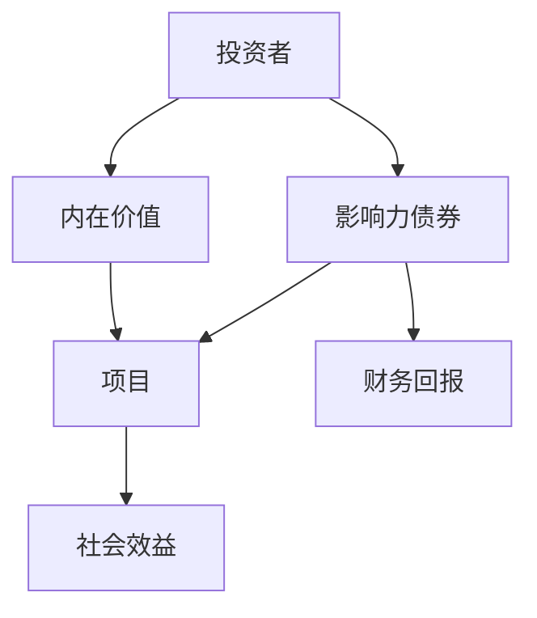
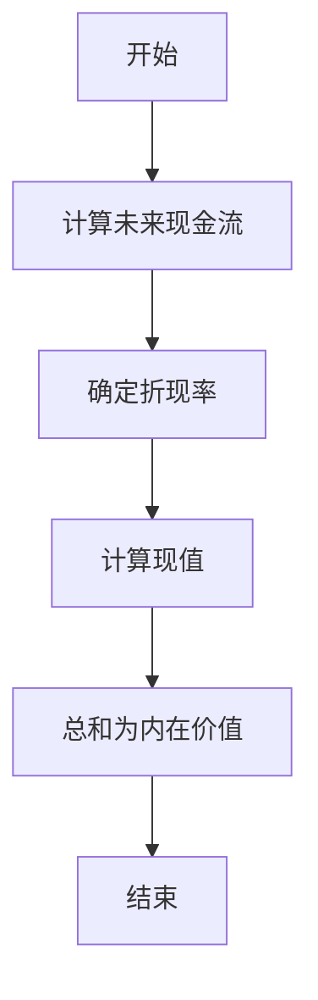
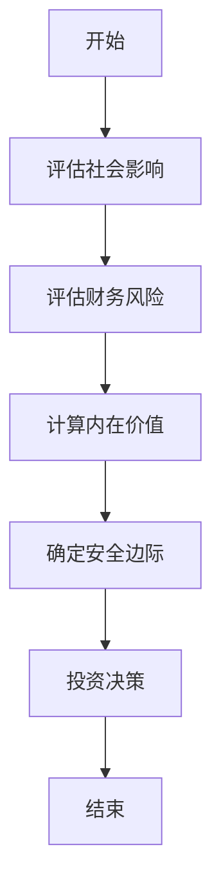
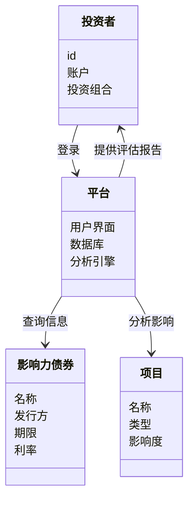
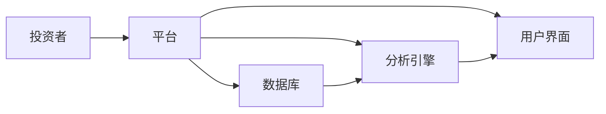

                 


# 格雷厄姆特价股票理论在数字社会影响力债券中的新应用

## 关键词：格雷厄姆理论，影响力债券，数字社会，价值投资，社会责任投资

## 摘要：本文探讨了本杰明·格雷厄姆的价值投资理论在数字社会中对影响力债券的新应用。通过分析影响债券的内在价值和安全边际，结合数字技术的应用，提出了一种创新的投资策略。文章详细阐述了理论基础、数学模型和系统设计，并通过实际案例展示了该方法的有效性。

---

# 第一部分: 格雷厄姆特价股票理论与数字社会影响力债券的背景介绍

## 第1章: 格雷厄姆特价股票理论与数字社会影响力债券的背景

### 1.1 格雷厄姆特价股票理论的起源与发展

#### 1.1.1 价值投资的鼻祖：本杰明·格雷厄姆
- 格雷厄姆是价值投资的创始人，强调安全边际和内在价值。
- 他的理论在20世纪30年代提出，影响了巴菲特等投资大师。
- 格雷厄姆的核心思想是寻找市场价格低于内在价值的股票。

#### 1.1.2 格雷厄姆特价股票理论的核心思想
- **安全边际**：购买价格远低于内在价值，以降低风险。
- **内在价值**：企业未来现金流的现值，计算公式为：
  $$ V = \sum_{t=1}^{n} \frac{CF_t}{(1 + r)^t} $$
- **价值投资**：通过分析公司基本面，寻找低估的投资标的。

#### 1.1.3 格雷厄姆理论在现代投资中的应用
- 现代投资组合理论（MPT）的结合。
- 在社会责任投资（SRI）中的应用。

### 1.2 数字社会与影响力债券的兴起

#### 1.2.1 数字社会的定义与特征
- 数字社会：基于数字技术的社会形态，数据驱动决策。
- 数字技术：大数据、人工智能、区块链等，提高了信息处理效率。

#### 1.2.2 影响力债券的概念与特点
- 影响力债券：投资者通过投资支持社会公益项目，同时获得财务回报。
- 与传统债券的区别：不仅关注财务回报，还关注社会影响。
- 数字技术在影响力债券中的应用：提高透明度和效率。

#### 1.2.3 数字社会中影响力债券的兴起背景
- 社会责任投资的兴起：投资者关注环境、社会和治理（ESG）因素。
- 数字技术的应用：区块链技术确保债券透明度，人工智能优化投资决策。

### 1.3 格雷厄姆理论与影响力债券的结合

#### 1.3.1 格雷厄姆理论在社会责任投资中的潜在价值
- 格雷厄姆的内在价值计算方法可以用于评估影响力债券的真正价值。
- 安全边际的概念可以降低投资风险。

#### 1.3.2 数字社会中影响力债券的创新应用
- 利用大数据分析社会项目的影响，评估其内在价值。
- 通过人工智能优化投资组合，平衡财务回报和社会影响力。

#### 1.3.3 格雷厄姆理论与影响力债券结合的必要性
- 提高社会责任投资的科学性和准确性。
- 通过数字技术实现理论与实践的结合。

## 1.4 本章小结
本章介绍了格雷厄姆价值投资理论和影响力债券的基本概念，分析了两者的结合在数字社会中的潜在价值和必要性。

---

# 第二部分: 格雷厄姆特价股票理论与影响力债券的核心概念与联系

## 第2章: 核心概念与联系

### 2.1 格雷厄姆特价股票理论的核心原理

#### 2.1.1 格雷厄姆的安全边际理论
- 安全边际 = 内在价值 - 市场价格。
- 公式：$$ \text{安全边际} = V - P $$
- 安全边际越大，投资风险越小。

#### 2.1.2 格雷厄姆的内在价值计算方法
- 内在价值公式：
  $$ V = \sum_{t=1}^{n} \frac{CF_t}{(1 + r)^t} $$
- 通过分析公司未来现金流和折现率计算内在价值。

#### 2.1.3 格雷厄姆的价值投资策略
- 长期持有优质资产。
- 选择市场价格低于内在价值的股票。

### 2.2 影响力债券的核心属性与特征

#### 2.2.1 影响力债券的定义与分类
- 影响力债券：债券收益用于支持社会公益项目。
- 分类：绿色债券、社会影响债券、可持续发展债券。

#### 2.2.2 影响力债券的评级标准
- 评级标准：项目的社会影响、财务风险、信用评级。
- 评级公式：$$ \text{评级} = f(\text{影响度}, \text{财务风险}, \text{信用评级}) $$

#### 2.2.3 影响力债券的发行与投资流程
- 发行流程：项目发起、债券发行、资金分配。
- 投资流程：选择项目、评估风险、投资决策。

### 2.3 格雷厄姆理论与影响力债券的联系

#### 2.3.1 格雷厄姆理论在影响力债券投资中的应用
- 使用内在价值公式评估影响力债券的价值。
- 安全边际分析降低投资风险。

#### 2.3.2 影响力债券的内在价值与安全边际
- 内在价值：债券未来现金流的现值。
- 安全边际：市场价格与内在价值的差异。

#### 2.3.3 格雷厄姆理论对影响力债券的影响
- 提供科学的估值方法。
- 降低投资风险，提高投资回报。

---

## 2.4 核心概念对比表

| 核心概念 | 格雷厄姆理论 | 影响力债券 |
|----------|--------------|-------------|
| 定义     | 价值投资理论 | 社会责任债券 |
| 核心原则 | 内在价值、安全边际 | 社会影响、财务回报 |
| 应用场景 | 股票投资 | 社会公益项目投资 |

---

## 2.5 ER实体关系图（用Mermaid表示）



---

## 2.6 算法原理

### 2.6.1 格雷厄姆内在价值计算算法



### 2.6.2 影响力债券价值评估算法



---

## 2.7 系统架构设计

### 2.7.1 应用场景
- 投资者通过数字平台评估影响力债券的价值。
- 平台利用大数据和人工智能分析项目影响。

### 2.7.2 系统功能设计（领域模型类图）



### 2.7.3 系统架构图



### 2.7.4 接口设计
- 投资者查询债券信息接口。
- 平台提供分析报告接口。

### 2.7.5 交互序列图

```mermaid
graph LR
    A[投资者] --> B[平台]: 请求评估报告
    B --> C[分析引擎]: 分析债券
    C --> B[完成分析]
    B --> A[提供报告]
```

---

## 2.8 项目实战

### 2.8.1 环境安装
- 安装Python和相关库（如Pandas、NumPy）。
- 配置数据库和分析引擎。

### 2.8.2 核心代码实现

```python
def calculate_intrinsic_value(cash_flows, discount_rate):
    present_value = sum(cash_flow / (1 + discount_rate)**t for t, cash_flow in enumerate(cash_flows))
    return present_value

# 示例数据
cash_flows = [100, 200, 300]
discount_rate = 0.05

value = calculate_intrinsic_value(cash_flows, discount_rate)
print(f"内在价值为：{value}")
```

### 2.8.3 代码解读与分析
- 函数`calculate_intrinsic_value`计算现金流的现值。
- 示例数据：假设未来三年现金流分别为100、200、300，折现率为5%。

### 2.8.4 案例分析
- 某影响力债券的现金流和折现率计算。
- 结果分析：计算出的内在价值与市场价格比较，确定是否投资。

### 2.8.5 项目小结
通过代码实现和案例分析，验证了格雷厄姆理论在影响力债券中的应用。

---

## 2.9 最佳实践

### 2.9.1 小结
格雷厄姆理论与影响力债券的结合在数字社会中具有重要意义，提供了科学的估值方法和风险控制策略。

### 2.9.2 注意事项
- 数据质量：确保社会影响数据的准确性。
- 技术局限：算法依赖历史数据，需动态调整。

### 2.9.3 拓展阅读
- 格雷厄姆的《 Intelligent Investor》。
- 数字技术在金融中的应用。

---

## 2.10 作者信息
作者：AI天才研究院/AI Genius Institute & 禅与计算机程序设计艺术/Zen And The Art of Computer Programming

---

通过以上分析，我们展示了格雷厄姆理论在数字社会影响力债券中的新应用，结合了理论分析、算法设计和系统实现，为投资者提供了新的视角和工具。

