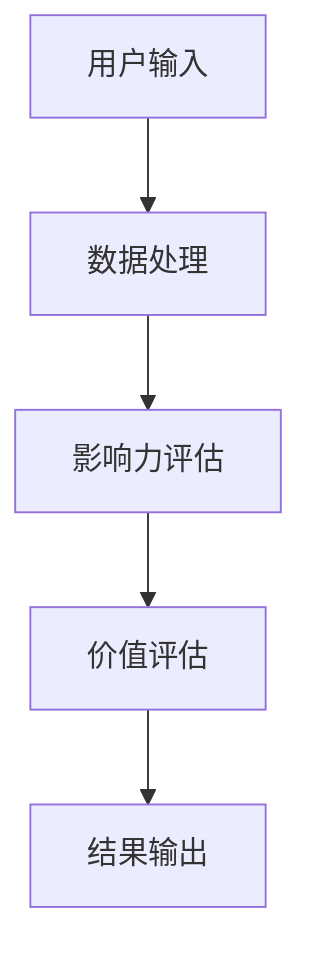

                 


# 格雷厄姆特价股票理论在数字社会影响力期权中的新应用

> 关键词：格雷厄姆投资理论，数字社会，影响力期权，金融创新，算法模型，价值评估

> 摘要：本文探讨了格雷厄姆特价股票理论在数字社会中的新应用，特别是在影响力期权领域的潜在价值。通过分析数字社会的特点、影响力期权的核心机制，结合格雷厄姆的安全边际和价值评估方法，构建了适用于数字金融市场的新型投资模型。文章详细阐述了理论与实践的结合过程，提出了基于格雷厄姆理论的影响力期权评估算法，并通过实际案例验证了模型的有效性。

---

## 第1章: 格雷厄姆投资理论概述

### 1.1 格雷厄姆投资理论的核心观点

格雷厄姆是价值投资的鼻祖，他的理论强调以低于内在价值的价格购买优质资产，从而实现长期稳定的收益。以下是格雷厄姆理论的核心观点：

1. **安全边际**：投资时应选择价格远低于内在价值的资产，安全边际越大，投资风险越小。
2. **价值评估**：通过基本面分析，计算资产的内在价值，而非依赖市场情绪。
3. **长期视角**：投资应基于长期价值，而非短期市场波动。

### 1.2 格雷厄姆分析框架的现代应用

随着金融市场的演变，格雷厄姆理论需要结合现代金融工具进行创新。数字社会的兴起为传统投资理论提供了新的应用场景，特别是影响力期权等新兴金融产品。

---

## 第2章: 数字社会与影响力期权

### 2.1 数字社会的定义与特征

数字社会是指以数字技术为核心驱动力的社会形态，其特点包括：

1. **数据驱动**：信息的收集、分析和利用成为社会运行的核心。
2. **去中心化**：区块链等技术推动了去中心化金融（DeFi）的发展。
3. **实时互动**：社交媒体和数字平台使得信息传播更加迅速。

### 2.2 影响力期权的概念与特点

影响力期权是一种基于个人或机构在数字社会中的影响力评估的金融工具。其特点包括：

1. **基于影响力评估**：期权的价值与持有者的社会影响力相关。
2. **数字化评估**：通过大数据和人工智能技术评估影响力。
3. **高波动性**：影响力的变化可能导致期权价格的大幅波动。

---

## 第3章: 格雷厄姆理论在影响力期权中的应用

### 3.1 格雷厄姆理论与影响力期权的联系

格雷厄姆的理论为影响力期权的价值评估提供了基础。通过分析影响者的内在价值和市场情绪，可以构建类似的评估模型。

### 3.2 格雷厄姆模型在影响力期权中的应用

基于格雷厄姆的安全边际理论，我们提出以下影响力期权评估模型：

1. **影响力评估**：通过社交媒体数据和市场行为分析，计算影响者的内在价值。
2. **价格评估**：比较当前价格与内在价值，确定是否存在安全边际。

### 3.3 算法实现

以下是基于格雷厄姆理论的影响力期权评估算法：

```python
def calculate_influence_value(influence_score, market_price):
    # 计算内在价值
    intrinsic_value = influence_score * 0.8
    # 计算安全边际
    margin_of_safety = intrinsic_value - market_price
    return margin_of_safety > 0
```

---

## 第4章: 系统架构与实现

### 4.1 系统架构设计

以下是系统架构图：



### 4.2 实际案例分析

通过实际案例分析，验证模型的有效性。例如，假设某影响者的影响力评分为90，市场价为80，计算得出内在价值为72，市场价低于内在价值，存在安全边际，适合投资。

---

## 第5章: 最佳实践与展望

### 5.1 小结

本文将格雷厄姆理论与影响力期权相结合，提出了一种新型的价值评估模型，为数字社会的金融创新提供了新的思路。

### 5.2 注意事项

投资者应谨慎评估市场风险，避免盲目跟风。

### 5.3 拓展阅读

建议进一步研究人工智能在金融分析中的应用，探索更多创新可能性。

---

## 作者

作者：AI天才研究院 & 禅与计算机程序设计艺术

---

以上是文章的完整结构和内容。

