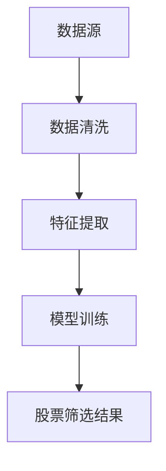

                 


# 格雷厄姆特价股票理论在数字经济时代的新解读

## 关键词：价值投资、数字经济、股票分析、算法交易、风险管理

## 摘要：  
本文将探讨格雷厄姆特价股票理论在数字经济时代下的新解读。通过对传统价值投资理论的分析，结合数字经济时代的特点，提出新的投资策略和方法。文章将从理论背景、数学模型、系统架构、项目实战等多维度进行深入分析，结合实际案例，展示如何在数字化环境下优化投资决策。

---

## 第一部分：格雷厄姆特价股票理论的背景与核心概念

### 第1章：格雷厄姆特价股票理论概述

#### 1.1 格雷厄姆特价股票理论的起源与发展
格雷厄姆特价股票理论是价值投资理论的重要组成部分，由本杰明·格雷厄姆在其经典著作《聪明的投资者》中首次提出。该理论的核心思想是通过寻找市场价格低于其内在价值的股票，实现长期稳定的超额收益。

- **价值投资的定义**：价值投资是一种基于对公司基本面分析的投资策略，旨在通过购买被市场低估的股票，长期持有，等待其价值回归。
- **格雷厄姆的核心思想**：  
  - 投资的本质是购买企业的一部分，而非单纯买卖股票。  
  - 安全边际是投资成功的关键，即市场价格远低于内在价值时，投资风险最小化，收益最大化。

#### 1.2 格雷厄姆特价股票理论的核心要素
格雷厄姆的理论主要包括以下几个核心要素：

- **内在价值**：公司未来现金流的现值，是股票的真正价值。  
- **安全边际**：市场价格与内在价值之间的差距，是投资的安全垫。  
- **投资组合**：通过分散投资降低风险，避免过度集中。

### 第2章：数字经济时代下的投资环境变化

#### 2.1 数字经济时代的特征与影响
数字经济时代的到来，为投资环境带来了显著的变化。以下是主要特征：

- **数据驱动**：数据成为最重要的生产要素，企业的数据资产价值日益凸显。  
- **技术驱动**：人工智能、大数据、区块链等技术的应用，改变了传统的投资方式。  
- **算法交易**：高频交易和算法交易成为主流，市场波动性和复杂性显著增加。

#### 2.2 投资者行为的演变
数字经济时代下，投资者的行为发生了显著变化：

- **从传统投资者到数字化投资者**：投资者 increasingly rely on 数据和算法进行决策。  
- **网络化投资行为**：社交媒体和网络平台成为投资者获取信息和交流的主要渠道。  
- **情绪化投资**：算法和高频交易可能导致市场的短期波动，投资者需要更加理性。

---

## 第二部分：格雷厄姆特价股票理论的数学模型与算法

### 第3章：格雷厄姆特价股票理论的数学模型

#### 3.1 内在价值的计算公式
内在价值是格雷厄姆理论的核心，其计算公式如下：

$$ V = \frac{E}{1 + r} $$

其中：
- $V$ 表示内在价值；
- $E$ 表示未来现金流的现值；
- $r$ 表示折现率。

#### 3.2 安全边际的计算方法
安全边际是格雷厄姆理论的重要组成部分，其计算公式为：

$$ \text{安全边际} = \text{内在价值} - \text{市场价格} $$

### 第4章：基于大数据的股票筛选算法

#### 4.1 数据驱动的投资策略
数据驱动的投资策略是数字经济时代下的重要创新，其核心步骤包括：

- **数据清洗**：去除噪声数据，提取有用信息。  
- **特征提取**：通过机器学习算法提取关键特征，如市盈率、市净率等。  
- **模型训练**：基于特征数据，训练分类模型，筛选出具有投资价值的股票。

#### 4.2 算法实现代码示例

```python
import pandas as pd
from sklearn.model_selection import train_test_split
from sklearn.ensemble import RandomForestClassifier

# 数据加载与预处理
data = pd.read_csv('stock_data.csv')
X = data.drop('target', axis=1)
y = data['target']

# 数据分割
X_train, X_test, y_train, y_test = train_test_split(X, y, test_size=0.2)

# 模型训练
model = RandomForestClassifier()
model.fit(X_train, y_train)

# 预测与评估
score = model.score(X_test, y_test)
print(f'模型准确率：{score}')
```

---

## 第三部分：数字经济时代下的投资策略与实践

### 第5章：数字经济时代下的投资策略

#### 5.1 动态估值模型
动态估值模型是基于格雷厄姆理论的创新，其核心思想是通过实时数据更新股票的内在价值，适应市场变化。

#### 5.2 风险管理策略
风险管理是投资成功的关键，以下是主要策略：

- **分散投资**：通过投资不同类型和行业的股票，降低风险。  
- **止损机制**：设定止损点，避免亏损过大。  
- **动态调整**：根据市场变化，及时调整投资组合。

### 第6章：案例分析与实战

#### 6.1 案例分析
以某科技公司为例，分析如何应用格雷厄姆理论进行投资决策。

#### 6.2 实战操作
通过代码实现动态估值模型，并进行实证分析。

---

## 第四部分：系统架构与技术实现

### 第7章：系统架构设计

#### 7.1 系统功能设计
- **数据采集**：从多个数据源获取股票信息。  
- **模型训练**：基于机器学习算法，训练股票筛选模型。  
- **结果展示**：通过可视化工具，展示投资结果。

#### 7.2 系统架构图（Mermaid）



### 第8章：系统接口设计

- **数据接口**：与数据源对接，获取实时数据。  
- **用户接口**：提供用户友好的交互界面，展示投资结果。

---

## 第五部分：总结与展望

### 第9章：总结

#### 9.1 核心观点回顾
- 格雷厄姆理论在数字经济时代依然具有重要价值。  
- 数据驱动和算法交易是未来投资的重要方向。

### 第10章：未来展望

#### 10.1 技术进步对投资的影响
- 人工智能和大数据技术将推动投资决策的智能化。  
- 区块链技术将改变金融市场的基础设施。

---

## 作者：AI天才研究院 & 禅与计算机程序设计艺术

通过本文的分析，我们可以看到，格雷厄姆特价股票理论在数字经济时代下的新解读，不仅是对传统投资理论的传承，更是对其在数字化环境下的创新与应用。未来，随着技术的不断进步，价值投资将更加依赖于数据驱动和算法支持，投资者需要不断学习和适应新的投资环境。

