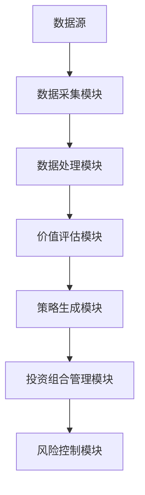

                 


# 格雷厄姆特价股票理论在数字货币时代的新思考

---

## 关键词：
- 格雷厄姆投资理论
- 数字货币
- 价值投资
- 安全边际
- 投资策略
- 系统架构
- 数字资产

---

## 摘要：
本文从格雷厄姆的经典价值投资理论出发，结合数字货币市场的特点，提出了一种新型的投资策略。通过对数字货币市场的深度分析，本文揭示了格雷厄姆理论在数字时代的适用性，并构建了一个基于价值评估和风险控制的投资系统。通过实际案例和系统实现，本文为投资者提供了在数字货币时代如何有效应用格雷厄姆理论的详细指导。

---

# 第一部分：格雷厄姆投资理论的背景与基础

## 第1章：传统价值投资理论概述

### 1.1 格雷厄姆投资理论的核心概念

#### 1.1.1 价值投资的基本原则
- **核心思想**：投资的本质是购买低于其内在价值的资产，而不是参与市场的波动。
- **安全边际**：买入价格与内在价值之间的差距，是投资的“安全垫”。
- **长期视角**：关注企业的内在价值，而不是短期市场波动。

#### 1.1.2 特价股票的定义与特征
- **定义**：价格低于内在价值的股票。
- **特征**：
  - 低市盈率（P/E）。
  - 低市净率（P/B）。
  - 高股息率。

#### 1.1.3 投资者的心理与行为
- **恐惧与贪婪**：市场的波动往往由投资者的心理主导。
- **理性与非理性**：价值投资要求投资者在市场恐慌时保持理性。

---

### 1.2 格雷厄姆投资策略的关键要素

#### 1.2.1 安全边际的概念与计算
- **安全边际公式**：
  $$ \text{安全边际} = \text{内在价值} - \text{市场价格} $$
- **意义**：确保投资的安全性，降低风险。

#### 1.2.2 股票内在价值的评估方法
- **DCF模型**：通过现金流折现法评估企业的内在价值。
- **资产净值法**：评估企业的账面价值。

#### 1.2.3 投资组合的构建与优化
- **分散投资**：降低单一资产的风险。
- **价值排序**：优先选择安全边际高的资产。

---

## 第2章：数字货币时代的投资新维度

### 2.1 数字货币的特性与挑战

#### 2.1.1 数字货币的基本概念与分类
- **基本概念**：数字货币是一种基于区块链技术的虚拟货币，具有去中心化、匿名性、可追溯性等特点。
- **分类**：
  - 按用途：支付型（如比特币）、价值存储型（如黄金代币）。
  - 按技术：公链、联盟链、私链。

#### 2.1.2 数字货币市场的波动性与风险
- **波动性**：市场波动剧烈，价格受技术、政策、市场情绪等多种因素影响。
- **风险**：市场风险、流动性风险、技术风险。

#### 2.1.3 数字货币与传统金融市场的差异
- **交易时间**：24/7 全天候交易。
- **市场参与者**：机构投资者与散户并存。

---

### 2.2 格雷厄姆理论在数字时代的适用性

#### 2.2.1 数字货币市场的独特性与传统股票市场的对比
- **市场效率**：数字货币市场效率较低，信息不对称严重。
- **市场参与**：数字货币市场参与者更广泛，包括散户和机构。

#### 2.2.2 格雷厄姆理论的核心要素在数字时代的映射
- **内在价值**：基于项目技术、团队、市场应用的综合评估。
- **安全边际**：数字货币价格与内在价值的差距。
- **长期视角**：关注项目的长期价值，而非短期价格波动。

---

# 第二部分：格雷厄姆特价股票理论在数字货币中的应用

## 第3章：数字资产的价值评估模型

### 3.1 格雷厄姆模型在数字资产中的应用

#### 3.1.1 数字资产的内在价值计算公式
- **公式**：
  $$ \text{内在价值} = \frac{\text{未来现金流}}{\text{贴现率}} $$
- **注意事项**：
  - 现金流的预测需要考虑项目的技术实现、市场需求。
  - 贴现率需结合项目风险调整。

#### 3.1.2 安全边际的重新定义与计算
- **公式**：
  $$ \text{安全边际} = \text{内在价值} \times (1 - \text{风险系数}) $$
- **风险系数**：根据项目风险调整，范围在 0 到 1 之间。

#### 3.1.3 数字资产价值评估中的关键指标
- **技术指标**：区块链技术的成熟度、代码开源性。
- **市场指标**：交易量、市场占有率。
- **团队指标**：团队背景、开发进展。

---

### 3.2 数字货币市场情绪与价格波动分析

#### 3.2.1 市场情绪对数字资产价格的影响
- **市场情绪指标**：恐慌指数、社交媒体情绪分析。
- **影响机制**：市场情绪通过影响投资者行为间接影响价格。

#### 3.2.2 技术分析与基本面分析的结合
- **技术分析**：K线图、MACD、RSI 等指标。
- **基本面分析**：项目团队、市场应用、技术实现。

#### 3.2.3 市场周期与投资策略的调整
- **周期划分**：牛市、熊市、震荡市。
- **策略调整**：根据市场周期调整投资策略。

---

## 第4章：基于格雷厄姆理论的数字货币投资策略

### 4.1 低价币投资策略

#### 4.1.1 低价币的定义与筛选标准
- **定义**：价格低于其内在价值的数字货币。
- **筛选标准**：
  - 价格低。
  - 安全边际高。
  - 项目有潜力。

#### 4.1.2 低价币投资的风险与收益分析
- **风险**：市场波动大，项目风险高。
- **收益**：潜在收益高，长期持有可能获得超额收益。

#### 4.1.3 低价币投资的长期与短期策略
- **长期策略**：选择具有长期增长潜力的项目。
- **短期策略**：抓住短期市场波动的机会。

---

### 4.2 高质量项目的识别与投资

#### 4.2.1 项目质量评估的维度与指标
- **技术维度**：区块链技术的成熟度、代码质量。
- **市场维度**：市场需求、市场地位。
- **团队维度**：团队背景、开发进度。

#### 4.2.2 项目团队与社区信任度的评估
- **团队信任度**：团队成员的背景、历史项目经验。
- **社区信任度**：社区活跃度、社区共识。

#### 4.2.3 项目技术与市场的结合分析
- **技术优势**：项目的技术创新点。
- **市场应用**：项目的实际应用场景。

---

# 第三部分：系统架构与技术实现

## 第5章：数字货币投资分析系统的架构设计

### 5.1 系统功能模块划分

#### 5.1.1 数据采集与处理模块
- **功能**：采集数字货币市场数据（价格、交易量、市场情绪等）。
- **数据源**：交易所 API、社交媒体、新闻网站。

#### 5.1.2 价值评估与策略生成模块
- **功能**：基于格雷厄姆理论评估数字资产价值，生成投资策略。
- **评估指标**：内在价值、安全边际、风险系数。

#### 5.1.3 投资组合管理与风险控制模块
- **功能**：管理投资组合，实时监控风险。
- **风险控制**：设置止损、止盈，动态调整投资组合。

---

### 5.2 系统架构的 Mermaid 图表示



---

## 第6章：系统实现与案例分析

### 6.1 系统核心实现

#### 6.1.1 环境配置
- **Python 版本**：3.8 或以上。
- **依赖库**：Pandas、Matplotlib、Scikit-learn、CoinMarketCap API。

#### 6.1.2 数据源获取
- **代码示例**：
  ```python
  import coinmarketcap

  cmc = coinmarketcap.CoinMarketCap(api_key='your_api_key')
  data = cmc.get_coin_market_chart(coin_id='bitcoin', days=365)
  ```

#### 6.1.3 核心算法实现
- **价值评估算法**：
  ```python
  def calculate_intrinsic_value(price, revenue, growth_rate, discount_rate):
      cash_flow = revenue * (1 + growth_rate) / (1 + discount_rate)
      return cash_flow / discount_rate
  ```

---

### 6.2 案例分析

#### 6.2.1 案例背景
- **项目**：比特币（BTC）。
- **市场情况**：2023 年初，比特币价格处于熊市。

#### 6.2.2 价值评估
- **内在价值计算**：
  ```python
  revenue = 100  # 假设年收入为 100 亿美元
  growth_rate = 0.05  # 增长率为 5%
  discount_rate = 0.08  # 贴现率为 8%
  intrinsic_value = calculate_intrinsic_value(40000, revenue, growth_rate, discount_rate)
  ```

#### 6.2.3 投资策略制定
- **安全边际计算**：
  ```python
  price = 40000
  margin_of_safety = intrinsic_value * (1 - 0.2)  # 风险系数为 20%
  ```

---

## 第7章：未来展望与投资建议

### 7.1 未来技术趋势
- **人工智能**：AI 在数据分析、风险控制中的应用。
- **大数据**：利用大数据技术提高价值评估的准确性。

### 7.2 投资策略的优化方向
- **动态调整**：根据市场变化动态调整投资策略。
- **多策略结合**：结合技术分析、基本面分析等多种策略。

### 7.3 注意事项与最佳实践
- **分散投资**：避免过度集中。
- **长期持有**：耐心等待价值实现。
- **风险管理**：设置止损，控制仓位。

---

## 作者信息

作者：AI天才研究院/AI Genius Institute & 禅与计算机程序设计艺术/Zen And The Art of Computer Programming

---

# 结语

在数字货币时代，格雷厄姆的价值投资理论依然具有重要的指导意义。通过结合数字货币市场的特点，我们可以重新定义价值评估模型，优化投资策略，并构建高效的投资分析系统。未来，随着技术的进步和市场的成熟，数字货币投资将更加依赖于系统化的方法和智能化的工具。

