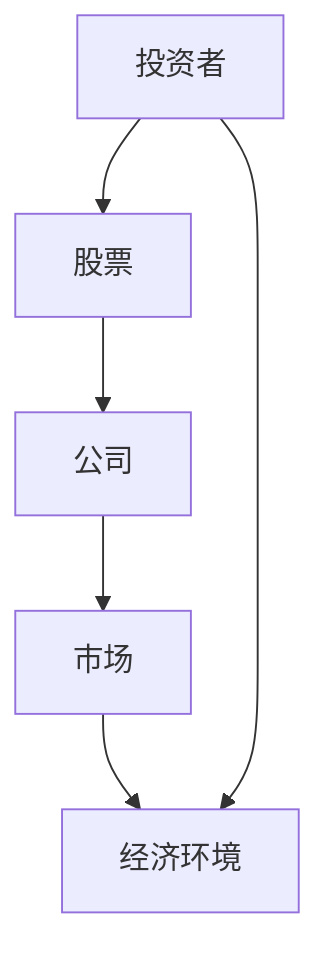
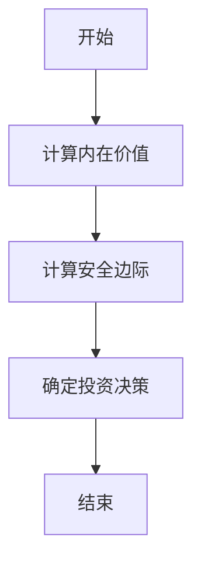
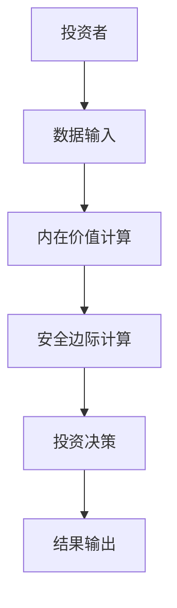

                 


# 格雷厄姆特价股票理论在新兴产业中的应用

> 关键词：格雷厄姆投资理论、新兴产业、价值投资、特价股票、内在价值、安全边际、股票估值

> 摘要：本文将深入探讨格雷厄姆的价值投资理论在新兴产业中的应用。通过分析新兴产业的特性，结合格雷厄姆的内在价值评估和安全边际概念，提出在新兴产业中寻找特价股票的方法和策略。文章将从理论基础、核心概念、算法原理、系统设计、项目实战等多个维度展开，结合实际案例，系统性地分析如何在新兴产业中应用格雷厄姆的理论，为投资者提供实用的指导和参考。

---

## 第1章: 格雷厄姆特价股票理论概述

### 1.1 格雷厄姆投资理论的起源与发展

#### 1.1.1 价值投资的鼻祖——本杰明·格雷厄姆
本杰明·格雷厄姆（Benjamin Graham）被誉为“价值投资之父”，他的投资理念深刻影响了包括沃伦·巴菲特在内的众多投资者。格雷厄姆的核心思想是基于股票的内在价值进行投资，而非关注市场波动。他的理论在20世纪初提出，至今仍被广泛应用于股票投资领域。

#### 1.1.2 格雷厄姆投资理论的核心思想
格雷厄姆的投资理论强调安全性和稳定性，主张以低于内在价值的价格买入股票，并长期持有。他认为市场情绪往往会导致股票价格偏离其真实价值，因此，投资者应关注企业的基本面，而非市场的短期波动。

#### 1.1.3 特价股票的概念与定义
特价股票是指那些市场价格低于其内在价值的股票。格雷厄姆认为，这类股票提供了足够的安全边际，使得投资者能够在市场波动中获得超额收益。

---

### 1.2 格雷厄姆特价股票理论的核心要素

#### 1.2.1 安全边际的定义与计算
安全边际是指股票的内在价值与市场价格之间的差额。它衡量了投资者在购买股票时所承担的风险。安全边际越大，投资的安全性越高。

公式：
$$ \text{安全边际} = \text{内在价值} - \text{市场价格} $$

#### 1.2.2 内在价值的评估方法
内在价值是基于企业未来现金流的现值计算得出的。格雷厄姆通常使用市盈率、市净率等指标来评估股票的价值。

公式：
$$ \text{内在价值} = \frac{\text{预期现金流}}{折现率} $$

#### 1.2.3 股票市场的周期性分析
格雷厄姆认为，股票市场具有周期性，投资者应在市场低迷时买入股票，在市场高涨时卖出股票。

---

## 第2章: 格雷厄姆特价股票理论的核心概念与联系

### 2.1 核心概念原理

#### 2.1.1 安全边际的数学模型
安全边际的计算公式：
$$ \text{安全边际} = \text{内在价值} - \text{市场价格} $$

#### 2.1.2 内在价值的评估公式
内在价值的计算公式：
$$ \text{内在价值} = \frac{\text{预期现金流}}{折现率} $$

#### 2.1.3 市场情绪对股票价格的影响
市场情绪对股票价格的影响可以通过投资者行为模型来分析，例如：
$$ \text{市场价格} = \text{内在价值} + \text{市场情绪偏差} $$

---

### 2.2 核心概念属性特征对比表格

| 概念       | 安全边际 | 内在价值 | 市场价格 |
|------------|----------|----------|----------|
| 定义       | 股票价格与内在价值的差距 | 股票的合理估值 | 当前市场价格 |
| 计算公式   | 安全边际 = 内在价值 - 市场价格 | 内在价值 = 股东权益 + 长期债务 | 市场价格 = 股票市价 |
| 应用场景   | 确定投资的安全性 | 确定股票的合理价格 | 确定股票的市场表现 |

---

### 2.3 ER实体关系图架构



---

## 第3章: 格雷厄姆特价股票理论在新兴产业中的应用

### 3.1 新兴产业的特点与投资机会

#### 3.1.1 新兴产业的定义与分类
新兴产业是指那些基于新技术、新商业模式或新市场需求而形成的产业。例如，人工智能、生物技术、绿色能源等。

#### 3.1.2 新兴产业的投资风险与收益
新兴产业通常具有高增长潜力，但也伴随着高风险。例如，技术失败、市场需求不足、竞争激烈等问题都可能影响企业的生存和发展。

#### 3.1.3 新兴产业中的潜在投资机会
新兴产业中的技术创新和市场需求往往能够带来超额收益。例如，电动汽车行业的快速发展为相关企业带来了巨大的投资机会。

---

### 3.2 格雷厄姆理论与新兴产业的结合

#### 3.2.1 格雷厄姆理论在新兴产业中的适用性
格雷厄姆的理论在新兴产业中仍然适用，但需要结合新兴产业的特点进行调整。例如，新兴产业中的企业通常具有较高的成长性，因此内在价值的计算需要考虑未来的高增长。

#### 3.2.2 新兴产业中的安全边际计算
由于新兴产业的高波动性，安全边际的计算需要更加谨慎。投资者需要选择那些具有强大竞争优势和良好财务状况的企业。

#### 3.2.3 新兴产业中的内在价值评估
新兴产业中的内在价值评估需要考虑企业的技术创新能力、市场前景和管理团队等因素。例如，可以通过市盈率和市净率的对比来评估股票的价值。

---

## 第4章: 格雷厄姆特价股票理论的算法原理

### 4.1 算法原理概述

#### 4.1.1 格雷厄姆投资模型的算法流程
1. 计算企业的内在价值。
2. 计算股票的安全边际。
3. 比较市场价格与内在价值，选择具有安全边际的股票进行投资。

#### 4.1.2 内在价值计算的数学模型
$$ V = \frac{E}{1 - g} $$
其中，$V$为内在价值，$E$为未来现金流的现值，$g$为增长率。

#### 4.1.3 安全边际的计算公式
$$ M = V - P $$
其中，$M$为安全边际，$V$为内在价值，$P$为市场价格。

---

### 4.2 算法原理的流程图



---

## 第5章: 格雷厄姆特价股票理论的系统分析与架构设计

### 5.1 系统分析

#### 5.1.1 问题场景介绍
在新兴产业中，投资者需要面对高波动性和高风险的市场环境。如何在这样的环境中应用格雷厄姆的理论，是一个具有挑战性的课题。

#### 5.1.2 系统功能设计
- 计算企业的内在价值。
- 计算股票的安全边际。
- 评估市场的整体风险。

---

### 5.2 系统架构设计



---

## 第6章: 项目实战

### 6.1 环境配置

#### 6.1.1 安装必要的工具
- Python
- 数据分析库（如Pandas、NumPy）
- 图表绘制工具（如Matplotlib、Seaborn）

---

### 6.2 核心实现

#### 6.2.1 计算内在价值
```python
def calculate_intrinsic_value(enterprise_value, growth_rate):
    return enterprise_value / (1 - growth_rate)
```

#### 6.2.2 计算安全边际
```python
def calculate_margin_of_safety(intrinsic_value, market_price):
    return intrinsic_value - market_price
```

---

### 6.3 应用解读与分析

#### 6.3.1 案例分析
以电动汽车行业为例，计算某家电动汽车企业的内在价值和安全边际。

---

## 第7章: 最佳实践与注意事项

### 7.1 小结
格雷厄姆的理论在新兴产业中仍然具有重要的指导意义。投资者需要结合新兴产业的特点，灵活运用格雷厄姆的理论，选择具有安全边际和内在价值的企业进行投资。

### 7.2 注意事项
- 新兴产业中的企业通常具有较高的成长性，但也伴随着较高的风险。
- 投资者需要关注企业的技术创新能力和市场前景。

---

## 作者：AI天才研究院/AI Genius Institute & 禅与计算机程序设计艺术 /Zen And The Art of Computer Programming

---

以上是《格雷厄姆特价股票理论在新兴产业中的应用》的文章目录和内容框架，涵盖了从理论基础到实际应用的各个方面，为投资者提供了全面的指导和参考。

