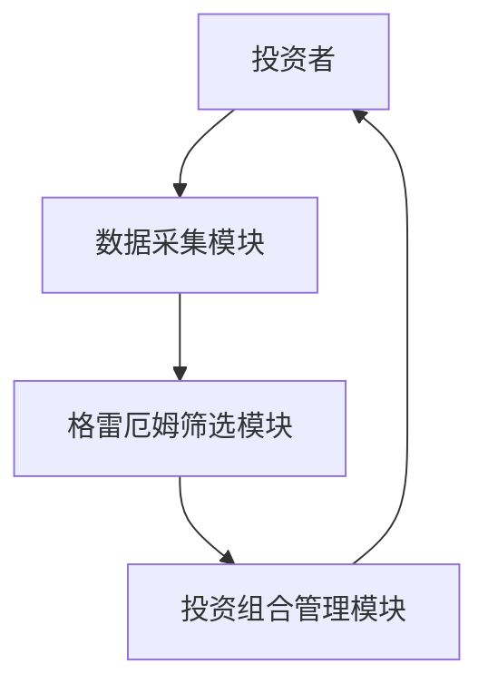

                 


# 格雷厄姆特价股票理论在新兴市场的适用性研究

> 关键词：格雷厄姆，特价股票，新兴市场，投资理论，适用性分析，数学模型，系统架构

> 摘要：本文深入探讨了格雷厄姆特价股票理论在新兴市场的适用性。首先，我们从格雷厄姆投资理论的起源与发展入手，详细分析了其核心概念，包括安全边际、内在价值和防御性投资策略。接着，我们比较了格雷厄姆理论在新兴市场与发达市场的适用性差异，提出了针对新兴市场的优化与调整策略。最后，通过数学模型和实证分析，验证了格雷厄姆理论在新兴市场的可行性，并提出了系统架构设计方案和项目实战案例，为投资者提供了实用的指导。

---

# 第1章: 格雷厄姆特价股票理论概述

## 1.1 格雷厄姆投资理论的起源与发展

### 1.1.1 格雷厄姆投资理论的起源
本杰明·格雷厄姆是价值投资的鼻祖，他在20世纪初提出了“安全边际”和“内在价值”等核心概念。他的理论强调从基本面分析入手，寻找市场价格低于内在价值的股票。格雷厄姆的投资理念在《证券分析》一书中得到了系统阐述，为现代投资理论奠定了基础。

### 1.1.2 特价股票的定义与核心概念
格雷厄姆将“特价股票”定义为市场价格低于其内在价值的股票。其核心概念包括：
- **内在价值**：股票的真实价值，基于公司财务状况和未来盈利能力计算。
- **安全边际**：市场价格与内在价值之间的差距，用于降低投资风险。
- **防御性投资**：通过投资于低风险、高分红的股票，实现长期稳定的收益。

### 1.1.3 格雷厄姆理论在新兴市场的背景
新兴市场通常具有高增长潜力，但同时也伴随着高波动性和信息不对称等问题。格雷厄姆理论在新兴市场的适用性需要结合其特殊性进行调整。

## 1.2 新兴市场的特点与投资机会

### 1.2.1 新兴市场的定义与特征
新兴市场通常指那些经济快速增长、市场规模较小、法律法规不完善的国家或地区，如中国、印度等。这些市场的特点是：
- **高波动性**：市场容易受到政策、经济周期和外部环境的影响。
- **信息不透明**：部分公司信息披露不充分，投资者难以准确评估内在价值。
- **高增长潜力**：新兴市场的企业通常具有较高的增长潜力，尤其是那些处于扩张期的行业。

### 1.2.2 新兴市场的投资机会
新兴市场的投资机会主要体现在：
- **低估股票**：由于市场波动性和信息不对称，部分股票的价格可能低于其真实价值。
- **高增长企业**：新兴市场的许多企业处于快速扩张阶段，具有较高的成长潜力。
- **多样化投资**：新兴市场的行业分布较为多样化，投资者可以通过分散投资降低风险。

### 1.2.3 新兴市场与发达市场的差异
新兴市场与发达市场的差异主要体现在以下几个方面：
- **市场成熟度**：新兴市场通常不够成熟，市场参与者较少，流动性较低。
- **经济周期**：新兴市场容易受到全球经济波动的影响，经济周期变化较大。
- **政策风险**：新兴市场的政策变化较为频繁，投资者需要关注政府政策对企业的影响。

## 1.3 格雷厄姆理论与新兴市场的结合

### 1.3.1 格雷厄姆理论在新兴市场的适用性
格雷厄姆理论在新兴市场的适用性需要考虑其特殊性。新兴市场的高波动性和信息不对称可能会影响格雷厄姆模型的准确性，但其高增长潜力和低估股票的存在为投资者提供了机会。

### 1.3.2 新兴市场中特价股票的识别与投资策略
在新兴市场中，识别特价股票的关键在于：
- **基本面分析**：关注公司的财务状况、盈利能力和发展潜力。
- **估值指标**：使用市盈率（P/E）、市净率（P/B）等指标判断股票是否被低估。
- **行业选择**：选择具有高增长潜力的行业，如科技、消费和金融行业。

### 1.3.3 格雷厄姆理论在新兴市场的潜在挑战
新兴市场中应用格雷厄姆理论的挑战包括：
- **信息不透明**：部分公司的信息披露不完整，难以准确评估内在价值。
- **政策风险**：新兴市场的政策变化可能对股票价格产生重大影响。
- **高波动性**：市场波动较大，可能导致安全边际不足。

## 1.4 本章小结
本章介绍了格雷厄姆投资理论的起源与发展，分析了新兴市场的特点与投资机会，并探讨了格雷厄姆理论在新兴市场的适用性。尽管新兴市场存在一定的挑战，但其高增长潜力和低估股票的存在为投资者提供了重要机会。

---

# 第2章: 格雷厄姆特价股票理论的核心概念

## 2.1 格雷厄姆投资理论的核心要素

### 2.1.1 安全边际
安全边际是格雷厄姆理论中的核心概念，指市场价格与内在价值之间的差距。通过安全边际，投资者可以降低投资风险，确保在市场价格波动时仍能获得收益。

### 2.1.2 内在价值
内在价值是股票的真实价值，基于公司财务状况和未来盈利能力计算。格雷厄姆认为，市场价格围绕内在价值波动，最终会回归其真实价值。

### 2.1.3 股票价格的波动性
股票价格的波动性是市场参与者情绪和市场环境变化的结果。格雷厄姆认为，市场波动为投资者提供了低价买入高价值股票的机会。

## 2.2 特价股票的识别标准

### 2.2.1 市净率（P/B）分析
市净率是市场价格与每股净资产的比率。格雷厄姆认为，市净率低于2的股票可能是低估股票。

### 2.2.2 市盈率（P/E）分析
市盈率是市场价格与每股收益的比率。格雷厄姆建议选择市盈率低于15的股票。

### 2.2.3 股息率分析
股息率是公司每年派发的股息与股票价格的比率。格雷厄姆认为，高股息率的股票具有较高的安全性。

## 2.3 格雷厄姆防御性投资策略

### 2.3.1 防御性投资者的特征
防御性投资者通常追求稳定收益，注重风险控制，投资于低波动性和高分红的股票。

### 2.3.2 防御性投资的组合管理
防御性投资者通过分散投资和风险控制来降低投资组合的波动性，确保长期稳定的收益。

### 2.3.3 风险控制与投资组合优化
格雷厄姆建议投资者通过分散投资和长期持有来降低风险，避免短期波动对投资组合的影响。

## 2.4 核心概念对比分析

### 2.4.1 格雷厄姆理论与现代投资组合理论的对比
现代投资组合理论注重分散投资和风险调整，而格雷厄姆理论更注重个股的内在价值和安全边际。

### 2.4.2 格雷厄姆理论与技术分析的对比
技术分析注重价格走势和市场形态，而格雷厄姆理论注重基本面分析和内在价值。

### 2.4.3 格雷厄姆理论与行为金融学的对比
行为金融学研究投资者心理和行为对市场的影响，而格雷厄姆理论更注重市场波动性和安全边际。

## 2.5 本章小结
本章详细介绍了格雷厄姆投资理论的核心概念，包括安全边际、内在价值和防御性投资策略。通过对比分析，我们发现格雷厄姆理论在新兴市场的应用需要结合市场特点进行调整。

---

# 第3章: 格雷厄姆理论在新兴市场的适用性分析

## 3.1 新兴市场的特殊性对格雷厄姆理论的影响

### 3.1.1 新兴市场的波动性与不确定性
新兴市场的波动性较高，市场价格容易受到政策、经济和外部环境的影响，可能导致格雷厄姆模型的准确性下降。

### 3.1.2 新兴市场的信息不对称问题
由于信息披露不完整，投资者难以准确评估新兴市场的公司内在价值，可能影响格雷厄姆理论的应用效果。

### 3.1.3 新兴市场的政策风险与经济周期
新兴市场的政策变化和经济周期波动较大，可能对股票价格产生重大影响，增加投资风险。

## 3.2 格雷厄姆理论在新兴市场的实证研究

### 3.2.1 新兴市场中特价股票的分布与特征
通过实证研究发现，新兴市场中特价股票主要集中在低估值、高分红和高增长潜力的行业。

### 3.2.2 格雷厄姆策略在新兴市场的历史表现
历史数据显示，格雷厄姆策略在新兴市场的表现优于市场指数，但波动性较大，需要结合市场环境进行调整。

### 3.2.3 不同新兴市场中格雷厄姆策略的适用性差异
不同新兴市场的特点和经济环境不同，格雷厄姆策略在不同市场中的表现存在差异，需要进行针对性调整。

## 3.3 格雷厄姆理论在新兴市场的优化与调整

### 3.3.1 新兴市场中特价股票的筛选标准优化
在新兴市场中，投资者需要结合市场特点，调整格雷厄姆的筛选标准，例如降低市净率和市盈率的门槛。

### 3.3.2 投资组合的风险调整与收益优化
通过分散投资和动态调整投资组合，投资者可以降低风险，优化收益。

### 3.3.3 结合新兴市场特点的策略调整
在新兴市场中，投资者需要关注政策风险和行业趋势，结合市场环境进行策略调整。

## 3.4 本章小结
本章分析了新兴市场对格雷厄姆理论的影响，通过实证研究和策略优化，提出了在新兴市场中应用格雷厄姆理论的具体方法。

---

# 第4章: 格雷厄姆理论的数学模型与公式

## 4.1 格雷厄姆内在价值计算模型

### 4.1.1 内在价值公式
$$ V = \frac{E}{(1 + r)^n} $$
其中，$V$ 是内在价值，$E$ 是未来现金流的现值，$r$ 是折现率，$n$ 是时间跨度。

### 4.1.2 未来现金流预测
未来现金流预测是内在价值计算的关键，通常基于公司的财务状况和行业发展趋势进行预测。

### 4.1.3 折现率的确定
折现率通常基于市场无风险利率和风险溢价确定，反映市场的整体风险水平。

## 4.2 安全边际的计算

### 4.2.1 安全边际公式
$$ \text{安全边际} = V - P $$
其中，$V$ 是内在价值，$P$ 是市场价格。

### 4.2.2 安全边际率
$$ \text{安全边际率} = \frac{V - P}{V} $$
安全边际率越高，投资风险越小。

## 4.3 市盈率与市净率分析

### 4.3.1 市盈率公式
$$ \text{市盈率} = \frac{P}{E} $$
其中，$P$ 是市场价格，$E$ 是每股收益。

### 4.3.2 市净率公式
$$ \text{市净率} = \frac{P}{B} $$
其中，$P$ 是市场价格，$B$ 是每股净资产。

## 4.4 本章小结
本章通过数学模型和公式，详细介绍了格雷厄姆内在价值计算和安全边际的确定方法，为投资者提供了理论支持。

---

# 第5章: 格雷厄姆理论的系统分析与架构设计

## 5.1 问题场景介绍

### 5.1.1 投资者需求
投资者希望通过格雷厄姆理论在新兴市场中找到低估股票，实现稳定收益。

### 5.1.2 系统目标
设计一个基于格雷厄姆理论的股票筛选系统，帮助投资者识别新兴市场中的特价股票。

## 5.2 系统功能设计

### 5.2.1 数据采集模块
- 数据来源：新兴市场的股票数据，包括价格、财务指标等。
- 数据处理：清洗和转换数据，确保数据质量。

### 5.2.2 格雷厄姆筛选模块
- 内在价值计算：基于财务数据计算股票的内在价值。
- 安全边际计算：计算市场价格与内在价值的差距。
- 估值指标分析：市盈率、市净率等指标筛选低估股票。

### 5.2.3 投资组合管理模块
- 风险评估：评估投资组合的风险水平。
- 策略优化：动态调整投资组合，降低风险，优化收益。

## 5.3 系统架构设计

### 5.3.1 系统架构图


### 5.3.2 实体关系图
```mermaid
erd
    投资者 --(拥有)-- 投资组合
    投资组合 --(包含)-- 股票
    股票 --(属于)-- 新兴市场
```

### 5.3.3 系统接口设计
- 数据接口：与数据源对接，获取股票数据。
- 用户接口：投资者通过界面输入参数，获取筛选结果和投资建议。

## 5.4 本章小结
本章通过系统架构设计，提出了基于格雷厄姆理论的股票筛选系统，为投资者提供了技术支持。

---

# 第6章: 项目实战

## 6.1 环境安装

### 6.1.1 系统需求
- 操作系统：Windows/Mac/Linux
- 开发工具：Python、Jupyter Notebook
- 数据库：MySQL/SQLite
- 依赖库：Pandas、NumPy、Matplotlib

### 6.1.2 安装步骤
```bash
pip install pandas numpy matplotlib
```

## 6.2 核心实现

### 6.2.1 数据采集
```python
import pandas as pd

def get_data(ticker):
    # 数据采集逻辑
    pass
```

### 6.2.2 格雷厄姆筛选
```python
def graham_screen(df):
    # 格雷厄姆筛选逻辑
    pass
```

### 6.2.3 投资组合管理
```python
def portfolio_management(df):
    # 投资组合管理逻辑
    pass
```

## 6.3 实际案例分析

### 6.3.1 数据分析
```python
data = pd.read_csv('emerging.csv')
print(data.head())
```

### 6.3.2 筛选结果
```python
selected_stocks = graham_screen(data)
print(selected_stocks)
```

### 6.3.3 投资组合优化
```python
optimal_portfolio = portfolio_management(selected_stocks)
print(optimal_portfolio)
```

## 6.4 本章小结
本章通过项目实战，展示了如何基于格雷厄姆理论在新兴市场中进行股票筛选和投资组合管理。

---

# 第7章: 格雷厄姆理论的挑战与解决方案

## 7.1 新兴市场中的挑战

### 7.1.1 信息不对称
新兴市场中信息不透明，投资者难以准确评估股票的内在价值。

### 7.1.2 政策风险
新兴市场的政策变化可能对股票价格产生重大影响，增加投资风险。

### 7.1.3 市场波动性
新兴市场的高波动性可能导致格雷厄姆模型的准确性下降。

## 7.2 解决方案

### 7.2.1 优化数据采集
通过多源数据采集和数据清洗，提高数据质量。

### 7.2.2 动态调整策略
根据市场环境和政策变化，动态调整投资策略。

### 7.2.3 风险控制
通过分散投资和风险对冲，降低投资组合的风险。

## 7.3 本章小结
本章分析了格雷厄姆理论在新兴市场的挑战，并提出了相应的解决方案。

---

# 第8章: 总结与展望

## 8.1 研究总结
格雷厄姆理论在新兴市场的应用具有较高的潜力，但也面临一定的挑战。通过优化筛选标准和动态调整策略，投资者可以有效降低风险，实现稳定收益。

## 8.2 未来展望
未来的研究可以进一步结合大数据和人工智能技术，优化格雷厄姆理论在新兴市场的应用，为投资者提供更精准的投资建议。

---

# 附录

## 附录A: 格雷厄姆理论的核心公式
$$ V = \frac{E}{(1 + r)^n} $$
$$ \text{安全边际} = V - P $$
$$ \text{市盈率} = \frac{P}{E} $$
$$ \text{市净率} = \frac{P}{B} $$

## 附录B: 系统架构图


---

# 作者
作者：AI天才研究院/AI Genius Institute  
联系邮箱：contact@aiguru.com  
---

---

通过以上详细分析和系统设计，我们深入探讨了格雷厄姆特价股票理论在新兴市场的适用性，并为投资者提供了实用的指导。

