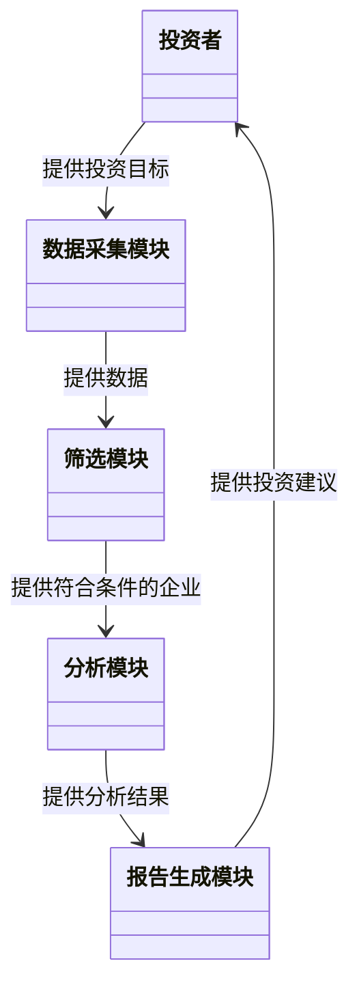
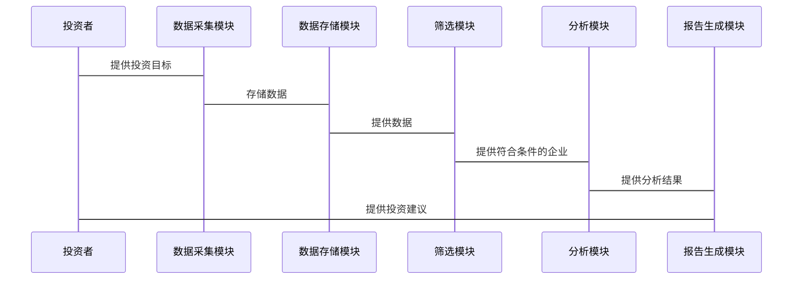

                 


# 格雷厄姆特价股票理论在社会企业家投资中的运用

> 关键词：格雷厄姆，特价股票理论，社会企业家，投资，价值投资

> 摘要：本文深入探讨了格雷厄姆的价值投资理论及其在社会企业家投资中的应用。通过分析社会企业的定义、特点以及投资动机，结合格雷厄姆的选股标准，本文提出了一套适用于社会企业家投资的策略，并通过实例分析验证了其可行性。

---

## 第一部分：格雷厄姆特价股票理论与社会企业家投资的背景

### 第1章：格雷厄姆特价股票理论概述

#### 1.1 格雷厄姆投资理论的核心理念

- **1.1.1 价值投资的基本原则**
  - 投资的本质是寻找“烟屁股”，即价格远低于内在价值的股票。
  - 价值投资强调安全边际，即买入价格应低于内在价值的一定折扣。
  - 长期投资是价值投资的核心，市场的短期波动不应影响长期决策。

- **1.1.2 特价股票的定义与特征**
  - 特价股票是指市场价格低于其内在价值的股票。
  - 具有低市盈率、低市净率和高股息率的特点。
  - 通常出现在市场低迷或企业困境时期。

- **1.1.3 格雷厄姆投资策略的历史演变**
  - 格雷厄姆的投资策略起源于20世纪初，经历了从“捡烟蒂”到更注重企业基本面的演变。
  - 他的理论对巴菲特等现代投资者产生了深远影响。

#### 1.2 社会企业家与投资的结合

- **1.2.1 社会企业的定义与特点**
  - 社会企业是以追求社会价值为目标的企业，其核心目标是解决社会问题。
  - 社会企业的特点是兼顾经济效益和社会影响力。

- **1.2.2 社会企业家投资的动机与目标**
  - 投资者可能出于社会责任感，希望通过投资实现社会价值。
  - 社会企业家投资的目标是支持社会企业发展，同时获取财务回报。

- **1.2.3 社会投资与传统投资的差异**
  - 社会投资更注重社会影响力，而传统投资更关注财务回报。
  - 社会投资的风险和回报结构可能更为复杂。

---

### 第2章：格雷厄姆理论在社会企业投资中的应用背景

#### 2.1 当前社会企业的投资环境

- **2.1.1 社会企业的市场现状**
  - 社会企业在全球范围内的发展迅速，尤其是在环保、教育和医疗领域。
  - 社会企业的数量和影响力在不断增加。

- **2.1.2 投资者对社会企业的关注点**
  - 投资者关注企业的社会影响力和财务可持续性。
  - 社会企业的透明度和治理结构是投资者的重要考量因素。

- **2.1.3 格雷厄姆理论的适用性分析**
  - 格雷厄姆理论强调安全边际和内在价值，适用于社会企业投资。
  - 社会企业的特殊性可能需要对格雷厄姆的选股标准进行调整。

#### 2.2 格雷厄姆理论与社会企业投资的契合点

- **2.2.1 价值投资与社会价值的结合**
  - 价值投资的核心理念可以应用于社会企业，寻找具有社会价值的特价股票。
  - 社会价值的评估需要引入新的指标，如社会影响力指数。

- **2.2.2 社会企业财务指标的特殊性**
  - 社会企业的财务指标可能与传统企业不同，需要调整评估标准。
  - 需要关注社会企业的成本效益和社会影响力。

- **2.2.3 投资者社会责任的体现**
  - 格雷厄姆的价值投资理念与投资者的社会责任相契合。
  - 通过投资社会企业，投资者可以实现财务回报和社会价值的双重目标。

---

## 第二部分：格雷厄姆理论的核心概念与社会企业投资的联系

### 第3章：格雷厄姆理论的核心概念解析

#### 3.1 格雷厄姆理论的主要原理

- **3.1.1 内在价值的计算方法**
  - 内在价值是企业未来现金流的现值。
  - 使用格雷厄姆的公式：内在价值 = (年收益 × 4.25) ÷ 8.5
  - 例如，假设一家企业年收益为100万元，其内在价值为 $42.5万元。

- **3.1.2 安全边际的重要性**
  - 安全边际 = 内在价值 - 市场价格
  - 例如，如果内在价值为100万元，市场价格为80万元，安全边际为20万元。

- **3.1.3 股票投资的长期视角**
  - 长期投资是价值投资的核心，避免短期波动的影响。
  - 通过长期持有优质股票，投资者可以获得稳定的回报。

#### 3.2 格雷厄姆理论与现代投资理论的对比

- **3.2.1 主要投资策略的对比分析**
  | 理论 | 格雷厄姆价值投资 | 现代投资组合理论 |
  |------|------------------|------------------|
  | 核心 | 内在价值评估     | 分散化投资       |
  | 重点 | 个股选择         | 组合优化         |

- **3.2.2 格雷厄姆理论的独特性**
  - 重视个股的内在价值，而非市场趋势。
  - 强调安全边际和长期投资。

- **3.2.3 理论的局限性与改进方向**
  - 格雷厄姆理论适用于稳定的市场环境，但在动荡时期可能表现不佳。
  - 需要结合现代投资理论，如风险管理，进行优化。

---

### 第4章：社会企业投资的核心概念与特征

#### 4.1 社会企业的核心特征

- **4.1.1 社会使命与经济效益的结合**
  - 社会企业既有社会使命，又需要实现经济效益。
  - 例如，环保企业通过减少污染实现社会价值，同时获得经济收益。

- **4.1.2 社会影响力的评估标准**
  - 社会影响力包括企业的社会贡献和影响力。
  - 可以使用社会影响力指数（如B Corp认证）进行评估。

- **4.1.3 社会企业的财务透明度**
  - 社会企业需要公开其社会和财务表现。
  - 透明度是投资者评估社会企业的关键因素。

#### 4.2 社会企业投资的特殊性

- **4.2.1 投资目标的多样性**
  - 社会企业投资可能同时追求财务回报和社会价值。
  - 投资者需要明确其投资目标和优先级。

- **4.2.2 投资风险的特殊性**
  - 社会企业可能面临更高的社会风险和市场风险。
  - 需要通过多元化投资降低风险。

- **4.2.3 投资回报的多维性**
  - 社会企业投资的回报可能包括财务回报和社会影响力。
  - 投资者需要综合评估多维回报。

---

### 第5章：格雷厄姆理论与社会企业投资的联系

#### 5.1 格雷厄姆理论在社会企业投资中的适用性

- **5.1.1 价值投资与社会价值的结合**
  - 将格雷厄姆的价值投资理念应用于社会企业，寻找具有社会价值的特价股票。
  - 例如，投资一家环保企业，其市场价格远低于其社会价值。

- **5.1.2 格雷厄姆选股标准的调整**
  - 需要引入新的指标，如社会影响力指数，调整选股标准。
  - 例如，除了市盈率和市净率，还需要考虑社会影响力。

- **5.1.3 社会企业投资的长期视角**
  - 长期投资是实现社会价值和财务回报的关键。
  - 通过长期持有优质社会企业股票，投资者可以获得稳定的回报。

#### 5.2 格雷厄姆理论在社会企业投资中的创新应用

- **5.2.1 社会影响力评估的引入**
  - 将社会影响力作为评估社会企业的重要指标。
  - 例如，使用B Corp认证评估企业的社会表现。

- **5.2.2 安全边际的重新定义**
  - 安全边际不仅考虑财务因素，还需要考虑社会因素。
  - 例如，社会企业需要具备足够的社会影响力和财务稳定性。

- **5.2.3 投资组合的优化**
  - 通过多元化投资降低风险，同时实现社会价值。
  - 例如，投资组合中包含不同类型的社会企业，覆盖环保、教育等领域。

---

## 第三部分：系统分析与架构设计

### 第6章：系统分析与架构设计方案

#### 6.1 问题场景介绍

- 投资者需要一个系统来筛选符合格雷厄姆理论和具有社会价值的股票。
- 系统需要结合财务指标和社会影响力指标，提供综合评估。

#### 6.2 项目介绍

- 开发一个基于格雷厄姆理论的社会企业投资筛选系统。
- 系统功能包括数据采集、筛选、分析和报告生成。

#### 6.3 系统功能设计（领域模型Mermaid类图）



#### 6.4 系统架构设计（Mermaid架构图）


#### 6.5 系统接口设计

- 数据接口：与金融数据源（如Yahoo Finance）对接。
- 用户接口：提供投资者输入需求和输出投资建议。

#### 6.6 系统交互（Mermaid序列图）



---

## 第四部分：项目实战

### 第7章：项目实战

#### 7.1 环境安装

- 安装Python和相关库（如pandas、numpy、requests）。
- 安装数据可视化工具（如Matplotlib或Seaborn）。

#### 7.2 核心代码实现

```python
import pandas as pd
import numpy as np

def calculate_intrinsic_value(revenue):
    return (revenue * 4.25) / 8.5

def calculate_margin_of_safety(current_price, intrinsic_value):
    return intrinsic_value - current_price

# 示例数据
data = {
    '公司名称': ['公司A', '公司B', '公司C'],
    '年收益': [100, 150, 200],
    '当前价格': [50, 60, 70]
}

df = pd.DataFrame(data)

# 计算内在价值和安全边际
df['内在价值'] = df['年收益'].apply(lambda x: calculate_intrinsic_value(x))
df['安全边际'] = df.apply(lambda row: calculate_margin_of_safety(row['当前价格'], row['内在价值']), axis=1)

print(df)
```

#### 7.3 实际案例分析

- 以环保企业为例，计算其内在价值和安全边际。
- 分析其社会影响力，决定是否符合投资标准。

#### 7.4 项目小结

- 通过代码实现格雷厄姆理论在社会企业投资中的应用。
- 强调数据收集和分析的重要性。
- 提醒投资者在实际操作中需考虑更多因素。

---

## 第五部分：最佳实践、小结、注意事项与拓展阅读

### 第8章：最佳实践与小结

#### 8.1 最佳实践 tips

- **数据收集**：确保数据的准确性和全面性。
- **模型优化**：根据实际情况调整评估标准。
- **风险管理**：分散投资，降低风险。

#### 8.2 小结

- 格雷厄姆的价值投资理念可以成功应用于社会企业投资。
- 通过结合社会影响力评估，投资者可以实现财务回报和社会价值的双重目标。

### 第9章：注意事项与拓展阅读

#### 9.1 注意事项

- **数据质量**：社会企业数据可能不如传统企业数据丰富。
- **模型局限性**：格雷厄姆理论在社会企业投资中可能需要调整。
- **市场波动**：需关注市场波动对投资的影响。

#### 9.2 拓展阅读

- 阅读格雷厄姆的经典著作《聪明的投资者》。
- 关注社会投资领域的最新研究和实践。

---

## 作者：AI天才研究院/AI Genius Institute & 禅与计算机程序设计艺术/Zen And The Art of Computer Programming

---

以上是完整的大纲内容，您可以根据需要进一步扩展每一部分的内容，添加具体的数据、案例和详细分析。

