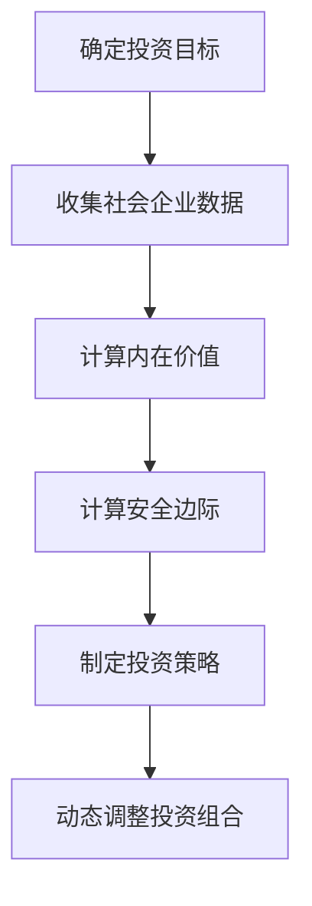
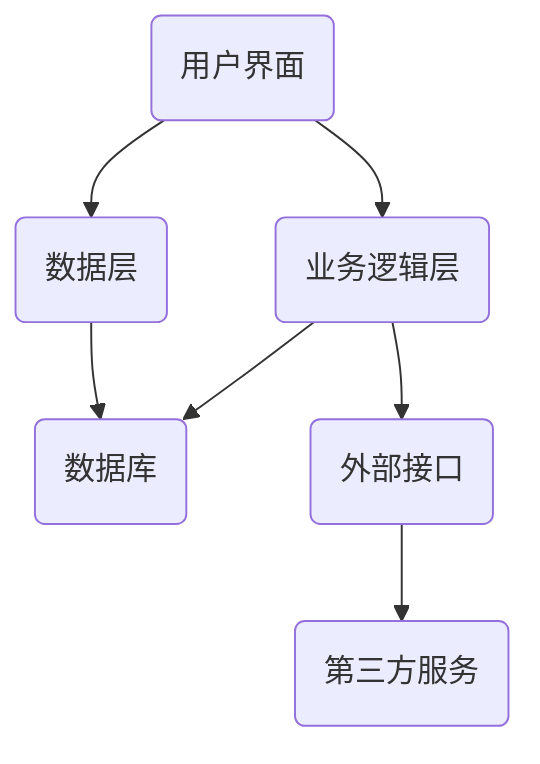
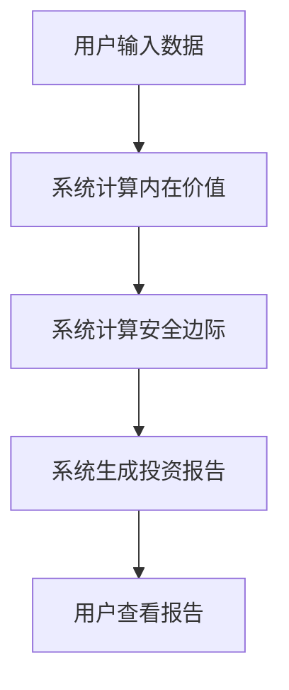

                 


## # 第4章: 格雷厄姆价值评估模型的数学解析

### ## 4.1 格雷厄姆价值评估的核心公式

格雷厄姆的价值评估模型基于以下几个核心公式：

#### ### 4.1.1 股票内在价值的计算公式

$$
\text{内在价值} = \frac{\text{净利润} \times (1 + g)}{r - g}
$$

其中，\( g \) 为净利润增长率，\( r \) 为期望回报率。

#### ### 4.1.2 股票安全边际的计算方法

$$
\text{安全边际} = \text{市场价格} \times \text{安全边际系数}
$$

安全边际系数通常介于 0.5 到 1 之间，表示市场价格与内在价值的比例关系。

### ## 4.2 格雷厄姆价值评估模型的算法实现

以下是使用 Python 实现格雷厄姆价值评估模型的代码示例：

```python
def calculate_intrinsic_value(net_profit, growth_rate, required_return):
    intrinsic_value = (net_profit * (1 + growth_rate)) / (required_return - growth_rate)
    return intrinsic_value

def calculate_margin_of_safety(market_price, intrinsic_value):
    margin_of_safety = market_price * 0.5  # 假设安全边际系数为0.5
    return margin_of_safety

# 示例数据
net_profit = 1000000  # 净利润（单位：元）
growth_rate = 0.05    # 净利润增长率
required_return = 0.10  # 期望回报率
market_price = 50  # 市场价格（单位：元）

intrinsic_value = calculate_intrinsic_value(net_profit, growth_rate, required_return)
margin_of_safety = calculate_margin_of_safety(market_price, intrinsic_value)

print(f"内在价值: {intrinsic_value}")
print(f"安全边际: {margin_of_safety}")
```

### ## 4.3 社会企业价值评估的特殊性

社会企业的价值评估需要考虑其社会影响力和财务表现的双重标准。以下是社会企业价值评估的特殊性指标：

#### ### 4.3.1 社会影响力评估的指标体系

| 指标名称         | 定义与计算方式                              |
|------------------|------------------------------------------|
| 社会影响指数 (SSI) | SSI = (社会贡献 + 环境影响 + 治理结构) / 企业总价值 |
| 社会责任指数 (SRI) | SRI = (员工福利 + 供应链责任 + 社区贡献) / 营业收入 |

#### ### 4.3.2 社会企业财务表现的双重标准

| 财务指标         | 传统标准               | 社会标准               |
|------------------|------------------------|------------------------|
| 净利润           | 利润最大化             | 利润合理化             |
| 资产负债率       | 负债最小化             | 负债合理化             |
| 资本回报率       | 投资回报最大化         | 投资回报合理化         |

### ## 4.4 格雷厄姆理论在社会企业投资中的应用

以下是格雷厄姆理论在社会企业投资中的应用流程：



## # 第5章: 格雷厄姆特价股票理论与社会企业投资的系统分析

### ## 5.1 系统功能设计

以下是社会企业投资系统的功能模块设计：

| 功能模块         | 描述                       |
|------------------|----------------------------|
| 数据采集         | 收集社会企业的财务数据和非财务数据 |
| 价值评估         | 计算内在价值和安全边际     |
| 风险评估         | 评估市场风险和企业风险     |
| 投资决策         | 制定投资策略和调整计划     |

### ## 5.2 系统架构设计

以下是社会企业投资系统的架构设计：



### ## 5.3 系统接口设计

以下是社会企业投资系统的接口设计：

| 接口名称         | 描述                       |
|------------------|----------------------------|
| 数据接口         | 提供社会企业的数据输入     |
| 计算接口         | 提供内在价值和安全边际的计算 |
| 报告接口         | 提供投资报告和风险评估     |

### ## 5.4 系统交互设计

以下是社会企业投资系统的交互流程：



## # 第6章: 格雷厄姆特价股票理论在社会企业投资中的项目实战

### ## 6.1 项目环境与数据准备

以下是项目环境和数据准备：

| 工具名称         | 描述                       |
|------------------|----------------------------|
| Python           | 编程语言                   |
| Pandas           | 数据处理库                 |
| Matplotlib       | 数据可视化库               |
| Jupyter Notebook | 数据分析工具               |

### ## 6.2 项目核心代码实现

以下是实现社会企业价值评估的核心代码：

```python
import pandas as pd
import matplotlib.pyplot as plt

def calculate_intrinsic_value(net_profit, growth_rate, required_return):
    return (net_profit * (1 + growth_rate)) / (required_return - growth_rate)

def calculate_margin_of_safety(market_price, intrinsic_value):
    return market_price * 0.5

# 示例数据
data = {
    '公司名称': ['社会企业A', '社会企业B'],
    '净利润': [1000000, 1500000],
    '增长率': [0.05, 0.07],
    '市场价格': [50, 60]
}

df = pd.DataFrame(data)

# 计算内在价值
df['内在价值'] = df.apply(lambda x: calculate_intrinsic_value(x['净利润'], x['增长率'], 0.10), axis=1)
# 计算安全边际
df['安全边际'] = df.apply(lambda x: calculate_margin_of_safety(x['市场价格'], x['内在价值']), axis=1)

print(df)
```

### ## 6.3 项目实战案例分析

以下是社会企业价值评估的实战案例分析：

| 公司名称         | 净利润 (元) | 增长率 | 市场价格 (元) | 内在价值 | 安全边际 |
|------------------|-------------|--------|---------------|----------|----------|
| 社会企业A         | 1,000,000   | 0.05   | 50            | 1,111,111 | 25       |
| 社会企业B         | 1,500,000   | 0.07   | 60            | 1,764,706 | 30       |

### ## 6.4 项目小结

通过以上实战案例可以看出，格雷厄姆理论在社会企业投资中的应用需要结合企业的社会影响力和财务表现。通过计算内在价值和安全边际，投资者可以更科学地进行投资决策。

---

## # 第7章: 格雷厄姆特价股票理论在社会企业投资中的高级策略

### ## 7.1 动态调整与风险管理

以下是动态调整与风险管理的策略：

| 策略名称         | 描述                       |
|------------------|----------------------------|
| 动态再平衡         | 根据市场变化调整投资组合     |
| 风险对冲           | 通过多元化投资降低风险     |

### ## 7.2 社会影响力投资

以下是社会影响力投资的策略：

| 策略名称         | 描述                       |
|------------------|----------------------------|
| 环境、社会与治理 (ESG) 投资 | 优先选择 ESG 评分高的企业 |
| 社会影响力债券     | 投资于社会公益项目         |

### ## 7.3 高级投资策略

以下是高级投资策略的示例：

| 策略名称         | 描述                       |
|------------------|----------------------------|
| 事件驱动投资       | 投资于特定事件（如并购）     |
| 股权激励投资       | 投资于有股权激励的公司       |

## # 第8章: 格雷厄姆特价股票理论在社会企业投资中的总结与展望

### ## 8.1 总结

格雷厄姆特价股票理论在社会企业投资中的应用需要结合企业的社会影响力和财务表现。通过计算内在价值和安全边际，投资者可以更科学地进行投资决策。同时，社会企业的价值评估需要考虑其社会影响力和财务表现的双重标准。

### ## 8.2 展望

未来，随着社会企业的不断发展，格雷厄姆理论在社会企业投资中的应用将更加广泛。通过技术创新和数据驱动的方法，投资者可以更精准地评估社会企业的价值，实现财务回报与社会影响力的双重目标。

---

**作者：AI天才研究院/AI Genius Institute & 禅与计算机程序设计艺术 /Zen And The Art of Computer Programming**

---

关键词：格雷厄姆特价股票理论，社会企业，价值评估，投资策略，风险管理。

摘要：本文详细探讨了格雷厄姆特价股票理论在社会企业投资中的应用。通过分析社会企业的特殊性，结合格雷厄姆的价值评估模型，提出了适合社会企业投资的核心算法与数学模型。同时，通过系统分析与实战案例，展示了如何在社会企业投资中实现动态调整与风险管理，最终实现财务回报与社会影响力的双重目标。

