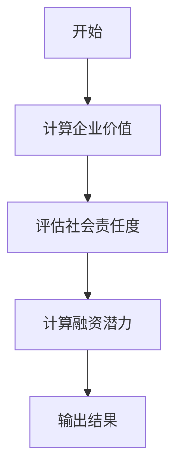
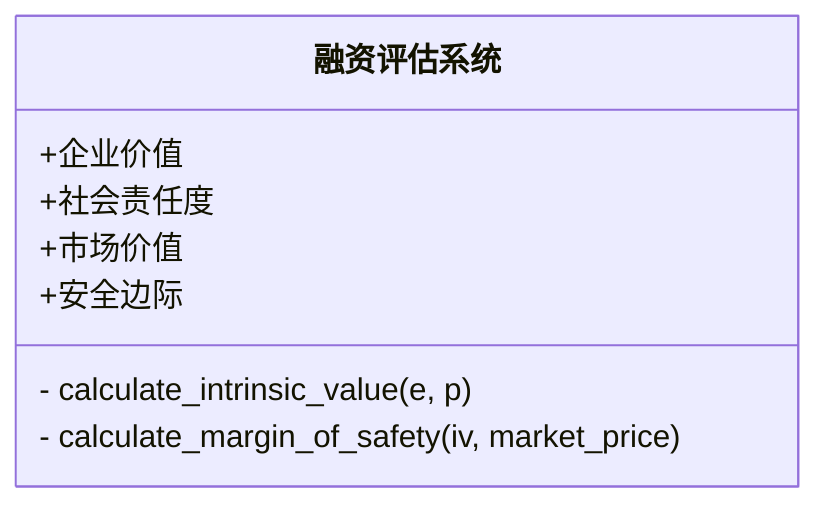

                 


# 格雷厄姆特价股票理论在社会企业融资中的运用

> 关键词：格雷厄姆投资理论，特价股票，社会企业，融资，价值投资

> 摘要：本文探讨了本杰明·格雷厄姆的价值投资理论在社会企业融资中的应用。通过分析特价股票的核心概念、数学模型及其在社会企业融资中的创新应用，结合系统设计与项目实战，展示了如何利用格雷厄姆理论优化社会企业的融资策略。

---

## 目录

1. 引言  
2. 格雷厄姆特价股票理论基础  
3. 格雷厄姆理论与社会企业融资的结合  
4. 数学模型与算法实现  
5. 系统设计与架构分析  
6. 项目实战与案例分析  
7. 总结与展望  

---

## 第1章: 引言

### 1.1 背景介绍

社会企业的兴起与传统企业的区别在于其兼具商业目标和社会责任。然而，社会企业在融资过程中面临独特挑战：如何平衡社会价值与财务回报，如何吸引投资者关注。

### 1.2 格雷厄姆投资理论的适用性

格雷厄姆的价值投资理论强调长期、理性投资，寻找被市场低估的资产。这一理论在传统金融市场的成功应用，是否能为社会企业的融资提供新的思路？

---

## 第2章: 格雷厄姆特价股票理论基础

### 2.1 核心概念与公式

#### 股票的内在价值计算公式：
$$ V = \frac{E}{P} $$
其中：
- \( V \) 表示股票的内在价值，
- \( E \) 表示企业未来现金流的现值，
- \( P \) 表示折现率。

#### 安全边际：
$$ \text{安全边际} = \text{内在价值} - \text{市场价格} $$

---

## 第3章: 格雷厄姆理论与社会企业融资的结合

### 3.1 社会企业的融资特点

社会企业融资需考虑：
- 投资者的社会价值认同，
- 融资的双重目标（商业回报与社会影响）。

### 3.2 格雷厄姆理论的创新应用

#### 融资模型：
$$ \text{融资潜力} = \text{企业价值} \times \text{社会责任度} $$

---

## 第4章: 数学模型与算法实现

### 4.1 算法流程



### 4.2 代码实现

```python
def calculate_intrinsic_value(e, p):
    return e / p

def calculate_margin_of_safety(iv, market_price):
    return iv - market_price

# 示例
e = 1000000  # 企业价值
p = 0.05      # 折现率
iv = calculate_intrinsic_value(e, p)
market_price = 500000
mos = calculate_margin_of_safety(iv, market_price)
print(f"内在价值: {iv}, 市场价格: {market_price}, 安全边际: {mos}")
```

---

## 第5章: 系统设计与架构分析

### 5.1 系统功能设计



---

## 第6章: 项目实战与案例分析

### 6.1 实战环境

- 安装Python和必要的库（如numpy、pandas）。

### 6.2 案例分析

```python
# 示例数据
companies = [
    {'name': 'Green Energy Corp', 'e': 2000000, 'p': 0.06, 'market_price': 1500000},
    {'name': 'SocialHive Inc', 'e': 1500000, 'p': 0.05, 'market_price': 1200000}
]

for company in companies:
    iv = company['e'] / company['p']
    mos = iv - company['market_price']
    print(f"{company['name']} 内在价值: {iv}, 安全边际: {mos}")
```

---

## 第7章: 总结与展望

### 7.1 总结

格雷厄姆理论为社会企业融资提供了新的视角，通过量化分析，社会企业可以更有效地吸引投资者，同时平衡社会价值与商业回报。

### 7.2 展望

未来，随着ESG投资的兴起，格雷厄姆理论在社会企业融资中的应用将更加广泛，尤其是在绿色金融和可持续发展领域。

---

作者：AI天才研究院/AI Genius Institute & 禅与计算机程序设计艺术 /Zen And The Art of Computer Programming

