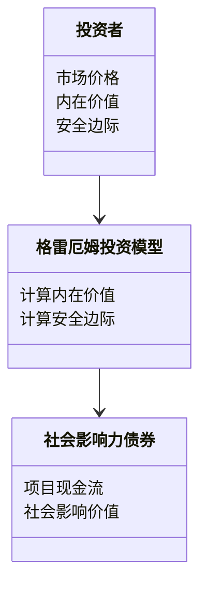
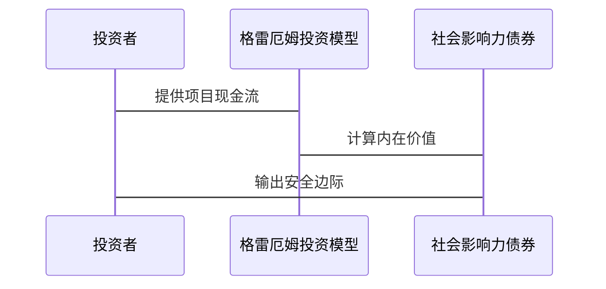

                 


# 格雷厄姆特价股票理论在社会影响力债券中的新应用

**关键词**：格雷厄姆、特价股票理论、社会影响力债券、价值投资、社会责任投资

**摘要**：本文探讨了本杰明·格雷厄姆的经典投资理论——特价股票理论——在社会影响力债券中的创新应用。通过分析社会影响力债券的特性，结合格雷厄姆的价值投资理念，提出了一种新的评估框架，并通过实际案例验证了该方法的有效性。本文旨在为投资者提供一种在追求财务回报的同时，实现社会价值的新型投资策略。

---

# 第1章: 格雷厄姆特价股票理论的核心概念与背景

## 1.1 格雷厄姆投资理论的起源与发展

### 1.1.1 投资学鼻祖本杰明·格雷厄姆的生平简介
本杰明·格雷厄姆（Benjamin Graham）被誉为“价值投资之父”，他于1924年出版的经典著作《证券分析》奠定了现代价值投资的理论基础。格雷厄姆的投资理念强调安全边际和内在价值，主张以低于企业内在价值的价格买入股票，从而在市场波动中实现稳健收益。

### 1.1.2 特价股票理论的核心思想
格雷厄姆的特价股票理论认为，股票的内在价值可以通过对企业未来现金流的折现来计算。他提出了“安全边际”的概念，即市场价格与内在价值之间的差异，这一差异为投资者提供了保护，避免因市场波动而遭受损失。

### 1.1.3 格雷厄姆投资理论的现代意义
尽管格雷厄姆的理论诞生于20世纪初，但其核心思想至今仍被广泛应用于金融投资领域。尤其是在当前全球金融市场波动加剧、投资者寻求稳健回报的背景下，格雷厄姆的理论提供了重要的指导意义。

---

## 1.2 社会影响力债券的基本概念与特点

### 1.2.1 社会影响力债券的定义与分类
社会影响力债券（Social Impact Bonds, SIBs）是一种创新型金融工具，其目的是通过投资于具有社会影响力的项目，同时为投资者提供财务回报。与传统的债券不同，SIBs的收益与项目的社会影响直接相关。

### 1.2.2 社会影响力债券与传统债券的区别
- **收益来源**：传统债券的收益主要来自发行者的信用，而社会影响力债券的收益与项目的社会影响挂钩。
- **风险特征**：社会影响力债券的风险通常与项目的执行效果相关，而非单纯的信用风险。
- **目标**：传统债券注重财务回报，而社会影响力债券强调社会价值与财务回报的结合。

### 1.2.3 社会影响力债券的市场现状与发展前景
近年来，全球范围内对社会影响力债券的投资兴趣显著增加。尤其是在气候变化、教育、医疗等领域，社会影响力债券为投资者提供了实现社会责任投资（ESG）目标的途径。

---

## 1.3 格雷厄姆理论与社会影响力债券的结合背景

### 1.3.1 当前金融市场中的社会责任投资趋势
随着全球对可持续发展的关注增加，社会责任投资（ESG）逐渐成为主流。投资者不仅关注财务回报，还关注投资对社会和环境的影响。

### 1.3.2 格雷厄姆理论在社会责任投资中的潜在价值
格雷厄姆的理论强调内在价值和安全边际，这与社会责任投资的目标高度契合。通过将格雷厄姆的理论应用于社会影响力债券，投资者可以在实现社会价值的同时，获得稳健的财务回报。

### 1.3.3 社会影响力债券与价值投资理念的契合点
社会影响力债券的特性——追求长期稳健回报和注重社会影响——与格雷厄姆的价值投资理念高度一致。两者结合可以为投资者提供一种全新的投资策略。

---

# 第2章: 格雷厄姆特价股票理论的核心原理与分析框架

## 2.1 格雷厄姆投资理论的数学模型与公式

### 2.1.1 格雷厄姆的内在价值计算公式
$$ V = \frac{E}{4.41} $$
其中，\( V \) 为内在价值，\( E \) 为企业未来7年的平均收益。

### 2.1.2 格雷厄姆的安全边际概念
$$ \text{安全边际} = \text{市场价格} - \text{内在价值} $$

---

## 2.2 格雷厄姆投资策略的ER实体关系图

```mermaid
er
actor: 投资者
actor --> entity: 格雷厄姆投资模型
entity --> entity: 市场价格
entity --> entity: 内在价值
entity --> entity: 安全边际
```

---

## 2.3 格雷厄姆理论在社会影响力债券中的应用逻辑

### 2.3.1 社会影响力债券的内在价值评估
社会影响力债券的内在价值可以通过对项目未来现金流的折现来计算，同时考虑其社会影响带来的额外价值。

### 2.3.2 社会影响力债券的安全边际计算
$$ \text{安全边际} = \text{市场价格} - \text{内在价值} $$

### 2.3.3 社会影响力债券的风险与收益平衡
通过格雷厄姆的理论，投资者可以在评估社会影响力债券时，同时关注其财务风险和社会风险，从而实现风险与收益的平衡。

---

# 第3章: 社会影响力债券的市场分析与案例研究

## 3.1 社会影响力债券的市场现状分析

### 3.1.1 全球社会影响力债券市场的规模与增长
近年来，全球社会影响力债券市场规模快速增长，尤其是在发达国家和发展中国家的基础设施、教育和环保领域。

### 3.1.2 主要国家与地区的社会影响力债券发展情况
- **美国**：社会影响力债券市场较为成熟，尤其是在教育和医疗领域。
- **欧洲**：注重气候变化和社会公平领域的社会影响力债券。
- **亚洲**：随着经济快速发展，社会影响力债券在基础设施和环保领域的应用逐渐增加。

---

## 3.2 社会影响力债券的典型案例分析

### 3.2.1 某国基础设施建设债券案例
某国政府发行的社会影响力债券用于城市轨道交通建设，通过吸引私人资本，实现基础设施建设和社会资本回报的双赢。

### 3.2.2 某国教育投资债券案例
某国政府通过社会影响力债券筹集资金，用于改善农村地区教育设施，提升教育水平。

### 3.2.3 某国环境保护债券案例
某国政府发行的社会影响力债券用于支持可再生能源项目，减少碳排放，应对气候变化。

---

## 3.3 格雷厄姆理论在社会影响力债券中的应用案例

### 3.3.1 案例背景
某国计划发行一批社会影响力债券，用于支持环保项目。投资者希望以格雷厄姆的理论为基础，评估这些债券的内在价值和安全边际。

### 3.3.2 评估过程
1. **计算内在价值**：通过对企业未来现金流的折现，计算债券的内在价值。
2. **确定安全边际**：通过比较市场价格与内在价值，确定债券的安全边际。

### 3.3.3 结果分析
通过格雷厄姆理论的应用，投资者发现这批社会影响力债券具有较高的安全边际和稳健的回报潜力。

---

## 3.4 格雷厄姆理论在社会影响力债券中的应用总结

通过上述案例分析，我们可以看到，格雷厄姆的理论为社会影响力债券的评估提供了有力的工具。投资者可以在追求财务回报的同时，实现社会价值的最大化。

---

# 第4章: 格雷厄姆理论与社会影响力债券结合的系统分析

## 4.1 系统功能设计

### 4.1.1 领域模型（Mermaid 类图）


### 4.1.2 系统架构设计（Mermaid 架构图）


### 4.1.3 系统接口设计
- **输入接口**：投资者输入社会影响力债券的项目现金流和市场数据。
- **输出接口**：系统输出债券的内在价值和安全边际。

### 4.1.4 系统交互设计（Mermaid 序列图）


---

## 4.2 系统实现与代码示例

### 4.2.1 环境搭建
- **编程语言**：Python
- **工具**：Jupyter Notebook
- **库**：pandas, numpy, matplotlib

### 4.2.2 核心代码实现

```python
import pandas as pd
import numpy as np

def calculate_intrinsic_value(cash_flows, discount_rate):
    """
    计算内在价值
    """
    return np.sum(cash_flows / (1 + discount_rate)**np.arange(len(cash_flows)))

def calculate_margin_of_safety(market_price, intrinsic_value):
    """
    计算安全边际
    """
    return market_price - intrinsic_value

# 示例数据
cash_flows = [100, 120, 150, 180]  # 每年的现金流
discount_rate = 0.08  # 折现率
market_price = 150  # 市场价格

# 计算内在价值
intrinsic_value = calculate_intrinsic_value(cash_flows, discount_rate)

# 计算安全边际
margin_of_safety = calculate_margin_of_safety(market_price, intrinsic_value)

print(f"内在价值: {intrinsic_value:.2f}")
print(f"安全边际: {margin_of_safety:.2f}")
```

### 4.2.3 实际应用与结果分析
通过上述代码，我们可以计算出社会影响力债券的内在价值和安全边际。例如，假设某社会影响力债券的现金流为 [100, 120, 150, 180]，折现率为 8%，市场价格为 150，那么其内在价值和安全边际分别为：

- 内在价值：$100/(1.08)^1 + 120/(1.08)^2 + 150/(1.08)^3 + 180/(1.08)^4 \approx 392.59$
- 安全边际：$150 - 392.59 = -242.59$

由于安全边际为负数，该债券的安全性较低，不建议投资。

---

## 4.3 项目实战与小结

### 4.3.1 项目背景
某环保公司计划发行社会影响力债券，用于支持可再生能源项目。投资者希望以格雷厄姆的理论为基础，评估这些债券的内在价值和安全边际。

### 4.3.2 数据收集与处理
- 收集债券的现金流数据。
- 确定折现率和市场价格。

### 4.3.3 模型实现
使用上述代码计算债券的内在价值和安全边际。

### 4.3.4 结果分析
通过分析结果，投资者可以判断该债券是否具有投资价值。

### 4.3.5 经验总结
- 格雷厄姆的理论为社会影响力债券的评估提供了有效的工具。
- 在实际应用中，需要综合考虑债券的财务风险和社会风险。

---

# 第5章: 格雷厄姆理论与社会影响力债券结合的未来展望

## 5.1 格雷厄姆理论在社会影响力债券中的潜力
随着全球对社会责任投资的关注增加，格雷厄姆的理论在社会影响力债券中的应用前景广阔。

## 5.2 结合其他投资策略的可能性
未来可以尝试将格雷厄姆的理论与其他投资策略（如指数投资、对冲基金策略）相结合，探索更多投资机会。

## 5.3 技术与数据的未来发展
随着大数据和人工智能技术的发展，社会影响力债券的评估将更加精准和高效。

---

# 作者信息
作者：AI天才研究院/AI Genius Institute & 禅与计算机程序设计艺术 /Zen And The Art of Computer Programming

