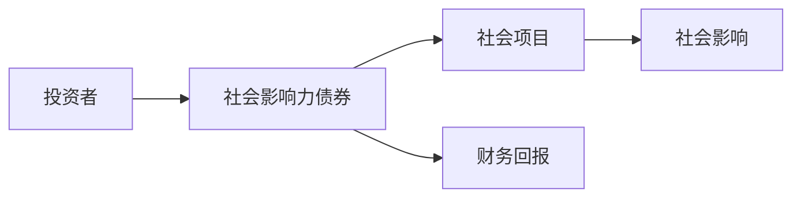
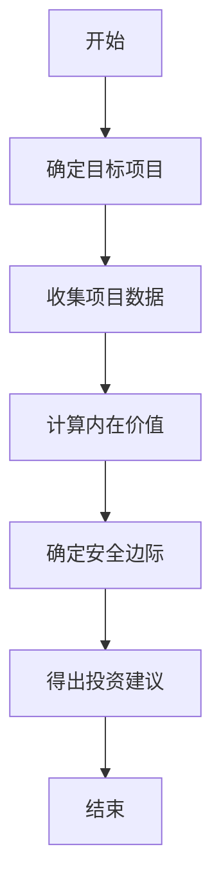
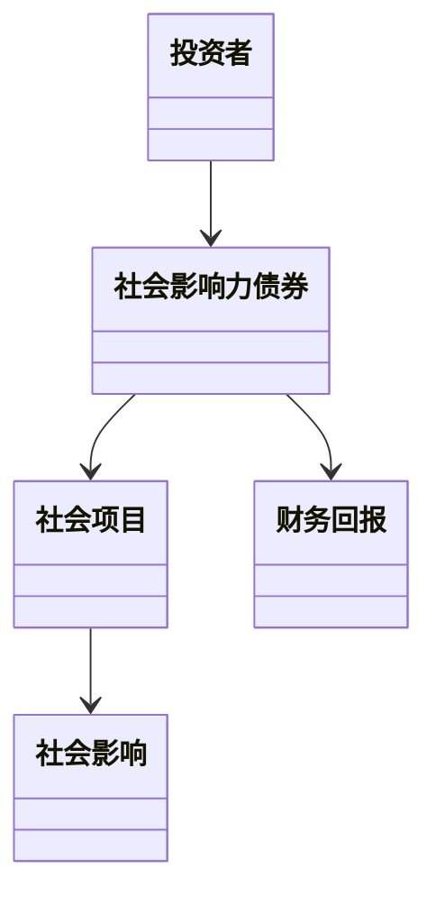
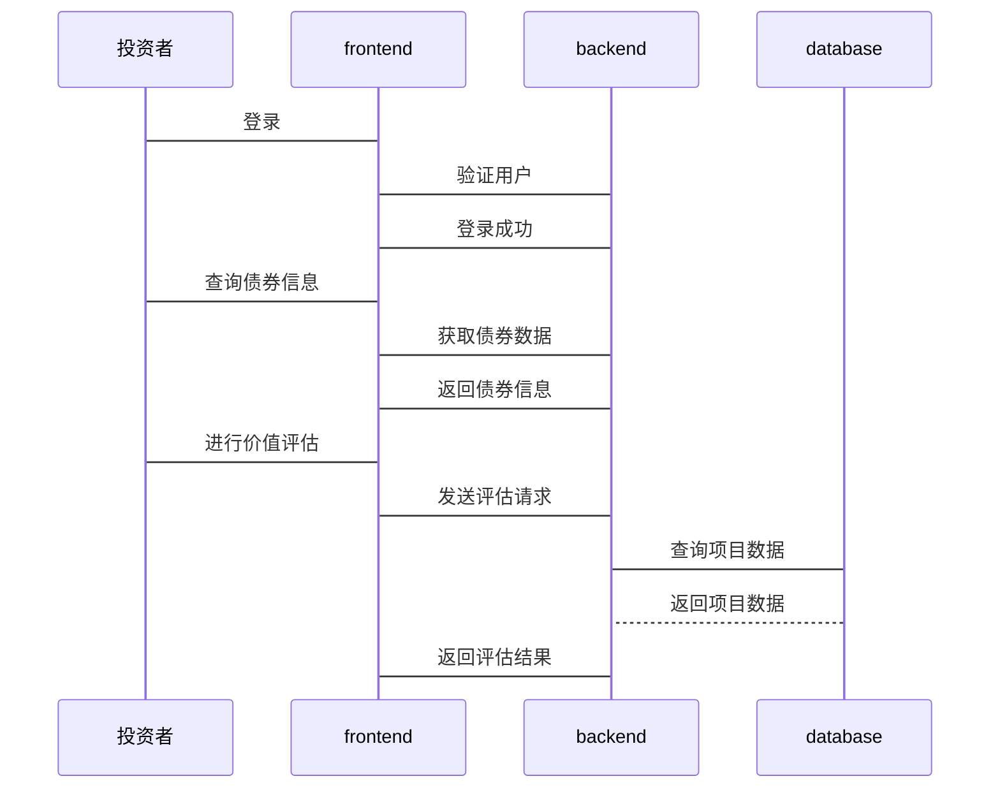

                 


# 格雷厄姆特价股票理论在社会影响力债券中的运用

## 关键词：格雷厄姆投资理论，社会影响力债券，价值评估，安全边际，ESG投资

## 摘要：  
本文探讨了格雷厄姆价值投资理论在社会影响力债券中的应用。通过分析社会影响力债券的核心概念、价值评估方法及与格雷厄姆理论的结合，展示了如何在追求财务回报的同时，实现社会价值的最大化。本文从理论基础到实战案例，全面解析了这一创新性的投资策略。

---

# 第一部分: 格雷厄姆特价股票理论与社会影响力债券的背景介绍

## 第1章: 格雷厄姆投资理论概述

### 1.1 格雷厄姆投资理论的核心概念

#### 1.1.1 价值投资的基本原理  
价值投资的核心在于寻找市场价格低于内在价值的资产。格雷厄姆提出，股票的内在价值是其未来现金流的现值，可以通过基本面分析进行评估。这种投资策略强调长期持有和避免短期市场波动的干扰。

#### 1.1.2 格雷厄姆的“安全边际”概念  
安全边际是格雷厄姆理论中的重要概念，指市场价格与内在价值之间的差距。通过购买价格低于内在价值的资产，投资者可以降低风险并确保投资的稳定性。

#### 1.1.3 股票定价的内在价值模型  
格雷厄姆提出了内在价值计算的公式，考虑了企业的盈利能力、资产状况和行业地位等因素。通过分析这些因素，投资者可以估算出股票的合理价格区间。

### 1.2 格雷厄姆投资策略的特点

#### 1.2.1 低市盈率与高分红策略  
格雷厄姆倾向于投资低市盈率、高分红的股票，这些股票通常具有较高的安全边际和稳定的收益。

#### 1.2.2 避免情绪化投资  
格雷厄姆强调理性投资，避免因市场情绪波动而做出错误决策。

#### 1.2.3 长期持有与价值发现  
价值投资的核心在于长期持有优质资产，等待其内在价值被市场发现。

---

## 第2章: 社会影响力债券的基本概念

### 2.1 社会影响力债券的定义与特点

#### 2.1.1 社会影响力债券的定义  
社会影响力债券是一种将社会责任与金融投资结合的新型债券，其目的是支持具有社会影响力的项目，如教育、环保、医疗等领域。

#### 2.1.2 社会影响力债券与传统债券的区别  
与传统债券相比，社会影响力债券不仅关注财务回报，还强调其对社会的积极影响。此外，社会影响力债券通常与特定的社会目标挂钩，具有更高的透明度和责任感。

#### 2.1.3 社会影响力债券的市场现状  
近年来，随着ESG投资的兴起，社会影响力债券的市场规模迅速增长。投资者越来越关注其对社会和环境的贡献，这使得社会影响力债券成为一种重要的投资工具。

### 2.2 社会影响力债券的发行与投资机制

#### 2.2.1 社会影响力债券的发行流程  
社会影响力债券的发行需要经过项目评估、债券设计、发行和上市等步骤。发行方通常为政府、非营利组织或企业，债券募集资金用于支持特定的社会项目。

#### 2.2.2 投资者参与社会影响力债券的方式  
投资者可以通过购买债券、投资基金或参与ESG投资组合等方式参与社会影响力债券市场。与传统债券相比，社会影响力债券的投资门槛较低，适合各类投资者。

#### 2.2.3 社会影响力债券的风险与收益分析  
社会影响力债券的风险主要来自于项目执行的不确定性和社会影响的实现程度。然而，其收益不仅体现在财务回报上，还包括社会价值的实现，如改善教育、减少污染等。

---

# 第二部分: 格雷厄姆特价股票理论在社会影响力债券中的核心概念与联系

## 第3章: 核心概念与联系的原理分析

### 3.1 格雷厄姆理论与社会影响力债券的结合点

#### 3.1.1 格雷厄姆理论中的价值发现机制  
格雷厄姆的价值投资方法可以帮助投资者发现具有潜在社会影响力的项目，从而实现财务回报与社会价值的双重目标。

#### 3.1.2 社会影响力债券的内在价值评估  
通过格雷厄姆的内在价值模型，投资者可以评估社会影响力债券的合理价格，确保投资的可持续性和稳定性。

#### 3.1.3 格雷厄姆理论在社会影响力债券中的应用潜力  
格雷厄姆理论为社会影响力债券的定价、风险控制和投资策略提供了理论依据，使其更具科学性和可操作性。

### 3.2 核心概念的属性特征对比

#### 3.2.1 格雷厄姆理论的核心属性  
- 价值投资  
- 安全边际  
- 长期持有  

#### 3.2.2 社会影响力债券的核心属性  
- 社会影响力  
- 可持续性  
- ESG因素  

#### 3.2.3 核心概念属性特征对比表格  
以下是格雷厄姆理论与社会影响力债券核心属性的对比：

| 核心概念 | 格雷厄姆理论 | 社会影响力债券 |
|----------|--------------|----------------|
| 目标     | 追求内在价值 | 追求社会影响力 |
| 方法     | 基于基本面分析 | 基于ESG因素 |
| 风险     | 价格波动风险 | 项目执行风险 |

### 3.3 ER实体关系图架构

#### 3.3.1 实体关系图的构建  
以下是格雷厄姆理论与社会影响力债券之间关系的ER图：



#### 3.3.2 实体关系图的分析与解释  
投资者通过购买社会影响力债券支持社会项目，同时获得财务回报。这种关系体现了格雷厄姆理论中价值发现与社会责任的结合。

---

## 第4章: 格雷厄姆理论在社会影响力债券中的算法原理

### 4.1 格雷厄姆价值评估算法的流程图

#### 4.1.1 算法流程图的绘制  
以下是格雷厄姆价值评估算法的流程图：



#### 4.1.2 算法流程图的详细解释  
- 确定目标项目：选择具有社会影响力且符合价值投资标准的债券。
- 收集项目数据：包括财务数据、ESG评分、项目目标等。
- 计算内在价值：使用格雷厄姆模型估算债券的合理价格。
- 确定安全边际：比较市场价格与内在价值，确保投资的安全性。
- 得出投资建议：根据计算结果，提出投资建议。

### 4.2 算法原理的数学模型与公式

#### 4.2.1 格雷厄姆内在价值计算公式  
债券的内在价值可以通过以下公式计算：

$$ V = \frac{D}{k} $$

其中，\( V \) 为内在价值，\( D \) 为债券的预期现金流，\( k \) 为折现率。

#### 4.2.2 格雷厄姆安全边际计算公式  
安全边际可以通过以下公式计算：

$$ S = V - P $$

其中，\( S \) 为安全边际，\( V \) 为内在价值，\( P \) 为市场价格。

---

## 第5章: 社会影响力债券的系统分析与架构设计

### 5.1 问题场景介绍

#### 5.1.1 项目背景  
随着ESG投资的兴起，社会影响力债券逐渐成为投资者关注的焦点。然而，如何在社会影响力债券中应用格雷厄姆理论，仍是一个需要深入研究的问题。

#### 5.1.2 项目目标  
本项目旨在通过格雷厄姆理论，设计一种社会影响力债券的价值评估系统，帮助投资者实现财务回报与社会价值的双重目标。

### 5.2 系统功能设计

#### 5.2.1 领域模型 mermaid 类图  
以下是系统的领域模型类图：



#### 5.2.2 系统架构设计 mermaid 架构图  
以下是系统的架构图：


#### 5.2.3 系统接口设计  
系统接口包括投资者登录、债券信息查询、价值评估等功能。

#### 5.2.4 系统交互 mermaid 序列图  
以下是系统的交互序列图：



---

## 第6章: 项目实战

### 6.1 环境安装

#### 6.1.1 开发环境  
需要安装Python、Jupyter Notebook、Mermaid工具和相关库。

#### 6.1.2 依赖安装  
安装必要的依赖，如pandas、numpy、scikit-learn等。

### 6.2 核心代码实现

#### 6.2.1 格雷厄姆价值评估算法的实现  
以下是Python代码示例：

```python
import pandas as pd
import numpy as np

def calculate_intrinsic_value(D, k):
    return D / k

def calculate_safety_margin(V, P):
    return V - P

# 示例数据
D = 1000  # 预期现金流
k = 0.05   # 折现率
P = 900    # 市场价格

V = calculate_intrinsic_value(D, k)
S = calculate_safety_margin(V, P)

print(f"内在价值: {V:.2f}")
print(f"安全边际: {S:.2f}")
```

#### 6.2.2 社会影响力债券的评估系统实现  
以下是系统的实现代码：

```python
class Investor:
    def __init__(self, name):
        self.name = name
        self.bonds = []

    def buy_bond(self, bond):
        self.bonds.append(bond)

class Bond:
    def __init__(self, name, impact_score, financial_return):
        self.name = name
        self.impact_score = impact_score
        self.financial_return = financial_return

    def get_value(self):
        return self.financial_return / 0.05

# 示例
investor = Investor("John")
bond1 = Bond("教育债券", 85, 1000)
bond2 = Bond("环保债券", 90, 1200)

investor.buy_bond(bond1)
investor.buy_bond(bond2)

print(f"{investor.name} 持有的债券：")
for bond in investor.bonds:
    print(f"{bond.name}, 内在价值: {bond.get_value():.2f}")
```

### 6.3 实际案例分析与详细解读

#### 6.3.1 案例背景  
假设某投资者希望投资于教育债券，该债券的预期现金流为1000元，折现率为5%。

#### 6.3.2 案例分析  
使用格雷厄姆理论计算债券的内在价值和安全边际：

$$ V = \frac{1000}{0.05} = 20,000 $$

假设市场价格为19,000元，则安全边际为：

$$ S = 20,000 - 19,000 = 1,000 $$

这表明该债券具有较高的安全边际，适合投资。

### 6.4 项目小结  
通过实际案例分析，我们验证了格雷厄姆理论在社会影响力债券中的应用效果。投资者可以通过该方法实现财务回报与社会价值的双重目标。

---

## 第7章: 总结与展望

### 7.1 总结  
本文详细探讨了格雷厄姆价值投资理论在社会影响力债券中的应用，提出了基于内在价值和安全边际的投资策略。通过理论分析和实际案例，证明了该策略的有效性和可行性。

### 7.2 未来研究方向  
未来的研究可以进一步探讨如何将格雷厄姆理论与其他社会责任投资工具结合，如ESG基金、绿色债券等。此外，还可以研究如何利用人工智能和大数据技术提高社会影响力债券的价值评估效率。

### 7.3 注意事项  
投资者在应用格雷厄姆理论时，需注意市场波动、项目执行风险等不确定性因素，确保投资的稳健性。

### 7.4 拓展阅读  
建议读者进一步阅读格雷厄姆的《证券分析》和相关社会责任投资的书籍，以深入了解价值投资与社会责任的结合。

---

## 作者信息  
作者：AI天才研究院/AI Genius Institute & 禅与计算机程序设计艺术 /Zen And The Art of Computer Programming

