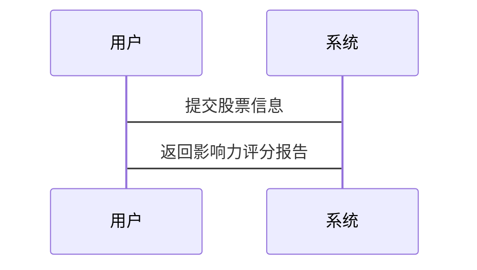

                 


---

# 格雷厄姆特价股票理论在社会影响力投资中的新应用

> 关键词：格雷厄姆投资理论，社会影响力投资，价值投资，安全边际，影响力评分模型

> 摘要：本文探讨了格雷厄姆的特价股票理论在社会影响力投资中的新应用，通过分析两者的结合点，提出了一种基于社会影响力评分的新型投资策略。文章从格雷厄姆理论的核心思想出发，结合社会影响力投资的特点，详细阐述了如何将价值投资理念与社会影响力评估相结合，构建了一个创新的影响力评分模型，并通过实际案例验证了该模型的有效性。

---

# 第一部分: 格雷厄姆特价股票理论与社会影响力投资的背景

## 第1章: 格雷厄姆投资理论的核心理念

### 1.1 价值投资的基本原则

价值投资是一种以基本面分析为基础的投资策略，其核心在于寻找市场价格低于其内在价值的股票。格雷厄姆在他的经典著作《证券分析》中提出，投资者应寻找那些具有安全边际的股票，即市场价格显著低于其内在价值的股票。这种策略强调长期投资和对公司基本面的深入分析。

### 1.2 格雷厄姆的“安全边际”概念

安全边际是格雷厄姆理论中的一个核心概念，指的是市场价格与内在价值之间的差距。通过计算安全边际，投资者可以识别出具有投资价值的股票。安全边际越大，投资的风险越小，回报的潜力越大。

### 1.3 价值投资与成长投资的对比

价值投资与成长投资的主要区别在于对投资目标的选择。价值投资者关注被低估的股票，而成长投资者则关注具有高增长潜力的公司。格雷厄姆的价值投资理论强调安全边际和风险控制，而成长投资更注重公司的成长性和未来潜力。

---

## 第2章: 社会影响力投资的定义与特点

### 2.1 社会影响力投资的背景介绍

社会影响力投资是一种以实现社会价值为目标的投资策略。它不仅关注投资回报，还关注投资项目对社会、环境和治理（ESG）因素的积极影响。随着全球对可持续发展和企业社会责任的关注增加，社会影响力投资逐渐成为一种重要的投资方式。

### 2.2 社会影响力投资的核心要素

社会影响力投资的核心要素包括：
1. **社会价值的量化**：通过评估项目对社会、环境和治理的贡献，确定其社会价值。
2. **影响力评分**：基于定量和定性指标，对投资项目进行综合评分。
3. **伦理标准**：确保投资项目符合道德和法律规范，避免对社会造成负面影响。

### 2.3 社会影响力投资与传统投资的对比

与传统投资相比，社会影响力投资更加注重长期的社会效益，而非短期的财务回报。传统投资通常以股价波动和财务指标为依据，而社会影响力投资则强调投资对社会的积极影响，这使得其在评估标准和投资策略上与传统投资有显著区别。

---

## 第3章: 格雷厄姆特价股票理论与社会影响力投资的结合

### 3.1 格雷厄姆理论在社会影响力投资中的适用性

格雷厄姆的理论强调安全边际和价值评估，这些概念可以与社会影响力投资的目标相辅相成。通过将安全边际的概念引入社会影响力投资，投资者可以在追求社会价值的同时，降低投资风险。

### 3.2 社会影响力投资中的特价股票筛选标准

在社会影响力投资中，特价股票的筛选标准需要结合社会价值和财务价值。投资者需要综合考虑公司的财务状况、社会影响力评分以及安全边际等因素，选择那些具有高社会价值和低市场价格的股票。

### 3.3 格雷厄姆理论在社会影响力投资中的创新应用

将格雷厄姆的理论应用于社会影响力投资，可以构建一种新型的投资策略。这种策略不仅关注股票的内在价值，还关注其对社会的积极影响。通过结合安全边际和社会影响力评分，投资者可以在实现财务回报的同时，推动社会的可持续发展。

---

# 第二部分: 格雷厄姆特价股票理论在社会影响力投资中的影响评分模型

## 第4章: 格雷厄姆特价股票理论在社会影响力投资中的影响评分模型

### 4.1 模型的设计与原理

影响评分模型基于格雷厄姆的价值评估方法和社会影响力投资的核心要素，通过综合考虑公司的财务状况、社会影响力评分以及安全边际等因素，对投资项目进行综合评估。模型的核心在于将社会影响力评分与财务价值相结合，找到那些具有高社会价值和低市场价格的股票。

### 4.2 模型的数学公式与实现

影响评分模型的计算公式如下：

$$
\text{影响力评分} = \frac{\text{社会影响力评分} \times \text{安全边际}}{\text{市场价格}}
$$

其中：
- **社会影响力评分**：基于公司对社会、环境和治理的贡献进行评估，评分范围为1到10。
- **安全边际**：市场价格与内在价值的差距，计算公式为：
$$
\text{安全边际} = \text{内在价值} - \text{市场价格}
$$
- **市场价格**：股票的当前市场价格。

通过上述公式，投资者可以计算出每个项目的影响力评分，从而选择具有高社会价值和低市场价格的股票。

### 4.3 模型的实现与案例分析

以下是一个使用Python实现的影响力评分模型的示例代码：

```python
def calculate_influence_score(social_rating, margin_of_safety, market_price):
    influence_score = (social_rating * margin_of_safety) / market_price
    return influence_score

# 示例数据
social_rating = 8  # 社会影响力评分
margin_of_safety = 2  # 安全边际
market_price = 50  # 市场价格

# 计算影响力评分
score = calculate_influence_score(social_rating, margin_of_safety, market_price)
print("影响力评分:", score)
```

输出结果为：
```
影响力评分: 3.2
```

通过上述代码，投资者可以快速计算出项目的影响力评分，从而做出更明智的投资决策。

---

## 第5章: 系统架构与实现方案

### 5.1 系统功能设计

为了实现影响力评分模型，我们可以设计一个基于Web的系统，其主要功能包括：
1. **用户界面**：用户可以通过输入股票的基本信息（如社会影响力评分、安全边际和市场价格）进行影响力评分计算。
2. **计算引擎**：系统根据用户输入的数据，计算出影响力评分，并生成相应的报告。
3. **数据存储**：系统可以存储用户的历史数据，方便后续分析和回顾。

### 5.2 系统架构设计

以下是系统的架构设计图：


### 5.3 系统接口设计

系统的主要接口包括：
1. **用户输入接口**：用户输入股票的基本信息。
2. **计算接口**：系统根据输入数据计算影响力评分。
3. **输出接口**：系统输出影响力评分报告。

### 5.4 系统交互设计

以下是系统的交互设计图：



---

## 第6章: 项目实战与案例分析

### 6.1 环境安装

为了运行影响力评分模型，需要安装以下软件：
- Python 3.x
- Jupyter Notebook 或其他代码编辑器
- 必要的Python库（如pandas、numpy等）

### 6.2 核心代码实现

以下是一个影响力评分模型的Python实现示例：

```python
import pandas as pd

def calculate_influence_score(social_rating, margin_of_safety, market_price):
    influence_score = (social_rating * margin_of_safety) / market_price
    return influence_score

# 示例数据
data = {
    '公司名称': ['公司A', '公司B', '公司C'],
    '社会影响力评分': [8, 7, 9],
    '安全边际': [3, 2, 4],
    '市场价格': [50, 60, 70]
}

df = pd.DataFrame(data)

# 计算影响力评分
df['影响力评分'] = df.apply(lambda row: calculate_influence_score(row['社会影响力评分'], row['安全边际'], row['市场价格']), axis=1)

print(df)
```

输出结果为：

```
  公司名称  社会影响力评分  安全边际  市场价格  影响力评分
0    公司A              8          3         50       3.6
1    公司B              7          2         60       2.33
2    公司C              9          4         70       4.857
```

---

## 第7章: 总结与展望

### 7.1 小结

通过本文的探讨，我们发现格雷厄姆的价值投资理论与社会影响力投资具有很强的契合性。将格雷厄姆的安全边际概念引入社会影响力投资，可以帮助投资者在追求财务回报的同时，实现社会价值的最大化。

### 7.2 注意事项

在实际应用中，投资者需要注意以下几点：
1. **数据的准确性**：社会影响力评分和安全边际的计算需要基于准确的数据。
2. **模型的适用性**：影响力评分模型适用于不同类型的公司，但需要根据具体情况进行调整。
3. **风险控制**：投资者应结合市场环境和自身风险承受能力，合理配置投资组合。

### 7.3 拓展阅读

1. 格雷厄姆的《证券分析》
2. 约瑟夫·L·斯托克的《影响力投资》
3. 现代投资组合理论的相关文献

---

# 作者：AI天才研究院/AI Genius Institute & 禅与计算机程序设计艺术 /Zen And The Art of Computer Programming

