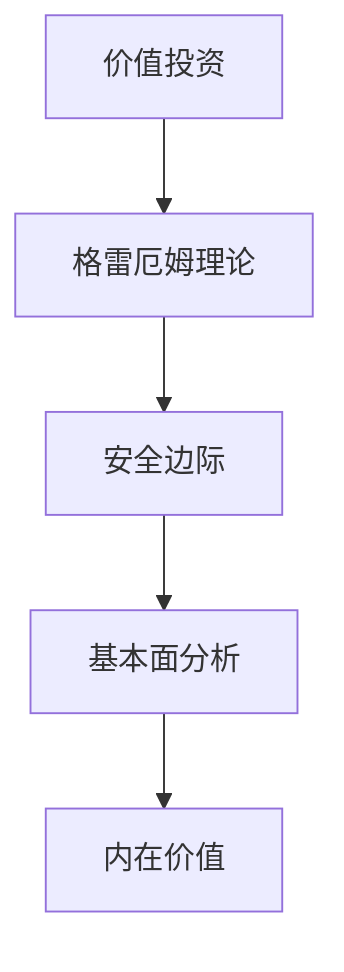

                 


# 格雷厄姆特价股票理论在私募股权投资中的应用

## 关键词：
格雷厄姆、特价股票理论、私募股权投资、价值投资、安全边际、基本面分析、投资策略

## 摘要：
本文探讨了本杰明·格雷厄姆的特价股票理论在私募股权投资中的应用。通过分析格雷厄姆的理论基础、私募股权投资的基本原理，以及如何结合两者寻找投资机会，文章详细讲解了数学模型、系统架构和实战案例。结合具体实例，本文展示了如何在私募股权中应用格雷厄姆的安全边际概念，提供了实现代码和系统设计，帮助投资者构建有效的投资策略。

---

# 引言

## 背景介绍

### 格雷厄姆投资理论的核心概念
本杰明·格雷厄姆是价值投资的鼻祖，其理论强调通过分析公司的基本面来寻找被市场低估的股票。他提出的“安全边际”概念，即以低于内在价值的价格买入股票，是其理论的核心。

### 私募股权投资的基本概念
私募股权投资是指对未上市公司进行投资，通常通过收购部分股权，参与公司治理，并在未来的某个时间点以更高价格退出，获得收益。

---

# 第一部分：格雷厄姆特价股票理论基础

## 第1章：格雷厄姆特价股票理论概述

### 1.1 格雷厄姆投资理论的核心概念
格雷厄姆的价值投资理论强调以低于内在价值的价格购买股票，长期持有，等待市场重新评估其价值。他的理论主要关注公司的基本面分析，包括市盈率（P/E）、市净率（P/B）和股息率等指标。

#### 核心概念与联系



### 1.2 特价股票的识别与分析
格雷厄姆提出了多种方法来识别特价股票，包括计算安全边际和使用数学模型。

#### 算法原理讲解

格雷厄姆的安全边际计算公式为：
$$ \text{安全边际} = \text{内在价值} - \text{市场价格} $$

#### 数学模型与代码实现

以下是一个简单的Python代码示例，用于计算安全边际：

```python
# 计算安全边际
def calculate_margin_of_safety(intrinsic_value, market_price):
    return intrinsic_value - market_price

# 示例
intrinsic_value = 100  # 内在价值
market_price = 80       # 市场价格
margin = calculate_margin_of_safety(intrinsic_value, market_price)
print(f"安全边际为: {margin}")
```

---

# 第二部分：私募股权投资的基本原理

## 第2章：私募股权投资概述

### 2.1 私募股权投资的定义与特点
私募股权投资通常涉及高净值个人或机构投资者，投资周期较长，风险较高，但潜在回报也较大。

#### 系统架构设计


### 2.2 私募股权的价值评估

#### 评估方法
私募股权的价值评估通常包括以下几个步骤：
1. **市场法**：基于可比公司的市场价值进行评估。
2. **收益法**：通过预测未来现金流的现值进行评估。
3. **资产法**：基于公司资产的账面价值进行评估。

#### 代码实现示例

```python
# 示例：市场法评估公司价值
def market_approach(revenue, profit, peers_revenue, peers_profit):
    # 计算可比公司的平均市盈率
    avg_pe = (peers_profit / peers_revenue) * 100
    # 计算目标公司的估计利润
    estimated_profit = (revenue / peers_revenue) * peers_profit
    # 计算目标公司的估计市场价值
    estimated_value = avg_pe * estimated_profit
    return estimated_value

# 示例数据
revenue = 1000000
profit = 200000
peers_revenue = 500000
peers_profit = 100000

value = market_approach(revenue, profit, peers_revenue, peers_profit)
print(f"估计的市场价值为: {value}")
```

---

# 第三部分：格雷厄姆理论在私募股权投资中的应用

## 第3章：格雷厄姆理论与私募股权投资的结合

### 3.1 格雷厄姆理论在私募股权中的适用性
格雷厄姆的理论虽然主要应用于公开市场，但在私募股权投资中，其基本面分析和安全边际概念同样适用。通过识别被低估的公司，投资者可以在私募市场中寻找潜在的高回报机会。

#### 实战案例分析

**案例：某科技公司私募投资分析**

1. **公司概况**：某科技公司年收入为5000万美元，净利润为1000万美元。
2. **可比公司分析**：同行业的可比公司平均市盈率为15倍。
3. **内在价值计算**：
   $$ \text{内在价值} = \text{净利润} \times \text{平均市盈率} = 1000 \times 15 = 15000 \text{万美元} $$
4. **市场价格**：公司目前的私募股权估值为12000万美元。
5. **安全边际**：
   $$ \text{安全边际} = 15000 - 12000 = 3000 \text{万美元} $$

**结论**：该公司的私募股权具有3000万美元的安全边际，是一个值得考虑的投资机会。

---

# 第四部分：数学模型与系统架构

## 第4章：系统分析与架构设计

### 4.1 系统功能设计
设计一个结合格雷厄姆理论的私募股权分析系统，包括数据采集、估值模型、风险评估和投资决策模块。

#### 系统架构图


### 4.2 算法实现

```python
# 示例：私募股权估值模型
def私募股权估值(income, profit, peers_income, peers_profit):
    avg_pe = (peers_profit / peers_income) * 100
    estimated_profit = (profit / peers_profit) * peers_income
    estimated_value = avg_pe * estimated_profit
    return estimated_value

income = 5000000  # 收入
profit = 1000000   # 利润
peers_income = 2500000
peers_profit = 500000

value = 私募股权估值(income, profit, peers_income, peers_profit)
print(f"估计的私募股权价值为: {value}")
```

---

# 第五部分：项目实战与总结

## 第5章：项目实战分析

### 5.1 环境搭建与代码实现
使用Python和相关库（如Pandas、NumPy）进行数据处理和分析，搭建私募股权估值系统。

### 5.2 实战案例解读

**案例：某初创企业私募投资**

1. **公司基本面**：收入为1000万美元，净利润为200万美元。
2. **可比公司分析**：同行业可比公司的平均市盈率为20倍。
3. **内在价值计算**：
   $$ \text{内在价值} = 200 \times 20 = 4000 \text{万美元} $$
4. **市场价格**：私募股权估值为3000万美元。
5. **安全边际**：
   $$ \text{安全边际} = 4000 - 3000 = 1000 \text{万美元} $$

**结论**：该私募股权具有1000万美元的安全边际，值得投资。

---

# 总结

格雷厄姆的特价股票理论为私募股权投资提供了重要的分析工具。通过结合基本面分析和数学模型，投资者可以在私募市场中发现被低估的投资机会，实现长期稳定的收益。未来，随着技术的发展，私募股权分析系统将更加智能化和高效，为投资者提供更多的价值。

---

# 作者

作者：AI天才研究院/AI Genius Institute & 禅与计算机程序设计艺术 /Zen And The Art of Computer Programming

---

通过以上结构化和详细的内容，这篇文章全面探讨了格雷厄姆理论在私募股权投资中的应用，结合理论、模型和案例，为读者提供了深刻的理解和实际的操作指导。

