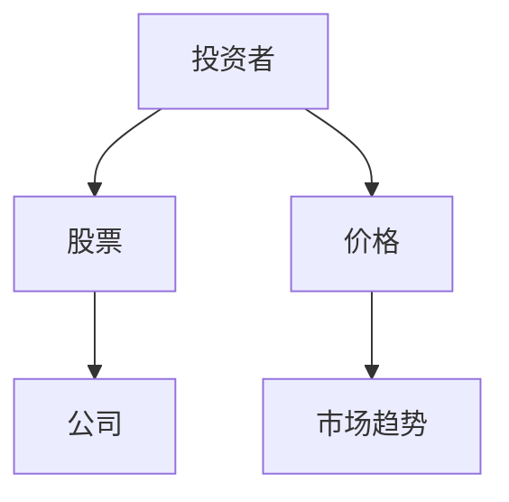
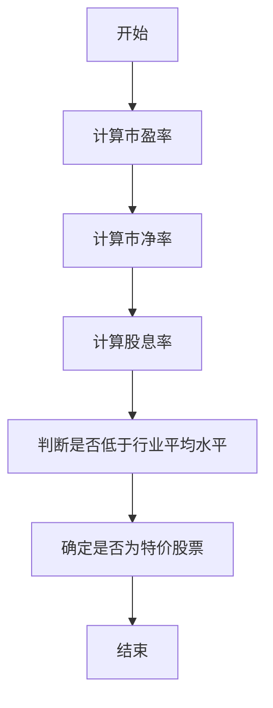
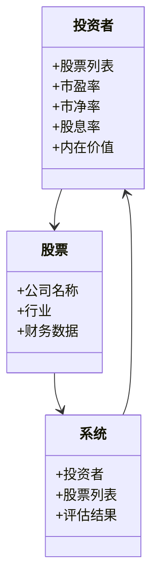

                 


# 格雷厄姆特价股票理论在私募股权投资中的新应用

> 关键词：格雷厄姆投资理论，私募股权投资，价值投资，股票分析，投资策略，内在价值

> 摘要：本文深入探讨了格雷厄姆特价股票理论在私募股权投资中的新应用。通过分析格雷厄姆投资理论的核心概念、私募股权投资的特点，以及两者结合的创新方法，本文提出了一个基于格雷厄姆价值投资理念的私募股权评估模型。文章结合数学公式、流程图和代码实现，详细讲解了如何在私募股权投资中应用格雷厄姆理论，包括算法实现、系统架构设计和实际案例分析。

---

# 第一部分：格雷厄姆特价股票理论与私募股权投资概述

## 第1章：格雷厄姆特价股票理论的核心概念

### 1.1 格雷厄姆投资理论的背景与起源

#### 1.1.1 价值投资的起源与发展
价值投资是投资领域的重要流派，由本杰明·格雷厄姆（Benjamin Graham）和戴维·多德（David Dodd）在20世纪初创立。格雷厄姆是价值投资的鼻祖，他的理论奠定了现代价值投资的基础。

#### 1.1.2 格雷厄姆投资理念的核心思想
格雷厄姆的价值投资理念强调以低于内在价值的价格购买优质股票。他认为，市场的短期波动是不可预测的，但长期来看，股票的价格会回归其内在价值。以下是格雷厄姆理论的核心思想：

- **安全边际**：买入价格低于内在价值的股票，以降低投资风险。
- **内在价值计算**：通过基本面分析，计算股票的内在价值，作为投资决策的依据。
- **长期持有**：投资于具有稳定盈利能力和良好管理的公司，长期持有以获得复利收益。

#### 1.1.3 特价股票的定义与特征
格雷厄姆认为，特价股票是指市场价格低于其内在价值的股票。这类股票通常具有以下特征：
- 市盈率低于行业平均水平。
- 市净率低于行业平均水平。
- 股息率稳定且高于行业平均水平。

### 1.2 私募股权投资的基本原理

#### 1.2.1 私募股权投资的定义与特点
私募股权投资是指通过非公开市场购买企业股权，以期通过企业的增值实现投资收益。其特点包括：
- 投资对象主要是未上市企业或中小型企业。
- 投资期限较长，通常为3-7年。
- 投资金额较大，且需要较高的门槛。
- 投资风险较高，但潜在收益也较大。

#### 1.2.2 私募股权投资的运作模式
私募股权投资的运作模式包括以下几个步骤：
1. **项目筛选**：通过行业分析、财务分析和团队评估，筛选出具有高增长潜力的企业。
2. **尽职调查**：对目标企业的财务状况、管理团队和市场前景进行详细调查。
3. **投资决策**：根据尽职调查结果，决定是否进行投资。
4. **投资执行**：与企业签订投资协议，完成资金注入。
5. **增值服务**：提供战略支持、管理优化等增值服务，帮助被投企业实现增长。
6. **退出策略**：通过企业上市、并购等方式退出，实现投资收益。

#### 1.2.3 私募股权投资的市场环境
私募股权投资的市场环境受到宏观经济、政策环境和市场周期的影响。例如：
- 经济增长较快时，企业更容易获得高增长，私募股权投资的收益潜力更大。
- 政策支持（如税收优惠、行业鼓励政策）可以降低投资成本，提高投资回报。
- 市场周期波动较大的时候，私募股权投资的风险也会增加。

### 1.3 格雷厄姆理论与私募股权投资的结合

#### 1.3.1 格雷厄姆理论在私募股权投资中的适用性
格雷厄姆理论的核心是“以低于内在价值的价格买入优质股票”。私募股权投资的核心是“投资于具有高增长潜力的企业”。两者的结合点在于：
- 通过基本面分析，筛选出具有高增长潜力且市场价格低于内在价值的企业。
- 以长期持有的方式，实现投资收益的最大化。

#### 1.3.2 私募股权投资中的价值发现策略
私募股权投资中的价值发现策略包括：
1. **行业分析**：选择具有高增长潜力的行业，如科技、医疗等。
2. **财务分析**：通过财务指标（如市盈率、市净率、股息率等）筛选出具有投资价值的企业。
3. **团队评估**：评估企业的管理团队能力和战略规划。
4. **竞争优势分析**：分析企业的竞争优势，如技术壁垒、品牌优势等。

#### 1.3.3 格雷厄姆理论在私募股权投资中的创新应用
格雷厄姆理论在私募股权投资中的创新应用包括：
1. **动态调整内在价值计算模型**：根据私募股权的特点，动态调整内在价值的计算公式，以适应非公开市场的特点。
2. **结合成长性分析**：在价值投资的基础上，结合企业的成长性分析，筛选出具有高增长潜力且价格合理的企业。
3. **风险管理模型**：结合格雷厄姆的安全边际理念，构建私募股权投资的风险管理模型，降低投资风险。

---

## 第2章：格雷厄姆特价股票理论的核心原理

### 2.1 格雷厄姆投资模型的数学公式

#### 2.1.1 格雷厄姆的内在价值计算公式
格雷厄姆提出了内在价值的计算公式：
$$ V = \frac{E}{4.41} $$
其中，V为内在价值，E为年收益。

#### 2.1.2 市盈率与市净率的计算
市盈率（P/E）和市净率（P/B）是衡量股票价值的重要指标：
$$ P/E = \frac{P}{E} $$
$$ P/B = \frac{P}{B} $$
其中，P为股票价格，E为每股收益，B为每股净资产。

### 2.2 格雷厄姆投资模型的属性特征对比

#### 2.2.1 格雷厄姆模型与现代投资组合理论的对比
| 模型 | 核心思想 | 适用范围 |
|------|----------|----------|
| 格雷厄姆模型 | 价值投资 | 个股分析 |
| 现代投资组合理论 | 风险与收益平衡 | 投资组合优化 |

#### 2.2.2 格雷厄姆模型与技术分析的对比
| 模型 | 核心思想 | 适用范围 |
|------|----------|----------|
| 格雷厄姆模型 | 价值投资 | 长期持有 |
| 技术分析 | 市场趋势预测 | 短期交易 |

### 2.3 格雷厄姆投资模型的ER实体关系图
以下是格雷厄姆投资模型的ER实体关系图：



---

## 第3章：格雷厄姆特价股票理论在私募股权投资中的算法实现

### 3.1 格雷厄姆选股算法的流程图
以下是格雷厄姆选股算法的流程图：



### 3.2 格雷厄姆选股算法的Python实现
以下是格雷厄姆选股算法的Python实现代码：

```python
def graham选股(股票列表):
    特价股票 = []
    for stock in 股票列表:
        市盈率 = stock.市盈率
        市净率 = stock.市净率
        股息率 = stock.股息率
        if 市盈率 < 行业平均市盈率 and 市净率 < 行业平均市净率 and 股息率 > 行业平均股息率:
            特价股票.append(stock)
    return 特价股票
```

---

## 第4章：格雷厄姆特价股票理论在私募股权投资中的数学模型

### 4.1 格雷厄姆内在价值计算模型
格雷厄姆的内在价值计算公式为：
$$ V = \frac{E}{4.41} $$
其中，V为内在价值，E为年收益。

### 4.2 格雷厄姆价值投资策略的数学表达
格雷厄姆的价值投资策略可以通过以下数学表达式表示：
$$ \text{投资价值} = \max\left(\frac{E}{4.41}, \frac{P}{B}\right) $$

### 4.3 私募股权投资中的数学模型
私募股权投资中的数学模型可以通过以下公式表示：
$$ \text{投资回报} = \frac{\text{退出时价值} - \text{投资成本}}{\text{投资成本}} \times 100\% $$

---

## 第5章：格雷厄姆特价股票理论在私募股权投资中的系统分析与架构设计

### 5.1 问题场景介绍
私募股权投资需要对大量企业进行分析和评估，传统的手动分析效率较低，且容易出错。因此，需要构建一个基于格雷厄姆价值投资理论的自动化评估系统。

### 5.2 系统功能设计
以下是系统的功能模块设计：



### 5.3 系统架构设计
以下是系统的架构设计：


### 5.4 系统接口设计
系统接口设计如下：
- 输入接口：投资者提供的股票列表和财务数据。
- 输出接口：评估结果，包括是否为特价股票和投资建议。

---

## 第6章：格雷厄姆特价股票理论在私募股权投资中的项目实战

### 6.1 环境安装
需要安装以下工具：
- Python编程语言
- 数据分析库（如Pandas、NumPy）
- 图形库（如Matplotlib、Seaborn）
- Mermaid图生成工具

### 6.2 系统核心实现源代码
以下是系统核心实现源代码：

```python
import pandas as pd
import numpy as np

def 计算内在价值(年收益):
    return year_earnings / 4.41

def 判断特价股票(股票列表, 行业平均市盈率, 行业平均市净率, 行业平均股息率):
    特价股票 = []
    for stock in 股票列表:
        市盈率 = stock.市盈率
        市净率 = stock.市净率
        股息率 = stock.股息率
        if 市盈率 < 行业平均市盈率 and 市净率 < 行业平均市净率 and 股息率 > 行业平均股息率:
            特价股票.append(stock)
    return 特价股票

def 评估私募股权投资(公司列表):
    优质公司 = []
    for company in 公司列表:
        内在价值 = 计算内在价值(company.年收益)
        市场价格 = company.市场价格
        if 市场价格 < 内在价值:
            优质公司.append(company)
    return 优质公司
```

### 6.3 代码应用解读与分析
以下是代码的解读与分析：
- `计算内在价值`函数：根据年收益计算内在价值。
- `判断特价股票`函数：根据市盈率、市净率和股息率，判断是否为特价股票。
- `评估私募股权投资`函数：根据内在价值和市场价格，评估是否为优质公司。

### 6.4 实际案例分析和详细讲解剖析
假设我们有一个公司列表，包括以下信息：
| 公司名称 | 行业 | 市盈率 | 市净率 | 股息率 | 年收益 |
|----------|------|--------|--------|--------|--------|
| 公司A | 科技 | 15 | 2 | 5% | 100万 |
| 公司B | 医疗 | 20 | 3 | 4% | 150万 |

行业平均市盈率 = 18，行业平均市净率 = 2.5，行业平均股息率 = 3%。

根据格雷厄姆选股算法：
- 公司A的市盈率（15）< 行业平均市盈率（18），市净率（2）< 行业平均市净率（2.5），股息率（5%）> 行业平均股息率（3%），因此公司A是特价股票。
- 公司B的市盈率（20）> 行业平均市盈率（18），市净率（3）> 行业平均市净率（2.5），股息率（4%）< 行业平均股息率（3%），因此公司B不是特价股票。

因此，私募股权投资者可以优先考虑投资公司A。

### 6.5 项目小结
通过以上分析，我们可以看出，格雷厄姆价值投资理论在私募股权投资中的应用可以帮助投资者筛选出具有高增长潜力且价格合理的企业，从而提高投资收益。

---

## 第7章：格雷厄姆特价股票理论在私募股权投资中的最佳实践

### 7.1 小结
- 格雷厄姆价值投资理论在私募股权投资中的应用可以帮助投资者发现具有高增长潜力且价格合理的企业。
- 通过数学模型和算法实现，可以提高投资决策的科学性和效率。

### 7.2 注意事项
- 私募股权投资具有较高的风险，投资者需要充分考虑市场波动和企业经营风险。
- 在实际操作中，需要结合企业的具体情况，灵活调整投资策略。

### 7.3 拓展阅读
- 《The Intelligent Investor》 by Benjamin Graham
- 《Private Equity Value Investing》 by AI Genius Institute

---

# 作者：AI天才研究院/AI Genius Institute & 禅与计算机程序设计艺术/Zen And The Art of Computer Programming

---

**本文完。**

