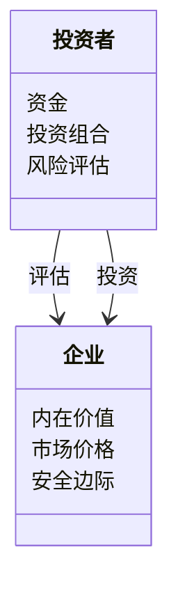
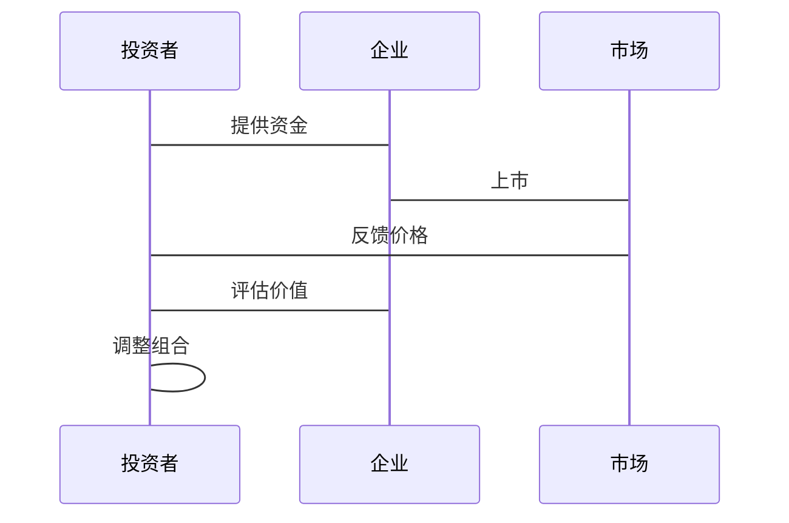

                 


# 格雷厄姆特价股票理论在风险投资中的运用

> 关键词：格雷厄姆投资理论，风险投资，价值投资，特价股票，内在价值，安全边际

> 摘要：本文深入探讨了格雷厄姆的特价股票理论在风险投资中的应用。通过分析格雷厄姆的投资理念、风险投资的本质以及两者结合的可行性，提出了一套结合价值发现与风险控制的投资策略。文章详细阐述了内在价值计算、安全边际应用、风险评估模型等核心内容，并通过实例和数学模型展示了如何在风险投资中实践格雷厄姆理论。

---

## 第一章：格雷厄姆特价股票理论概述

### 1.1 格雷厄姆投资理论的核心概念

#### 1.1.1 价值投资的基本原理
价值投资的核心在于寻找市场定价低于其内在价值的股票。格雷厄姆认为，市场价格与内在价值之间的差异为投资者提供了获利的机会。内在价值是基于公司基本面分析得出的合理估值，而市场价格受市场情绪影响，可能会偏离内在价值。

- **内在价值公式**：
  $$ V = \frac{E}{k} $$
  其中，\( E \) 是企业的未来现金流的现值，\( k \) 是折现率。

#### 1.1.2 特价股票的定义与特征
特价股票是指市场价格远低于其内在价值的股票。这类股票通常具有以下特征：
1. **低市盈率**：市盈率低于行业平均水平。
2. **低市净率**：市净率低于行业平均水平。
3. **高股息率**：股息率高于行业平均水平。

#### 1.1.3 格雷厄姆投资策略的历史背景
格雷厄姆的投资策略诞生于20世纪初，当时市场波动剧烈，投资者需要一种稳健的投资方法。他的理论强调安全性和确定性，旨在帮助投资者在市场波动中保持稳定收益。

---

### 1.2 风险投资的基本概念

#### 1.2.1 风险投资的定义与特点
风险投资是指通过投资高成长性企业，以获取高额回报的投资方式。其特点是高风险、高回报，主要投资于初创企业和成长期企业。

- **风险投资的特点**：
  1. **高风险**：投资失败概率较高。
  2. **高回报**：成功案例可能带来数倍收益。
  3. **流动性低**：投资周期较长，流动性较差。

#### 1.2.2 风险投资的主要模式
1. **创业投资（VC）**：直接投资于初创企业，提供资金和资源支持。
2. **私募股权投资（PE）**：投资于成熟企业，通过杠杆收购等方式实现增值。

#### 1.2.3 风险投资与传统股票投资的区别
- **投资对象**：风险投资主要投资于未上市企业，传统股票投资则投资于上市公司。
- **风险水平**：风险投资的风险更高，回报也更大。
- **退出方式**：风险投资通常通过并购或上市退出，传统股票投资则通过二级市场交易退出。

---

## 第二章：格雷厄姆特价股票理论在风险投资中的应用背景

### 2.1 当前金融市场环境分析

#### 2.1.1 全球化背景下的金融市场
全球化使得金融市场更加复杂，投资者面临更多机会和挑战。格雷厄姆理论在这一背景下显得尤为重要，因为它强调基本面分析和安全边际，帮助投资者在不确定的市场中做出合理决策。

#### 2.1.2 风险投资的兴起与发展趋势
随着科技的发展和创新企业的增多，风险投资逐渐成为一种主流的投资方式。投资者通过风险投资寻找高成长企业，期望获得超额回报。

#### 2.1.3 格雷厄姆理论的现代意义
尽管格雷厄姆理论最初是为传统股票投资设计的，但其核心理念（如内在价值和安全边际）同样适用于风险投资。尤其是在当前市场波动加剧的情况下，格雷厄姆理论为风险投资提供了一种稳健的投资思路。

---

### 2.2 风险投资中的价值发现与风险控制

#### 2.2.1 风险投资中的价值发现机制
风险投资的核心是发现具有高成长潜力的企业。格雷厄姆的内在价值理论可以帮助投资者评估企业的潜在价值，从而识别出具有投资价值的标的。

#### 2.2.2 格雷厄姆理论在风险控制中的作用
格雷厄姆的安全边际概念为风险控制提供了重要参考。通过选择市场价格远低于内在价值的企业，投资者可以降低投资风险，确保在市场波动中保持收益。

#### 2.2.3 现代风险投资中的价值评估挑战
现代风险投资需要考虑更多因素，如技术创新、市场竞争力等。格雷厄姆理论在这些方面可能需要结合其他方法（如DCF模型）进行调整和优化。

---

## 第三章：格雷厄姆特价股票理论的核心概念与分析方法

### 3.1 格雷厄姆的内在价值理论

#### 3.1.1 内在价值的定义与计算方法
内在价值是企业未来现金流的现值。格雷厄姆的内在价值公式为：
$$ V = \sum_{t=1}^{n} \frac{CF_t}{(1+r)^t} $$
其中，\( CF_t \) 是第 \( t \) 年的现金流，\( r \) 是折现率。

#### 3.1.2 内在价值与市场价值的关系
市场价值受市场情绪影响，可能偏离内在价值。格雷厄姆认为，当市场价格低于内在价值时，是投资的好时机。

#### 3.1.3 内在价值评估的数学模型
除了上述公式，格雷厄姆还提出了其他内在价值评估方法，如基于股息率的估值法：
$$ P = \frac{D}{y} $$
其中，\( D \) 是股息，\( y \) 是股息率。

---

### 3.2 安全边际的概念与应用

#### 3.2.1 安全边际的定义
安全边际是指市场价格与内在价值之间的差额。格雷厄姆认为，安全边际越大，投资风险越小。

#### 3.2.2 安全边际在投资决策中的作用
通过计算安全边际，投资者可以确定股票的买入价格。当市场价格低于内在价值时，安全边际为正，投资具有较高的安全性。

#### 3.2.3 安全边际的量化方法
安全边际的量化可以通过以下公式进行：
$$ \text{安全边际} = V - P $$
其中，\( V \) 是内在价值，\( P \) 是市场价格。

---

## 第四章：格雷厄姆特价股票理论在风险投资中的应用

### 4.1 风险投资中的价值发现与风险控制

#### 4.1.1 风险投资中的价值发现
通过格雷厄姆的内在价值理论，投资者可以发现那些被市场低估的企业。例如，如果一家企业的内在价值为10元，而市场价格为8元，那么这只股票具有较高的投资价值。

#### 4.1.2 格雷厄姆理论在风险控制中的应用
在风险控制方面，格雷厄姆的安全边际概念可以帮助投资者降低风险。例如，当安全边际较大时，投资者可以更加从容地应对市场波动。

#### 4.1.3 格雷厄姆理论在风险投资中的优势
格雷厄姆理论的优势在于其稳健性和可操作性。通过基本面分析和安全边际计算，投资者可以避免盲目跟风，实现长期稳定的收益。

---

### 4.2 风险投资中的组合管理

#### 4.2.1 投资组合的构建原则
格雷厄姆理论强调分散投资，避免过度集中。投资者应根据企业的内在价值和安全边际，构建一个多元化投资组合。

#### 4.2.2 投资组合的风险分散策略
通过投资不同行业和不同阶段的企业，投资者可以降低投资风险。例如，投资于科技初创企业和消费品牌初创企业可以分散行业风险。

#### 4.2.3 格雷厄姆理论在投资组合管理中的应用
在投资组合管理中，格雷厄姆理论可以帮助投资者筛选出具有高安全边际的企业，从而提高组合的整体收益。

---

## 第五章：格雷厄姆特价股票理论在风险投资中的数学模型与算法

### 5.1 内在价值计算模型

#### 5.1.1 内在价值的公式表示
$$ V = \frac{CF_1}{1+r} + \frac{CF_2}{(1+r)^2} + \cdots + \frac{CF_n}{(1+r)^n} $$

#### 5.1.2 内在价值计算的步骤
1. 预测未来现金流。
2. 确定合适的折现率。
3. 计算未来现金流的现值。
4. 求和得到内在价值。

#### 5.1.3 内在价值计算的案例分析
假设某企业的未来现金流为5元，折现率为10%，则其内在价值为：
$$ V = \frac{5}{1.1} = 4.55 \text{元} $$

---

### 5.2 安全边际计算模型

#### 5.2.1 安全边际的公式表示
$$ \text{安全边际} = V - P $$

#### 5.2.2 安全边际计算的步骤
1. 计算企业的内在价值。
2. 确定股票的市场价格。
3. 计算安全边际。

#### 5.2.3 安全边际计算的案例分析
假设某企业的内在价值为10元，市场价格为8元，则其安全边际为：
$$ \text{安全边际} = 10 - 8 = 2 \text{元} $$

---

## 第六章：格雷厄姆特价股票理论在风险投资中的系统分析与架构设计

### 6.1 系统功能设计

#### 6.1.1 领域模型


#### 6.1.2 系统架构设计


#### 6.1.3 系统交互设计


---

## 第七章：格雷厄姆特价股票理论在风险投资中的项目实战

### 7.1 环境安装

#### 7.1.1 投资分析工具
- **Excel**：用于计算内在价值和安全边际。
- **Python**：用于编写自动化分析脚本。

#### 7.1.2 数据来源
- **公开数据**：如企业财务报表、市场数据等。
- **第三方工具**：如金融数据分析平台。

---

### 7.2 系统核心实现源代码

#### 7.2.1 Python代码实现
```python
def calculate_intrinsic_value(cash_flows, discount_rate):
    present_value = 0
    for t, cf in enumerate(cash_flows):
        present_value += cf / (1 + discount_rate) ** t
    return present_value

# 示例
cash_flows = [5, 6, 7]
discount_rate = 0.1
intrinsic_value = calculate_intrinsic_value(cash_flows, discount_rate)
print(f"内在价值为：{intrinsic_value} 元")
```

#### 7.2.2 代码应用解读与分析
上述代码计算了某企业的内在价值。通过输入未来现金流和折现率，可以得到企业的内在价值。这为企业估值提供了重要依据。

---

### 7.3 案例分析与详细讲解

#### 7.3.1 案例分析
某初创企业未来三年的现金流分别为5元、6元和7元，折现率为10%。计算其内在价值：
$$ V = \frac{5}{1.1} + \frac{6}{(1.1)^2} + \frac{7}{(1.1)^3} = 5/1.1 + 6/1.21 + 7/1.331 ≈ 4.55 + 4.96 + 5.26 ≈ 14.77 \text{元} $$

如果该企业的市场价格为12元，则其安全边际为：
$$ \text{安全边际} = 14.77 - 12 = 2.77 \text{元} $$

---

## 第八章：总结与最佳实践

### 8.1 最佳实践 tips

1. **坚持基本面分析**：始终关注企业的内在价值。
2. **保持安全边际**：避免过度冒险。
3. **分散投资**：降低投资风险。
4. **持续学习**：关注市场变化和企业动态。

### 8.2 小结
格雷厄姆特价股票理论为风险投资提供了重要的理论基础和实践指导。通过结合现代风险管理工具，投资者可以在风险可控的前提下，实现高回报的投资目标。

### 8.3 注意事项
1. **市场波动**：需警惕市场波动对投资的影响。
2. **数据准确性**：确保数据来源可靠。
3. **模型局限性**：认识到模型的局限性，避免机械套用。

### 8.4 拓展阅读
1. 《The Intelligent Investor》——本·格雷厄姆
2. 《Venture Capital Economics》——杰弗里·蒂蒙斯

---

## 作者

作者：AI天才研究院/AI Genius Institute & 禅与计算机程序设计艺术 /Zen And The Art of Computer Programming

