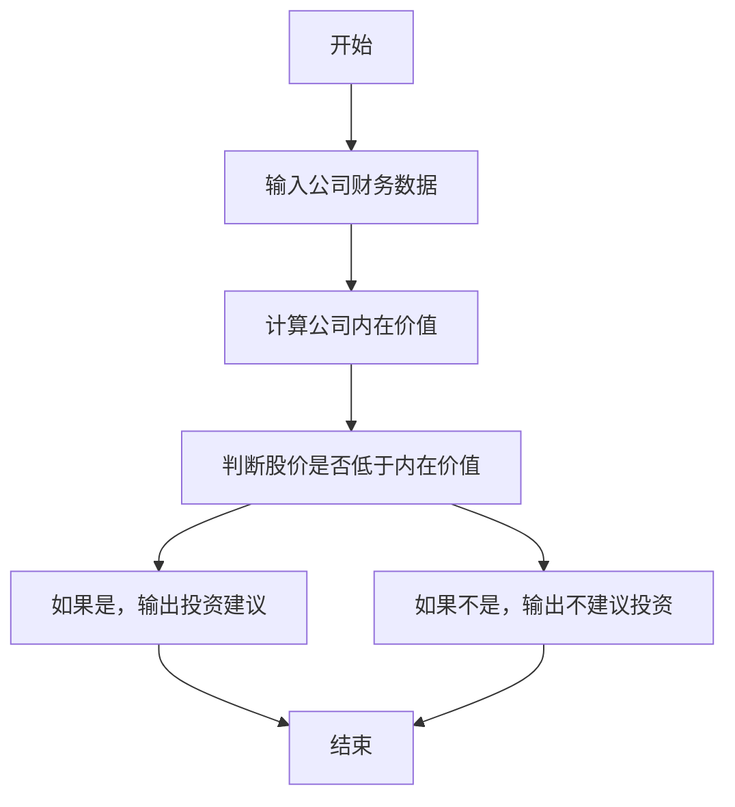
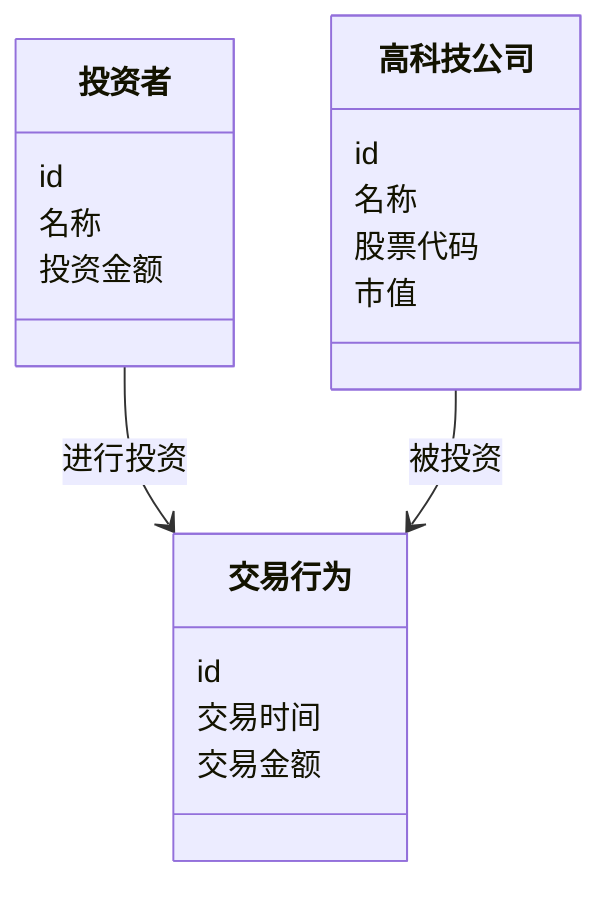
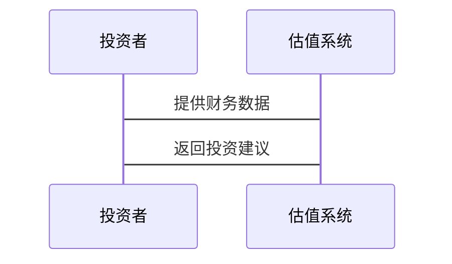

                 


# 格雷厄姆特价股票理论在高科技公司中的应用挑战

## 关键词：价值投资，高科技公司，股票估值，投资策略，技术分析

## 摘要：  
本文探讨了格雷厄姆的价值投资理论在高科技公司中的应用挑战。首先介绍了格雷厄姆投资理论的背景及其核心概念，分析了高科技公司的特点和投资难点。然后，结合具体的数学模型和算法，详细阐述了如何将格雷厄姆理论应用于高科技公司估值，并通过实际案例分析和系统设计展示了这一过程的可行性与局限性。最后，总结了在高科技公司投资中的最佳实践和未来研究方向。

---

# 第一章：背景介绍

## 1.1 格雷厄姆价值投资理论的起源与发展

### 1.1.1 价值投资的定义
价值投资是一种基于对公司内在价值的评估，寻找市场价格低于内在价值的股票的投资策略。其核心在于“购买便宜的”，而非关注市场的短期波动。

### 1.1.2 格雷厄姆投资策略的核心理念
1. **安全边际**：以低于内在价值的价格买入股票，确保即使市场波动，也能获得超额收益。
2. **长期持有**：价值投资强调长期持有，避免频繁交易以降低成本。
3. **基本面分析**：通过分析公司的财务报表、行业地位和竞争优势，评估其内在价值。

### 1.1.3 格雷厄姆理论的应用范围
格雷厄姆的理论最初适用于那些具有稳定业务模式、低增长、低波动性的传统行业公司，例如公用事业、制造业等。

---

## 1.2 高科技公司的特点与投资挑战

### 1.2.1 高科技公司的定义与分类
高科技公司通常指那些以技术创新为核心驱动力，从事计算机、互联网、人工智能、半导体等领域的公司。这些公司具有高增长、高研发投入、高波动性的特点。

### 1.2.2 高科技公司的增长模式
高科技公司的增长往往依赖于技术创新和市场扩展，其收益可能呈现出周期性波动，且研发投入占比较高，导致短期内盈利能力可能较弱。

### 1.2.3 高科技公司投资的主要挑战
1. **高波动性**：高科技公司的股价受市场情绪和技术进展的影响较大，容易出现大幅波动。
2. **高研发投入**：高科技公司通常需要大量的研发投入，这可能影响短期盈利。
3. **技术壁垒**：竞争对手的技术突破可能迅速改变行业格局，增加了投资的风险。
4. **未来增长率的不确定性**：高科技公司的未来增长难以准确预测，尤其是在快速变化的市场环境中。

---

# 第二章：核心概念与联系

## 2.1 核心概念原理

### 2.1.1 格雷厄姆的内在价值计算
格雷厄姆认为，内在价值是基于公司未来现金流的现值计算得出的。公式如下：
$$
\text{内在价值} = \sum_{t=1}^{n} \frac{\text{现金流}_t}{(1 + r)^t}
$$
其中，\( r \) 是折现率，\( \text{现金流}_t \) 是第 \( t \) 年的现金流。

### 2.1.2 高科技公司的核心竞争力评估
高科技公司的核心竞争力包括技术创新能力、研发团队实力、市场占有率和专利数量等。这些因素需要在估值时予以重点考虑。

### 2.1.3 企业财务健康状况的分析
格雷厄姆强调财务健康状况的重要性，包括低债务水平、稳定的现金流和较高的利润率。

---

## 2.2 核心概念对比表

### 2.2.1 高科技公司与传统公司的对比

| **维度**       | **传统公司**                     | **高科技公司**                  |
|-----------------|----------------------------------|---------------------------------|
| 收入来源        | 制造业、公用事业等                | 软件、互联网服务、半导体等     |
| 增长速度        | 较慢                            | 较快                            |
| 技术依赖性      | 低                             | 高                             |
| 财务稳定性      | 较高                            | 较低                            |

### 2.2.2 格雷厄姆指标与现代估值指标的对比

| **指标**        | **格雷厄姆指标**                 | **现代估值指标**               |
|------------------|---------------------------------|--------------------------------|
| 主要关注点      | 股价与账面价值比                 | 市盈率、市净率、EV/EBITDA等     |
| 适用场景        | 适用于低增长、低波动的公司       | 适用于高增长、高波动的公司     |
| 优点            | 计算简单，易于理解               | 更加全面，考虑更多因素         |
| 缺点            | 不适合高增长行业                   | 计算复杂，需要更多数据支持     |

---

## 2.3 ER实体关系图

```mermaid
erDiagram
    customer[投资者] {
        <属性>
        id : integer
        名称 : string
        投资金额 : integer
    }
    company[高科技公司] {
        <属性>
        id : integer
        名称 : string
        股票代码 : string
        市值 : integer
    }
    transaction[投资行为] {
        <属性>
        id : integer
        交易时间 : date
        交易金额 : integer
    }
    customer --> transaction : 进行投资
    company --> transaction : 被投资
    customer --> company : 持有股票
```

---

# 第三章：算法原理讲解

## 3.1 算法流程图



---

## 3.2 格雷厄姆特价股票理论算法实现

### 3.2.1 计算内在价值

```python
def calculate_intrinsic_value(company_data):
    cash_flow = company_data['cash_flow']
    discount_rate = company_data['discount_rate']
    n = len(cash_flow)
    intrinsic_value = 0
    for t in range(n):
        intrinsic_value += cash_flow[t] / (1 + discount_rate) ** t
    return intrinsic_value
```

### 3.2.2 判断投资价值

```python
def is_investment-worthy(intrinsic_value, market_price):
    return intrinsic_value > market_price
```

### 3.2.3 应用实例

假设某高科技公司的现金流如下：
$$
\text{现金流} = [100, 150, 200, 250]
$$
折现率 \( r = 0.1 \)

计算内在价值：
$$
\text{内在价值} = \frac{100}{1.1} + \frac{150}{1.1^2} + \frac{200}{1.1^3} + \frac{250}{1.1^4}
$$

计算结果约为 432.59，假设市场价为 400，则该股票具有投资价值。

---

# 第四章：系统分析与架构设计

## 4.1 系统功能设计

### 4.1.1 领域模型



---

## 4.2 系统架构设计

### 4.2.1 系统架构图


---

## 4.3 系统接口设计

### 4.3.1 数据接口

```json
{
    "投资者": {
        "id": 1,
        "名称": "张三",
        "投资金额": 10000
    },
    "高科技公司": {
        "id": 1,
        "名称": "科技公司A",
        "股票代码": "A",
        "市值": 50000
    }
}
```

---

## 4.4 系统交互流程

### 4.4.1 投资决策流程



---

# 第五章：项目实战

## 5.1 环境安装

### 5.1.1 安装Python和相关库
```bash
pip install numpy pandas matplotlib
```

## 5.2 核心代码实现

### 5.2.1 计算内在价值

```python
import numpy as np

def calculate_intrinsic_value(cash_flows, discount_rate):
    return np.npv(discount_rate, cash_flows)
```

### 5.2.2 判断投资价值

```python
def is_investment-worthy(intrinsic_value, market_price):
    return intrinsic_value > market_price
```

## 5.3 案例分析

### 5.3.1 数据收集与处理
假设某高科技公司过去5年的现金流为 [100, 150, 200, 250, 300]，折现率为 10%。

### 5.3.2 计算内在价值
$$
\text{内在价值} = \frac{100}{1.1} + \frac{150}{1.1^2} + \frac{200}{1.1^3} + \frac{250}{1.1^4} + \frac{300}{1.1^5} \approx 620.92
$$

假设市场价为 600，则该股票具有投资价值。

---

# 第六章：最佳实践与小结

## 6.1 最佳实践

### 6.1.1 注意高科技公司的特殊性
在应用格雷厄姆理论时，需考虑高科技公司的高研发投入、技术壁垒和未来增长潜力。

### 6.1.2 动态调整模型
定期更新模型参数，根据市场变化和公司发展调整估值指标。

## 6.2 小结

格雷厄姆的价值投资理论在高科技公司中的应用具有挑战性，但通过调整和优化模型，仍能为投资者提供有效的参考。

## 6.3 注意事项

1. 避免仅依赖单一估值指标。
2. 结合技术分析和基本面分析。
3. 定期跟踪和评估投资组合。

## 6.4 拓展阅读

1. 格雷厄姆的《证券分析》
2. 现代投资组合理论的相关文献
3. 高科技公司的财务分析与估值案例

---

# 附录

## 附录A：术语表
- 内在价值：公司未来现金流的现值。
- 安全边际：买入价格低于内在价值的幅度。

## 附录B：工具推荐
- Python的`pandas`和`numpy`库用于数据处理。
- Matplotlib用于数据可视化。

## 附录C：参考文献
1. 格雷厄姆，本杰明. 《证券分析》.
2. 弗伦克尔，戴维. 《价值投资实战指南》.

---

# 作者

作者：AI天才研究院/AI Genius Institute & 禅与计算机程序设计艺术/Zen And The Art of Computer Programming

