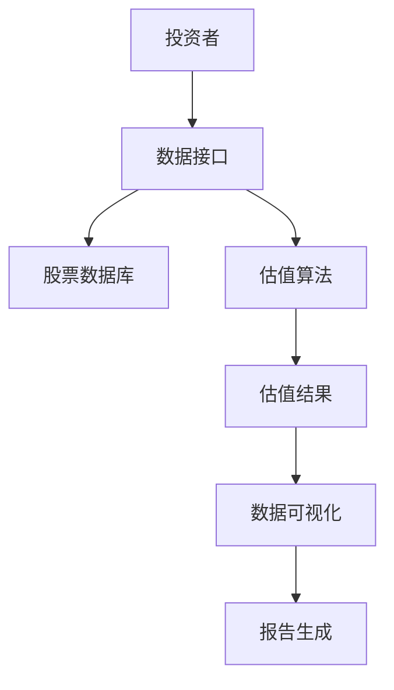
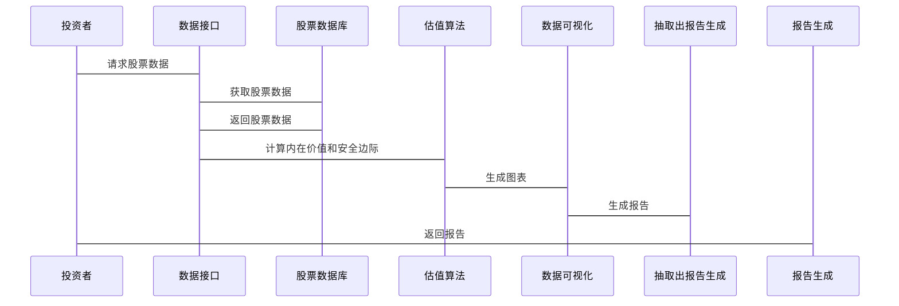

                 


# 格雷厄姆特价股票理论对公司估值方法的影响

## 关键词：
- 格雷厄姆
- 特价股票理论
- 公司估值
- 投资策略
- 价值投资

## 摘要：
格雷厄姆特价股票理论是价值投资的重要基石，它强调通过分析公司的基本面来寻找被市场低估的股票。本文将深入探讨格雷厄姆的理论如何影响公司估值方法，分析其数学模型和算法，并通过实际案例展示其应用。文章还结合系统分析与架构设计，提出了一种基于格雷厄姆理论的估值系统，并通过项目实战验证了其有效性和局限性。

---

# 第一部分: 格雷厄姆特价股票理论的背景与核心概念

## 第1章: 格雷厄姆及其投资理念

### 1.1 格雷厄姆的生平与投资哲学

#### 1.1.1 格雷厄姆的生平简介
 Benjamin Graham（1894-1976）是美国著名投资家、教授和作家，被誉为“价值投资之父”。他在20世纪初提出了许多影响深远的投资理论，其中包括“特价股票”（cheap stocks）的概念。他的思想对现代投资理论和实践产生了深远的影响。

#### 1.1.2 格雷厄姆的投资哲学与价值投资理念
 格雷厄姆的投资哲学的核心是“安全边际”（margin of safety），即以低于内在价值的价格买入股票，以确保投资的安全性。他认为市场波动是不可预测的，但可以通过分析公司的基本面来找到被市场低估的股票。

#### 1.1.3 格雷厄姆对现代投资理论的贡献
 格雷厄姆的理论为价值投资奠定了基础，他的学生包括沃伦·巴菲特（Warren Buffett）等著名投资者。他的思想强调长期投资、安全边际和对公司基本面的深入分析，这些原则至今仍被广泛应用于投资实践中。

### 1.2 格雷厄姆特价股票理论的起源

#### 1.2.1 特价股票的定义与特征
 特价股票是指市场价格低于其内在价值的股票。格雷厄姆认为，市场价与内在价值之间的差距为投资者提供了“安全边际”。以下是特价股票的几个关键特征：
 - 市场价格低于内在价值
 - 低市盈率（P/E ratio）
 - 低市净率（P/B ratio）
 - 高股息率（Dividend Yield）

#### 1.2.2 格雷厄姆特价股票理论的提出背景
 格雷厄姆在20世纪30年代经济大萧条期间提出了特价股票理论。当时，市场恐慌导致许多优质股票的价格被压低，为投资者提供了廉价买入的机会。他的理论为投资者在市场低迷时期提供了有效的投资策略。

#### 1.2.3 格雷厄姆理论的核心思想与原则
 格雷厄姆的核心思想是：
 1. **安全边际**：买入价格低于内在价值的股票，以降低投资风险。
 2. **价值投资**：通过分析公司的基本面，寻找具有长期竞争优势的公司。
 3. **分散投资**：通过投资多只股票分散风险，避免过度依赖单一股票。

---

## 第2章: 格雷厄姆特价股票理论的核心概念

### 2.1 特价股票理论的定义与特点

#### 2.1.1 特价股票的定义
 特价股票是指市场价格低于其内在价值的股票。格雷厄姆认为，内在价值可以通过对公司财务状况、盈利能力和发展前景的分析来估算。

#### 2.1.2 特价股票的核心特点
 - 低市盈率（P/E ratio）：市盈率 = 股价 / 每股净利润（EPS）
 - 低市净率（P/B ratio）：市净率 = 股价 / 每股净资产（BPS）
 - 高股息率（Dividend Yield）：股息率 = 每股股息 / 股价
 - 强大的财务状况：低负债率、高利润率、稳定的现金流

#### 2.1.3 特价股票与普通股票的对比分析
 下表对比了特价股票和普通股票的核心差异：

 | **指标**       | **特价股票**                     | **普通股票**                     |
 |----------------|--------------------------------|--------------------------------|
 | 市盈率（P/E）   | 低于行业平均水平                 | 接近或高于行业平均水平           |
 | 市净率（P/B）   | 低于1                            | 接近或高于1                      |
 | 股息率（Dividend Yield） | 较高                             | 较低                             |
 | 财务状况       | 强劲，低负债率                   | 较弱，高负债率                   |

### 2.2 格雷厄姆投资策略的关键要素

#### 2.2.1 安全边际的概念与重要性
 安全边际是格雷厄姆理论的核心思想。安全边际 = 内在价值 - 市场价格。通过买入具有较大安全边际的股票，投资者可以降低市场波动带来的风险。

#### 2.2.2 市盈率与市净率的分析
 市盈率（P/E）和市净率（P/B）是衡量股票价值的重要指标。格雷厄姆建议投资者关注低市盈率和低市净率的股票，因为这些股票更可能被市场低估。

#### 2.2.3 内在价值的计算方法
 格雷厄姆的内在价值公式如下：
 $$ 
 \text{内在价值} = \frac{\text{净利润} \times (5 + P/E)}{\text{股数}}
 $$
 其中，P/E是市盈率，股数是公司总股本。

---

## 第3章: 格雷厄姆特价股票理论的数学模型与算法

### 3.1 格雷厄姆估值模型的数学表达

#### 3.1.1 内在价值的计算公式
 内在价值公式：
 $$ 
 V = \frac{E \times (5 + P/E)}{N}
 $$
 其中：
 - \( E \)：公司净利润
 - \( P/E \)：市盈率
 - \( N \)：公司总股本

#### 3.1.2 安全边际的计算方法
 安全边际公式：
 $$ 
 \text{安全边际} = V - P
 $$
 其中：
 - \( V \)：内在价值
 - \( P \)：市场价格

#### 3.1.3 市盈率与市净率的数学关系
 市盈率与市净率的关系可以通过以下公式表示：
 $$ 
 P/E = \frac{P}{E}
 $$
 $$ 
 P/B = \frac{P}{B}
 $$
 其中：
 - \( P \)：股价
 - \( E \)：每股净利润
 - \( B \)：每股净资产

### 3.2 格雷厄姆估值算法的实现

#### 3.2.1 估值模型的输入参数
 输入参数包括：
 - 公司名称
 - 股价（P）
 - 净利润（E）
 - 总股本（N）
 - 每股净资产（B）

#### 3.2.2 估值算法的实现步骤
 1. 计算市盈率（P/E）：
    $$
    \text{P/E} = \frac{P}{E}
    $$
 2. 计算内在价值（V）：
    $$
    V = \frac{E \times (5 + \text{P/E})}{N}
    $$
 3. 计算安全边际：
    $$
    \text{安全边际} = V - P
    $$

#### 3.2.3 代码实现
 以下是一个Python代码示例，用于计算内在价值和安全边际：

 ```python
def calculate_intrinsic_value(stock_name, price, net_profit, shares_outstanding, book_value_per_share):
    pe = price / net_profit
    intrinsic_value = (net_profit * (5 + pe)) / shares_outstanding
    margin_ofSafety = intrinsic_value - price
    return {
        'stock_name': stock_name,
        'intrinsic_value': intrinsic_value,
        'margin_ofSafety': margin_ofSafety
    }

# 示例
stock_data = {
    'stock_name': 'Example Corp',
    'price': 20,
    'net_profit': 5,
    'shares_outstanding': 100,
    'book_value_per_share': 2
}

result = calculate_intrinsic_value(**stock_data)
print(f"股票名称: {result['stock_name']}")
print(f"内在价值: {result['intrinsic_value']}")
print(f"安全边际: {result['margin_ofSafety']}")
 ```

---

## 第4章: 系统分析与架构设计

### 4.1 问题场景介绍
 本文将构建一个基于格雷厄姆理论的股票估值系统，用于分析和筛选特价股票。

### 4.2 系统功能设计
 系统功能包括：
 - 数据收集：从数据库中获取股票的基本信息（股价、净利润、总股本、每股净资产等）。
 - 数据处理：计算市盈率、市净率、内在价值和安全边际。
 - 数据可视化：生成图表和报告，帮助用户直观理解股票的估值结果。

### 4.3 系统架构设计

#### 4.3.1 领域模型（ER图）
 下图展示了系统的实体关系：

```mermaid
erd
    图表
    class 投资者 {
        投资者ID
        投资者名称
    }
    class 股票 {
        股票代码
        股票名称
        股价
        净利润
        总股本
        每股净资产
    }
    class 估值结果 {
        股票代码
        内在价值
        安全边际
    }
    投资者 --> 股票: 持有
    股票 --> 估值结果: 对应
```

#### 4.3.2 系统架构图
 下图展示了系统的整体架构：



#### 4.3.3 系统接口设计
 系统接口包括：
 - 数据接口：从数据库中获取股票数据。
 - 估值接口：计算股票的内在价值和安全边际。
 - 可视化接口：生成图表和报告。

#### 4.3.4 系统交互流程图
 下图展示了系统的交互流程：



---

## 第5章: 项目实战

### 5.1 环境安装
 需要安装以下工具：
 - Python 3.8+
 - Pandas、NumPy、Matplotlib 等数据处理库
 - 数据库（如MySQL）

### 5.2 系统核心实现源代码
 以下是一个Python代码示例，用于实现股票估值系统的核心功能：

 ```python
import pandas as pd
import numpy as np

def calculate_intrinsic_value(stock_data):
    pe = stock_data['price'] / stock_data['net_profit']
    intrinsic_value = (stock_data['net_profit'] * (5 + pe)) / stock_data['shares_outstanding']
    margin_ofSafety = intrinsic_value - stock_data['price']
    return {
        'intrinsic_value': intrinsic_value,
        'margin_ofSafety': margin_ofSafety
    }

# 示例数据
data = {
    'stock_code': ['AAPL', 'GOOGL', 'MSFT'],
    'stock_name': ['Apple', 'Google', 'Microsoft'],
    'price': [150, 120, 80],
    'net_profit': [50, 40, 30],
    'shares_outstanding': [10, 20, 30],
    'book_value_per_share': [5, 6, 7]
}

df = pd.DataFrame(data)
results = df.apply(lambda x: calculate_intrinsic_value(x), axis=1)
 ```

### 5.3 代码应用解读与分析
 通过上述代码，我们可以计算每只股票的内在价值和安全边际。例如，对于Apple股票：
 - 市盈率（P/E）= 150 / 50 = 3
 - 内在价值（V）= (50 * (5 + 3)) / 10 = 40
 - 安全边际 = 40 - 150 = -110（负值表示市场价格高于内在价值）

### 5.4 实际案例分析和详细讲解剖析
 以实际案例为例，假设我们分析某公司的股票：
 - 股价（P）= 20
 - 净利润（E）= 5
 - 总股本（N）= 10
 - 每股净资产（B）= 2

 根据格雷厄姆的理论：
 - 市盈率（P/E）= 20 / 5 = 4
 - 内在价值（V）= (5 * (5 + 4)) / 10 = 4.5
 - 安全边际 = 4.5 - 20 = -15.5（负值表示股票被高估）

---

## 第6章: 总结与最佳实践

### 6.1 总结
 格雷厄姆的特价股票理论为投资者提供了寻找被低估股票的有效方法。通过分析公司的基本面和市场价与内在价值的差距，投资者可以找到具有安全边际的投资机会。

### 6.2 最佳实践 tips
 1. **长期投资**：格雷厄姆强调长期投资，避免短期市场的波动。
 2. **分散投资**：通过投资多只股票分散风险。
 3. **持续学习**：市场环境不断变化，投资者需要持续学习和调整策略。

### 6.3 小结
 格雷厄姆的理论虽然简单，但其核心思想——安全边际和价值投资，仍然是现代投资理论的重要组成部分。投资者可以通过深入分析公司的基本面，结合市场环境，找到具有长期竞争优势的公司。

### 6.4 注意事项
 - 特价股票理论适用于长期投资，不适合短期交易。
 - 投资者需要结合市场环境和公司具体情况，灵活调整投资策略。

### 6.5 拓展阅读
 - 《格雷厄姆投资经典》
 - 《巴菲特的估值方法》
 - 《价值投资入门》

---

# 作者：AI天才研究院 & 禅与计算机程序设计艺术

