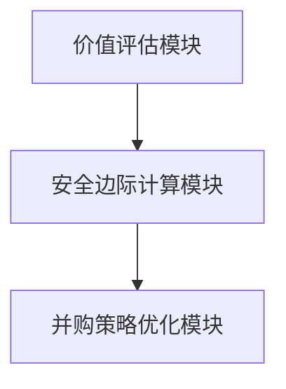
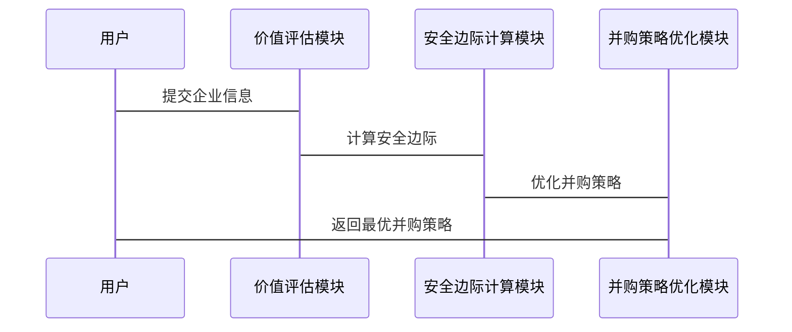

                 


# 格雷厄姆特价股票理论对公司并购策略的影响

> 关键词：格雷厄姆特价股票理论, 并购策略, 价值投资, 安全边际, 投资模型, 并购定价, 风险管理

> 摘要：本文探讨了本杰明·格雷厄姆的特价股票理论对公司并购策略的影响。通过分析价值投资的核心原则、安全边际的概念，以及这些理论在并购定价和风险管理中的应用，本文提出了基于格雷厄姆理论的并购策略优化模型，并通过实际案例展示了其在现代企业并购中的实践价值。

---

## 第一部分: 格雷厄姆特价股票理论的背景与核心概念

### 第1章: 格雷厄姆特价股票理论的背景与核心概念

#### 1.1 格雷厄姆特价股票理论的背景

##### 1.1.1 价值投资的起源与发展
价值投资作为一种投资策略，起源于20世纪初。本杰明·格雷厄姆是该理论的奠基人之一，他的投资理念强调以低于内在价值的价格购买优质资产。这种理念在当时传统投资方法的基础上，引入了更为严谨的数学模型和风险管理方法，为现代投资理论奠定了基础。

##### 1.1.2 格雷厄姆投资理念的形成
格雷厄姆的投资理念深受其导师 Benjamin Graham的影响，他在1934年出版的《证券分析》一书中系统阐述了价值投资的方法。他认为，市场波动是投资者的敌人，而投资的真正目标是找到那些市场价格低于其内在价值的股票。

##### 1.1.3 特价股票的概念与特点
特价股票是指市场价格显著低于其内在价值的股票。格雷厄姆认为，这种价格差异为投资者提供了安全边际，即市场价格与内在价值之间的差距越大，投资的风险越小。

#### 1.2 格雷厄姆特价股票理论的核心概念

##### 1.2.1 价值投资的基本原则
价值投资的核心在于寻找市场先生的错误定价。格雷厄姆提出，市场波动往往导致股票价格与内在价值脱节，投资者应利用这种脱节寻找投资机会。

##### 1.2.2 网络安全与投资决策
在现代投资环境中，网络安全已成为影响投资决策的重要因素。格雷厄姆的理论提醒投资者，除了市场波动，还需要关注数据安全和信息泄露对股价的影响。

##### 1.2.3 投资中的安全边际
安全边际是格雷厄姆理论中的核心概念，它是指市场价格与内在价值之间的差距。通过购买具有较大安全边际的股票，投资者可以降低投资风险。

#### 1.3 格雷厄姆特价股票理论的数学模型

##### 1.3.1 价值评估的公式推导
格雷厄姆的价值评估公式基于企业内在价值的计算。以下是公式推导：

$$ V = \frac{E}{P} $$

其中，V为内在价值，E为企业盈利，P为股票价格。

##### 1.3.2 安全边际的计算方法
安全边际计算公式如下：

$$ S = V - P $$

其中，S为安全边际，V为内在价值，P为市场价格。安全边际越大，投资的风险越小。

---

### 第2章: 格雷厄姆特价股票理论对并购策略的影响

#### 2.1 并购策略的背景与挑战

##### 2.1.1 并购的动机与目标
企业并购的主要动机包括扩大市场份额、获取技术优势、实现协同效应等。格雷厄姆的理论为并购定价提供了新的视角。

##### 2.1.2 并购中的常见问题
并购过程中常见的问题包括信息不对称、估值偏差、整合风险等。格雷厄姆的理论强调了安全边际在降低估值风险中的作用。

##### 2.1.3 格雷厄姆理论在并购中的应用
格雷厄姆的理论为并购定价提供了基于内在价值的评估方法，帮助投资者识别低估的标的，从而降低并购成本。

#### 2.2 格雷厄姆理论对并购定价的影响

##### 2.2.1 并购定价的数学模型
以下是并购定价的数学模型：

$$ P = \frac{E}{V} $$

其中，P为并购价格，E为企业盈利，V为内在价值。

##### 2.2.2 安全边际在并购定价中的应用
安全边际在并购定价中的应用如下：

$$ S = P - V $$

其中，S为安全边际，P为并购价格，V为内在价值。安全边际越大，并购风险越小。

#### 2.3 并购策略中的风险管理

##### 2.3.1 风险评估与管理
格雷厄姆的理论强调了风险管理的重要性。投资者应通过安全边际的计算，评估并购中的潜在风险。

##### 2.3.2 格雷厄姆理论在风险管理中的应用
通过计算安全边际，投资者可以识别那些具有较大安全边际的并购标的，从而降低投资风险。

##### 2.3.3 并购后的整合策略
格雷厄姆的理论提醒投资者，并购后的整合策略至关重要。整合过程中的协同效应和成本控制是实现并购价值的关键。

---

## 第三部分: 格雷厄姆特价股票理论的系统架构设计

### 第3章: 格雷厄姆特价股票理论的系统架构设计

#### 3.1 系统功能设计

##### 3.1.1 价值评估模块
价值评估模块负责计算目标企业的内在价值，基于格雷厄姆的价值评估公式。

##### 3.1.2 安全边际计算模块
安全边际计算模块根据市场价格和内在价值，计算安全边际，评估投资风险。

##### 3.1.3 并购策略优化模块
并购策略优化模块根据安全边际和内在价值，优化并购策略，降低投资风险。

#### 3.2 系统架构设计

##### 3.2.1 系统架构图


#### 3.3 接口设计与交互流程

##### 3.3.1 API接口设计
以下是系统的主要API接口：

- `get_intrinsic_value(enterprise_value, earnings)`：计算内在价值
- `calculate_safety_margin(value, price)`：计算安全边际
- `optimize_acquisition_strategy(safety_margin)`：优化并购策略

##### 3.3.2 用户交互流程图


---

## 第四部分: 格雷厄姆特价股票理论的项目实战

### 第4章: 格雷厄姆特价股票理论的项目实战

#### 4.1 项目环境安装

##### 4.1.1 安装Python环境
建议使用Anaconda Python Distribution，安装步骤如下：

1. 下载并安装Anaconda：[https://www.anaconda.com/](https://www.anaconda.com/)
2. 配置环境变量

##### 4.1.2 安装相关库
安装numpy和pandas库：

```bash
pip install numpy pandas
```

#### 4.2 核心代码实现

##### 4.2.1 价值评估函数
```python
import numpy as np

def get_intrinsic_value(enterprise_value, earnings):
    return earnings / enterprise_value

# 示例数据
enterprise_value = 100000000
earnings = 10000000
intrinsic_value = get_intrinsic_value(enterprise_value, earnings)
print(f"内在价值: ${intrinsic_value}")
```

##### 4.2.2 安全边际计算函数
```python
def calculate_safety_margin(value, price):
    return value - price

# 示例数据
value = 50
price = 40
safety_margin = calculate_safety_margin(value, price)
print(f"安全边际: ${safety_margin}")
```

#### 4.3 项目实战案例分析

##### 4.3.1 案例介绍
假设某企业计划并购另一家公司，目标公司的企业价值为1亿美元，年收益为1000万美元。

##### 4.3.2 并购定价分析
使用格雷厄姆的理论，计算目标公司的内在价值和安全边际。

```python
enterprise_value = 100000000
earnings = 10000000
target_price = 40

intrinsic_value = earnings / enterprise_value
print(f"内在价值: ${intrinsic_value}")

safety_margin = intrinsic_value - target_price
print(f"安全边际: ${safety_margin}")
```

##### 4.3.3 并购策略优化
根据安全边际的计算结果，调整并购价格，确保安全边际为正值。

---

## 第五部分: 格雷厄姆特价股票理论的最佳实践

### 第5章: 格雷厄姆特价股票理论的最佳实践

#### 5.1 最佳实践 tips

##### 5.1.1 投资前的充分研究
在进行任何投资之前，投资者应进行充分的市场研究和数据分析，确保投资决策的科学性和严谨性。

##### 5.1.2 定期评估投资组合
定期评估投资组合，根据市场变化和企业状况，调整投资策略，确保投资组合的稳健性。

##### 5.1.3 注意风险管理
投资者应时刻关注投资组合中的风险因素，通过合理配置资产和分散投资，降低整体风险。

##### 5.1.4 结合现代投资工具
在实际投资中，投资者可以结合现代投资工具和技术，如大数据分析和人工智能，提升投资决策的效率和准确性。

#### 5.2 小结
格雷厄姆的特价股票理论为投资者提供了科学的投资方法和风险管理策略。通过合理应用这些理论，投资者可以在复杂多变的市场环境中，实现稳健的投资回报。

#### 5.3 注意事项

##### 5.3.1 投资有风险，入市需谨慎
投资者在进行任何投资之前，应充分了解投资的风险，并根据自身的风险承受能力，选择合适的投资策略。

##### 5.3.2 理论与实践相结合
格雷厄姆的理论虽然科学，但在实际应用中，投资者需要根据市场环境和企业状况，灵活调整投资策略。

##### 5.3.3 关注长期价值
格雷厄姆的价值投资理念强调长期价值，投资者应关注企业的长期发展，而非短期市场波动。

#### 5.4 拓展阅读

##### 5.4.1 格雷厄姆的经典著作
1. 《证券分析》
2. 《聪明的投资者》

##### 5.4.2 现代投资理论
1. 马科维茨的现代投资组合理论（MPT）
2. 布林克曼的投资组合理论

##### 5.4.3 相关书籍推荐
1. 《价值投资实战策略》
2. 《投资的艺术》

---

## 作者：AI天才研究院/AI Genius Institute & 禅与计算机程序设计艺术 /Zen And The Art of Computer Programming

---

**本文遵循CC协议，转载请注明出处。**

