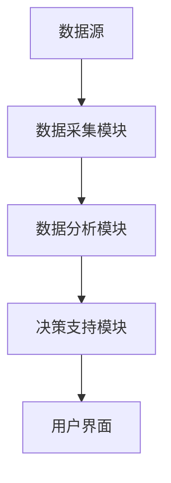

                 


# 格雷厄姆特价股票理论对公司数字化生态战略的影响

> 关键词：格雷厄姆特价股票理论, 数字化生态战略, 价值投资, 数字化转型, 企业战略

> 摘要：本文探讨了格雷厄姆的价值投资理论，特别是特价股票理论，对公司数字化生态战略的影响。通过分析价值投资的核心概念、数字化生态系统的构建要素，以及两者之间的联系，文章旨在为企业提供优化资源配置、提升竞争力的策略。同时，文章结合实际案例和数学模型，深入阐述了如何在数字化转型中应用格雷厄姆的投资理念，以实现可持续的业务增长和生态系统的优化。

---

# 第一部分: 格雷厄姆特价股票理论与数字化生态战略的背景介绍

## 第1章: 格雷厄姆特价股票理论概述

### 1.1 格雷厄姆特价股票理论的起源与核心观点

#### 1.1.1 价值投资的起源与发展
价值投资是一种长期投资策略，起源于20世纪初，由本杰明·格雷厄姆和戴维·多德共同提出。格雷厄姆在其著作《证券分析》中系统阐述了价值投资的理念，强调以低于内在价值的价格购买股票。

#### 1.1.2 格雷厄姆的投资理念与方法
格雷厄姆的价值投资理论基于以下几个核心观点：
1. **安全边际**：购买股票时，应确保其市场价格低于其内在价值，以降低投资风险。
2. **内在价值计算**：通过分析企业的财务状况、盈利能力和发展潜力，计算其内在价值。
3. **逆向思维**：在市场恐慌时寻找被低估的投资机会。

#### 1.1.3 特价股票理论的核心观点
格雷厄姆的特价股票理论强调，投资者应关注市场中被低估的股票，即市场价格远低于内在价值的股票。这种股票通常在市场低迷或企业面临短期困境时出现，但具备长期投资价值。

### 1.2 数字化生态战略的背景与意义

#### 1.2.1 数字化转型的现状与趋势
随着信息技术的发展，企业正面临前所未有的数字化转型压力。数字化转型不仅是技术升级，更是商业模式和组织结构的深刻变革。企业需要构建一个以数据驱动为核心的生态系统，以应对市场的快速变化。

#### 1.2.2 数字化生态系统的构成要素
数字化生态系统包括以下几个核心要素：
1. **数据采集与处理**：通过物联网、大数据等技术，实时采集和处理企业内外部数据。
2. **业务流程优化**：利用数字化工具优化企业运营流程，提升效率。
3. **决策支持**：基于数据分析和预测模型，为企业决策提供支持。

#### 1.2.3 数字化生态战略的重要性
在数字化转型中，企业需要构建一个开放、协同、高效的数字化生态系统，以实现资源的最优配置和业务的持续创新。这种生态系统能够帮助企业在竞争中占据优势，同时适应市场变化。

---

## 第2章: 格雷厄姆特价股票理论与数字化生态战略的核心概念与联系

### 2.1 格雷厄姆特价股票理论的核心概念

#### 2.1.1 内在价值的计算
内在价值是企业未来现金流的现值。格雷厄姆提出，内在价值公式为：
$$ V = \frac{E}{1 + r} $$
其中，V为内在价值，E为未来现金流，r为折现率。

#### 2.1.2 安全边际的计算
安全边际是市场价格与内在价值之间的差额：
$$ \text{安全边际} = V - P $$
其中，P为市场价格。

### 2.2 数字化生态战略的核心要素

#### 2.2.1 数字化生态系统的构成模块
数字化生态系统由以下几个模块组成：
1. **数据采集模块**：负责采集企业内外部数据。
2. **数据分析模块**：对数据进行处理和分析，生成洞察。
3. **决策支持模块**：基于分析结果，为企业决策提供支持。

#### 2.2.2 数字化生态系统的评价指标
数字化生态系统的核心评价指标包括：
1. **效率指标**：如数据处理速度、系统响应时间。
2. **效果指标**：如企业盈利能力、市场占有率。

---

## 第3章: 格雷厄姆特价股票理论与数字化生态战略的联系

### 3.1 格雷厄姆投资模型的数学表达
格雷厄姆的价值投资模型可以用以下公式表示：
$$ \text{安全边际} = \text{内在价值} - \text{市场价格} $$

### 3.2 数字化生态系统中的价值投资策略
在数字化生态系统中，价值投资策略可以应用于以下几个方面：
1. **资源优化配置**：通过分析数据，识别企业中的低效资源，并进行优化配置。
2. **风险控制**：通过数据监控和预测模型，降低投资风险。

---

## 第4章: 数字化生态战略中的算法与数学模型

### 4.1 内在价值的计算算法
以下是一个计算内在价值的Python代码示例：

```python
def calculate_intrinsic_value(future_cash_flows, discount_rate):
    present_value = sum([cf / (1 + discount_rate)**i for i, cf in enumerate(future_cash_flows)])
    return present_value
```

### 4.2 安全边际的计算
安全边际的计算公式为：
$$ \text{安全边际} = V - P $$

---

## 第5章: 数字化生态系统中的系统架构与设计

### 5.1 系统架构设计
以下是一个数字化生态系统的架构图（使用Mermaid）：



### 5.2 系统接口设计
系统接口设计包括以下几个部分：
1. 数据接口：与数据源对接，获取实时数据。
2. 用户接口：提供友好的用户界面，方便用户操作。

---

## 第6章: 项目实战

### 6.1 环境安装
安装必要的软件和工具，如Python、Jupyter Notebook等。

### 6.2 核心实现
以下是一个价值投资模型的Python代码示例：

```python
def calculate_intrinsic_value(future_cash_flows, discount_rate):
    present_value = sum([cf / (1 + discount_rate)**i for i, cf in enumerate(future_cash_flows)])
    return present_value

# 示例数据
future_cash_flows = [100, 200, 300]
discount_rate = 0.1

# 计算内在价值
intrinsic_value = calculate_intrinsic_value(future_cash_flows, discount_rate)
print("内在价值:", intrinsic_value)
```

### 6.3 案例分析
以某科技公司为例，分析其数字化生态系统的构建和优化过程。

---

## 第7章: 最佳实践与小结

### 7.1 实施策略
1. **数据驱动决策**：充分利用数据进行分析和预测。
2. **持续优化**：定期评估和优化数字化生态系统。

### 7.2 注意事项
1. **数据质量**：确保数据的准确性和完整性。
2. **风险管理**：建立完善的风险控制机制。

### 7.3 未来趋势
随着人工智能和大数据技术的不断发展，数字化生态系统的构建将更加智能化和个性化。

---

## 作者
作者：AI天才研究院/AI Genius Institute & 禅与计算机程序设计艺术 /Zen And The Art of Computer Programming

