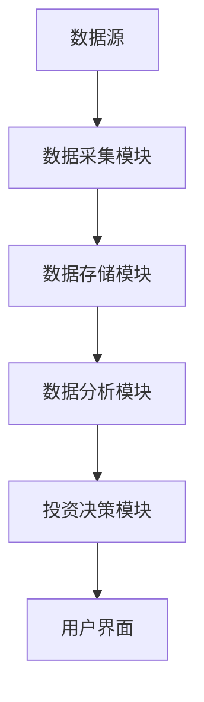
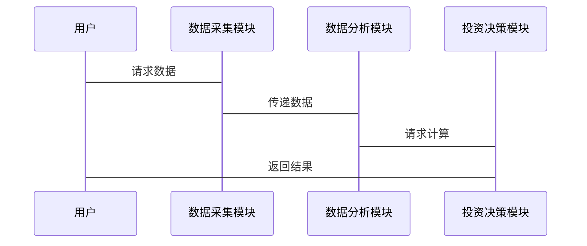

                 


# 格雷厄姆特价股票理论对公司数字化生态战略转型的影响

## 关键词：
- 格雷厄姆投资理论
- 特价股票
- 数字化转型
- 企业战略
- 数字化生态
- 投资策略

## 摘要：
本文探讨了格雷厄姆的价值投资理论如何影响公司的数字化生态战略转型。通过分析特价股票的核心概念，结合数学模型和算法，本文展示了如何将格雷厄姆的理论数字化应用于现代企业战略。文章详细阐述了从理论到实践的全过程，包括背景介绍、核心概念分析、算法实现、系统架构设计以及实际案例分析，为企业的数字化转型提供了理论和实践指导。

---

### 第一部分：格雷厄姆特价股票理论概述

#### 第1章：格雷厄姆特价股票理论的背景与核心观点

##### 1.1 格雷厄姆投资理论的起源与发展

格雷厄姆的价值投资理论起源于20世纪，其核心思想是“安全边际”。格雷厄姆认为，投资者应以低于内在价值的价格购买资产，以确保投资的安全性。这种理论在《证券分析》和《聪明的投资者》中得到了详细阐述。

**核心观点：**
- 投资的本质是购买企业的一部分。
- 安全边际是投资的关键，即购买价格低于内在价值。
- 长期投资优于短期交易。

##### 1.2 格雷厄姆特价股票的定义与特征

特价股票是指市场价格低于其内在价值的股票。格雷厄姆提出了多个筛选标准，包括低市盈率、低市净率和高股息率等。

**特征：**
| 特征 | 描述 |
|------|------|
| 市盈率 | 低于市场平均水平 |
| 市净率 | 低于行业平均水平 |
| 股息率 | 高于行业平均水平 |

##### 1.3 格雷厄姆投资策略的数学模型

格雷厄姆的内在价值公式为：
$$
\text{内在价值} = \frac{\text{收益} \times (1 + \text{增长率})}{\text{资本成本}}
$$
安全边际的计算公式为：
$$
\text{安全边际} = \text{内在价值} - \text{市场价格}
$$

#### 第2章：格雷厄姆投资理论的数字化应用

##### 2.1 数字化生态战略的定义与特点

数字化生态是指企业通过数字技术构建的生态系统，包括数据、技术平台和商业模式。其特点包括数据驱动、智能化和生态协同。

##### 2.2 格雷厄姆理论与数字化转型的联系

格雷厄姆的理论强调安全边际和内在价值，这与数字化转型中的数据驱动决策和风险管理高度契合。

---

### 第二部分：格雷厄姆特价股票理论的数学模型与算法

#### 第3章：格雷厄姆投资模型的数学分析

##### 3.1 格雷厄姆内在价值计算公式

内在价值的计算涉及收益、增长率和资本成本。公式为：
$$
\text{内在价值} = \frac{E \times (1 + g)}{k}
$$
其中，$E$ 是收益，$g$ 是增长率，$k$ 是资本成本。

##### 3.2 市盈率与市净率的数学模型

市盈率（P/E）计算公式为：
$$
P/E = \frac{\text{市场价格}}{\text{每股收益}}
$$
市净率（P/B）计算公式为：
$$
P/B = \frac{\text{市场价格}}{\text{每股净资产}}
$$

##### 3.3 安全边际的数学表达

安全边际为内在价值与市场价格的差值：
$$
\text{安全边际} = V - P
$$

#### 第4章：格雷厄姆投资策略的算法实现

##### 4.1 投资策略的算法框架

算法流程如下：
1. 数据收集：获取股票的历史数据。
2. 计算内在价值：使用格雷厄姆公式。
3. 筛选股票：过滤出价格低于内在价值的股票。

##### 4.2 投资策略的Python实现

```python
def calculate_intrinsic_value(earnings, growth_rate, cost_of_capital):
    return (earnings * (1 + growth_rate)) / cost_of_capital

def screen_stocks(stocks):
    selected = []
    for stock in stocks:
        iv = calculate_intrinsic_value(stock.earnings, stock.growth_rate, stock.cost_of_capital)
        if stock.price < iv:
            selected.append(stock)
    return selected

# 示例使用
stocks = [...]  # 包含所有股票数据
selected_stocks = screen_stocks(stocks)
print("筛选出的特价股票为:", selected_stocks)
```

---

### 第三部分：系统分析与架构设计

#### 第5章：系统分析与架构设计

##### 5.1 问题场景介绍

企业需要通过数字化手段优化投资决策，提升战略转型效率。

##### 5.2 系统功能设计

系统功能模块包括：
- 数据采集模块：收集股票数据。
- 数据分析模块：计算内在价值和安全边际。
- 投资决策模块：筛选特价股票。

##### 5.3 系统架构设计

Mermaid架构图：


##### 5.4 系统接口设计

接口描述：
- 数据采集模块：接收外部数据源接口。
- 数据分析模块：提供API用于计算内在价值。
- 投资决策模块：返回筛选结果。

##### 5.5 系统交互设计

Mermaid序列图：


---

### 第四部分：项目实战

#### 第6章：项目实战

##### 6.1 环境安装

安装Python和必要的库：
```bash
pip install pandas numpy matplotlib
```

##### 6.2 核心实现代码

```python
import pandas as pd

def main():
    # 数据加载
    df = pd.read_csv('stocks.csv')
    # 计算内在价值
    df['内在价值'] = df['收益'] * (1 + df['增长率']) / df['资本成本']
    # 筛选特价股票
    df['是否特价'] = df['价格'] < df['内在价值']
    print(df[df['是否特价'] == True])

if __name__ == "__main__":
    main()
```

##### 6.3 案例分析

以某公司为例，计算其内在价值和安全边际，判断是否为特价股票。

##### 6.4 项目小结

通过代码实现，我们可以有效筛选出符合条件的特价股票，为投资决策提供支持。

---

### 第五部分：最佳实践

#### 第7章：最佳实践

##### 7.1 小结

格雷厄姆的理论结合数字化技术，为企业的投资决策提供了新的思路。

##### 7.2 注意事项

- 数据的准确性和完整性至关重要。
- 算法需要定期更新以适应市场变化。

##### 7.3 拓展阅读

建议阅读《证券分析》和《聪明的投资者》深入理解格雷厄姆的理论。

---

### 作者信息

作者：AI天才研究院/AI Genius Institute & 禅与计算机程序设计艺术 /Zen And The Art of Computer Programming

