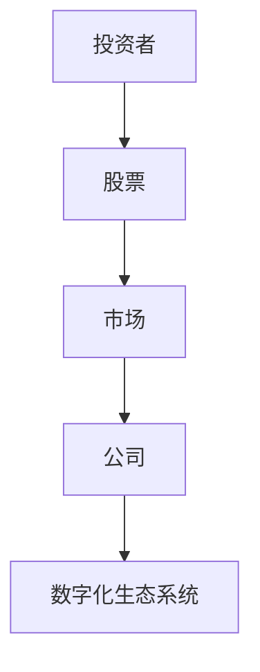
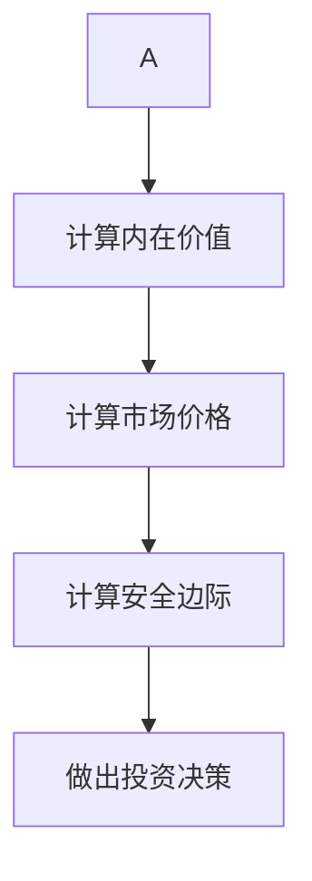
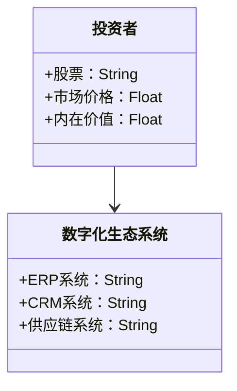

                 


# 格雷厄姆特价股票理论对公司数字化生态系统共生进化的影响

> 关键词：格雷厄姆投资理论、数字化生态系统、股票分析、共生进化、价值投资

> 摘要：本文探讨了格雷厄姆的特价股票理论如何影响公司数字化生态系统的共生进化。通过分析价值投资的核心原理、数字化生态系统的构建，以及两者之间的相互作用，本文揭示了如何利用格雷厄姆的投资理念优化企业的数字化战略，实现长期价值增长。

---

# 第1章: 格雷厄姆特价股票理论与数字化生态系统概述

## 1.1 格雷厄姆投资理论的核心概念

### 1.1.1 价值投资的基本原理

格雷厄姆的价值投资理论强调以低于内在价值的价格买入股票，长期持有，等待市场重新评估其真实价值。其核心在于“安全边际”的概念，即内在价值与市场价格之间的差距越大，投资风险越小，潜在回报越高。

$$ V = \frac{E}{1 + r} $$
其中，\( V \) 是股票的内在价值，\( E \) 是企业的预期收益，\( r \) 是期望的收益率。

### 1.1.2 特价股票的定义与特征

格雷厄姆将“特价股票”定义为市场价格低于内在价值的股票。其特征包括：
1. 价格低估：市场价格显著低于计算出的内在价值。
2. 低市盈率：市盈率低于行业平均水平。
3. 高股息率：股息收益率远高于行业平均水平。

### 1.1.3 格雷厄姆投资策略的现代应用

格雷厄姆的投资策略在现代金融市场中依然具有重要价值，尤其是在数字化时代，投资者可以利用大数据和人工智能技术更精准地计算内在价值和市场价格差异。

---

## 1.2 公司数字化生态系统的基本概念

### 1.2.1 数字化生态系统的定义

数字化生态系统是指由数字技术构建的、包含企业内外部所有参与者（如供应商、客户、合作伙伴等）的复杂系统。它通过数据流、信息交互和自动化流程实现各个模块的协同工作。

### 1.2.2 数字化生态系统的构成要素

1. **核心系统**：ERP、CRM、供应链管理系统等。
2. **数据层**：数据采集、存储、分析和应用。
3. **用户层**：员工、客户、合作伙伴等。
4. **技术层**：云计算、大数据、人工智能等技术支撑。

### 1.2.3 数字化生态系统与传统商业模式的区别

数字化生态系统更加注重数据驱动的决策、自动化流程和实时反馈，而传统商业模式更多依赖于人工操作和静态流程。

---

## 1.3 格雷厄姆理论与数字化生态系统的关联性

### 1.3.1 格雷厄姆理论在现代企业中的适用性

格雷厄姆的理论强调长期价值，这与数字化生态系统的目标一致。通过长期投资和优化数字化系统，企业可以实现持续的价值增长。

### 1.3.2 数字化生态系统对格雷厄姆理论的影响

数字化生态系统为投资者提供了更丰富的数据和工具，使得内在价值的计算更加精准。同时，数字化转型也为企业提供了更高的透明度和效率，从而影响市场价格。

### 1.3.3 格雷厄姆理论对公司数字化转型的指导意义

格雷厄姆的理论提醒企业在数字化转型中要注重基本面分析，避免盲目追求短期收益。通过构建稳定的数字化生态系统，企业可以在竞争中保持长期优势。

---

# 第2章: 格雷厄姆理论的核心概念与联系

## 2.1 核心概念原理

### 2.1.1 价值投资的核心公式

$$ V = \frac{E}{1 + r} $$
其中，\( V \) 是股票的内在价值，\( E \) 是企业的预期收益，\( r \) 是期望的收益率。

### 2.1.2 市场先生的概念与作用

格雷厄姆提出了“市场先生”的概念，认为市场价格波动反映了市场情绪，而非企业的实际价值。在数字化生态系统中，市场先生的角色通过数据和算法得以体现。

### 2.1.3 股票内在价值的计算方法

内在价值的计算需要考虑企业的盈利能力、成长潜力、行业地位等因素。数字化生态系统为企业提供了更高效的数据分析工具，使得内在价值的计算更加准确。

---

## 2.2 核心概念属性特征对比表格

| 概念 | 特性 | 描述 |
|------|------|------|
| 内在价值 | 稳定性 | 股票的真实价值，不受市场波动影响 |
| 市场价值 | 波动性 | 受市场情绪和供需影响 |
| 安全边际 | 保护性 | 内在价值与市场价值的差异，提供风险保护 |

---

## 2.3 ER实体关系图（Mermaid流程图）



---

# 第3章: 格雷厄姆理论的算法原理与数学模型

## 3.1 格雷厄姆投资算法概述

### 3.1.1 算法输入：股票基本面数据

1. 营业收入
2. 净利润
3. 现金流
4. 市盈率
5. 市净率

### 3.1.2 算法处理：内在价值计算

$$ V = \frac{E}{1 + r} $$
其中，\( E \) 是企业的预期收益，\( r \) 是期望的收益率。

### 3.1.3 算法输出：投资决策

1. 买入信号：市场价格 < 内在价值
2. 卖出信号：市场价格 > 内在价值 + 安全边际

---

## 3.2 数学模型与公式

### 3.2.1 内在价值计算公式

$$ V = \frac{E}{1 + r} $$

### 3.2.2 安全边际计算公式

$$ S = V_{\text{内在}} - V_{\text{市场}} $$

---

## 3.3 算法流程图（Mermaid）



---

# 第4章: 数字化生态系统中的格雷厄姆理论应用

## 4.1 系统分析与架构设计方案

### 4.1.1 问题场景介绍

企业在数字化转型中需要构建高效、稳定的生态系统，同时利用格雷厄姆的理论优化投资决策。

### 4.1.2 系统功能设计（领域模型Mermaid类图）



### 4.1.3 系统架构设计Mermaid架构图


---

## 4.2 项目实战

### 4.2.1 环境安装

1. 安装Python和必要的库（如pandas、numpy）。
2. 配置数据库和API接口。

### 4.2.2 系统核心实现源代码

```python
def calculate_intrinsic_value(enterprise_value, expected_profit):
    return enterprise_value / (1 + expected_profit)
```

### 4.2.3 代码应用解读与分析

上述代码计算企业的内在价值，考虑了企业的实际收益和期望收益率。通过与市场价格的对比，投资者可以判断是否存在安全边际。

---

## 4.3 案例分析

### 4.3.1 实际案例分析

某企业通过数字化生态系统优化供应链管理，降低了成本，提高了利润率，从而提高了内在价值。

### 4.3.2 详细讲解剖析

通过分析企业数字化转型前后的数据，可以发现内在价值的变化趋势，从而指导投资决策。

---

## 4.4 项目小结

通过结合格雷厄姆理论和数字化生态系统，企业可以实现更精准的投资决策和更高效的运营管理。

---

# 第5章: 格雷厄姆理论与数字化生态系统共生进化的机制

## 5.1 共生进化的核心机制

### 5.1.1 协同进化

企业通过优化数字化生态系统，提升内在价值，同时市场价格也受到市场先生的影响。

### 5.1.2 反馈机制

市场价格的变化会反馈到企业的数字化系统，进一步优化其运营策略。

---

## 5.2 共生进化的系统架构设计


---

## 5.3 共生进化的反馈循环

1. 投资者根据数字化系统的数据做出投资决策。
2. 市场价格的变化反馈到企业的数字化系统。
3. 企业根据反馈优化其运营策略，进一步影响内在价值。

---

# 第6章: 格雷厄姆理论与数字化生态系统共生进化的案例分析

## 6.1 案例背景介绍

某科技公司通过构建数字化生态系统，优化供应链和客户管理，显著提高了内在价值。

## 6.2 案例分析与解读

通过分析该公司的数据，可以发现其内在价值的提升与其数字化转型密不可分。

---

## 6.3 案例总结

格雷厄姆理论与数字化生态系统相结合，为企业提供了更强大的竞争优势。

---

# 第7章: 格雷厄姆理论与数字化生态系统共生进化的总结与展望

## 7.1 总结

本文探讨了格雷厄姆理论与数字化生态系统之间的关系，分析了其在共生进化中的作用和影响。

## 7.2 展望

未来，随着人工智能和大数据技术的进一步发展，格雷厄姆理论在数字化生态系统中的应用将更加广泛和深入。

---

# 作者：AI天才研究院/AI Genius Institute & 禅与计算机程序设计艺术 /Zen And The Art of Computer Programming

