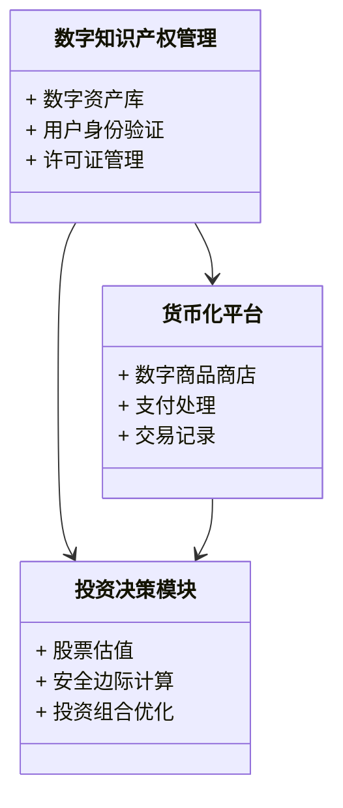
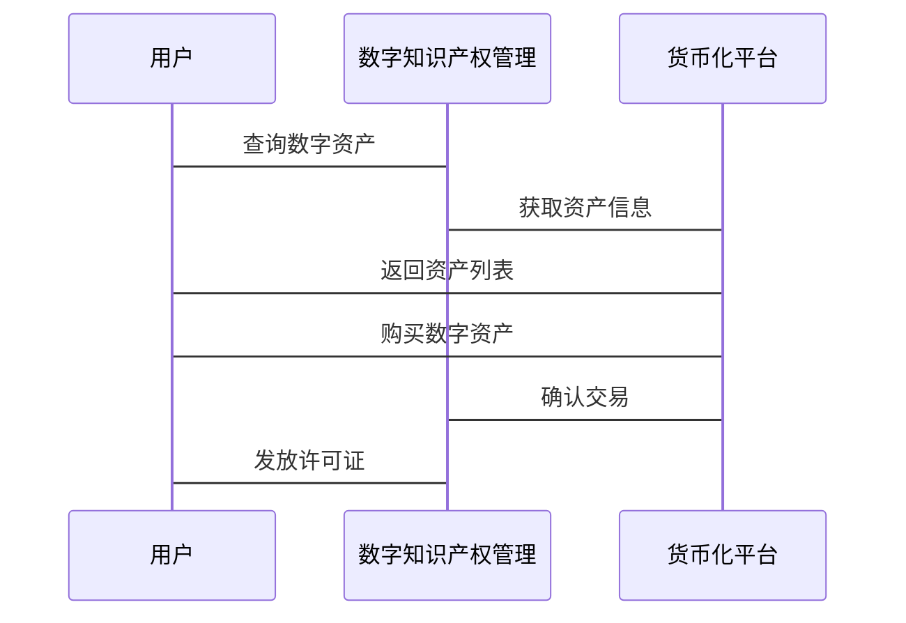
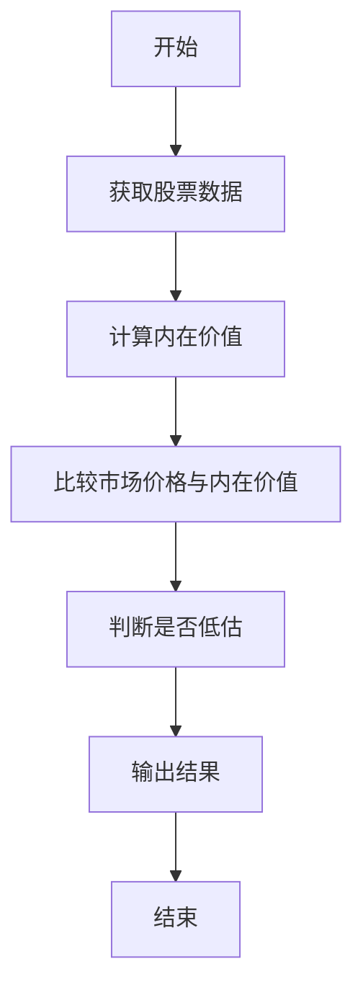

                 


# 格雷厄姆特价股票理论对公司数字知识产权货币化战略的影响

> 关键词：格雷厄姆投资理论、数字知识产权、货币化战略、价值投资、安全边际

> 摘要：本文探讨了格雷厄姆的特价股票理论如何影响公司的数字知识产权货币化战略。通过分析价值投资、安全边际等核心概念，结合实际案例和系统设计，展示了如何利用这些理论优化数字资产配置和管理。

---

## 第一部分: 格雷厄姆特价股票理论概述

### 第1章: 格雷厄姆特价股票理论的核心概念

#### 1.1 格雷厄姆特价股票理论的背景

- **投资理论的发展历程**
  - 格雷厄姆是价值投资的鼻祖，其理论在20世纪初形成。
  - 他的理论强调安全边际和内在价值，为投资者提供了长期稳定的收益策略。

- **格雷厄姆投资理念的形成**
  - 格雷厄姆在《证券分析》中提出，股票应被视为企业的部分所有权。
  - 他强调以低于内在价值的价格买入股票，注重企业的基本面分析。

- **特价股票理论的定义与特点**
  - 特价股票是指市场价格低于其内在价值的股票。
  - 这种股票通常被视为被市场低估，具有长期增值的潜力。

#### 1.2 格雷厄姆投资策略的关键要素

- **安全边际的概念**
  - 安全边际是市场价格与内在价值之间的差距。
  - 通过购买具有较大安全边际的股票，降低投资风险。

- **价值投资的核心原则**
  - 长期投资，避免频繁交易。
  - 选择具有强大基本面和竞争优势的企业。

- **股票内在价值的计算方法**
  - 使用DCF模型（现金流折现法）估算企业价值。
  - 格雷厄姆的公式：内在价值 = 息税折旧摊销前利润 / 加权平均资本成本。

### 第2章: 数字知识产权的货币化战略

#### 2.1 数字知识产权的基本概念

- **知识产权的定义与类型**
  - 知识产权包括专利、商标、版权等。
  - 数字知识产权涉及软件、数据、算法等。

- **数字知识产权的独特性**
  - 易复制性：数字内容可以轻松复制，增加了保护难度。
  - 全球性：数字产品可以迅速传播到全球市场。

- **数字知识产权的保护与管理**
  - 使用法律手段保护专利和版权。
  - 建立有效的管理系统，监控和应对侵权行为。

#### 2.2 数字知识产权的货币化模式

- **许可证模式**
  - 将知识产权授权给第三方使用，收取许可费。
  - 适用于软件和技术服务。

- **交易模式**
  - 在数字市场平台上销售数字产品，如音乐、视频、电子书。
  - 利用在线支付系统实现交易。

- **平台模式**
  - 构建平台，连接创作者和消费者，抽取佣金。
  - 如Apple App Store和Google Play商店。

### 第3章: 格雷厄姆特价股票理论与数字知识产权的联系

#### 3.1 格雷厄姆理论在投资中的应用

- **安全边际在投资决策中的作用**
  - 选择市场价格低于内在价值的数字公司股票。
  - 减少市场波动对投资的影响。

- **价值投资与市场周期的关系**
  - 在市场低迷时寻找被低估的数字资产。
  - 长期持有优质资产，等待市场回升。

- **股票估值与市场波动的分析**
  - 使用格雷厄姆的方法评估数字公司的内在价值。
  - 监测市场波动，抓住投资机会。

#### 3.2 数字知识产权货币化中的价值投资策略

- **数字资产的价值评估方法**
  - 考虑市场需求、竞争环境和公司盈利能力。
  - 使用DCF模型评估数字公司的未来现金流。

- **市场波动对数字知识产权的影响**
  - 数字资产价格受市场情绪影响较大。
  - 格雷厄姆理论帮助投资者在波动中保持理性。

- **利用特价股票理论优化数字资产配置**
  - 定期评估资产组合，确保符合价值投资原则。
  - 选择具有强大竞争优势和安全边际的数字公司。

### 第4章: 格雷厄姆理论在数字知识产权货币化中的应用案例

#### 4.1 案例分析: 科技公司的数字知识产权货币化

- **某科技公司数字知识产权的管理与估值**
  - 该公司持有多项专利和技术，通过许可证模式获得收入。
  - 使用格雷厄姆方法评估其股票价值，确保投资安全。

- **格雷厄姆理论在该公司投资决策中的应用**
  - 公司管理层参考格雷厄姆理论，优化资产配置。
  - 在市场低迷时增持被低估的数字资产。

- **案例的启示与借鉴**
  - 数字知识产权的货币化需要结合市场环境和公司战略。
  - 格雷厄姆理论提供了有效的投资框架。

#### 4.2 案例分析: 创意产业的数字知识产权货币化

- **创意产业中的数字知识产权保护**
  - 使用数字水印和区块链技术保护版权。
  - 构建平台，促进创作者和消费者的直接交易。

- **格雷厄姆理论在创意产业投资中的应用**
  - 投资具有独特创意和市场需求的公司。
  - 在市场低估时进入，长期持有优质资产。

- **案例的启示与借鉴**
  - 创意产业的数字货币化需要创新的商业模式。
  - 格雷厄姆理论帮助投资者识别和抓住价值。

### 第5章: 数字知识产权货币化战略的系统分析与架构设计

#### 5.1 系统分析

- **问题场景介绍**
  - 数字知识产权的保护与货币化面临技术和市场挑战。
  - 需要系统化的解决方案来优化货币化策略。

- **项目介绍**
  - 开发一个数字知识产权管理与货币化平台。
  - 结合格雷厄姆理论，优化投资决策。

- **系统功能设计（领域模型Mermaid类图）**



#### 5.2 系统架构设计

- **系统架构设计Mermaid架构图**


- **系统接口设计**
  - API接口：提供数字资产的查询、购买和许可证发放功能。
  - 数据传输：确保数据的安全性和高效性。

- **系统交互Mermaid序列图**



### 第6章: 项目实战与算法实现

#### 6.1 环境安装与配置

- **开发环境的选择**
  - 使用Python和Jupyter Notebook进行开发。
  - 安装必要的库，如Pandas、NumPy、Scikit-learn。

- **必要工具的安装与配置**
  - 安装Mermaid和Latex工具，配置开发环境。

- **数据源与API设置**
  - 获取数字公司的股票数据，连接金融API。

#### 6.2 核心算法实现

- **算法原理Mermaid流程图**



- **Python源代码实现**

```python
import pandas as pd
import numpy as np

def calculate_intrinsic_value(eps, growth_rate, required_return):
    return eps / (required_return - growth_rate)

def graham_investment_strategy(stock_data, required_return):
    undervalued_stocks = []
    for stock in stock_data:
        eps = stock['eps']
        growth = stock['growth_rate']
        iv = calculate_intrinsic_value(eps, growth, required_return)
        if stock['price'] < iv * 0.8:
            undervalued_stocks.append(stock['ticker'])
    return undervalued_stocks

# 示例数据
data = {
    'ticker': ['AAPL', 'GOOG', 'MSFT'],
    'price': [150, 250, 100],
    'eps': [10, 15, 8],
    'growth_rate': [0.1, 0.15, 0.1]
}

stock_data = pd.DataFrame(data)
undervalued = graham_investment_strategy(stock_data, 0.12)
print("低估股票:", undervalued)
```

- **算法原理的数学模型和公式**

  内在价值计算公式：
  $$ \text{内在价值} = \frac{\text{每股收益 (EPS)}}{\text{必要回报率} - \text{增长率}} $$

  安全边际计算：
  $$ \text{安全边际} = \text{内在价值} - \text{市场价格} $$

#### 6.3 项目小结

- **算法实现的总结与反思**
  - 代码实现了格雷厄姆的投资策略，能够筛选出低估的数字资产。
  - 在实际应用中，需要考虑更多的变量和市场因素。

- **优化建议**
  - 引入更多的数据源，如宏观经济指标和行业分析。
  - 使用机器学习模型进一步优化股票估值。

---

## 结语

格雷厄姆的特价股票理论为数字知识产权的货币化战略提供了重要的理论支持。通过价值投资和安全边际的概念，投资者可以在数字资产领域实现长期稳定的收益。未来，随着数字技术的发展，这一理论的应用将更加广泛和深入。

作者：AI天才研究院/AI Genius Institute & 禅与计算机程序设计艺术 /Zen And The Art of Computer Programming

