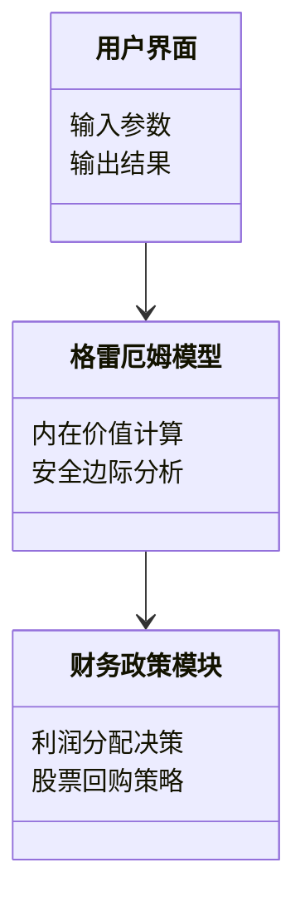
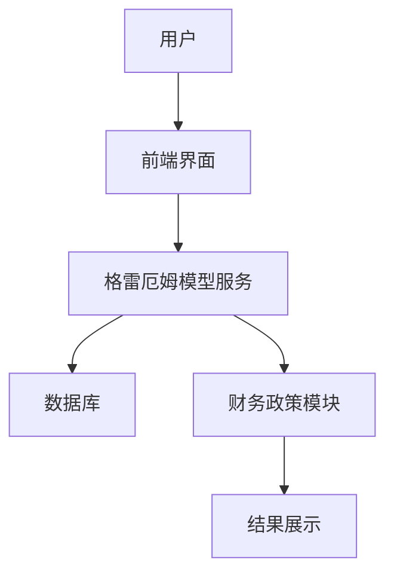
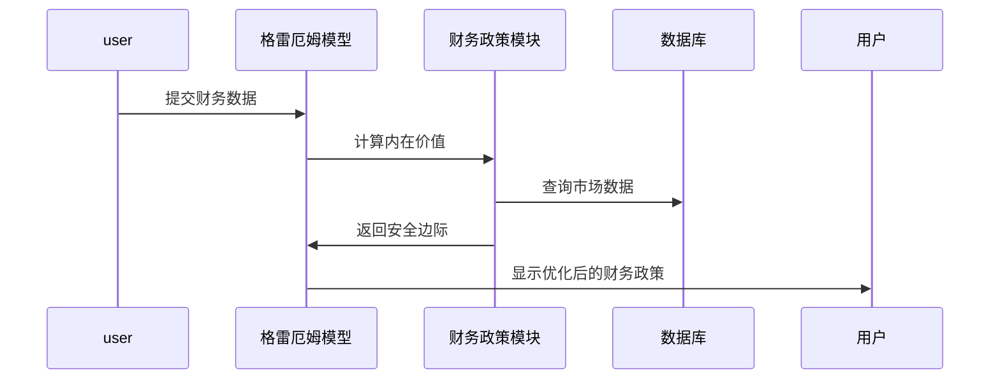

                 


# 格雷厄姆特价股票理论对公司财务政策的影响

## 关键词：格雷厄姆投资理论、特价股票、公司财务政策、价值投资、内在价值

## 摘要

本文探讨了本杰明·格雷厄姆提出的特价股票理论对公司财务政策的影响。文章首先介绍了格雷厄姆投资理论的核心概念，包括价值投资、内在价值和安全边际等。接着，详细分析了格雷厄姆理论如何通过影响公司的财务政策来优化企业价值。文章通过数学模型和系统设计，展示了如何将格雷厄姆理论应用于实际的财务决策中，如利润分配和股票回购策略。最后，通过案例分析和系统实现，进一步验证了该理论在实际中的应用效果。

---

# 第1章: 格雷厄姆特价股票理论的核心概念

## 1.1 格雷厄姆特价股票理论的背景与起源

### 1.1.1 价值投资的起源与发展

价值投资是一种以低于其内在价值的价格购买优质股票的投资策略。本杰明·格雷厄姆是这一领域的先驱，他在20世纪初提出了价值投资的基本原则。格雷厄姆的学生沃伦·巴菲特进一步发展了他的理论，并将其应用到实践中，取得了巨大的成功。

### 1.1.2 格雷厄姆投资理论的核心思想

格雷厄姆认为，市场波动是不可预测的，投资者应关注公司的内在价值，而不是市场的短期波动。他提出了“安全边际”概念，即以低于内在价值的价格购买股票，以降低投资风险。

### 1.1.3 特价股票的定义与特征

特价股票是指其市场价格低于其内在价值的股票。这类股票通常被市场低估，具有较大的增值潜力。格雷厄姆的理论强调，投资者应寻找那些市场价格远低于内在价值的股票。

## 1.2 公司财务政策的基本概念

### 1.2.1 公司财务政策的定义

公司财务政策是指企业在财务管理方面所遵循的基本原则和策略，包括资金筹集、投资决策、利润分配等方面。

### 1.2.2 公司财务政策的主要内容

公司财务政策主要包括以下几个方面：
1. 资金筹集政策：如何筹集资金，包括债务融资和股权融资。
2. 投资决策：如何分配资金用于投资项目。
3. 利润分配政策：如何分配利润，包括股息支付和股票回购。

### 1.2.3 财务政策与公司价值的关系

财务政策直接影响公司的价值。合理的财务政策可以提高公司价值，而不良的财务政策可能导致公司价值下降。

## 1.3 格雷厄姆特价股票理论与公司财务政策的联系

### 1.3.1 格雷厄姆理论对财务政策的影响

格雷厄姆的理论强调，公司应以合理的价格进行投资，避免过度杠杆和高风险的投资。这些原则直接影响公司的投资决策和资金筹集政策。

### 1.3.2 特价股票投资与公司财务决策的关系

当公司以低于内在价值的价格购买股票时，可以提高投资回报率，同时优化资本结构。这种策略有助于公司实现长期的财务稳定。

### 1.3.3 理论在实际中的应用前景

格雷厄姆理论在实际中的应用前景广阔。通过分析公司财务政策，投资者可以更好地理解公司的价值，从而做出更明智的投资决策。

## 1.4 本章小结

本章介绍了格雷厄姆特价股票理论的核心概念，包括价值投资、内在价值和安全边际等。同时，分析了公司财务政策的基本内容及其与格雷厄姆理论的联系。这些理论为后续的分析奠定了基础。

---

# 第2章: 格雷厄姆投资理论的数学模型

## 2.1 格雷厄姆投资理论的核心公式

### 2.1.1 灵魂公式

格雷厄姆的核心公式是内在价值的计算公式：

$$
\text{内在价值} = \frac{\text{收益} \times (1 + \text{增长率})}{\text{折现率}}
$$

其中，收益是指公司的净利润，增长率是预期的年增长率，折现率是市场要求的回报率。

### 2.1.2 安全边际的计算方法

安全边际是市场价格与内在价值之间的差额：

$$
\text{安全边际} = \text{内在价值} - \text{市场价格}
$$

### 2.1.3 其他相关公式

格雷厄姆还提出了其他相关公式，如市盈率和市净率：

$$
\text{市盈率} = \frac{\text{股价}}{\text{每股收益}}
$$

$$
\text{市净率} = \frac{\text{股价}}{\text{每股净资产}}
$$

## 2.2 特价股票筛选的数学模型

### 2.2.1 市盈率模型

市盈率模型用于筛选低估股票：

$$
\text{合理市盈率} = \frac{\text{行业平均市盈率}}{2}
$$

### 2.2.2 市净率模型

市净率模型用于筛选低估股票：

$$
\text{合理市净率} = \frac{\text{行业平均市净率}}{2}
$$

### 2.2.3 股息率模型

股息率模型用于筛选高分红股票：

$$
\text{合理股息率} = \frac{\text{行业平均股息率}}{2}
$$

## 2.3 案例分析：使用格雷厄姆模型筛选特价股票

### 2.3.1 案例背景

假设我们有两家公司，A公司和B公司，分别属于不同的行业。

### 2.3.2 数据收集与处理

收集两家公司的财务数据，包括净利润、每股收益、市盈率、市净率和股息率。

### 2.3.3 模型应用与结果分析

通过格雷厄姆模型筛选出低估股票，并进行投资决策。

---

# 第3章: 公司财务政策的系统分析与架构设计

## 3.1 问题场景介绍

### 3.1.1 公司财务政策的目标与挑战

公司财务政策的目标是实现股东价值最大化，同时面临市场波动、利率变化和企业风险等挑战。

### 3.1.2 格雷厄姆理论在财务政策中的应用需求

公司需要通过合理的财务政策，实现价值投资和风险控制。

### 3.1.3 系统设计的目标与范围

系统设计的目标是通过格雷厄姆理论优化公司的财务政策，实现价值最大化。

## 3.2 系统功能设计

### 3.2.1 领域模型设计（Mermaid 类图）



### 3.2.2 系统架构设计（Mermaid 架构图）



## 3.3 系统接口设计

### 3.3.1 输入接口

用户通过前端界面输入公司财务数据和市场数据。

### 3.3.2 输出接口

系统输出优化后的财务政策和投资建议。

### 3.3.3 数据接口

系统通过数据库接口获取历史数据和实时数据。

## 3.4 系统交互设计（Mermaid 序列图）



## 3.5 本章小结

本章通过系统分析和架构设计，展示了如何将格雷厄姆理论应用于公司财务政策的优化中。通过系统设计，可以实现高效的投资决策和风险控制。

---

# 第4章: 格雷厄姆理论在公司财务政策中的应用

## 4.1 环境安装与系统实现

### 4.1.1 环境安装

安装Python和相关库，如Pandas和Matplotlib。

### 4.1.2 核心功能实现

实现内在价值计算、安全边际分析和财务政策优化等功能。

### 4.1.3 代码实现

以下是Python代码示例：

```python
import pandas as pd

def calculate_intrinsic_value(revenue, growth_rate, discount_rate):
    return revenue * (1 + growth_rate) / discount_rate

def calculate_margin_of_safety(intrinsic_value, market_price):
    return intrinsic_value - market_price

# 示例数据
revenue = 1000000
growth_rate = 0.05
discount_rate = 0.10
market_price = 50

# 计算内在价值
intrinsic_value = calculate_intrinsic_value(revenue, growth_rate, discount_rate)
print(f"内在价值: ${intrinsic_value}")

# 计算安全边际
margin_of_safety = calculate_margin_of_safety(intrinsic_value, market_price)
print(f"安全边际: ${margin_of_safety}")
```

## 4.2 实际案例分析

### 4.2.1 案例背景

以某公司为例，分析其财务政策优化过程。

### 4.2.2 数据收集与处理

收集公司的财务数据和市场数据。

### 4.2.3 模型应用与结果分析

通过格雷厄姆模型优化公司的财务政策，实现价值最大化。

## 4.3 本章小结

本章通过实际案例分析，展示了格雷厄姆理论在公司财务政策中的应用。通过系统实现，可以有效优化财务决策，提高公司价值。

---

# 第5章: 最佳实践与总结

## 5.1 最佳实践

### 5.1.1 投资策略

遵循价值投资原则，选择低估股票进行投资。

### 5.1.2 风险控制

通过安全边际分析，降低投资风险。

## 5.2 小结

本文通过详细分析格雷厄姆特价股票理论，探讨了其对公司财务政策的影响。通过数学模型和系统设计，展示了如何将理论应用于实际投资决策中。

## 5.3 注意事项

投资者应结合市场实际情况，灵活调整投资策略。

## 5.4 拓展阅读

推荐阅读格雷厄姆的《聪明的投资者》和巴菲特的《巴菲特致股东的信》。

---

# 作者：AI天才研究院/AI Genius Institute & 禅与计算机程序设计艺术 /Zen And The Art of Computer Programming

---

本文通过系统分析和实际案例，展示了格雷厄姆特价股票理论在公司财务政策中的应用。通过数学模型和系统设计，可以帮助投资者和公司优化财务决策，实现价值最大化。希望本文能为读者提供有价值的参考和启示。

