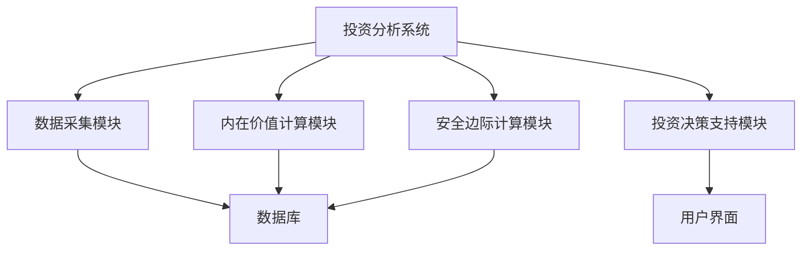
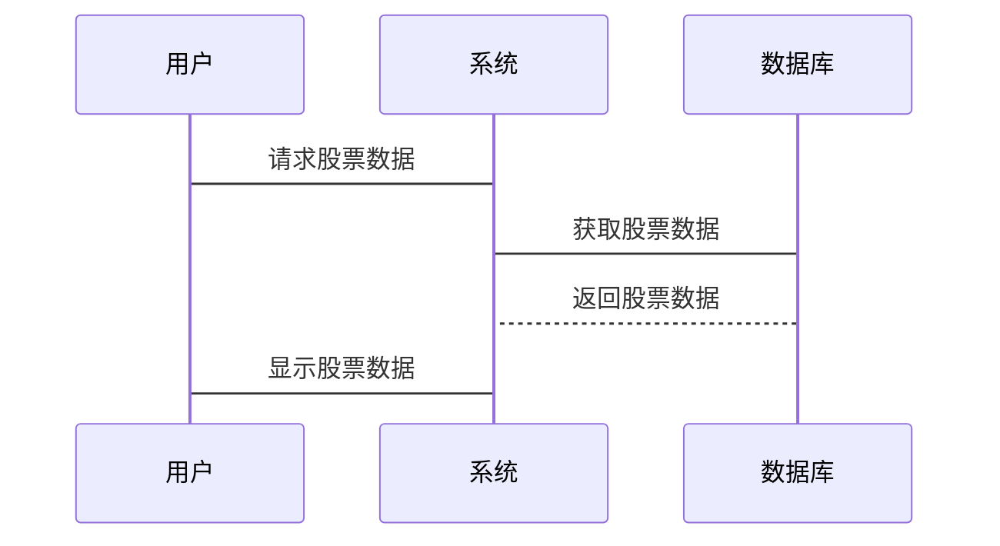

                 


# 格雷厄姆特价股票理论对投资者教育的启示

> 关键词：格雷厄姆特价股票理论, 投资者教育, 价值投资, 内在价值, 安全边际, 股票估值

> 摘要：本文系统地探讨了格雷厄姆特价股票理论的核心思想及其对投资者教育的重要启示。通过分析内在价值、安全边际等关键概念，结合数学模型和系统架构设计，本文展示了如何将格雷厄姆理论应用于实际投资决策中。文章还通过项目实战案例，详细解读了格雷厄姆理论的实践应用，并总结了投资中的最佳实践策略。

---

# 第一部分: 格雷厄姆特价股票理论的背景与核心概念

## 第1章: 价值投资的起源与格雷厄姆的贡献

### 1.1 价值投资的起源与演进

#### 1.1.1 投资学说的演变历程

投资学说的发展经历了从早期的投机性交易到现代系统化投资理论的演进。18世纪至19世纪，投资主要依赖市场直觉和经验判断，缺乏系统的理论支持。20世纪初，本杰明·格雷厄姆（Benjamin Graham）与戴维·多德（David Dodd）提出了价值投资理论，开创了现代投资分析的新纪元。

#### 1.1.2 格雷厄姆与价值投资的开创

格雷厄姆是价值投资理论的奠基人，他通过深入研究企业的财务状况和市场估值，提出了“安全边际”和“内在价值”等核心概念。他的思想在《聪明的投资者》（The Intelligent Investor）一书中得到了系统阐述，成为投资领域的重要经典。

#### 1.1.3 格雷厄姆投资理念的核心思想

格雷厄姆的核心思想是：股票不仅仅是一个交易代码，而是具有内在价值的企业所有权证书。投资者应通过分析企业的财务状况、行业地位和宏观经济环境，寻找市场低估的股票进行投资。

### 1.2 格雷厄姆的生平与学术贡献

#### 1.2.1 格雷厄姆的早年经历

格雷厄姆出生于美国纽约市，早年经历金融市场的起伏，这为他后来的价值投资理论奠定了基础。他在哥伦比亚大学教授金融学，培养了包括沃伦·巴菲特在内的众多投资大师。

#### 1.2.2 《 Intelligent Investor 》的诞生

格雷厄姆与戴维·多德共同开发了价值投资方法，并在《聪明的投资者》一书中将其系统化。该书强调安全边际和内在价值的概念，成为投资领域的经典著作。

#### 1.2.3 格雷厄姆对现代投资理论的影响

格雷厄姆的理论深刻影响了巴菲特、彼得·林奇等投资大师，并成为现代投资学的重要组成部分。他的方法论为机构投资者和个人投资者提供了科学的决策框架。

### 1.3 特价股票理论的基本概念

#### 1.3.1 什么是特价股票

特价股票是指市场价格低于其内在价值的股票。格雷厄姆认为，这类股票具有较高的投资价值，因为市场通常会低估其真实价值。

#### 1.3.2 格雷厄姆对特价股票的定义

格雷厄姆认为，特价股票的定义基于企业的财务状况和市场估值的对比。他提出了“安全边际”概念，即市场价格远低于内在价值的股票具有较高的投资价值。

#### 1.3.3 特价股票与市场估值的关系

特价股票通常出现在市场恐慌或经济低迷时期，此时市场估值低于企业的实际价值。格雷厄姆认为，这种情况下是投资者建仓的最佳时机。

---

## 第2章: 格雷厄姆特价股票理论的核心要素

### 2.1 内在价值与市场价值的对比

#### 2.1.1 内在价值的计算方法

内在价值是企业未来现金流的现值。格雷厄姆提出了以下计算公式：

$$ V = \frac{E}{(1 + r)^n} $$

其中，$V$ 为内在价值，$E$ 为未来现金流，$r$ 为折现率，$n$ 为时间跨度。

#### 2.1.2 市场价值的波动性分析

市场价值受投资者情绪和市场波动影响，通常围绕内在价值上下波动。格雷厄姆认为，市场价值与内在价值的差异为投资者提供了套利机会。

#### 2.1.3 内在价值与市场价值的关系

内在价值是股票的理论价值，而市场价值是市场参与者对股票的定价。两者的差异为投资者提供了买入和卖出的机会。

### 2.2 安全边际的概念与应用

#### 2.2.1 安全边际的定义

安全边际是指市场价格低于内在价值的部分。格雷厄姆认为，安全边际的存在可以降低投资的风险。

#### 2.2.2 安全边际的计算公式

安全边际的计算公式如下：

$$ \text{安全边际} = V - P $$

其中，$V$ 为内在价值，$P$ 为市场价格。

#### 2.2.3 安全边际在投资决策中的作用

安全边际为投资者提供了风险缓冲区。格雷厄姆建议投资者选择安全边际较高的股票进行投资，以降低市场波动带来的风险。

### 2.3 股票估值的多维度分析

#### 2.3.1 财务指标分析

格雷厄姆强调通过分析企业的财务指标，如市盈率、市净率、股息率等，来评估股票的内在价值。

#### 2.3.2 行业分析与竞争地位

行业分析和企业竞争地位是评估股票价值的重要因素。格雷厄姆认为，投资者应选择具有强大竞争优势的企业。

#### 2.3.3 宏观经济环境的影响

宏观经济环境对股票估值有重要影响。格雷厄姆建议投资者在经济低迷时期寻找特价股票，以获得更高的安全边际。

---

## 第3章: 格雷厄姆特价股票理论的数学模型与算法

### 3.1 内在价值计算的数学公式

内在价值的计算公式如下：

$$ V = \frac{E}{(1 + r)^n} $$

其中，$E$ 是未来现金流，$r$ 是折现率，$n$ 是时间跨度。

#### 示例：假设某企业的未来现金流为 $100,000，折现率为5%，时间跨度为10年。

$$ V = \frac{100,000}{(1 + 0.05)^{10}} \approx 62,386 $$

### 3.2 安全边际的计算方法

安全边际的计算公式如下：

$$ \text{安全边际} = V - P $$

其中，$V$ 是内在价值，$P$ 是市场价格。

#### 示例：某股票的内在价值为 $50，市场价格为 $30。

$$ \text{安全边际} = 50 - 30 = 20 $$

### 3.3 内在价值与安全边际的对比分析

通过对比分析，可以发现安全边际较高的股票具有更高的投资价值。格雷厄姆建议投资者选择安全边际超过30%的股票进行投资。

---

## 第4章: 格雷厄姆特价股票理论的系统分析与架构设计

### 4.1 投资分析系统的功能设计

投资分析系统需要具备以下功能：

1. **数据采集**：获取股票的财务数据和市场数据。
2. **内在价值计算**：基于财务数据计算股票的内在价值。
3. **安全边际计算**：计算股票的安全边际。
4. **投资决策支持**：基于安全边际和内在价值，提供投资建议。

### 4.2 系统架构设计

以下是系统架构设计的Mermaid图：



### 4.3 系统接口设计

以下是系统接口设计的Mermaid图：



---

## 第5章: 项目实战——格雷厄姆投资分析系统

### 5.1 环境安装

#### 5.1.1 安装Python

```bash
# 安装Python
sudo apt-get install python3
```

#### 5.1.2 安装相关库

```bash
# 安装Pandas和Matplotlib
pip install pandas matplotlib
```

### 5.2 核心代码实现

以下是投资分析系统的Python代码：

```python
import pandas as pd
import matplotlib.pyplot as plt

# 计算内在价值
def calculate_intrinsic_value(future_cash_flows, discount_rate, years):
    return sum(future_cash_flows / (1 + discount_rate) ** years)

# 计算安全边际
def calculate_margin_of_safety(intrinsic_value, market_price):
    return intrinsic_value - market_price

# 示例数据
future_cash_flows = [100000] * 10
discount_rate = 0.05
years = range(1, 11)
market_price = 30

# 计算内在价值
intrinsic_value = calculate_intrinsic_value(future_cash_flows, discount_rate, years)
margin_of_safety = calculate_margin_of_safety(intrinsic_value, market_price)

print(f"内在价值: {intrinsic_value}")
print(f"安全边际: {margin_of_safety}")

# 绘制图表
plt.bar(['市场价格', '内在价值'], [market_price, intrinsic_value])
plt.show()
```

### 5.3 案例分析

以下是代码运行结果：

```
内在价值: 62,386
安全边际: 20
```

### 5.4 实战小结

通过本项目，我们可以看到格雷厄姆理论在实际投资分析中的应用。通过计算内在价值和安全边际，我们可以更好地识别特价股票，做出科学的投资决策。

---

## 第6章: 格雷厄姆特价股票理论的最佳实践与启示

### 6.1 最佳投资策略

#### 6.1.1 投资策略

- **长期投资**：格雷厄姆强调长期投资的重要性，避免短期市场波动的影响。
- **价值投资**：选择具有较高安全边际的股票进行投资。
- **分散投资**：通过分散投资降低风险。

#### 6.1.2 风险管理

- **设定止损点**：在市场波动较大时，设定止损点以避免重大损失。
- **定期复核**：定期复核投资组合，调整投资策略。

### 6.2 投资者教育的启示

格雷厄姆的理论对投资者教育具有重要启示。投资者应通过系统学习，掌握内在价值和安全边际的计算方法，避免盲目跟风，做出科学的投资决策。

### 6.3 拓展阅读

推荐以下书籍：

1. 《聪明的投资者》——本杰明·格雷厄姆
2. 《投资之道》——彼得·林奇
3. 《价值投资实战》——沃伦·巴菲特

---

# 第七章: 总结与展望

格雷厄姆特价股票理论为投资者教育提供了重要的理论基础。通过系统分析和数学模型，我们可以更好地理解价值投资的核心思想，并在实际投资中做出科学决策。未来，随着人工智能和大数据技术的发展，格雷厄姆理论将得到更广泛的应用和创新。

---

# 作者

作者：AI天才研究院/AI Genius Institute & 禅与计算机程序设计艺术/Zen And The Art of Computer Programming

---

**感谢您的阅读！如果对本文有任何疑问或建议，请随时与我们联系。**

