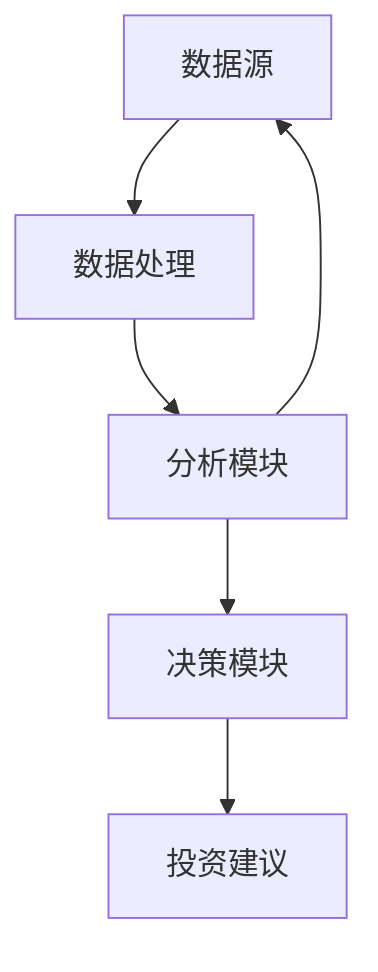
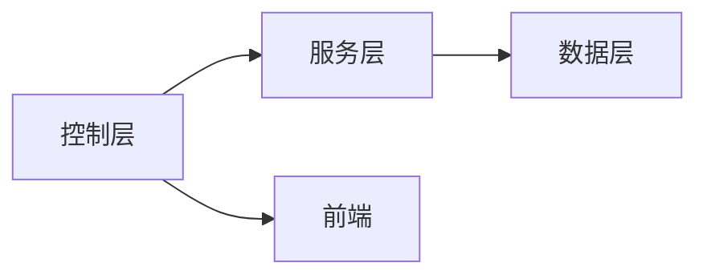

                 


# 《格雷厄姆特价股票理论对投资者教育的启示》

## 关键词
- 价值投资
- 投资者教育
- 股票分析
- 风险管理
- 安全边际

## 摘要
本文深入探讨了本杰明·格雷厄姆的特价股票理论，分析其对投资者教育的重要启示。文章从理论背景、核心概念、数学模型、系统架构到实际案例，全面解析格雷厄姆的投资理念，并通过量化分析和系统设计，展示了如何将理论应用于实际投资决策。文章旨在帮助投资者理解价值投资的本质，提升理性决策能力，避免常见投资误区。

---

## 第一部分：格雷厄姆投资理论概述

### 第1章：格雷厄姆投资理念与特价股票理论

#### 1.1 格雷厄姆投资理论的背景与起源

**1.1.1 价值投资的鼻祖：本杰明·格雷厄姆**

本杰明·格雷厄姆（Benjamin Graham）被誉为“价值投资之父”，他的投资理念深刻影响了巴菲特等一代投资者。格雷厄姆在20世纪初提出了价值投资理论，强调以低于内在价值的价格购买股票，以确保投资的安全性和稳定性。

**1.1.2 投资理论的演变与特价股票理论的提出**

格雷厄姆的理论建立在对市场波动性和投资者心理的深入研究之上。他认为，市场短期波动难以预测，但长期趋势可以通过基本面分析来把握。特价股票理论正是基于这一理念，强调寻找被市场低估的股票，即“特价”股票。

#### 1.2 特价股票理论的核心概念

**1.2.1 特价股票的定义与特征**

特价股票是指市场价格低于其内在价值的股票。这类股票通常被市场忽视或低估，但具备良好的基本面和成长潜力。格雷厄姆提出的“安全边际”概念，进一步强化了这一理论：即内在价值与市场价格之间的差距越大，投资的安全边际越高。

**1.2.2 格雷厄姆的安全边际概念**

安全边际是格雷厄姆理论的核心，它通过比较股票的市场价格和内在价值，评估投资的风险。公式如下：
$$ \text{安全边际} = \frac{\text{内在价值} - \text{市场价格}}{\text{市场价格}} \times 100\% $$

**1.2.3 特价股票与长期投资的关系**

格雷厄姆强调长期投资的重要性，认为市场波动和短期趋势不应影响长期投资决策。通过购买特价股票，投资者能够在市场低估时买入，长期持有，最终获得超额收益。

#### 1.3 格雷厄姆理论与现代投资理论的对比

**1.3.1 现代投资组合理论的兴起**

现代投资组合理论（MPT）由哈里·马科维茨提出，强调通过分散投资来降低风险。与格雷厄姆的价值投资不同，MPT更注重资产配置和风险分散，而非单个资产的内在价值。

**1.3.2 格雷厄姆理论的独特性与适用性**

格雷厄姆理论的独特性在于其对基本面分析的重视和对安全边际的追求。尽管现代投资理论在风险管理和资产配置方面提供了新的视角，但格雷厄姆的价值投资理念在市场波动加剧时仍具有重要指导意义。

---

## 第二部分：投资者教育的现状与挑战

### 第2章：投资者教育的现状与挑战

#### 2.1 当前投资者教育的主要问题

**2.1.1 投资者认知误区**

许多投资者缺乏对股票内在价值的理解，往往被市场情绪和短期收益驱动。他们可能忽视了基本面分析，导致投资决策的非理性。

**2.1.2 非理性决策的根源**

投资者的非理性行为，如追涨杀跌，往往是由于情绪化和缺乏深入分析导致的。格雷厄姆理论强调理性分析和长期投资，为纠正这些误区提供了理论依据。

#### 2.2 格雷厄姆理论对投资者教育的启示

**2.2.1 基础知识的重要性**

投资者教育应从基本面分析和价值评估的基本知识入手，帮助投资者理解内在价值和安全边际的概念。

**2.2.2 理性决策的培养**

通过格雷厄姆的安全边际概念，投资者可以学会在市场低估时买入，避免盲目跟风，培养理性决策能力。

---

## 第三部分：格雷厄姆投资模型的数学分析

### 第3章：格雷厄姆投资模型的数学分析

#### 3.1 内在价值的计算公式

内在价值是格雷厄姆理论的核心，其计算公式为：
$$ V = \frac{E}{1 + r} $$
其中，\( V \) 为内在价值，\( E \) 为未来现金流，\( r \) 为折现率。

#### 3.2 安全边际的量化分析

通过安全边际公式，投资者可以评估投资的风险：
$$ \text{安全边际} = \frac{V - P}{P} \times 100\% $$
其中，\( V \) 为内在价值，\( P \) 为市场价格。

#### 3.3 股票筛选的数学模型

格雷厄姆提出的股票筛选指标包括低市盈率、低市净率和高股息率等。通过这些指标，投资者可以筛选出具有潜力的特价股票。

---

## 第四部分：系统架构与投资决策模型

### 第4章：系统架构与投资决策模型

#### 4.1 投资决策系统的整体架构

**4.1.1 数据流图展示**

以下是投资决策系统的数据流图：


**4.1.2 系统功能设计**

- **数据处理模块**：负责收集和清洗股票数据。
- **分析模块**：计算内在价值和安全边际，筛选特价股票。
- **决策模块**：基于分析结果生成投资建议。

#### 4.2 系统架构设计

以下是系统的架构图：


---

## 第五部分：项目实战

### 第5章：项目实战

#### 5.1 环境配置

- **工具安装**：安装Python和相关库（如Pandas、NumPy）。
- **数据获取**：使用Yahoo Finance获取股票数据。

#### 5.2 核心实现

以下是计算内在价值和安全边际的Python代码：
```python
import pandas as pd

# 假设我们有股票数据 DataFrame df，包含'Price'和'Earnings'列
df['Intrinsic_Value'] = df['Earnings'] / (1 + df['Discount_Rate'])
df['Safety_Margin'] = ((df['Intrinsic_Value'] - df['Price']) / df['Price']) * 100
```

#### 5.3 案例分析

通过分析某公司的数据，计算其内在价值和安全边际，判断其是否为特价股票。

---

## 第六部分：总结与启示

### 第6章：总结与启示

#### 6.1 核心要点回顾

- 格雷厄姆的特价股票理论强调基本面分析和安全边际。
- 投资者教育应注重理性决策和长期投资。

#### 6.2 最佳实践

- **风险管理**：避免过度集中投资，分散风险。
- **长期投资**：耐心持有，避免频繁交易。

#### 6.3 小结

格雷厄姆的理论为投资者提供了科学的分析框架，但在实际操作中，需结合市场变化和自身情况灵活运用。

---

## 作者：AI天才研究院 & 禅与计算机程序设计艺术

---

通过以上结构，文章详细解析了格雷厄姆的特价股票理论，结合数学模型和系统设计，为投资者提供了实用的指导和启示。

