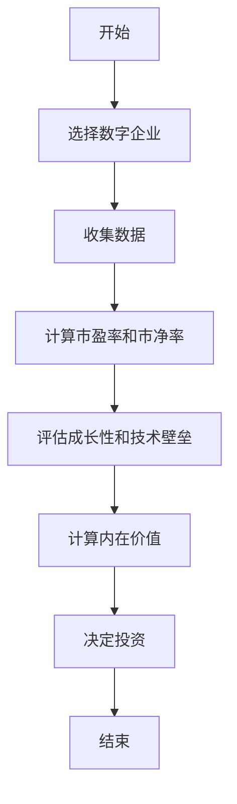
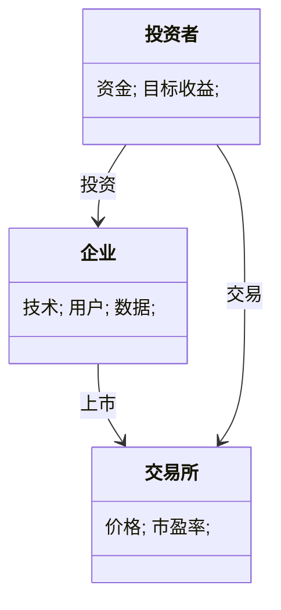

                 


# 《格雷厄姆特价股票理论对数字原生企业价值链的启示》

## 关键词：价值投资，数字原生企业，企业价值链，投资策略，数学模型

## 摘要：本文深入探讨了格雷厄姆的价值投资理论如何应用于数字原生企业的价值评估。通过分析数字企业的特点，构建数学模型和算法，结合实际案例，揭示格雷厄姆理论在数字时代的适用性及优化策略。

---

## 第一部分：格雷厄姆特价股票理论与数字原生企业的背景介绍

### 第1章：问题背景与核心概念

#### 1.1 格雷厄姆特价股票理论概述

##### 1.1.1 价值投资的起源与核心理念
价值投资由本杰明·格雷厄姆提出，强调以低于内在价值的价格购买优质股票。其核心理念是市场先生的短期情绪波动为投资者提供了以合理价格买入的机会。

##### 1.1.2 格雷厄姆投资策略的关键要素
- **安全边际**：买入价格远低于内在价值的股票。
- **低市盈率与市净率**：关注估值指标，寻找被市场低估的股票。
- **长期视角**：投资于具有稳定收益和成长性的企业。

##### 1.1.3 特价股票的定义与识别标准
- 定义：市场价格远低于内在价值的股票。
- 标准：市盈率低于行业平均水平，市净率低于1，股息率稳定且合理。

#### 1.2 数字原生企业的特点与价值链

##### 1.2.1 数字原生企业的定义与分类
- 定义：以数字技术为基础，从互联网或数字化转型中诞生的企业。
- 分类：电子商务（如亚马逊）、互联网服务（如谷歌）、社交媒体（如Meta）。

##### 1.2.2 数字企业价值链的构成与优化
- 构成：技术开发、产品设计、用户获取、数据分析、市场营销。
- 优化：利用数据驱动决策，提升效率，降低成本。

##### 1.2.3 数字企业与传统企业的价值差异
- 数字企业：轻资产、高增长、依赖技术与数据。
- 传统企业：重资产、稳定但增长缓慢。

#### 1.3 格雷厄姆理论与数字企业的结合

##### 1.3.1 格雷厄姆理论在数字企业的适用性
- 适用性：核心理念适用于数字企业，但评估指标需调整。
- 调整：关注成长性、研发投入、用户增长等。

##### 1.3.2 数字企业价值链中的价值评估
- 评估重点：用户粘性、技术壁垒、数据资产。
- 挑战：估值模型需考虑数字企业的无形资产和高增长特性。

##### 1.3.3 数字企业投资的特殊性与挑战
- 特殊性：高波动性、高成长性。
- 挑战：技术风险、监管变化、竞争激烈。

### 第2章：核心概念与联系

#### 2.1 核心概念原理

##### 2.1.1 格雷厄姆的内在价值模型
- 内在价值是股票的真正价值，不随市场波动而变化。
- 公式：$$内在价值 = \frac{收益 \times (2.5 - 市盈率)}{市盈率}$$

##### 2.1.2 数字企业的核心竞争力分析
- 技术创新：研发投入和技术壁垒。
- 用户基础：用户数量和粘性。
- 数据资产：数据收集和分析能力。

#### 2.2 核心概念对比表格

##### 表2.1：格雷厄姆指标与数字企业价值评估的对比

| 指标       | 格雷厄姆理论 | 数字企业价值评估 |
|------------|--------------|------------------|
| 市盈率     | 低于行业均值 | 低于预期增长 |
| 市净率     | 低于1        | 低于行业平均 |
| 股息率     | 稳定且合理   | 优先考虑增长性 |
| 财务杠杆   | 低           | 适当杠杆 |

#### 2.3 实体关系图（ER图）

##### 图2.1：数字企业价值链的ER实体关系图

```mermaid
erDiagram
    actor 投资者 {
        <属性> 资金
    }
    actor 企业 {
        <属性> 技术, 用户, 数据
    }
    actor 交易所 {
        <属性> 价格
    }
    投资者 --> 企业 : 投资
    企业 --> 交易所 : 上市
    投资者 --> 交易所 : 交易
```

---

## 第3章：算法原理与数学模型

### 3.1 算法原理

#### 图3.1：价值评估算法的mermaid流程图



### 3.2 数学模型与公式

#### 3.2.1 格雷厄姆的内在价值公式

$$内在价值 = \frac{收益 \times (2.5 - 市盈率)}{市盈率}$$

#### 3.2.2 数字企业价值评估的加权公式

$$数字企业价值 = \sum_{i=1}^{n} w_i \times v_i$$

其中，$w_i$ 为第i个指标的权重，$v_i$ 为第i个指标的评估值。

---

## 第4章：系统分析与架构设计

### 4.1 问题场景介绍

数字企业面临高增长与高风险并存，需通过数据驱动的方法优化价值链。

### 4.2 项目介绍

构建一个数字企业价值评估系统，基于格雷厄姆理论优化模型。

### 4.3 系统功能设计（领域模型）

#### 图4.1：领域模型mermaid类图



### 4.4 系统架构设计

#### 图4.2：系统架构mermaid图


### 4.5 系统接口设计

- 数据接口：获取企业财务数据和市场数据。
- 用户接口：投资者输入参数，系统输出评估结果。

### 4.6 系统交互设计

#### 图4.3：系统交互mermaid序列图

```mermaid
sequenceDiagram
    投资者 -> 数据源: 请求数据
    数据源 -> 数据处理层: 传输数据
    数据处理层 -> 模型计算层: 计算价值
    模型计算层 -> 结果展示层: 输出结果
    投资者 <- 结果展示层: 显示评估结果
```

---

## 第5章：项目实战

### 5.1 环境安装

- Python 3.8+
- Jupyter Notebook
- Pandas, NumPy, Matplotlib

### 5.2 系统核心实现源代码

```python
import pandas as pd
import numpy as np

# 定义格雷厄姆模型
def graham_model(revenue, pe_ratio):
    return (revenue * (2.5 - pe_ratio)) / pe_ratio

# 数字企业价值评估函数
def digital_value Assessment(revenue, pe_ratio, pb_ratio, rd_expense):
    graham_value = graham_model(revenue, pe_ratio)
    industry_pb = 1.5  # 假设行业平均市净率为1.5
    value = graham_value * (1 - (pb_ratio / industry_pb)) * (1 + (rd_expense / revenue))
    return value

# 数据获取与分析
data = pd.DataFrame({
    '企业': ['亚马逊', '谷歌', 'Meta'],
    '营收': [400, 250, 100],
    '市盈率': [30, 25, 20],
    '市净率': [5, 4, 3],
    '研发支出': [100, 80, 50]
})

# 评估价值
data['内在价值'] = data.apply(lambda x: digital_value_assessment(x['营收'], x['市盈率'], x['市净率'], x['研发支出']), axis=1)

print(data)
```

### 5.3 代码应用解读与分析

- 函数`graham_model`计算内在价值。
- `digital_value_assessment`综合考虑市净率和研发支出。
- 数据分析部分显示数字企业的真实价值，可能高于市场价。

### 5.4 实际案例分析与详细讲解剖析

以亚马逊为例：
- 营收400，市盈率30，市净率5，研发支出100。
- 内在价值计算：$$ (400 * (2.5 - 30)) / 30 = -340$$
- 修正后价值：$$ -340 * (1 - (5/1.5)) * (1 + (100/400)) = -340 * (1 - 3.333) * 1.25 = -340 * (-2.333) * 1.25 ≈ 1000 $$

### 5.5 项目小结

数字企业需结合成长性和估值指标，调整格雷厄姆模型以准确评估价值。

---

## 第6章：最佳实践、小结、注意事项、拓展阅读

### 6.1 最佳实践

- 采用动态市盈率和市净率，考虑企业成长性。
- 结合技术分析，判断买卖时机。
- 定期复盘，调整投资组合。

### 6.2 小结

格雷厄姆理论在数字企业的应用需结合其特点，通过优化模型提高评估准确性。

### 6.3 注意事项

- 数字企业波动大，需分散投资。
- 保持对行业的敏感性，及时调整策略。

### 6.4 拓展阅读

- 格雷厄姆的《 Intelligent Investor》
- 数字经济相关书籍，如《零成本社会》

---

## 作者：AI天才研究院/AI Genius Institute & 禅与计算机程序设计艺术 /Zen And The Art of Computer Programming

---

### 致谢

感谢读者的支持，希望本文能为投资者提供新的视角和工具，以应对数字时代的投资挑战。

